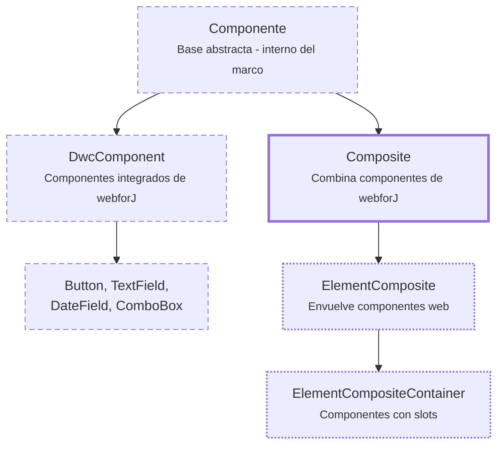

<JavadocLink type="foundation" location="com/webforj/component/Component" top='true'/>

Antes de construir componentes personalizados en webforJ, es importante comprender la arquitectura fundamental que da forma a cómo funcionan los componentes. Este artículo explica la jerarquía de los componentes, la identidad del componente, los conceptos del ciclo de vida y cómo las interfaces de preocupación proporcionan capacidades a los componentes.

## Entendiendo la jerarquía de los componentes {#understanding-the-component-hierarchy}

webforJ organiza los componentes en una jerarquía con dos grupos: clases internas del marco que nunca debes extender y clases diseñadas específicamente para construir componentes personalizados. Esta sección explica por qué webforJ utiliza la composición en lugar de la herencia y lo que cada nivel de la jerarquía proporciona.

### ¿Por qué composición en lugar de extensión? {#why-composition-instead-of-extension}

En webforJ, los componentes integrados como [`Button`](../components/button) y [`TextField`](../components/fields/textfield) son clases finales; no puedes extenderlos:

```java
// Esto no funcionará en webforJ
public class MyButton extends Button {
  // Button es final - no se puede extender
}
```

webforJ utiliza **composición en lugar de herencia**. En lugar de extender componentes existentes, creas una clase que extiende `Composite` y combina componentes dentro de ella. `Composite` actúa como un contenedor que envuelve un único componente (llamado el componente vinculado) y te permite agregar tus propios componentes y comportamientos a él.

```java
public class SearchBar extends Composite<FlexLayout> {
  private final FlexLayout self = getBoundComponent();
  private TextField searchField;
  private Button searchButton;

  public SearchBar() {
    searchField = new TextField("Buscar");
    searchButton = new Button("Ir");

    self.setDirection(FlexDirection.ROW)
      .add(searchField, searchButton);
  }
}
```

### ¿Por qué no puedes extender componentes integrados? {#why-you-cant-extend-built-in-components}

Los componentes de webforJ están marcados como finales para mantener la integridad del componente web del lado del cliente subyacente. Extender las clases de componentes de webforJ otorgaría control sobre el componente web subyacente, lo que podría llevar a consecuencias no deseadas y romper la consistencia y previsibilidad del comportamiento del componente.

Para una explicación detallada, consulta [Final Classes and Extension Restrictions](https://docs.webforj.com/docs/architecture/controls-components#final-classes-and-extension-restrictions) en la documentación de arquitectura.

### La jerarquía de los componentes {#the-component-hierarchy}

<div style={{textAlign: 'center'}}>

```mermaid
graph TD
  A[Componente<br/><small>Base abstracta - interno del marco</small>]

  A --> B[DwcComponent<br/><small>Componentes integrados de webforJ</small>]
  A --> C[Composite<br/><small>Combina componentes de webforJ</small>]

  B --> E[Button, TextField,<br/>DateField, ComboBox]

  C --> D[ElementComposite<br/><small>Envuelve componentes web</small>]
  D --> F[ElementCompositeContainer<br/><small>Componentes con slots</small>]

  classDef internal stroke-dasharray:6 4,stroke-width:1px
  classDef primary stroke-width:3px
  classDef secondary stroke-width:2px,stroke-dasharray:2 2
  class A,B,E internal
  class C primary
  class D,F secondary
```
</div>

Clases para desarrolladores (utiliza estos):
- `Composite`
- `ElementComposite`
- `ElementCompositeContainer`

Clases internas del marco (nunca extiendas directamente):
- `Component`
- `DwcComponent`

:::warning[Nunca extiendas `Component` o `DwcComponent`]
Nunca extiendas `Component` o `DwcComponent` directamente. Todos los componentes integrados son finales. Siempre utiliza patrones de composición con `Composite` o `ElementComposite`.

Intentar extender `DwcComponent` lanzará una excepción en tiempo de ejecución.
:::

## Interfaces de preocupación {#concern-interfaces}

Las interfaces de preocupación son interfaces de Java que proporcionan capacidades específicas a tus componentes. Cada interfaz agrega un conjunto de métodos relacionados. Por ejemplo, `HasSize` agrega métodos para controlar el ancho y la altura, mientras que `HasFocus` agrega métodos para gestionar el estado de enfoque.

Cuando implementas una interfaz de preocupación en tu componente, obtienes acceso a esas capacidades sin necesidad de escribir ningún código de implementación. La interfaz proporciona implementaciones predeterminadas que funcionan automáticamente.

Implementar interfaces de preocupación brinda a tus componentes personalizados las mismas API que los componentes integrados de webforJ:

```java
// Implementar HasSize para obtener métodos de ancho/alto automáticamente
public class SizedCard extends Composite<Div> implements HasSize<SizedCard> {
  private final Div self = getBoundComponent();

  public SizedCard() {
    self.setText("Contenido de la tarjeta");
  }

  // No necesitas implementar estos - los obtienes gratis:
  // setWidth(), setHeight(), setSize()
}

// Utilízalo como cualquier componente de webforJ
SizedCard card = new SizedCard();
card.setWidth("300px")
  .setHeight("200px");
```

El composite reenvía automáticamente estas llamadas al `Div` subyacente. No se necesita código extra.

### Apariencia {#concern-interfaces-appearance}

Estas interfaces controlan la presentación visual de un componente, incluyendo sus dimensiones, visibilidad, estilos y tema.

| Interfaz | Descripción |
|---|---|
| `HasSize` | Controla el ancho y la altura, incluyendo restricciones mínimas y máximas. Extiende `HasWidth`, `HasHeight` y sus variantes mínimas/máximas. |
| `HasVisibility` | Muestra u oculta el componente sin eliminarlo del diseño. |
| `HasClassName` | Gestiona los nombres de clase CSS en el elemento raíz del componente. |
| `HasStyle` | Aplica y elimina estilos CSS en línea. |
| `HasHorizontalAlignment` | Controla cómo se alinea el contenido horizontalmente dentro del componente. |
| `HasExpanse` | Establece la variante de tamaño del componente utilizando los tokens de expanse estándar (`XSMALL` a `XLARGE`). |
| `HasTheme` | Aplica una variante de tema como `DEFAULT`, `PRIMARY` o `DANGER`. |
| `HasPrefixAndSuffix` | Agrega componentes al slot de prefijo o sufijo dentro del componente. |

### Contenido {#concern-interfaces-content}

Estas interfaces gestionan lo que un componente muestra, incluyendo texto, HTML, etiquetas, consejos y otro contenido descriptivo.

| Interfaz | Descripción |
|---|---|
| `HasText` | Establece y recupera el contenido de texto plano del componente. |
| `HasHtml` | Establece y recupera el HTML interno del componente. |
| `HasLabel` | Agrega una etiqueta descriptiva asociada con el componente, utilizada para accesibilidad. |
| `HasHelperText` | Muestra texto secundario de ayuda debajo del componente. |
| `HasPlaceholder` | Establece texto de marcador de posición que se muestra cuando el componente no tiene valor. |
| `HasTooltip` | Adjunta un tooltip que aparece al pasar el mouse. |

### Estado {#concern-interfaces-state}

Estas interfaces controlan el estado interactivo de un componente, incluyendo si está habilitado, editable, es requerido o tiene el foco al cargar.

| Interfaz | Descripción |
|---|---|
| `HasEnablement` | Habilita o deshabilita el componente. |
| `HasReadOnly` | Pone al componente en un estado de sólo lectura donde el valor es visible pero no puede ser cambiado. |
| `HasRequired` | Marca el componente como requerido, típicamente para validación de formularios. |
| `HasAutoFocus` | Mueve el foco al componente automáticamente cuando se carga la página. |

### Foco {#concern-interfaces-focus}

Estas interfaces gestionan cómo un componente recibe y responde al foco del teclado.

| Interfaz | Descripción |
|---|---|
| `HasFocus` | Gestiona el estado de foco y si el componente puede recibir foco. |
| `HasFocusStatus` | Comprueba si el componente tiene actualmente el foco. Requiere un viaje de ida y vuelta al cliente. |
| `HasHighlightOnFocus` | Controla si el contenido del componente se resalta cuando recibe foco y cómo (`KEY`, `MOUSE`, `KEY_MOUSE`, `ALL`, etc.). |

### Restricciones de entrada {#concern-interfaces-input-constraints}

Estas interfaces definen qué valores acepta un componente, incluyendo el valor actual, rangos permitidos, límites de longitud, máscaras de formato y comportamiento específico de la localidad.

| Interfaz | Descripción |
|---|---|
| `HasValue` | Obtiene y establece el valor actual del componente. |
| `HasMin` | Establece un valor mínimo permitido. |
| `HasMax` | Establece un valor máximo permitido. |
| `HasStep` | Establece el incremento del paso para entradas numéricas o de rango. |
| `HasPattern` | Aplica un patrón de expresión regular para restringir la entrada aceptada. |
| `HasMinLength` | Establece el número mínimo de caracteres requeridos en el valor del componente. |
| `HasMaxLength` | Establece el número máximo de caracteres permitidos en el valor del componente. |
| `HasMask` | Aplica una máscara de formato a la entrada. Utilizada por componentes de campos enmascarados. |
| `HasTypingMode` | Controla si los caracteres escritos se insertan o sobrescriben caracteres existentes (`INSERT` o `OVERWRITE`). Utilizada por campos enmascarados y `TextArea`. |
| `HasRestoreValue` | Define un valor al que el componente se restablece cuando el usuario presiona Esc o llama a `restoreValue()`. Utilizada por campos enmascarados. |
| `HasLocale` | Almacena una localidad por componente para formateo sensible a la localidad. Utilizada por campos de fecha y hora enmascarados. |
| `HasPredictedText` | Establece un valor de texto predictivo o de autocompletar. Utilizada por `TextArea` para soportar sugerencias en línea. |

### Validación {#concern-interfaces-validation}

Estas interfaces agregan comportamiento de validación del lado del cliente, incluyendo marcar componentes como no válidos, mostrar mensajes de error y controlar cuándo se ejecuta la validación.

| Interfaz | Descripción |
|---|---|
| `HasClientValidation` | Marca un componente como no válido, establece el mensaje de error y adjunta un validador del lado del cliente. |
| `HasClientAutoValidation` | Controla si el componente valida automáticamente mientras el usuario escribe. |
| `HasClientAutoValidationOnLoad` | Controla si el componente valida cuando se carga por primera vez. |
| `HasClientValidationStyle` | Controla cómo se muestran los mensajes de validación: `INLINE` (debajo del componente) o `POPOVER`. |

### Acceso al DOM {#concern-interfaces-dom-access}

Estas interfaces proporcionan acceso de bajo nivel al elemento HTML subyacente del componente y propiedades del lado del cliente.

| Interfaz | Descripción |
|---|---|
| `HasAttribute` | Lee y escribe atributos HTML arbitrarios en el elemento del componente. |
| `HasProperty` | Lee y escribe propiedades del componente DWC directamente en el elemento del cliente. |

### i18n {#concern-interfaces-i18n}

Esta interfaz proporciona soporte de traducción para componentes que necesitan mostrar texto localizado.

| Interfaz | Descripción |
|---|---|
| `HasTranslation` | Proporciona el método auxiliar `t()` para resolver claves de traducción a cadenas localizadas utilizando la localidad actual de la aplicación. |

:::warning
Si el componente subyacente no soporta la capacidad de la interfaz, recibirás una excepción en tiempo de ejecución. Proporciona tu propia implementación en ese caso.
:::

Para una lista completa de las interfaces de preocupación disponibles, consulta la [webforJ JavaDoc](https://javadoc.io/doc/com.webforj/webforj-foundation/latest/com/webforj/concern/package-summary.html).

## Identificadores de componentes {#component-identifiers}

Los componentes de webforJ tienen tres tipos distintos de identificadores que sirven a diferentes propósitos:

- **ID de componente del lado del servidor** (`getComponentId()`) - Asignado automáticamente por el marco para el seguimiento interno de componentes. Utiliza esto cuando necesites consultar componentes específicos o implementar registros de componentes personalizados.
- **ID de componente del lado del cliente** (`getClientComponentId()`) - Proporciona acceso al componente web subyacente desde JavaScript. Utiliza esto cuando necesites llamar a métodos nativos del componente web o integrarte con bibliotecas del lado del cliente.
- **Atributo `id` de HTML** (`setAttribute("id", "...")`) - Identificador estándar del DOM. Utiliza esto para selección CSS, selectores de automatización de pruebas y vincular etiquetas de formulario a entradas.

Comprender estas diferencias te ayuda a elegir el identificador correcto para tu caso de uso.

### ID de componente del lado del servidor {#server-side-component-id}

A cada componente se le asigna un identificador del lado del servidor automáticamente cuando se crea. Este identificador se utiliza internamente por el marco para rastrear componentes. Recupéralo con `getComponentId()`:

```java
Button button = new Button("Haz clic en mí");
String serverId = button.getComponentId();
```

El ID del lado del servidor es útil cuando necesitas consultar componentes específicos dentro de un contenedor o implementar lógica de seguimiento de componentes personalizada.

### ID de componente del lado del cliente {#client-side-component-id}

El ID del componente del lado del cliente proporciona acceso al componente web subyacente desde JavaScript. Esto te permite interactuar directamente con el componente del lado del cliente cuando sea necesario:

```java
Button btn = new Button("Haz clic en mí");
btn.onClick(e -> {
  OptionDialog.showMessageDialog("Se hizo clic en el botón", "Ocurrió un evento");
});

btn.whenAttached().thenAccept(e -> {
  Page.getCurrent().executeJs("objects.get('" + btn.getClientComponentId() + "').click()");
});
```

Utiliza `getClientComponentId()` con `objects.get()` en JavaScript para acceder a la instancia del componente web.

:::important
El ID del componente del lado del cliente no es el atributo `id` de HTML del elemento DOM. Para establecer IDs HTML para pruebas o selección CSS, consulta [Usando Componentes](using-components).
:::

## Resumen del ciclo de vida del componente {#component-lifecycle-overview}

webforJ gestiona automáticamente el ciclo de vida del componente. El marco maneja la creación, adjunción y destrucción de componentes sin requerir intervención manual.

**Hooks de ciclo de vida** están disponibles cuando los necesitas:
- `onDidCreate(T container)` - Se llama después de que el componente se adjunta al DOM
- `onDidDestroy()` - Se llama cuando el componente es destruido

Estos hooks son **opcionales**. Úsalos cuando necesites:
- Limpiar recursos (detener intervalos, cerrar conexiones)
- Inicializar componentes que requieren adjunción al DOM
- Integrar con JavaScript del lado del cliente

Para la mayoría de los casos simples, puedes inicializar los componentes directamente en el constructor. Utiliza hooks de ciclo de vida como `onDidCreate()` para diferir trabajo cuando sea necesario.
