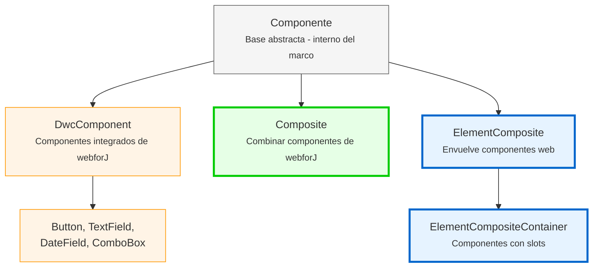

<JavadocLink type="foundation" location="com/webforj/component/Component" top='true'/> 

Antes de construir componentes personalizados en webforJ, es importante entender la arquitectura fundamental que da forma a cómo funcionan los componentes. Este artículo explica la jerarquía de componentes, la identidad de los componentes, los conceptos de ciclo de vida y cómo las interfaces de preocupación proporcionan capacidades a los componentes.

## Entendiendo la jerarquía de componentes {#understanding-the-component-hierarchy}

webforJ organiza los componentes en una jerarquía con dos grupos: clases internas del marco que nunca debes extender y clases diseñadas específicamente para construir componentes personalizados. Esta sección explica por qué webforJ utiliza la composición en lugar de la herencia y qué proporciona cada nivel de la jerarquía.

### ¿Por qué composición en lugar de extensión? {#why-composition-instead-of-extension}

En webforJ, los componentes integrados como [`Button`](../components/button) y [`TextField`](../components/fields/textfield) son clases finales, no puedes extenderlas:

```java
// Esto no funcionará en webforJ
public class MyButton extends Button {
    // Button es final - no se puede extender 
}
```

webforJ utiliza **composición sobre herencia**. En lugar de extender componentes existentes, creas una clase que extiende `Composite` y combina componentes dentro de ella. `Composite` actúa como un contenedor que envuelve un solo componente (llamado componente vinculado) y te permite agregar tus propios componentes y comportamientos.

```java
public class SearchBar extends Composite<FlexLayout> {
    private final FlexLayout self = getBoundComponent();
    private TextField searchField;
    private Button searchButton;
    
    public SearchBar() {
        searchField = new TextField("Buscar");
        searchButton = new Button("Ir");
        
        self.setDirection(FlexDirection.ROW)
            .add(searchField, searchButton);
    }
}
```

### ¿Por qué no puedes extender componentes integrados? {#why-you-cant-extend-built-in-components}

Los componentes de webforJ están marcados como finales para mantener la integridad del componente web del lado del cliente subyacente. Extender las clases de componentes de webforJ otorgaría control sobre el componente web subyacente, lo que podría llevar a consecuencias no deseadas y romper la consistencia y predictibilidad del comportamiento del componente.

Para una explicación detallada, consulta [Clases Finales y Restricciones de Extensión](https://docs.webforj.com/docs/architecture/controls-components#final-classes-and-extension-restrictions) en la documentación de arquitectura.

### La jerarquía de componentes {#the-component-hierarchy}


```mermaid
graph TD
    A[Componente<br/><small>Base abstracta - interno del marco</small>]
    
    A --> B[DwcComponent<br/><small>Componentes integrados de webforJ</small>]
    A --> C[Composite<br/><small>Combinar componentes de webforJ</small>]
    A --> D[ElementComposite<br/><small>Envuelve componentes web</small>]
    
    B --> E[Button, TextField,<br/>DateField, ComboBox]
    
    D --> F[ElementCompositeContainer<br/><small>Componentes con slots</small>]
    
    style A fill:#f5f5f5,stroke:#666
    style B fill:#fff4e6,stroke:#ff9800
    style C fill:#e6ffe6,stroke:#00cc00
    style D fill:#e6f3ff,stroke:#0066cc
    style E fill:#fff4e6,stroke:#ff9800
    style F fill:#e6f3ff,stroke:#0066cc
    
    classDef userClass stroke-width:3px
    class C,D,F userClass
```

**Clases para desarrolladores (usa estas):**
- **Composite**
- **ElementComposite**
- **ElementCompositeContainer**

**Clases internas del marco (nunca extiendas directamente):**
- **Component**
- **DwcComponent**

:::warning[Nunca extiendas `Component` o `DwcComponent`]
Nunca extiendas `Component` o `DwcComponent` directamente. Todos los componentes integrados son finales. Siempre usa patrones de composición con `Composite` o `ElementComposite`.

Intentar extender `DwcComponent` generará una excepción en tiempo de ejecución.
:::

## Interfaces de preocupación {#concern-interfaces}

Las interfaces de preocupación son interfaces de Java que proporcionan capacidades específicas a tus componentes. Cada interfaz añade un conjunto de métodos relacionados. Por ejemplo, `HasSize` añade métodos para controlar el ancho y la altura, mientras que `HasFocus` añade métodos para gestionar el estado de enfoque.

Cuando implementas una interfaz de preocupación en tu componente, obtienes acceso a esas capacidades sin escribir ningún código de implementación. La interfaz proporciona implementaciones predeterminadas que funcionan automáticamente.

Implementar interfaces de preocupación le da a tus componentes personalizados las mismas API que los componentes integrados de webforJ:

```java
// Implementar HasSize para obtener métodos de ancho/alto automáticamente
public class SizedCard extends Composite<Div> implements HasSize<SizedCard> {
    private final Div self = getBoundComponent();
    
    public SizedCard() {
        self.setText("Contenido de la tarjeta");
    }
    
    // No es necesario implementar estos - los obtienes sin costo:
    // setWidth(), setHeight(), setSize()
}

// Úsalo como cualquier componente de webforJ
SizedCard card = new SizedCard();
card.setWidth("300px")
    .setHeight("200px");
```

El composite reenvía automáticamente estas llamadas al `Div` subyacente. No se necesita código extra.

**Interfaces de preocupación comunes:**
- `HasSize` - `setWidth()`, `setHeight()`, `setSize()`
- `HasFocus` - `focus()`, `setFocusable()`, eventos de enfoque
- `HasClassName` - `addClassName()`, `removeClassName()`
- `HasStyle` - `setStyle()`, gestión de CSS en línea
- `HasVisibility` - `setVisible()`, capacidad de mostrar/ocultar
- `HasText` - `setText()`, gestión de contenido de texto
- `HasAttribute` - `setAttribute()`, gestión de atributos HTML

:::warning
Si el componente subyacente no soporta la capacidad de la interfaz, obtendrás una excepción en tiempo de ejecución. Proporciona tu propia implementación en ese caso.
:::

Para una lista completa de interfaces de preocupación disponibles, consulta la [webforJ JavaDoc](https://javadoc.io/doc/com.webforj/webforj-foundation/latest/com/webforj/concern/package-summary.html).

## Visión general del ciclo de vida del componente {#component-lifecycle-overview}

webforJ gestiona automáticamente el ciclo de vida del componente. El marco se encarga de la creación, unión y destrucción de componentes sin requerir intervención manual.

**Ganchos de ciclo de vida** están disponibles cuando los necesitas:
- `onDidCreate()` - Se llama después de que el componente está unido al DOM
- `onDidDestroy()` - Se llama cuando el componente es destruido

Estos ganchos son **opcionales**. Úsalos cuando lo necesites:
- Limpiar recursos (detener intervalos, cerrar conexiones)
- Inicializar componentes que requieren unión al DOM
- Integrar con JavaScript del lado del cliente

Para la mayoría de los casos simples, puedes inicializar componentes directamente en el constructor. Usa ganchos de ciclo de vida como `onDidCreate()` para diferir el trabajo cuando sea necesario.
