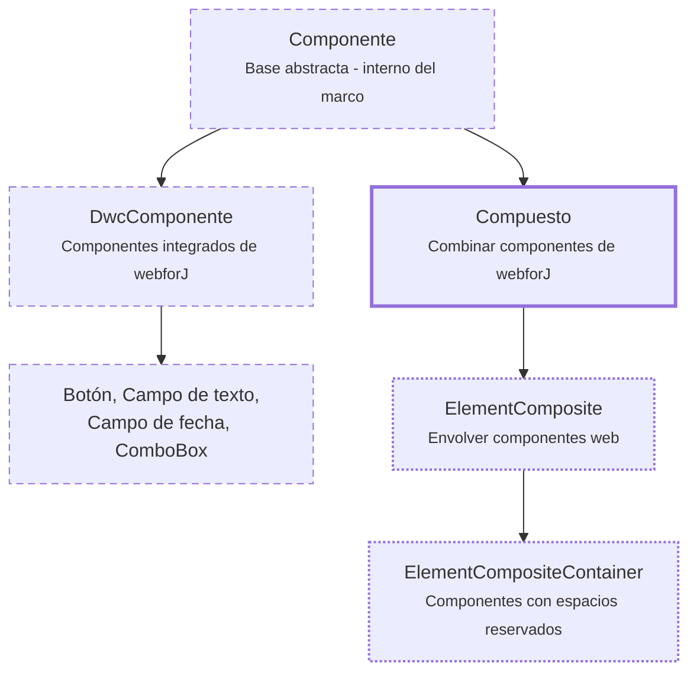

<JavadocLink type="foundation" location="com/webforj/component/Component" top='true'/>

Antes de construir componentes personalizados en webforJ, es importante entender la arquitectura fundamental que moldea cómo funcionan los componentes. Este artículo explica la jerarquía de componentes, la identidad de los componentes, los conceptos del ciclo de vida y cómo las interfaces de preocupación proporcionan capacidades a los componentes.

## Entendiendo la jerarquía de componentes {#understanding-the-component-hierarchy}

webforJ organiza los componentes en una jerarquía con dos grupos: clases internas del marco que nunca debes extender y clases diseñadas específicamente para construir componentes personalizados. Esta sección explica por qué webforJ utiliza composición sobre herencia y qué proporciona cada nivel de la jerarquía.

### ¿Por qué composición en lugar de extensión? {#why-composition-instead-of-extension}

En webforJ, los componentes integrados como [`Button`](../components/button) y [`TextField`](../components/fields/textfield) son clases finales: no puedes extenderlos:

```java
// Esto no funcionará en webforJ
public class MyButton extends Button {
  // Button es final - no se puede extender 
}
```

webforJ utiliza **composición sobre herencia**. En lugar de extender componentes existentes, creas una clase que extiende `Composite` y combina componentes dentro de ella. `Composite` actúa como un contenedor que envuelve un único componente (llamado el componente vinculado) y te permite agregar tus propios componentes y comportamientos a él.

```java
public class SearchBar extends Composite<FlexLayout> {
  private final FlexLayout self = getBoundComponent();
  private TextField searchField;
  private Button searchButton;
  
  public SearchBar() {
    searchField = new TextField("Buscar");
    searchButton = new Button("Ir");
    
    self.setDirection(FlexDirection.ROW)
      .add(searchField, searchButton);
  }
}
```

### Por qué no puedes extender componentes integrados {#why-you-cant-extend-built-in-components}

Los componentes webforJ están marcados como finales para mantener la integridad del componente web del lado del cliente subyacente. Extender las clases de componentes de webforJ otorgaría control sobre el componente web subyacente, lo que podría llevar a consecuencias no deseadas y romper la consistencia y previsibilidad del comportamiento del componente.

Para una explicación detallada, consulta [Clases finales y restricciones de extensión](https://docs.webforj.com/docs/architecture/controls-components#final-classes-and-extension-restrictions) en la documentación de arquitectura.

### La jerarquía de componentes {#the-component-hierarchy}

<div style={{textAlign: 'center'}}>

```mermaid
graph TD
  A[Componente<br/><small>Base abstracta - interno del marco</small>]
  
  A --> B[DwcComponente<br/><small>Componentes integrados de webforJ</small>]
  A --> C[Compuesto<br/><small>Combinar componentes de webforJ</small>]
  
  B --> E[Botón, Campo de texto,<br/>Campo de fecha, ComboBox]
  
  C --> D[ElementComposite<br/><small>Envolver componentes web</small>]
  D --> F[ElementCompositeContainer<br/><small>Componentes con espacios reservados</small>]

  classDef internal stroke-dasharray:6 4,stroke-width:1px
  classDef primary stroke-width:3px
  classDef secondary stroke-width:2px,stroke-dasharray:2 2
  class A,B,E internal
  class C primary
  class D,F secondary
```
</div>

Clases para desarrolladores (usa estas):
- `Composite`
- `ElementComposite`
- `ElementCompositeContainer`

Clases internas del marco (nunca extiendas directamente):
- `Component`
- `DwcComponent`

:::warning[Nunca extiendas `Component` o `DwcComponent`]
Nunca extiendas `Component` o `DwcComponent` directamente. Todos los componentes integrados son finales. Siempre utiliza patrones de composición con `Composite` o `ElementComposite`.

Intentar extender `DwcComponent` generará una excepción en tiempo de ejecución.
:::

## Interfaces de preocupación {#concern-interfaces}

Las interfaces de preocupación son interfaces de Java que proporcionan capacidades específicas a tus componentes. Cada interfaz agrega un conjunto de métodos relacionados. Por ejemplo, `HasSize` agrega métodos para controlar el ancho y la altura, mientras que `HasFocus` agrega métodos para gestionar el estado de enfoque.

Cuando implementas una interfaz de preocupación en tu componente, obtienes acceso a esas capacidades sin escribir código de implementación. La interfaz proporciona implementaciones predeterminadas que funcionan automáticamente.

Implementar interfaces de preocupación otorga a tus componentes personalizados las mismas API que los componentes integrados de webforJ:

```java
// Implementa HasSize para obtener métodos de ancho y altura automáticamente
public class SizedCard extends Composite<Div> implements HasSize<SizedCard> {
  private final Div self = getBoundComponent();
  
  public SizedCard() {
    self.setText("Contenido de la tarjeta");
  }
  
  // No es necesario implementar estos - los obtienes gratis:
  // setWidth(), setHeight(), setSize()
}

// Úsalo como cualquier componente webforJ
SizedCard card = new SizedCard();
card.setWidth("300px")
  .setHeight("200px");
```

El compuesto reenvía automáticamente estas llamadas al `Div` subyacente. No se necesita código adicional.

### Apariencia {#concern-interfaces-appearance}

Estas interfaces controlan la presentación visual de un componente, incluyendo sus dimensiones, visibilidad, estilos y tema.

| Interfaz | Descripción |
|---|---|
| `HasSize` | Controla el ancho y la altura, incluyendo restricciones mínimas y máximas. Extiende `HasWidth`, `HasHeight`, y sus variantes mínimas/máximas. |
| `HasVisibility` | Muestra u oculta el componente sin eliminarlo de la disposición. |
| `HasClassName` | Gestiona los nombres de clase CSS en el elemento raíz del componente. |
| `HasStyle` | Aplica y elimina estilos CSS en línea. |
| `HasHorizontalAlignment` | Controla cómo se alinea el contenido horizontalmente dentro del componente. |
| `HasExpanse` | Establece la variante de tamaño del componente utilizando los tokens de expansión estándar (`XSMALL` a `XLARGE`). |
| `HasTheme` | Aplica una variante de tema como `DEFAULT`, `PRIMARY` o `DANGER`. |
| `HasPrefixAndSuffix` | Agrega componentes al espacio reservado de prefijo o sufijo dentro del componente. |

### Contenido {#concern-interfaces-content}

Estas interfaces gestionan lo que un componente muestra, incluyendo texto, HTML, etiquetas, pistas y otro contenido descriptivo.

| Interfaz | Descripción |
|---|---|
| `HasText` | Establece y recupera el contenido de texto plano del componente. |
| `HasHtml` | Establece y recupera el HTML interno del componente. |
| `HasLabel` | Agrega una etiqueta descriptiva asociada con el componente, utilizada para accesibilidad. |
| `HasHelperText` | Muestra texto de pista secundaria debajo del componente. |
| `HasPlaceholder` | Establece texto de marcador que se muestra cuando el componente no tiene valor. |
| `HasTooltip` | Adjunta un tooltip que aparece al pasar el cursor. |

### Estado {#concern-interfaces-state}

Estas interfaces controlan el estado interactivo de un componente, incluyendo si está habilitado, editable, requerido o enfocado al cargar.

| Interfaz | Descripción |
|---|---|
| `HasEnablement` | Habilita o deshabilita el componente. |
| `HasReadOnly` | Coloca al componente en un estado de solo lectura donde el valor es visible pero no puede ser cambiado. |
| `HasRequired` | Marca al componente como requerido, típicamente para la validación de formularios. |
| `HasAutoFocus` | Mueve el enfoque al componente automáticamente cuando se carga la página. |

### Enfoque {#concern-interfaces-focus}

Estas interfaces gestionan cómo un componente recibe y responde al enfoque del teclado.

| Interfaz | Descripción |
|---|---|
| `HasFocus` | Gestiona el estado de enfoque y si el componente puede recibir enfoque. |
| `HasFocusStatus` | Verifica si el componente tiene actualmente enfoque. Requiere un viaje de ida y vuelta al cliente. |
| `HasHighlightOnFocus` | Controla si el contenido del componente se resalta cuando recibe enfoque, y cómo (`KEY`, `MOUSE`, `KEY_MOUSE`, `ALL`, etc.). |

### Restricciones de entrada {#concern-interfaces-input-constraints}

Estas interfaces definen qué valores acepta un componente, incluyendo el valor actual, los rangos permitidos, los límites de longitud, las máscaras de formato y el comportamiento específico del idioma.

| Interfaz | Descripción |
|---|---|
| `HasValue` | Obtiene y establece el valor actual del componente. |
| `HasMin` | Establece un valor mínimo permitido. |
| `HasMax` | Establece un valor máximo permitido. |
| `HasStep` | Establece el incremento de paso para entradas numéricas o de rango. |
| `HasPattern` | Aplica un patrón de expresión regular para restringir la entrada aceptada. |
| `HasMinLength` | Establece el número mínimo de caracteres requeridos en el valor del componente. |
| `HasMaxLength` | Establece el número máximo de caracteres permitidos en el valor del componente. |
| `HasMask` | Aplica una máscara de formato a la entrada. Utilizada por componentes de campo enmascarados. |
| `HasTypingMode` | Controla si los caracteres escritos se insertan o sobrescriben caracteres existentes (`INSERT` o `OVERWRITE`). Utilizado por campos enmascarados y `TextArea`. |
| `HasRestoreValue` | Define un valor al que el componente se restablece cuando el usuario presiona Escape o llama a `restoreValue()`. Utilizado por campos enmascarados. |
| `HasLocale` | Almacena un idioma por componente para el formato sensible al idioma. Utilizado por campos de fecha y hora enmascarados. |
| `HasPredictedText` | Establece un valor de texto predictivo o de autocompletar. Utilizado por `TextArea` para admitir sugerencias en línea. |

### Validación {#concern-interfaces-validation}

Estas interfaces agregan comportamiento de validación del lado del cliente, incluyendo marcar componentes como inválidos, mostrar mensajes de error y controlar cuándo se ejecuta la validación.

| Interfaz | Descripción |
|---|---|
| `HasClientValidation` | Marca un componente como inválido, establece el mensaje de error y adjunta un validador del lado del cliente. |
| `HasClientAutoValidation` | Controla si el componente valida automáticamente a medida que el usuario escribe. |
| `HasClientAutoValidationOnLoad` | Controla si el componente valida cuando se carga por primera vez. |
| `HasClientValidationStyle` | Controla cómo se muestran los mensajes de validación: `INLINE` (debajo del componente) o `POPOVER`. |

### Acceso al DOM {#concern-interfaces-dom-access}

Estas interfaces proporcionan acceso de bajo nivel al elemento HTML subyacente del componente y a las propiedades del lado del cliente.

| Interfaz | Descripción |
|---|---|
| `HasAttribute` | Lee y escribe atributos HTML arbitrarios en el elemento del componente. |
| `HasProperty` | Lee y escribe propiedades del componente DWC directamente en el elemento del cliente. |

### i18n {#concern-interfaces-i18n}

Esta interfaz proporciona soporte de traducción para componentes que necesitan mostrar texto localizado.

| Interfaz | Descripción |
|---|---|
| `HasTranslation` | Proporciona el método auxiliar `t()` para resolver claves de traducción a cadenas localizadas usando el idioma actual de la aplicación. |

:::warning
Si el componente subyacente no soporta la capacidad de la interfaz, recibirás una excepción en tiempo de ejecución. Proporciona tu propia implementación en ese caso.
:::

Para una lista completa de interfaces de preocupación disponibles, consulta el [JavaDoc de webforJ](https://javadoc.io/doc/com.webforj/webforj-foundation/latest/com/webforj/concern/package-summary.html).

## Descripción general del ciclo de vida del componente {#component-lifecycle-overview}

webforJ gestiona automáticamente el ciclo de vida del componente. El marco maneja la creación, adjunción y destrucción de componentes sin requerir intervención manual.

**Hooks del ciclo de vida** están disponibles cuando los necesitas:
- `onDidCreate(T container)` - Se llama después de que el componente se adjunta al DOM
- `onDidDestroy()` - Se llama cuando el componente se destruye

Estos hooks son **opcionales**. Úsalos cuando necesites:
- Limpiar recursos (detener intervalos, cerrar conexiones)
- Inicializar componentes que requieren adjunción al DOM
- Integrar con JavaScript del lado del cliente

Para la mayoría de los casos simples, puedes inicializar componentes directamente en el constructor. Usa hooks del ciclo de vida como `onDidCreate()` para diferir trabajo cuando sea necesario.
