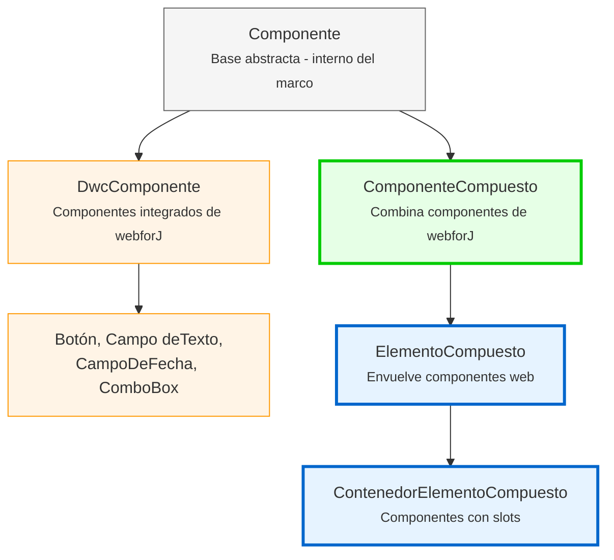

<JavadocLink type="foundation" location="com/webforj/component/Component" top='true'/> 

Antes de construir componentes personalizados en webforJ, es importante comprender la arquitectura fundamental que define cómo funcionan los componentes. Este artículo explica la jerarquía de componentes, la identidad del componente, conceptos de ciclo de vida y cómo las interfaces de preocupación proporcionan capacidades al componente.

## Comprendiendo la jerarquía de componentes {#understanding-the-component-hierarchy}

webforJ organiza los componentes en una jerarquía con dos grupos: clases internas del marco que nunca debes extender, y clases diseñadas específicamente para construir componentes personalizados. Esta sección explica por qué webforJ utiliza composición en lugar de herencia y lo que cada nivel de la jerarquía proporciona.

### ¿Por qué composición en lugar de extensión? {#why-composition-instead-of-extension}

En webforJ, los componentes integrados como [`Button`](../components/button) y [`TextField`](../components/fields/textfield) son clases finales: no puedes extenderlos:

```java
// Esto no funcionará en webforJ
public class MyButton extends Button {
  // Button es final - no puede ser extendido 
}
```

webforJ utiliza **composición sobre herencia**. En lugar de extender componentes existentes, creas una clase que extiende `Composite` y combina los componentes dentro de ella. `Composite` actúa como un contenedor que envuelve un único componente (llamado componente vinculado) y te permite agregar tus propios componentes y comportamiento a él.

```java
public class SearchBar extends Composite<FlexLayout> {
  private final FlexLayout self = getBoundComponent();
  private TextField searchField;
  private Button searchButton;
  
  public SearchBar() {
    searchField = new TextField("Buscar");
    searchButton = new Button("Ir");
    
    self.setDirection(FlexDirection.ROW)
      .add(searchField, searchButton);
  }
}
```

### Por qué no puedes extender componentes integrados {#why-you-cant-extend-built-in-components}

Los componentes de webforJ están marcados como finales para mantener la integridad del componente web subyacente del lado del cliente. Extender las clases de componentes de webforJ otorgaría control sobre el componente web subyacente, lo que podría llevar a consecuencias no deseadas y romper la consistencia y previsibilidad del comportamiento del componente.

Para una explicación detallada, consulta [Clases finales y restricciones de extensión](https://docs.webforj.com/docs/architecture/controls-components#final-classes-and-extension-restrictions) en la documentación de arquitectura.

### La jerarquía de componentes {#the-component-hierarchy}

<div style={{textAlign: 'center'}}>

```mermaid
graph TD
  A[Componente<br/><small>Base abstracta - interno del marco</small>]
  
  A --> B[DwcComponente<br/><small>Componentes integrados de webforJ</small>]
  A --> C[ComponenteCompuesto<br/><small>Combina componentes de webforJ</small>]
  
  B --> E[Botón, Campo deTexto,<br/>CampoDeFecha, ComboBox]
  
  C --> D[ElementoCompuesto<br/><small>Envuelve componentes web</small>]
  D --> F[ContenedorElementoCompuesto<br/><small>Componentes con slots</small>]
  
  style A fill:#f5f5f5,stroke:#666
  style B fill:#fff4e6,stroke:#ff9800
  style C fill:#e6ffe6,stroke:#00cc00
  style D fill:#e6f3ff,stroke:#0066cc
  style E fill:#fff4e6,stroke:#ff9800
  style F fill:#e6f3ff,stroke:#0066cc
  
  classDef userClass stroke-width:3px
  class C,D,F userClass
```
</div>

Clases para desarrolladores (usa estas):
- `Composite`
- `ElementComposite`
- `ElementCompositeContainer`

Clases internas del marco (nunca extiendas directamente):
- `Component`
- `DwcComponent`

:::warning[Nunca extiendas `Component` o `DwcComponent`]
Nunca extiendas `Component` o `DwcComponent` directamente. Todos los componentes integrados son finales. Siempre usa patrones de composición con `Composite` o `ElementComposite`.

Intentar extender `DwcComponent` lanzará una excepción en tiempo de ejecución.
:::

## Interfaces de preocupación {#concern-interfaces}

Las interfaces de preocupación son interfaces de Java que proporcionan capacidades específicas a tus componentes. Cada interfaz agrega un conjunto de métodos relacionados. Por ejemplo, `HasSize` agrega métodos para controlar el ancho y la altura, mientras que `HasFocus` agrega métodos para gestionar el estado de enfoque.

Cuando implementas una interfaz de preocupación en tu componente, obtienes acceso a esas capacidades sin escribir ningún código de implementación. La interfaz proporciona implementaciones predeterminadas que funcionan automáticamente.

Implementar interfaces de preocupación otorga a tus componentes personalizados las mismas APIs que los componentes integrados de webforJ:

```java
// Implementa HasSize para obtener automáticamente métodos de ancho/altura
public class SizedCard extends Composite<Div> implements HasSize<SizedCard> {
  private final Div self = getBoundComponent();
  
  public SizedCard() {
    self.setText("Contenido de la tarjeta");
  }
  
  // No es necesario implementar estos - los obtienes gratis:
  // setWidth(), setHeight(), setSize()
}

// Úsalo como cualquier componente de webforJ
SizedCard card = new SizedCard();
card.setWidth("300px")
  .setHeight("200px");
```

El compuesto reenvía automáticamente estas llamadas al `Div` subyacente. No se necesita código adicional.

**Interfaces de preocupación comunes:**
- `HasSize` - `setWidth()`, `setHeight()`, `setSize()`
- `HasFocus` - `focus()`, `setFocusable()`, eventos de enfoque
- `HasClassName` - `addClassName()`, `removeClassName()`
- `HasStyle` - `setStyle()`, gestión de CSS en línea
- `HasVisibility` - `setVisible()`, capacidad de mostrar/ocultar
- `HasText` - `setText()`, gestión de contenido de texto
- `HasAttribute` - `setAttribute()`, gestión de atributos HTML

:::warning
Si el componente subyacente no admite la capacidad de la interfaz, recibirás una excepción en tiempo de ejecución. Proporciona tu propia implementación en ese caso.
:::

Para una lista completa de las interfaces de preocupación disponibles, consulta el [JavaDoc de webforJ](https://javadoc.io/doc/com.webforj/webforj-foundation/latest/com/webforj/concern/package-summary.html).

## Descripción general del ciclo de vida del componente {#component-lifecycle-overview}

webforJ gestiona automáticamente el ciclo de vida del componente. El marco maneja la creación, el acoplamiento y la destrucción del componente sin requerir intervención manual.

**Ganchos de ciclo de vida** están disponibles cuando los necesitas:
- `onDidCreate()` - Se llama después de que el componente se adjunta al DOM
- `onDidDestroy()` - Se llama cuando el componente es destruido

Estos ganchos son **opcionales**. Úsalos cuando los necesites:
- Limpiar recursos (detener intervalos, cerrar conexiones)
- Inicializar componentes que requieren acoplamiento en el DOM
- Integrarse con JavaScript del lado del cliente

Para la mayoría de los casos simples, puedes inicializar componentes directamente en el constructor. Usa ganchos de ciclo de vida como `onDidCreate()` para diferir el trabajo cuando sea necesario.
