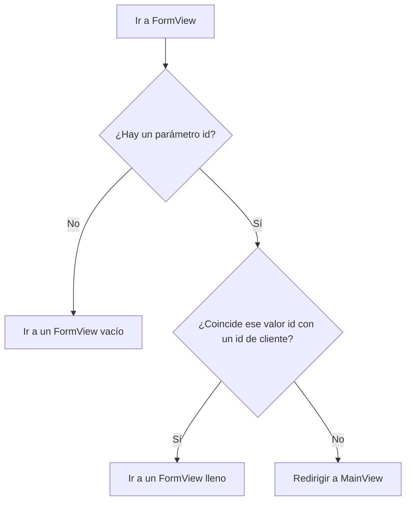

La aplicación de [Routing and Composites](/docs/introduction/tutorial/routing-and-composites) solo puede agregar nuevos clientes a la base de datos. Usando los siguientes conceptos, le darás a los usuarios la capacidad de editar también los datos de los clientes existentes:

- Patrones de ruta
- Pasar valores de parámetros a través de una URL
- Observadores del ciclo de vida

Completar este paso crea una versión de [4-observers-and-route-parameters](https://github.com/webforj/webforj-tutorial/tree/main/4-observers-and-route-parameters).

## Ejecutando la aplicación {#running-the-app}

Mientras desarrollas tu aplicación, puedes usar [4-observers-and-route-parameters](https://github.com/webforj/webforj-tutorial/tree/main/4-observers-and-route-parameters) como comparación. Para ver la aplicación en acción:

1. Navega al directorio de nivel superior que contiene el archivo `pom.xml`, que es `4-observers-and-route-parameters` si estás siguiendo la versión en GitHub.

2. Usa el siguiente comando de Maven para ejecutar la aplicación de Spring Boot localmente:
    ```bash
    mvn
    ```

Ejecutar la aplicación abre automáticamente un nuevo navegador en `http://localhost:8080`.

## Usando el `id` del cliente {#using-the-customers-id}

Para usar `FormView` para editar clientes existentes, necesitarás una forma de indicarle qué cliente editar. Puedes hacer esto proporcionando un parámetro inicial a `FormView` que represente el ID del cliente. En [Working with Data](/docs/introduction/tutorial/working-with-data), creaste una entidad `Customer` que asigna un valor numérico `Long` como un `id` único a los clientes cuando se agregan a la base de datos.

```java
@Id
@GeneratedValue(strategy = GenerationType.IDENTITY)
private Long id;
```

En este paso, harás cambios en `FormView` para que use un `id` como un parámetro inicial antes de que se cargue cualquier cosa. Luego, harás que `FormView` evalúe el `id` para determinar si el formulario es para agregar un nuevo cliente o para actualizar uno existente. Finalmente, modificarás `MainView` para que envíe un valor `id` al navegar a `FormView`.

## Agregando un patrón de ruta a `FormView` {#adding-a-route-pattern}

En el paso anterior, configurar la ruta en `FormView` como `@Route(customer)` mapea la clase localmente a `http://localhost:8080/customer`. Agregar un patrón de ruta te permite agregar un `id` como un parámetro inicial a `FormView`.

Un [Patrón de Ruta](/docs/routing/route-patterns) te permite agregar un parámetro en la URL, hacerlo opcional y establecer restricciones sobre patrones válidos. Usando la anotación `@Route`, aquí está lo que hace que `id` sea un parámetro de ruta opcional para `FormView`:

- **`/:id`** da al patrón de ruta un parámetro nombrado `id`, así que ir a `http://localhost:8080/customer/6` carga `FormView` con un parámetro `id` de `6`.

- **`?`** hace que el parámetro `id` sea opcional. Por defecto, los parámetros son obligatorios, pero hacer que el `id` sea opcional permite usar `FormView` para agregar nuevos clientes que aún no tienen un `id`.

- **`<[0-9]+>`** restringe `id` a ser un número positivo. En corchetes angulares, `<>`, puedes agregar una restricción como una expresión regular al parámetro. Si el `id` no coincide con la restricción, por ejemplo, `http://localhost:8080/customer/john-smith`, envía al usuario a una página 404.

Para agregar el parámetro de ruta opcional a `FormView`, cambia la anotación `@Route` a esto:

```java
@Route("customer/:id?<[0-9]+>")
```

## Enrutando a `FormView` {#routing-to-formview}

`FormView` ahora acepta un parámetro `id` opcional y solo se carga si el `id` es un número positivo entero.

Sin embargo, `FormView` aún puede cargarse cuando un usuario ingresa manualmente una URL para un cliente inexistente, como `http://localhost:8080/customer/5000`. Agregar un observador del ciclo de vida antes de ingresar a `FormView` permite que tu aplicación determine cómo manejar el valor `id` entrante.

### Enrutamiento condicional {#conditional-routing}

Los observadores del ciclo de vida permiten que los componentes reaccionen a eventos de ciclo de vida en etapas específicas. El artículo sobre [Observadores del Ciclo de Vida](/docs/routing/navigation-lifecycle/observers) enumera los observadores disponibles, pero este paso solo utiliza el `WillEnterObserver`.

El `WillEnterObserver` se ejecuta antes de que se complete el enrutamiento del componente. Usar este observador te permite evaluar el `id` entrante. Si el `id` no coincide con un cliente existente, puedes redirigir al usuario de regreso a `MainView` para encontrar un cliente válido para editar.

Antes de discutir el código para el `WillEnterObserver`, el siguiente diagrama de flujo describe cuáles deberían ser los posibles resultados al enrutarse a `FormView`:



### Usando el `WillEnterObserver` {#using-the-willenterobserver}

Usar el observador del ciclo de vida que se activa antes de que el componente se cargue completamente, `WillEnterObserver`, te permite agregar condiciones para determinar si la aplicación debe continuar a `FormView`, o si necesita redirigir a los usuarios a `MainView`.

Cada observador del ciclo de vida es una interfaz, así que implementa `WillEnterObserver` como parte de la declaración de `FormView`:

```java
public class FormView extends Composite<Div> implements WillEnterObserver {
```

El observador `WillEnterObserver` tiene el método `onWillEnter()` que webforJ llama antes de enrutarse al componente. Este método tiene dos parámetros: el `WillEnterEvent` y el `ParametersBag`.

El `WillEnterEvent` determina si continuar el enrutamiento al componente con el método `accept()`, o detener el enrutamiento usando el método `reject()`. Después de rechazar la ruta actual, necesitas redirigir al usuario a otro lugar.

El `ParametersBag` contiene los parámetros del enrutador de la URL. Usarás el `ParametersBag` en la siguiente sección para crear la lógica condicional para `onWillEnter()` utilizando el parámetro `id`.

El siguiente `onWillEnter()` es un ejemplo con solo dos resultados:

```java
@Override
public void onWillEnter(WillEnterEvent event, ParametersBag parameters) {

  //Agregar lógica condicional
  if (<condition>) {

    //Permitir que el enrutamiento a FormView continúe
    event.accept();

  } else {

    //Detener el enrutamiento a FormView
    event.reject();

    //Enviar al usuario a MainView
    navigateToMain();
  }
}
```

### Usando el `ParametersBag` {#using-the-parametersbag}

Como se mencionó brevemente en la sección anterior, el `ParametersBag` contiene el parámetro del enrutador de la URL. Cada observador del ciclo de vida tiene acceso a este objeto, y usarlo en tu aplicación te permite obtener el valor `id`.

El objeto `ParametersBag` proporciona varios métodos de consulta para recuperar un parámetro como un tipo de objeto específico. Por ejemplo, `getInt()` puede obtener un parámetro como un `Integer`.

Sin embargo, dado que algunos parámetros son opcionales, lo que `getInt()` devuelve en realidad es `Optional<Integer>`. Usar el método `ifPresentOrElse()` en el `Optional<Integer>` te permite establecer una variable usando el `Integer`.

Cuando no hay `id` presente, el usuario puede continuar yendo a `FormView` para agregar un nuevo cliente.

```java
@Override
public void onWillEnter(WillEnterEvent event, ParametersBag parameters) {

  //Determinar qué parámetro obtener y comprobar si está presente o no
  parameters.getInt("id").ifPresentOrElse(id -> {

    //Usar el id como una variable
    customerId = Long.valueOf(id);

  //Cuando no hay id presente, continuar a FormView para un nuevo cliente
  }, () -> event.accept());

}
```

### ¿Es válido el `id`? {#is-the-id-valid}

Hasta ahora, el `WillEnterObserver` de la última sección solo acepta el enrutamiento cuando no hay presente un `id`. El observador necesita realizar una verificación más antes de continuar a `FormView`: verificar que el `id` coincide con un cliente existente.

Ahora `FormView` puede usar `CustomerService` para confirmar la existencia de un cliente usando el método `doesCustomerExist()`. Si no hay coincidencia, la aplicación puede rechazar el enrutamiento actual y redirigir al usuario a `MainView` usando `navigateToMain()`.

Cuando se proporciona un `id` válido, la aplicación puede usar `accept()` para continuar el enrutamiento a `FormView`. Crea un método `fillForm()` para asignar la variable `customer` al cliente con el correspondiente `id` en la base de datos y establecer los valores de los campos:

```java
public void fillForm(Long customerId) {
  customer = customerService.getCustomerByKey(customerId);
  firstName.setValue(customer.getFirstName());
  lastName.setValue(customer.getLastName());
  company.setValue(customer.getCompany());
  country.selectKey(customer.getCountry());
}
```

Al igual que al agregar un nuevo cliente, usar la copia de trabajo permite a los usuarios editar los datos del cliente en la interfaz de usuario sin editar directamente el repositorio.

### `onWillEnter()` completo {#completed-onwillenter}

Las dos últimas secciones detallaron cómo manejar cada resultado para el enrutamiento dentro de `FormView` usando el `ParametersBag` y el `CustomerService`.

El siguiente es el `onWillEnter()` completo para `FormView` que utiliza el `ParametersBag` para rechazar o aceptar la ruta entrante, y llama a otros métodos para llenar el formulario o enviar al usuario a `MainView`:

```java
@Override
public void onWillEnter(WillEnterEvent event, ParametersBag parameters) {

  //Determinar qué parámetro obtener y comprobar si está presente o no
  parameters.getInt("id").ifPresentOrElse(id -> {
    customerId = Long.valueOf(id);
    //Comprobar si hay un cliente con este id
    if (customerService.doesCustomerExist(customerId)) {
        //Este cliente existe, así que continúa a FormView e inicializa los campos usando el id
        event.accept();
        fillForm(customerId);
      } else {
        //Este cliente no existe, así que redirigir a MainView
        event.reject();
        navigateToMain();
      }

  //No se presente id, así que continuar a FormView para un nuevo cliente
  }, () -> event.accept());

}
```

## Agregando o editando un cliente {#adding-or-editing-a-customer}

La versión anterior de esta aplicación solo agregaba nuevos clientes cuando el usuario enviaba el formulario. Ahora que los usuarios pueden editar clientes existentes, el método `submitCustomer()` debe verificar si el cliente ya existe antes de actualizar la base de datos.

Inicialmente, no era necesario asignar una variable para el `id` del cliente en `FormView`, porque a los nuevos clientes se les asigna un `id` único cuando se envían a la base de datos. Sin embargo, si declaras `customerId` como una variable inicial en `FormView` con un valor `id` que no está en uso, permanece intacto para nuevos clientes y se sobrescribe en `onWillEnter()` para los existentes.

Esto te permite usar `doesCustomerExist()` para verificar si se debe agregar un nuevo cliente o actualizar uno existente.

```java
private Long customerId = 0L;

//...

private void submitCustomer() {
  if (customerService.doesCustomerExist(customerId)) {
    customerService.updateCustomer(customer);
  } else {
    customerService.createCustomer(customer);
  }
  navigateToMain();
}
```

## `FormView` completo {#completed-formview}

Aquí está cómo debería verse `FormView`, ahora que puede manejar la edición de clientes existentes:

<ExpandableCode title="FormView.java" language="java" startLine={1} endLine={15}>
  {`@Route("customer/:id?<[0-9]+>")
  @FrameTitle("Formulario de Cliente")
  public class FormView extends Composite<Div> implements WillEnterObserver {
    private final CustomerService customerService;
    private Customer customer = new Customer();
    private Long customerId = 0L;
    private Div self = getBoundComponent();
    private TextField firstName = new TextField("Nombre", e -> customer.setFirstName(e.getValue()));
    private TextField lastName = new TextField("Apellido", e -> customer.setLastName(e.getValue()));
    private TextField company = new TextField("Empresa", e -> customer.setCompany(e.getValue()));
    private ChoiceBox country = new ChoiceBox("País",
        e -> customer.setCountry((Customer.Country) e.getSelectedItem().getKey()));
    private Button submit = new Button("Enviar", ButtonTheme.PRIMARY, e -> submitCustomer());
    private Button cancel = new Button("Cancelar", ButtonTheme.OUTLINED_PRIMARY, e -> navigateToMain());
    private ColumnsLayout layout = new ColumnsLayout(
        firstName, lastName,
        company, country,
        submit, cancel);

    public FormView(CustomerService customerService) {
      this.customerService = customerService;
      fillCountries();
      setColumnsLayout();
      self.setMaxWidth(600)
          .addClassName("card")
          .add(layout);
      submit.setStyle("margin-top", "var(--dwc-space-l)");
      cancel.setStyle("margin-top", "var(--dwc-space-l)");
    }

    private void setColumnsLayout() {
      List<Breakpoint> breakpoints = List.of(
          new Breakpoint(600, 2));
      layout.setSpacing("var(--dwc-space-l)")
          .setBreakpoints(breakpoints);
    }

    private void fillCountries() {
      ArrayList<ListItem> listCountries = new ArrayList<>();
      for (Country countryItem : Customer.Country.values()) {
        listCountries.add(new ListItem(countryItem, countryItem.toString()));
      }
      country.insert(listCountries);
      country.selectIndex(0);
    }

    private void submitCustomer() {
      if (customerService.doesCustomerExist(customerId)) {
        customerService.updateCustomer(customer);
      } else {
        customerService.createCustomer(customer);
      }
      navigateToMain();
    }

    private void navigateToMain() {
      Router.getCurrent().navigate(MainView.class);
    }

    @Override
    public void onWillEnter(WillEnterEvent event, ParametersBag parameters) {
      parameters.getInt("id").ifPresentOrElse(id -> {
        customerId = Long.valueOf(id);
        if (customerService.doesCustomerExist(customerId)) {
          event.accept();
          fillForm(customerId);
        } else {
          event.reject();
          navigateToMain();
        }

      }, () -> event.accept());
    }

    public void fillForm(Long customerId) {
      customer = customerService.getCustomerByKey(customerId);
      firstName.setValue(customer.getFirstName());
      lastName.setValue(customer.getLastName());
      company.setValue(customer.getCompany());
      country.selectKey(customer.getCountry());
    }
  }
`}
</ExpandableCode>

## Navegando de `MainView` a `FormView` para editar clientes {#navigating-from-mainview-to-formview-to-edit-customers}

Más arriba en este paso, utilizaste un `ParametersBag` existente para determinar el valor de un `id`. Crear un nuevo `ParametersBag` te permite navegar entre clases directamente con los parámetros que elijas. Usar los datos en la `Table` es una opción viable para enviar a los usuarios a `FormView` con un `id` de cliente.

De manera similar al botón, atar la navegación a una acción elegida por el usuario les permite decidir cuándo ir a `FormView`. Agregar un oyente de eventos a la `Table` te permite enviar al usuario a `FormView` con un `ParametersBag`:

```java
table.addItemClickListener(this::editCustomer);

private void editCustomer(TableItemClickEvent<Customer> e) {
  Router.getCurrent().navigate(FormView.class,
      ParametersBag.of("id=" + e.getItemKey()));
}
```

Sin embargo, la clave de los elementos de la `Table` se genera automáticamente por defecto. Puedes hacer que cada clave corresponda explícitamente al `id` de un cliente utilizando el método `setKeyProvider()`:

```java
table.setKeyProvider(Customer::getId);
```

En `MainView`, agrega los métodos `addItemClickListener()` y `setKeyProvider()` a `buildTable()`, luego agrega el método que envía al usuario a `FormView` con un valor para el `id` en el `ParametersBag` basado en dónde hizo clic el usuario en la tabla:

```java title="MainView.java" {30-31,34-37}
@Route("/")
@FrameTitle("Tabla de Clientes")
public class MainView extends Composite<Div> {
  private final CustomerService customerService;
  private Div self = getBoundComponent();
  private Table<Customer> table = new Table<>();
  private Button addCustomer = new Button("Agregar Cliente", ButtonTheme.PRIMARY,
      e -> Router.getCurrent().navigate(FormView.class));

  public MainView(CustomerService customerService) {
    this.customerService = customerService;
    addCustomer.setWidth(200);
    buildTable();
    self.setWidth("fit-content")
        .addClassName("card")
        .add(table, addCustomer);
  }

  private void buildTable() {
    table.setSize("1000px", "294px");
    table.setMaxWidth("90vw");
    table.addColumn("firstName", Customer::getFirstName).setLabel("Nombre");
    table.addColumn("lastName", Customer::getLastName).setLabel("Apellido");
    table.addColumn("company", Customer::getCompany).setLabel("Empresa");
    table.addColumn("country", Customer::getCountry).setLabel("País");
    table.setColumnsToAutoFit();
    table.setColumnsToResizable(false);
    table.getColumns().forEach(column -> column.setSortable(true));
    table.setRepository(customerService.getRepositoryAdapter());
    table.setKeyProvider(Customer::getId);
    table.addItemClickListener(this::editCustomer);
  }

  private void editCustomer(TableItemClickEvent<Customer> e) {
    Router.getCurrent().navigate(FormView.class,
        ParametersBag.of("id=" + e.getItemKey()));
  }
}
```

## Siguiente paso {#next-step}

Ahora que los usuarios pueden editar datos de clientes directamente, tu aplicación debería validar los cambios antes de comprometernos con el repositorio. En [Validating and Binding Data](/docs/introduction/tutorial/validating-and-binding-data), crearás reglas de validación y asociarás directamente el modelo de datos con la interfaz de usuario, permitiendo que los componentes muestren mensajes de error cuando los datos son inválidos.
