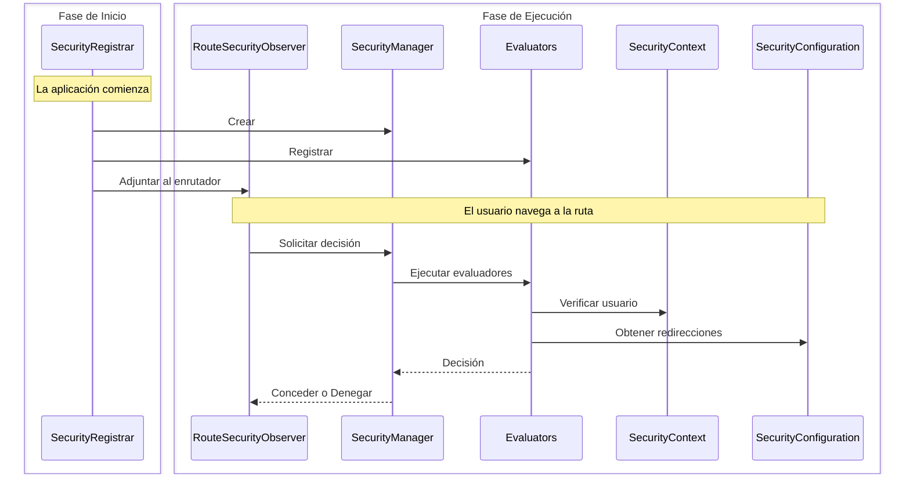

Esta guía explica cómo construir una implementación de seguridad personalizada completa utilizando autenticación basada en sesiones. Aprenderás cómo las cuatro interfaces centrales trabajan juntas al implementarlas desde cero.

:::tip[La mayoría de las aplicaciones deberían usar Spring Security]
La [integración de Spring Security](/docs/security/getting-started) configura automáticamente todo lo que se muestra aquí. Solo construye seguridad personalizada si tienes requisitos específicos o no estás utilizando Spring Boot.
:::

## Lo que construirás {#what-youll-build}

Un sistema de seguridad funcional con cuatro clases:

- **SecurityConfiguration** - Define el comportamiento de seguridad y las ubicaciones de redirección
- **SecurityContext** - Rastrear quién ha iniciado sesión utilizando sesiones HTTP
- **SecurityManager** - Coordina las comprobaciones de seguridad y proporciona inicio/cierre de sesión
- **SecurityRegistrar** - Conecta todo al inicio de la aplicación

Este ejemplo utiliza almacenamiento basado en sesiones, pero podrías implementar las mismas interfaces utilizando consultas a bases de datos, LDAP o cualquier otro backend de autenticación.

## Cómo funcionan juntos los componentes {#how-the-pieces-work-together}



**Flujo:**
1. **`SecurityRegistrar`** se ejecuta al inicio, crea el gestor, registra evaluadores y adjunta el observador
2. **`SecurityManager`** coordina todo: proporciona el contexto y la configuración a los evaluadores
3. **`SecurityContext`** responde "¿Quién ha iniciado sesión?" leyendo desde sesiones HTTP
4. **`SecurityConfiguration`** responde "¿Dónde redirigir?" para páginas de inicio de sesión y acceso denegado
5. **`Evaluators`** toman decisiones de acceso utilizando el contexto y la configuración

## Paso 1: Definir la configuración de seguridad {#step-1-define-security-configuration}

La configuración le dice al sistema de seguridad cómo comportarse y dónde redirigir a los usuarios:

```java title="SecurityConfiguration.java"
package com.securityplain.security;

import com.webforj.router.history.Location;
import com.webforj.router.security.RouteSecurityConfiguration;
import java.util.Optional;

/**
 * Configuración de seguridad para la aplicación.
 *
 * <p>
 * Define dónde redirigir a los usuarios cuando se requiere autenticación o se deniega el acceso.
 * </p>
 */
public class SecurityConfiguration implements RouteSecurityConfiguration {

  @Override
  public boolean isEnabled() {
    return true;
  }

  @Override
  public boolean isSecureByDefault() {
    return false;
  }

  @Override
  public Optional<Location> getAuthenticationLocation() {
    return Optional.of(new Location("/login"));
  }

  @Override
  public Optional<Location> getDenyLocation() {
    return Optional.of(new Location("/access-denied"));
  }
}
```

- `isEnabled() = true` - La seguridad está activa
- `isSecureByDefault() = false` - Las rutas son públicas a menos que se anoten (usa `true` para requerir autenticación en todas las rutas por defecto)
- `/login` - A dónde van los usuarios no autenticados
- `/access-denied` - A dónde van los usuarios autenticados sin permisos

## Paso 2: Implementar el contexto de seguridad {#step-2-implement-security-context}

El contexto rastrea quién está conectado. Esta implementación utiliza sesiones HTTP para almacenar la información del usuario:

<!-- vale off -->

<ExpandableCode title="SecurityContext.java" language="java">
{`package com.securityplain.security;

import com.webforj.Environment;
import com.webforj.router.security.RouteSecurityContext;
import java.util.HashMap;
import java.util.Map;
import java.util.Optional;
import java.util.Set;

/**
 * Contexto de seguridad basado en sesiones simple.
 *
 * <p>
 * Almacena el principal del usuario y los roles en la sesión HTTP. Esta es una implementación mínima para propósitos educativos.
 * </p>
 */
public class SecurityContext implements RouteSecurityContext {
  private static final String SESSION_USER_KEY = "security.user";
  private static final String SESSION_ROLES_KEY = "security.roles";
  private static final String SESSION_ATTRS_KEY = "security.attributes";

  /**
   * {@inheritDoc}
   */
  @Override
  public boolean isAuthenticated() {
    return getPrincipal().isPresent();
  }

  /**
   * {@inheritDoc}
   */
  @Override
  public Optional<Object> getPrincipal() {
    return getSessionAttribute(SESSION_USER_KEY);
  }

  /**
   * {@inheritDoc}
   */
  @Override
  public boolean hasRole(String role) {
    Optional<Object> rolesObj = getSessionAttribute(SESSION_ROLES_KEY);
    if (rolesObj.isPresent() && rolesObj.get() instanceof Set) {
      @SuppressWarnings("unchecked")
      Set<String> roles = (Set<String>) rolesObj.get();
      return roles.contains(role);
    }
    return false;
  }

  /**
   * {@inheritDoc}
   */
  @Override
  public boolean hasAuthority(String authority) {
    // En esta implementación simple, las autoridades son las mismas que los roles
    return hasRole(authority);
  }

  /**
   * {@inheritDoc}
   */
  @Override
  public Optional<Object> getAttribute(String name) {
    Optional<Object> attrsObj = getSessionAttribute(SESSION_ATTRS_KEY);
    if (attrsObj.isPresent() && attrsObj.get() instanceof Map) {
      @SuppressWarnings("unchecked")
      Map<String, Object> attrs = (Map<String, Object>) attrsObj.get();
      return Optional.ofNullable(attrs.get(name));
    }
    return Optional.empty();
  }

  /**
   * {@inheritDoc}
   */
  @Override
  public void setAttribute(String name, Object value) {
    Environment.ifPresent(env -> {
      env.getSessionAccessor().ifPresent(accessor -> {
        accessor.access(session -> {
          @SuppressWarnings("unchecked")
          Map<String, Object> attrs =
              (Map<String, Object>) session.getAttribute(SESSION_ATTRS_KEY);
          if (attrs == null) {
            attrs = new HashMap<>();
            session.setAttribute(SESSION_ATTRS_KEY, attrs);
          }
          attrs.put(name, value);
        });
      });
    });
  }

  private Optional<Object> getSessionAttribute(String key) {
    final Object[] result = new Object[1];
    Environment.ifPresent(env -> {
      env.getSessionAccessor().ifPresent(accessor -> {
        accessor.access(session -> {
          result[0] = session.getAttribute(key);
        });
      });
    });
    return Optional.ofNullable(result[0]);
  }
}`}
</ExpandableCode>

<!-- vale on -->

**Cómo funciona:**

- `isAuthenticated()` verifica si existe un principal de usuario en la sesión
- `getPrincipal()` recupera el nombre de usuario del almacenamiento de sesión
- `hasRole()` verifica si el conjunto de roles del usuario contiene el rol especificado
- `getAttribute()` / `setAttribute()` gestionan atributos de seguridad personalizados
- `Environment.getSessionAccessor()` proporciona acceso a la sesión seguro para hilos

## Paso 3: Crear el gestor de seguridad {#step-3-create-security-manager}

El gestor coordina las decisiones de seguridad. Extiende `AbstractRouteSecurityManager`, que maneja cadenas de evaluadores y la denegación de acceso:

<!-- vale off -->

<ExpandableCode title="SecurityManager.java" language="java">
{`package com.securityplain.security;

import com.webforj.environment.ObjectTable;
import com.webforj.environment.SessionObjectTable;
import com.webforj.router.Router;
import com.webforj.router.security.AbstractRouteSecurityManager;
import com.webforj.router.security.RouteAccessDecision;
import com.webforj.router.security.RouteSecurityConfiguration;
import com.webforj.router.security.RouteSecurityContext;

import java.util.Set;

/**
 * Implementación simple de un gestor de seguridad.
 *
 * <p>
 * Proporciona métodos estáticos para inicio/cierre de sesión y gestiona el contexto de seguridad.
 * </p>
 */
public class SecurityManager extends AbstractRouteSecurityManager {
  private static final String SESSION_USER_KEY = "security.user";
  private static final String SESSION_ROLES_KEY = "security.roles";

  /**
   * {@inheritDoc}
   */
  @Override
  public RouteSecurityConfiguration getConfiguration() {
    return new SecurityConfiguration();
  }

  /**
   * {@inheritDoc}
   */
  @Override
  public RouteSecurityContext getSecurityContext() {
    return new SecurityContext();
  }

  /**
   * Inicia sesión de un usuario con roles.
   *
   * @param username el nombre de usuario
   * @param password la contraseña
   */
  public RouteAccessDecision login(String username, String password) {
    if ("user".equals(username) && "password".equals(password)) {
      Set<String> roles = Set.of("USER");
      persistUser(username, roles);
      return RouteAccessDecision.grant();
    } else if ("admin".equals(username) && "admin".equals(password)) {
      Set<String> roles = Set.of("USER", "ADMIN");
      persistUser(username, roles);
      return RouteAccessDecision.grant();
    }

    return RouteAccessDecision.deny("Nombre de usuario o contraseña inválido");
  }

  /**
   * Cierra sesión del usuario actual y redirige a la página de inicio de sesión.
   */
  public void logout() {
    SessionObjectTable.clear(SESSION_USER_KEY);
    SessionObjectTable.clear(SESSION_ROLES_KEY);

    Router router = Router.getCurrent();
    if (router != null) {
      getConfiguration().getAuthenticationLocation().ifPresent(location -> router.navigate(location));
    }
  }

  /**
   * Obtiene la instancia actual del gestor.
   *
   * @return la instancia actual del gestor
   */
  public static SecurityManager getCurrent() {
    String key = SecurityManager.class.getName();
    if (ObjectTable.contains(key)) {
      return (SecurityManager) ObjectTable.get(key);
    }

    SecurityManager instance = new SecurityManager();
    ObjectTable.put(key, instance);

    return instance;
  }

  void saveCurrent(SecurityManager manager) {
    String key = SecurityManager.class.getName();
    ObjectTable.put(key, manager);
  }

  private void persistUser(String username, Set<String> roles) {
    SessionObjectTable.put(SESSION_USER_KEY, username);
    SessionObjectTable.put(SESSION_ROLES_KEY, roles);
  }
}`}
</ExpandableCode>

<!-- vale on -->

**Cómo funciona:**

- Extiende `AbstractRouteSecurityManager` para heredar la lógica de cadenas de evaluadores
- Proporciona implementaciones de `getConfiguration()` y `getSecurityContext()`
- Agrega `login()` para autenticar usuarios y almacenar credenciales en la sesión
- Agrega `logout()` para limpiar la sesión y redirigir a la página de inicio de sesión
- Usa [`SessionObjectTable`](/docs/advanced/object-string-tables#sessionobjecttable) para un almacenamiento de sesiones simple
- Se almacena a sí mismo en [`ObjectTable`](/docs/advanced/object-string-tables#objecttable) para acceso a nivel de aplicación

## Paso 4: Conectar todo al inicio {#step-4-wire-everything-at-startup}

El registrador conecta todas las piezas cuando la aplicación comienza:

```java title="SecurityRegistrar.java"
package com.securityplain.security;

import com.webforj.App;
import com.webforj.AppLifecycleListener;
import com.webforj.annotation.AppListenerPriority;
import com.webforj.router.Router;
import com.webforj.router.security.RouteSecurityObserver;
import com.webforj.router.security.evaluator.AnonymousAccessEvaluator;
import com.webforj.router.security.evaluator.DenyAllEvaluator;
import com.webforj.router.security.evaluator.PermitAllEvaluator;
import com.webforj.router.security.evaluator.RolesAllowedEvaluator;

/**
 * Registra componentes de seguridad de ruta durante el inicio de la aplicación.
 *
 * <p>
 * Configura el gestor de seguridad y los evaluadores con el enrutador.
 * </p>
 */
@AppListenerPriority(1)
public class SecurityRegistrar implements AppLifecycleListener {

  /**
   * {@inheritDoc}
   */
  @Override
  public void onWillRun(App app) {
    // Crear gestor de seguridad
    SecurityManager securityManager = new SecurityManager();
    securityManager.saveCurrent(securityManager);

    // Registrar evaluadores incorporados con prioridades
    securityManager.registerEvaluator(new DenyAllEvaluator(), 0);
    securityManager.registerEvaluator(new AnonymousAccessEvaluator(), 1);
    securityManager.registerEvaluator(new PermitAllEvaluator(), 2);
    securityManager.registerEvaluator(new RolesAllowedEvaluator(), 3);

    // Crear observador de seguridad y adjuntarlo al enrutador
    RouteSecurityObserver securityObserver = new RouteSecurityObserver(securityManager);
    Router router = Router.getCurrent();
    if (router != null) {
      router.getRenderer().addObserver(securityObserver);
    }
  }
}
```

**Registrar el oyente:**

Crea `src/main/resources/META-INF/services/com.webforj.AppLifecycleListener` con:

```text
com.securityplain.security.SecurityRegistrar
```

Esto registra tu [`AppLifecycleListener`](/docs/advanced/lifecycle-listeners) para que se ejecute al inicio de la aplicación.

**Cómo funciona:**

- Se ejecuta temprano (`@AppListenerPriority(1)`) para configurar la seguridad antes de que se carguen las rutas
- Crea el gestor de seguridad y lo almacena globalmente
- Registra evaluadores incorporados en orden de prioridad (números más bajos se ejecutan primero)
- Crea el observador que intercepta la navegación
- Adjunta el observador al enrutador para que las comprobaciones de seguridad ocurran automáticamente

Después de esto, la seguridad está activa para toda la navegación.

## Usando tu implementación {#using-your-implementation}

### Crear una vista de inicio de sesión {#create-a-login-view}

La siguiente vista utiliza el componente [`Login`](/docs/components/login).

```java title="LoginView.java"
package com.securityplain.views;

import com.securityplain.security.SecurityManager;
import com.webforj.component.Composite;
import com.webforj.component.login.Login;
import com.webforj.router.Router;
import com.webforj.router.annotation.FrameTitle;
import com.webforj.router.annotation.Route;
import com.webforj.router.history.Location;
import com.webforj.router.security.annotation.AnonymousAccess;

@Route("/login")
@FrameTitle("Inicio de sesión")
@AnonymousAccess
public class LoginView extends Composite<Login> {
  private Login self = getBoundComponent();

  public LoginView() {
    self.onSubmit(e -> {
      var result = SecurityManager.getCurrent().login(
        e.getUsername(), e.getPassword()
      );
      
      if (result.isGranted()) {
        Router.getCurrent().navigate(new Location("/"));
      } else {
        self.setError(true);
        self.setEnabled(true);
      }
    });

    self.whenAttached().thenAccept(c -> self.open());
  }
}
```
