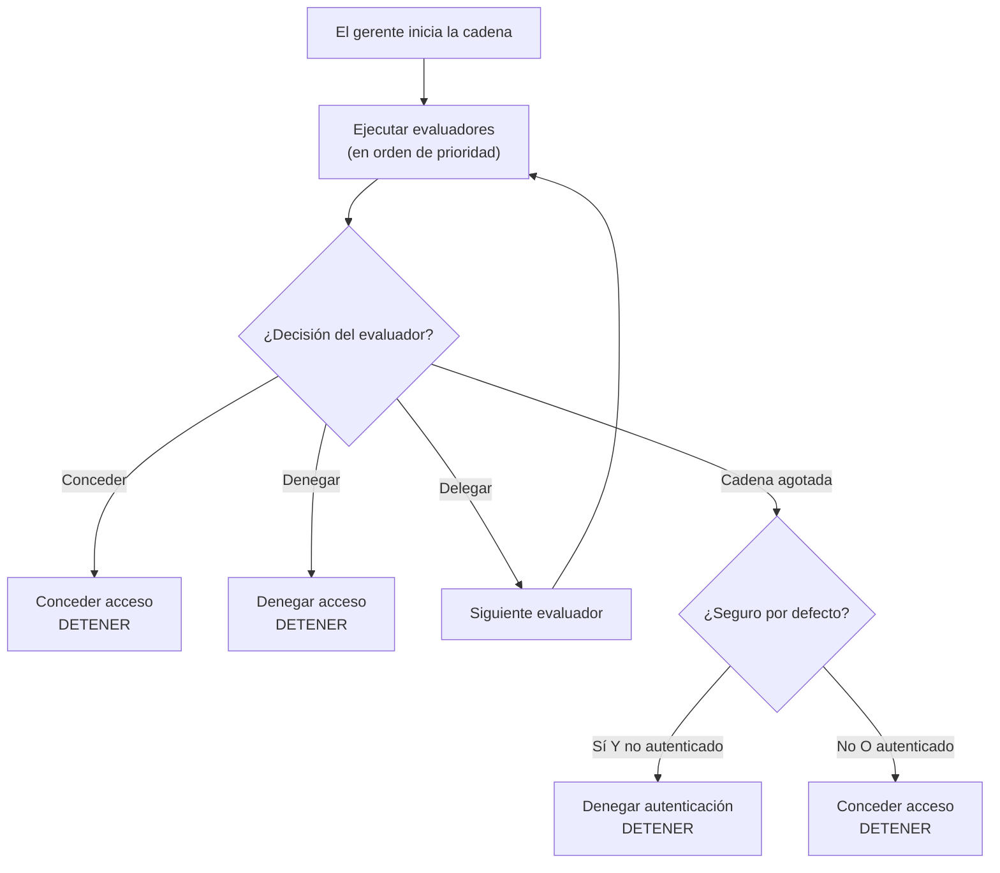

La cadena de evaluadores es el corazón del sistema de seguridad de webforJ. Es una secuencia de evaluadores ordenados por prioridades que examinan las rutas y toman decisiones de acceso utilizando el patrón de diseño de cadena de responsabilidad. Entender cómo funciona la cadena te ayuda a crear evaluadores personalizados y a solucionar denegaciones de acceso inesperadas.

## El patrón de cadena de responsabilidad {#the-chain-of-responsibility-pattern}

La cadena de evaluadores utiliza el patrón de cadena de responsabilidad, donde cada evaluador en la secuencia puede manejar una solicitud de navegación o pasarla al siguiente evaluador. Esto crea un sistema en el que la lógica de seguridad se distribuye entre múltiples evaluadores especializados en lugar de estar centralizada en un verificador monolítico único.

Cuando una ruta necesita evaluación, el gerente de seguridad crea una cadena y la inicia en el primer evaluador. Ese evaluador examina la ruta y toma una de tres decisiones:

1. **Conceder acceso:** El evaluador aprueba la ruta y retorna inmediatamente. No se ejecutan más evaluadores.
2. **Denegar acceso:** El evaluador bloquea la ruta y retorna inmediatamente. No se ejecutan más evaluadores.
3. **Delegar:** El evaluador no toma una decisión y llama a `chain.evaluate()` para pasar el control al siguiente evaluador.

Este patrón permite que los evaluadores se concentren en casos específicos. Cada evaluador implementa `supports(Class<?> routeClass)` para indicar qué rutas maneja. Por ejemplo, `AnonymousAccessEvaluator` solo se ejecuta para rutas marcadas con `@AnonymousAccess`, el gerente nunca lo invoca para otras rutas.

## Cómo se construye la cadena {#how-the-chain-is-built}

El gerente de seguridad mantiene una lista de evaluadores registrados, cada uno con una prioridad asociada. Cuando una ruta necesita evaluación, el gerente ordena los evaluadores por prioridad (números más bajos primero) y crea una cadena.

Los evaluadores se registran utilizando el método `registerEvaluator()` del gerente:

```java
// Registrar evaluadores integrados
securityManager.registerEvaluator(new DenyAllEvaluator(), 0);
securityManager.registerEvaluator(new AnonymousAccessEvaluator(), 1);
securityManager.registerEvaluator(new PermitAllEvaluator(), 2);
securityManager.registerEvaluator(new RolesAllowedEvaluator(), 3);

// Registrar evaluadores personalizados
securityManager.registerEvaluator(new SubscriptionEvaluator(), 10);
```

La prioridad determina el orden de evaluación. Las prioridades más bajas se ejecutan primero, dándoles la primera oportunidad de tomar decisiones de acceso. Esto es importante para la seguridad porque permite que evaluadores críticos bloqueen el acceso antes de que evaluadores permisivos puedan concederlo.

La cadena no tiene estado y se crea fresca para cada solicitud de navegación, de modo que la evaluación de una navegación no afecte a otra.

## Flujo de ejecución de la cadena {#chain-execution-flow}

Cuando la cadena comienza, inicia en el primer evaluador (prioridad más baja) y avanza secuencialmente:



La cadena se detiene tan pronto como cualquier evaluador concede o niega el acceso. Si todos los evaluadores delegan, la cadena se agota y se recurre a un comportamiento seguro por defecto.

## Orden de evaluadores integrados {#built-in-evaluator-ordering}

Cuatro evaluadores integrados manejan anotaciones estándar:

| Evaluador | Anotación | Comportamiento | Comportamiento de la cadena | Orden típico |
|-----------|------------|----------------|------------------------------|---------------|
| `DenyAllEvaluator` | `@DenyAll` | Siempre bloquea el acceso | Detiene la cadena (terminal) | Se ejecuta primero |
| `AnonymousAccessEvaluator` | `@AnonymousAccess` | Permite a todos (autenticados o no) | Detiene la cadena (terminal) | Se ejecuta temprano |
| `PermitAllEvaluator` | `@PermitAll` | Requiere autenticación, permite a todos los usuarios autenticados | Detiene la cadena (terminal) | Se ejecuta a mitad de la cadena |
| `RolesAllowedEvaluator` | `@RolesAllowed` | Requiere autenticación y rol específico | **Continúa la cadena** (componible) | Se ejecuta más tarde |

:::note
Los números de prioridad exactos se asignan durante el registro de evaluadores y difieren entre implementaciones. Consulta [Spring Security](/docs/security/getting-started) o [Implementación personalizada](/docs/security/architecture/custom-implementation#securityregistrar) para valores específicos.
:::

## Cómo delegan los evaluadores {#how-evaluators-delegate}

Antes de invocar a un evaluador, el gerente llama a su método `supports(Class<?> routeClass)`. Solo se invocan los evaluadores que devuelven `true`. Este filtrado obliga a los evaluadores a ejecutarse únicamente para rutas que están diseñados para manejar.

Cuando se invoca a un evaluador, puede:
- **Tomar una decisión**: Retornar conceder o denegar para detener la cadena
- **Delegar**: Llamar a `chain.evaluate()` para pasar el control al siguiente evaluador en la secuencia de prioridad

Por ejemplo, `RolesAllowedEvaluator` verifica si el usuario tiene el rol requerido. Si es así, llama a `chain.evaluate()` para permitir más verificaciones por parte de evaluadores de mayor prioridad. Esta delegación activa permite la composición de evaluadores.

Los evaluadores terminales como `PermitAllEvaluator` toman decisiones finales sin llamar a la cadena, evitando evaluaciones adicionales.

## Cuando se agota la cadena {#when-the-chain-exhausts}

Si cada evaluador delega y ninguno toma una decisión, la cadena se agota y no hay más evaluadores para ejecutar. En este punto, el sistema de seguridad aplica un retroceso basado en la configuración `isSecureByDefault()`:

**Seguro por defecto habilitado** (`isSecureByDefault() == true`):
- Si el usuario está autenticado: Conceder acceso
- Si el usuario no está autenticado: Denegar con autenticación requerida

**Seguro por defecto deshabilitado** (`isSecureByDefault() == false`):
- Conceder acceso independientemente de la autenticación

Las rutas sin anotaciones de seguridad aún tienen un comportamiento definido. Con la opción seguro por defecto habilitada, las rutas no anotadas requieren autenticación. Si se desactiva, las rutas no anotadas son públicas.

## Prioridades de evaluadores personalizados {#custom-evaluator-priorities}

Al crear evaluadores personalizados, elige prioridades cuidadosamente:

- **0-9**: Reservado para evaluadores del núcleo del framework. Evita usar estas prioridades a menos que estés reemplazando evaluadores integrados.
- **10-99**: Recomendados para evaluadores de lógica de negocio personalizados. Estos se ejecutan después de los evaluadores centrales, pero antes de los retrocesos genéricos.

Ejemplo:

```java title="SubscriptionEvaluator.java"
// Evaluador personalizado para acceso basado en suscripción
@RegisteredEvaluator(priority = 10)
public class SubscriptionEvaluator implements RouteSecurityEvaluator {
  @Override
  public boolean supports(Class<?> routeClass) {
    return routeClass.isAnnotationPresent(RequiresSubscription.class);
  }

  @Override
  public RouteAccessDecision evaluate(Class<?> routeClass,
                                       NavigationContext context,
                                       RouteSecurityContext securityContext,
                                       SecurityEvaluatorChain chain) {
    // Verificar si el usuario tiene una suscripción activa
    boolean hasSubscription = checkSubscription(securityContext);

    if (!hasSubscription) {
      return RouteAccessDecision.deny("Se requiere una suscripción activa");
    }

    // El usuario tiene suscripción - continuar la cadena para verificaciones adicionales
    return chain.evaluate(routeClass, context, securityContext);
  }
}
```

Este evaluador se ejecuta con prioridad 10, después de los evaluadores centrales. Si el usuario tiene una suscripción activa, delega a la cadena, permitiendo la composición con otros evaluadores.

## Composición de evaluadores {#evaluator-composition}

La mayoría de los evaluadores integrados son **terminales**, toman una decisión final y detienen la cadena. Solo `RolesAllowedEvaluator` continúa la cadena después de conceder acceso, permitiendo la composición con evaluadores personalizados.

**Evaluadores terminales (no se pueden componer):**
- `@DenyAll`: Siempre niega, detiene la cadena
- `@AnonymousAccess`: Siempre concede, detiene la cadena
- `@PermitAll`: Concede a usuarios autenticados, detiene la cadena

**Evaluadores componibles:**
- `@RolesAllowed`: Si el usuario tiene el rol, **continúa la cadena** para permitir más verificaciones

### Composición que funciona {#composition-that-works}

Puedes componer `@RolesAllowed` con evaluadores personalizados:

```java
@Route("/premium-admin")
@RolesAllowed("ADMIN")  // Verifica el rol, luego continúa la cadena
@RequiresSubscription   // Verificación personalizada se ejecuta después de la verificación de rol
public class PremiumAdminView extends Composite<Div> {
  // Requiere rol ADMIN Y suscripción activa
}
```

Flujo:
1. `RolesAllowedEvaluator` verifica si el usuario tiene el rol `ADMIN`
2. Si es así, llama a `chain.evaluate()` para continuar
3. `SubscriptionEvaluator` verifica el estado de la suscripción (se ejecuta más tarde en la cadena)
4. Si la suscripción está activa, concede acceso; de lo contrario, niega

### Composición que no funciona {#composition-that-does-not-work}

No puedes combinar `@PermitAll` con otros evaluadores porque detiene la cadena:

```java
@Route("/wrong")
@PermitAll           // Concede inmediatamente, detiene la cadena
@RolesAllowed("ADMIN")  // ¡NUNCA se ejecuta!
public class WrongView extends Composite<Div> {
  // Esto concede acceso a CUALQUIER usuario autenticado
  // @RolesAllowed se ignora
}
```

`PermitAllEvaluator` se ejecuta primero (registrado con prioridad más baja), concede acceso a cualquier usuario autenticado y retorna sin llamar a `chain.evaluate()`. El `RolesAllowedEvaluator` nunca se ejecuta.
