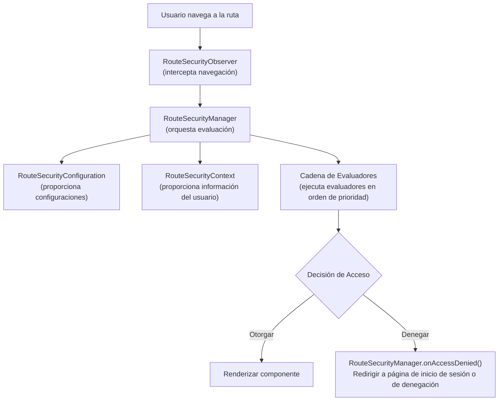

El sistema de seguridad de webforJ está construido sobre una base de interfaces fundamentales que trabajan en conjunto para proporcionar control de acceso a nivel de ruta. Estas interfaces definen los contratos para el comportamiento de seguridad, permitiendo que diferentes implementaciones, ya sean basadas en sesiones, en JSON Web Tokens (JWT), integradas con LDAP o respaldadas por base de datos, se conecten al mismo marco subyacente.

Entender esta arquitectura te ayuda a ver cómo se evalúan las anotaciones de seguridad como `@RolesAllowed` y `@PermitAll`, cómo funciona la interceptación de navegación y cómo puedes construir implementaciones de seguridad personalizadas para tus necesidades específicas.

## Las interfaces fundamentales {#the-four-core-interfaces}

La base de seguridad se construye sobre abstracciones clave, cada una con una responsabilidad específica:

### `RouteSecurityManager` {#routesecuritymanager}

El `RouteSecurityManager` es el coordinador central del sistema de seguridad. Administra los evaluadores de seguridad, orquesta el proceso de evaluación y maneja la denegación de acceso redirigiendo a los usuarios a las páginas apropiadas.

**Responsabilidades:**

- Registrar y gestionar evaluadores de seguridad con prioridades
- Coordinar el proceso de evaluación cuando un usuario navega a una ruta
- Manejar la denegación de acceso desencadenando redirecciones a páginas de inicio de sesión o de acceso denegado
- Almacenar y recuperar ubicaciones de pre-autenticación para redirecciones posteriores al inicio de sesión

```java
public interface RouteSecurityManager {
  RouteAccessDecision evaluate(Class<?> routeClass, NavigationContext context);
  void onAccessDenied(RouteAccessDecision decision, NavigationContext context);
  RouteSecurityContext getSecurityContext();
  RouteSecurityConfiguration getConfiguration();
  void registerEvaluator(RouteSecurityEvaluator evaluator, int priority);
  Optional<Location> consumePreAuthenticationLocation();
}
```

El gerente no toma decisiones de seguridad por sí mismo, delega a los evaluadores y la configuración. Es el vínculo que conecta todos los componentes de seguridad.

### `RouteSecurityContext` {#routesecuritycontext}

El `RouteSecurityContext` proporciona acceso al estado de autenticación del usuario actual. Responde preguntas como si el usuario está autenticado, cuál es su nombre de usuario y si tiene el rol `ADMIN`.

**Responsabilidades:**

- Determinar si el usuario actual está autenticado
- Proporcionar el principal del usuario (típicamente su nombre de usuario o objeto de usuario)
- Verificar si el usuario tiene roles o autoridades específicas
- Almacenar y recuperar atributos de seguridad personalizados

```java
public interface RouteSecurityContext {
  boolean isAuthenticated();
  Optional<Object> getPrincipal();
  boolean hasRole(String role);
  boolean hasAuthority(String authority);
  Optional<Object> getAttribute(String name);
  void setAttribute(String name, Object value);
}
```

Las implementaciones varían según el sistema de autenticación, el almacenamiento de sesiones HTTP, los tokens JWT decodificados de los encabezados, las consultas a la base de datos, las búsquedas LDAP o otros mecanismos.

### `RouteSecurityConfiguration` {#routesecurityconfiguration}

La `RouteSecurityConfiguration` define el comportamiento de seguridad y las ubicaciones de redirección. Indica al sistema de seguridad dónde enviar a los usuarios cuando se requiere autenticación o cuando se deniega el acceso.

**Responsabilidades:**

- Definir si la seguridad está habilitada
- Especificar el comportamiento seguro por defecto
- Proporcionar ubicación de la página de autenticación (típicamente `/login`)
- Proporcionar ubicación de la página de acceso denegado

```java
public interface RouteSecurityConfiguration {
  default boolean isEnabled() { return true; }
  default boolean isSecureByDefault() { return true; }
  default Optional<Location> getAuthenticationLocation() {
    return Optional.of(new Location("/login"));
  }
  default Optional<Location> getDenyLocation() { /* ... */ }
}
```

Esta interfaz separa la política de seguridad de la aplicación de seguridad. Puedes cambiar las ubicaciones de redirección o alternar el comportamiento seguro por defecto sin modificar el gerente o los evaluadores.

### `RouteSecurityEvaluator` {#routesecurityevaluator}

El `RouteSecurityEvaluator` es donde se verifican las reglas de seguridad reales. Cada evaluador examina una ruta y decide si otorgar acceso, denegar acceso o delegar la decisión al siguiente evaluador en la cadena.

**Responsabilidades:**

- Determinar si este evaluador maneja la ruta dada
- Evaluar las anotaciones de seguridad en la clase de la ruta
- Otorgar acceso, denegar acceso o delegar al siguiente evaluador
- Participar en el patrón de cadena de responsabilidad

```java
public interface RouteSecurityEvaluator {
  RouteAccessDecision evaluate(Class<?> routeClass,
                                NavigationContext context,
                                RouteSecurityContext securityContext,
                                SecurityEvaluatorChain chain);
  default boolean supports(Class<?> routeClass) { return true; }
}
```

Los evaluadores integrados manejan anotaciones estándar como `@RolesAllowed`, `@PermitAll`, `@DenyAll` y `@AnonymousAccess`. Puedes crear evaluadores personalizados para implementar la lógica de seguridad específica del dominio.

## Cómo trabajan juntas las interfaces {#how-the-interfaces-work-together}

Estas cuatro interfaces colaboran durante la navegación para hacer cumplir las reglas de seguridad:



Cuando un usuario navega, el `RouteSecurityObserver` intercepta la navegación y pide al `RouteSecurityManager` que evalúe el acceso. El gerente consulta la `RouteSecurityConfiguration` para obtener configuraciones, obtiene información del usuario del `RouteSecurityContext` y ejecuta cada `RouteSecurityEvaluator` en orden de prioridad hasta que uno toma una decisión.

## Interfaces como contratos {#the-interfaces-as-contracts}

Cada interfaz define un contrato, un conjunto de preguntas que el sistema de seguridad necesita que se respondan. **Cómo** responds esas preguntas es tu elección de implementación:

**Contrato de `RouteSecurityContext`:**

- "¿Está autenticado el usuario actual?" (`isAuthenticated()`)
- "¿Quién es el usuario?" (`getPrincipal()`)
- "¿Tiene el usuario el rol X?" (`hasRole()`)

Decides de dónde proviene esta información: sesiones HTTP, tokens JWT decodificados de encabezados, búsquedas en bases de datos, consultas LDAP o cualquier otro backend de autenticación.

**Contrato de `RouteSecurityConfiguration`:**

- "¿Está habilitada la seguridad?" (`isEnabled()`)
- "¿Deben ser seguras las rutas por defecto?" (`isSecureByDefault()`)
- "¿A dónde deben ir los usuarios no autenticados?" (`getAuthenticationLocation()`)

Decides cómo obtener estos valores: codificados, desde archivos de configuración, desde variables de entorno, desde una base de datos o calculados dinámicamente.

**Contrato de `RouteSecurityManager`:**

- "¿Debería este usuario acceder a esta ruta?" (`evaluate()`)
- "¿Qué sucede cuando se deniega el acceso?" (`onAccessDenied()`)
- "¿Qué evaluadores deben ejecutarse?" (`registerEvaluator()`)

Decides el flujo de autenticación, dónde almacenar ubicaciones de pre-autenticación y cómo manejar escenarios de denegación personalizados.

La arquitectura de la base define estos contratos, pero la implementación es flexible. Diferentes sistemas pueden implementar estas interfaces de maneras completamente diferentes según los requisitos específicos.

## La clase base `AbstractRouteSecurityManager` {#the-abstractroutesecuritymanager-base-class}

La mayoría de las implementaciones no implementan `RouteSecurityManager` directamente. En su lugar, extienden `AbstractRouteSecurityManager`, que proporciona:

- Registro de evaluadores y clasificación basada en prioridades
- Lógica de ejecución de la cadena
- Manejo de denegaciones de acceso con redirecciones automáticas
- Almacenamiento de ubicaciones de pre-autenticación en la sesión HTTP
- Comportamiento seguro por defecto

La clase base implementa la interfaz `RouteSecurityManager` y proporciona implementaciones concretas para la gestión de evaluadores, evaluación de acceso y manejo de denegaciones. Las subclases solo necesitan proporcionar el contexto y la configuración de seguridad. La clase base gestiona automáticamente la gestión de evaluadores, la ejecución de la cadena y el manejo de denegaciones.
