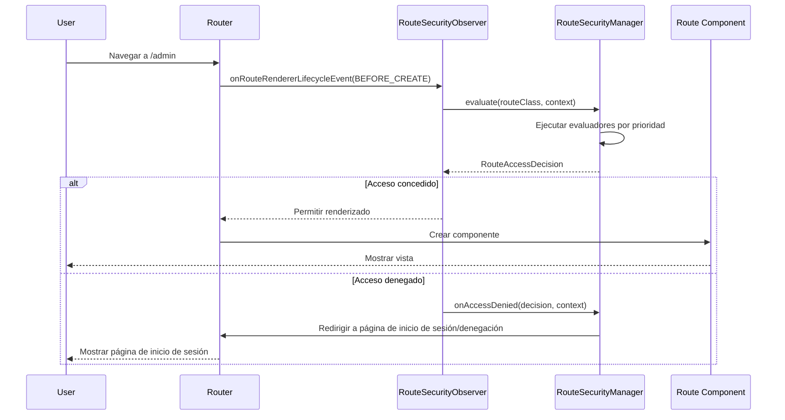

La aplicación de seguridad en webforJ ocurre automáticamente durante la navegación. Cuando un usuario hace clic en un enlace o navega a una ruta, el sistema de seguridad intercepta la navegación, evalúa las reglas de acceso y permite que la navegación continúe o redirige al usuario a una página apropiada. Esta interceptación es invisible para los usuarios y no requiere verificaciones manuales de seguridad en el código de su componente.

Entender cómo funciona la interceptación de navegación le ayuda a solucionar problemas de seguridad y construir lógica de navegación personalizada que se integre con el sistema de seguridad.

## El `RouteSecurityObserver` {#the-routesecurityobserver}

El `RouteSecurityObserver` es un observador de navegación que se integra en el ciclo de vida del enrutador. Escucha eventos de navegación y evalúa las reglas de seguridad antes de que se renderice cualquier componente.

El observador se adjunta al renderizador del enrutador durante el inicio de la aplicación:

```java
// Crear el observador con su administrador de seguridad
RouteSecurityObserver observer = new RouteSecurityObserver(securityManager);

// Adjuntarlo al renderizador del enrutador
Router router = Router.getCurrent();
if (router != null) {
  router.getRenderer().addObserver(observer);
}
```

Una vez adjunto, el observador intercepta cada solicitud de navegación. El observador se sitúa entre las solicitudes de navegación y el renderizado de componentes; cuando comienza la navegación, solicita al administrador de seguridad que evalúe el acceso. Solo si se concede acceso se renderiza el componente.

## Flujo de interceptación de navegación {#navigation-interception-flow}

Cuando un usuario navega a una ruta, ocurre la siguiente secuencia:



Este flujo muestra que la evaluación de seguridad ocurre antes de que se ejecute cualquier código de ruta sensible. Si se deniega el acceso, el componente nunca se instancia, lo que evita que usuarios no autorizados activen lógica comercial o accedan a datos protegidos.

## Puntos de interceptación {#interception-points}

El observador intercepta la navegación en un punto específico del ciclo de vida del enrutamiento:

**Antes de renderizar** El método `onRouteRendererLifecycleEvent()` del observador se llama con el evento `LifecycleEvent.BEFORE_CREATE` después de que la ruta se resuelve, pero antes de que se cree el componente. Este es el punto de control de seguridad crítico.

En este punto, el enrutador sabe qué clase de ruta se renderizará, pero la ruta aún no se ha instanciado. El observador puede evaluar las anotaciones de seguridad en la clase sin ejecutar la lógica de ruta.

Si se deniega el acceso, el observador evita el renderizado y activa una redirección. La ruta original nunca se instancia.

## El proceso de evaluación {#the-evaluation-process}

Cuando el observador intercepta la navegación, delega la evaluación al administrador de seguridad. El observador recupera la clase de ruta del contexto de navegación y pide al administrador que evalúe el acceso. Si la decisión concede acceso, la navegación procede con normalidad. Si la decisión niega el acceso, el observador detiene la propagación para evitar el renderizado y permite que el administrador maneje la denegación.

El administrador coordina la evaluación mediante:

1. Verificar si la seguridad está habilitada en la configuración
2. Obtener el contexto de seguridad actual (información del usuario)
3. Ejecutar la cadena de evaluadores en orden de prioridad
4. Devolver la decisión final de acceso

El observador actúa según la decisión: si se concede, la navegación continúa; si se deniega, el observador detiene la propagación y permite que el administrador maneje la denegación.

## Cómo se toman las decisiones de acceso {#how-access-decisions-are-made}

El administrador de seguridad crea una cadena de evaluadores y ejecuta cada evaluador en orden de prioridad. Los evaluadores pueden tomar tres tipos de decisiones:

- **Conceder acceso:** El evaluador aprueba la navegación y la ruta se renderiza. No se consultan más evaluadores. El evaluador devuelve una decisión indicando que se concede acceso.

- **Negar acceso:** El evaluador bloquea la navegación. El observador detiene el renderizado y activa una redirección. El evaluador devuelve una decisión de denegación, opcionalmente con un mensaje de razón. La denegación puede ser debido a la falta de autenticación (requiriendo inicio de sesión) o falta de autorización (permisos insuficientes).

- **Delegar al siguiente evaluador:** El evaluador no toma una decisión y pasa el control al siguiente evaluador en la cadena. El evaluador llama al método evaluate de la cadena, lo que avanza al siguiente evaluador en orden de prioridad.

La mayoría de los evaluadores solo manejan rutas con anotaciones específicas. Por ejemplo, `RolesAllowedEvaluator` solo evalúa rutas anotadas con `@RolesAllowed`. Si la anotación no está presente, delega al siguiente evaluador.

## Manejo de la denegación de acceso {#handling-access-denial}

Cuando se niega el acceso, el método `onAccessDenied()` del administrador maneja la denial en función del tipo de denegación:

- **Autenticación requerida:** El usuario no ha iniciado sesión. Redirigir a la página de inicio de sesión configurada en `RouteSecurityConfiguration.getAuthenticationLocation()`.

- **Acceso denegado:** El usuario ha iniciado sesión pero carece de permisos. Redirigir a la página de acceso denegado configurada en `RouteSecurityConfiguration.getDenyLocation()`.

Antes de redirigir, el administrador almacena la ubicación originalmente solicitada en la sesión HTTP. Después del inicio de sesión exitoso, esta ubicación se puede recuperar utilizando el método `consumePreAuthenticationLocation()` del administrador, que devuelve la ubicación almacenada y la elimina de la sesión. Si se almacenó una ubicación, la aplicación puede navegar allí; de lo contrario, navega a una página predeterminada.

## Cuando la seguridad está deshabilitada {#when-security-is-disabled}

Si `RouteSecurityConfiguration.isEnabled()` devuelve `false`, el administrador omite toda evaluación y concede acceso inmediatamente a cada ruta. La cadena de evaluadores nunca se ejecuta y no se realizan verificaciones de seguridad.

Esto es útil durante el desarrollo o para aplicaciones que no requieren seguridad. Puede alternar la seguridad encendida y apagada sin eliminar anotaciones o desregistrar el observador.

## Integración con el ciclo de vida de navegación {#integration-with-navigation-lifecycle}

El observador de seguridad se integra con el [ciclo de vida de navegación](/docs/routing/navigation-lifecycle/overview), donde múltiples observadores pueden engancharse a eventos de navegación. La evaluación de seguridad ocurre temprano en este ciclo de vida, antes de que ocurra el bloqueo de navegación o eventos del ciclo de vida de componentes.

Si implementa observadores de navegación personalizados, esté atento a que la evaluación de seguridad ocurre primero. Si se deniega el acceso, el método `onRouteRendererLifecycleEvent()` de su observador no será llamado con `BEFORE_CREATE` porque la navegación se ha detenido.
