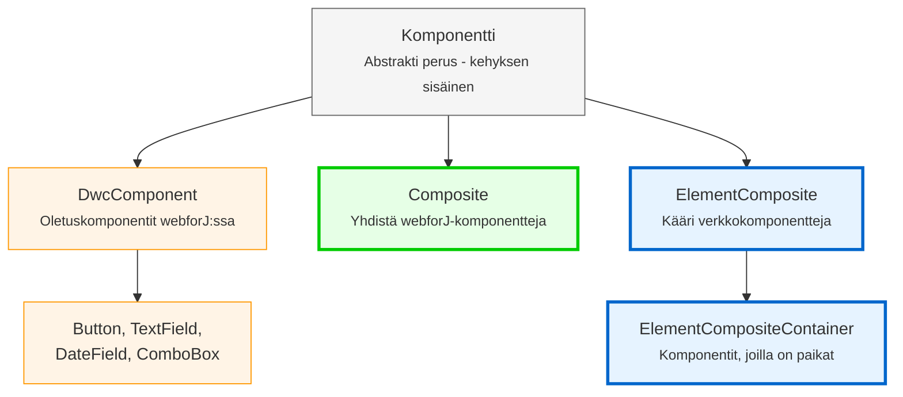

<DocChip chip='since' label='23.05' />
<JavadocLink type="foundation" location="com/webforj/component/Component" top='true'/> 

Ennen kuin rakennat mukautettuja komponentteja webforJ:ssä, on tärkeää ymmärtää perustavanlaatuinen arkkitehtuuri, joka määrittää, miten komponentit toimivat. Tässä artikkelissa selitetään komponenttierarkia, komponentin identiteetti, elinkaarikonseptit ja kuinka huolenaiheiden rajapinnat tarjoavat komponenttikykyjä.

## Ymmärtäminen komponenttierarkiasta

webforJ järjestää komponentit hierarkiaan, jossa on kaksi ryhmää: kehyksen sisäiset luokat, joita et koskaan saa laajentaa, ja luokat, jotka on suunniteltu erityisesti mukautettujen komponenttien rakentamiseen. Tässä osiossa selitetään, miksi webforJ käyttää koostumusta periytymisen sijaan ja mitä kukin hierarkian taso tarjoaa.

### Miksi koostumus eikä laajentaminen?

webforJ:ssä oletuskomponentit, kuten [`Button`](../components/button) ja [`TextField`](../components/fields/textfield), ovat lopullisia luokkia - et voi laajentaa niitä:

```java
// Tämä ei toimi webforJ:ssä
public class MyButton extends Button {
    // Button on lopullinen - ei voi laajentaa 
}
```

webforJ käyttää **koostumusta periytymisen sijaan**. Sen sijaan, että laajentaisit olemassa olevia komponentteja, luot luokan, joka laajentaa `Composite`-luokkaa ja yhdistää komponentteja sen sisälle. `Composite` toimii säiliönä, joka käärii yksittäisen komponentin (nimeltään sidottu komponentti) ja mahdollistaa omien komponenttien ja käytöksen lisäämisen siihen.

```java
public class SearchBar extends Composite<FlexLayout> {
    private TextField searchField;
    private Button searchButton;
    
    public SearchBar() {
        searchField = new TextField("Haku");
        searchButton = new Button("Mene");
        
        getBoundComponent()
            .setDirection(FlexDirection.ROW)
            .add(searchField, searchButton);
    }
}
```

### Miksi et voi laajentaa oletuskomponentteja

webforJ-komponentit on merkitty lopullisiksi, jotta varmistetaan asiakaspuolen verkkokomponentin eheyden säilyttäminen. webforJ-komponenttiluokkien laajentaminen antaisi hallinnan alapuolelle verkkokomponentille, mikä voisi johtaa odottamattomiin seurauksiin ja rikkoa komponentin käyttäytymisen johdonmukaisuuden ja ennustettavuuden.

Yksityiskohtaisen selityksen saamiseksi katso [Lopulliset luokat ja laajentamisrajoitukset](https://docs.webforj.com/docs/architecture/controls-components#final-classes-and-extension-restrictions) arkkitehtuuridokumentaatiossa.

### Komponenttierarkia



**Luokat kehittäjille (käytä näitä):**
- **Composite**
- **ElementComposite**
- **ElementCompositeContainer**

**Sisäiset kehysluokat (älä laajenna suoraan):**
- **Component**
- **DwcComponent**

:::warning[Älä laajenna `Component` tai `DwcComponent`]
Älä laajenna `Component` tai `DwcComponent` suoraan. Kaikki oletuskomponentit ovat lopullisia. Käytä aina koostumuskaavoja `Composite` tai `ElementComposite` kanssa.

Yrittäminen laajentaa `DwcComponent` -luokkaa aiheuttaa ajonaikaisen poikkeuksen.
:::

## Huolenaiheiden rajapinnat: Kykyjen lisääminen komponentteihisi

Huolenaiheiden rajapinnat ovat Java-rajapintoja, jotka tarjoavat erityisiä kykyjä komponentillesi. Jokainen rajapinta lisää joukon liittyviä menetelmiä. Esimerkiksi `HasSize` lisää metodit leveyden ja korkeuden hallintaan, kun taas `HasFocus` lisää metodit fokus-tilan hallintaan.

Kun implementoit huolenaiheiden rajapinnan komponentillasi, saat käyttöönsi nämä kyvyt ilman, että sinun tarvitsee kirjoittaa mitään toteutuskoodia. Rajapinta tarjoaa oletusimplementaatioita, jotka toimivat automaattisesti.

Huolenaiheiden rajapintojen toteuttaminen antaa mukautetuille komponenteillesi samat API:t kuin webforJ:n oletuskomponenteilla:

```java
// Implementoi HasSize saadaksesi automaattisesti leveys/korkeus -metodit
public class SizedCard extends Composite<Div> implements HasSize<SizedCard> {
    
    public SizedCard() {
        getBoundComponent().setText("Kortin sisältö");
    }
    
    // Ei tarvitse toteuttaa näitä - saat ne ilmaiseksi:
    // setWidth(), setHeight(), setSize()
}

// Käytä sitä kuten mitä tahansa webforJ-komponenttia
SizedCard card = new SizedCard();
card.setWidth("300px")
    .setHeight("200px");
```

Koosteen automaattisesti välittää nämä kutsut alapuolelle `Div`:lle. Ei tarvitse ylimääräistä koodia.

**Yleiset huolenaiheiden rajapinnat:**
- `HasSize` - `setWidth()`, `setHeight()`, `setSize()`
- `HasFocus` - `focus()`, `setFocusable()`, fokusitapahtumat
- `HasClassName` - `addClassName()`, `removeClassName()`
- `HasStyle` - `setStyle()`, inline CSS -hallinta
- `HasVisibility` - `setVisible()`, näyttää/piilottaa kyky
- `HasText` - `setText()`, tekstin sisällön hallinta
- `HasAttribute` - `setAttribute()`, HTML-attribuuttien hallinta

:::warning
Jos alapuolinen komponentti ei tue rajapinnan kykyä, saat ajonaikaisen poikkeuksen. Tarjoa oma toteutuksesi tuossa tapauksessa.
:::

Saat täydellisen luettelon käytettävissä olevista huolenaiheiden rajapinnoista osoitteesta [webforJ JavaDoc](https://javadoc.io/doc/com.webforj/webforj-foundation/latest/com/webforj/concern/package-summary.html).

## Komponentin elinkaaren yleiskatsaus

webforJ hallitsee komponentin elinkaarta automaattisesti. Kehys käsittelee komponentin luomisen, liittämisen ja tuhoamisen ilman manuaalista väliintuloa.

**Elinkaarivedokset** ovat saatavilla, kun tarvitset niitä:
- `onDidCreate()` - Kutsuu, kun komponentti on liitetty DOM:iin
- `onDidDestroy()` - Kutsuu, kun komponentti tuhotaan

Nämä vedokset ovat **valinnaisia**. Käytä niitä, kun sinun tarvitsee:
- Puhdistaa resursseja (lopettaa väliin, sulkea yhteyksiä)
- Alustaa komponentteja, jotka vaativat DOM:in liittämistä
- Integroi asiakaspuolen JavaScriptin kanssa

Useimmissa yksinkertaisissa tapauksissa voit alustaa komponentteja suoraan konstruktorissa. Käytä elinkaarivedoksia, kuten `onDidCreate()`, työn siirtämiseen tarvittaessa.
