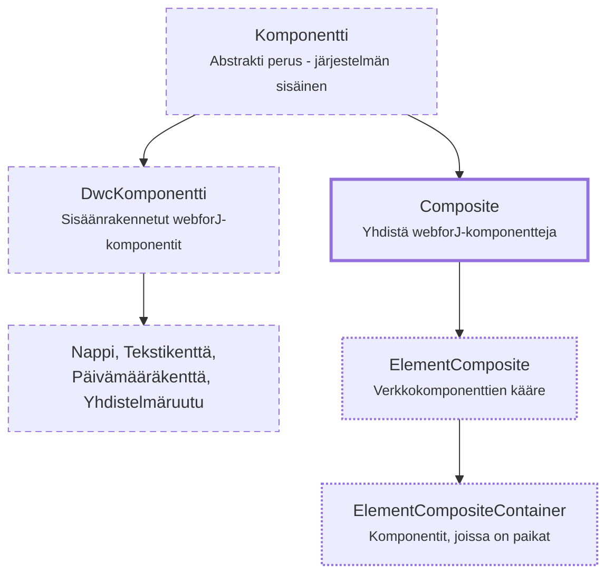

<JavadocLink type="foundation" location="com/webforj/component/Component" top='true'/> 

Ennen kuin rakennat mukautettuja komponentteja webforJ:ssä, on tärkeää ymmärtää perustavanlaatuiset rakenteet, jotka vaikuttavat komponenttien toimintaan. Tämä artikkeli selittää komponenttihierarkian, komponenttien identiteetin, elinkaarikäsitteet ja kuinka huolenaiheiden rajapinnat tarjoavat komponenttien ominaisuuksia.

## Ymmärrys komponenttihierarkiasta {#understanding-the-component-hierarchy}

webforJ järjestää komponentit hierarkiaan kahteen ryhmään: järjestelmän sisäisiin luokkiin, joita et koskaan saa laajentaa, ja luokkiin, jotka on erityisesti suunniteltu mukautettujen komponenttien rakentamiseen. Tämä osio selittää, miksi webforJ käyttää koostumista perinnön sijaan ja mitä jokainen hierarkian taso tarjoaa.

### Miksi koostumus eikä laajentaminen? {#why-composition-instead-of-extension}

webforJ:ssä sisäänrakennetut komponentit, kuten [`Button`](../components/button) ja [`TextField`](../components/fields/textfield), ovat lopullisia luokkia—et voi laajentaa niitä:

```java
// Tämä ei toimi webforJ:ssä
public class MyButton extends Button {
  // Button on lopullinen - sitä ei voi laajentaa 
}
```

webforJ käyttää **koostumista perinnön sijaan**. Sen sijaan, että laajentaisit olemassa olevia komponentteja, luot luokan, joka laajentaa `Composite` ja yhdistää komponentit sen sisälle. `Composite` toimii säiliönä, joka kääriytyy yhteen komponenttiin (kutsutaan sidotuksi komponentiksi) ja antaa sinun lisätä omia komponentteja ja toimintoa siihen.

```java
public class SearchBar extends Composite<FlexLayout> {
  private final FlexLayout self = getBoundComponent();
  private TextField searchField;
  private Button searchButton;
  
  public SearchBar() {
    searchField = new TextField("Haku");
    searchButton = new Button("Mene");
    
    self.setDirection(FlexDirection.ROW)
      .add(searchField, searchButton);
  }
}
```

### Miksi et voi laajentaa sisäänrakennettuja komponentteja {#why-you-cant-extend-built-in-components}

webforJ-komponentit on merkitty lopullisiksi, jotta säilytettäisiin asiakaspuolen web-komponentin eheys. webforJ-komponenttiluokkien laajentaminen antaisi hallinnan alhaalla olevalle web-komponentille, mikä voisi johtaa odottamattomiin seurauksiin ja rikkoa komponenttien käyttäytymisen johdonmukaisuuden ja ennakoitavuuden.

Yksityiskohtaisen selityksen saat osiosta [Lopulliset luokat ja laajentamiskielto](https://docs.webforj.com/docs/architecture/controls-components#final-classes-and-extension-restrictions) arkkitehtuuridokumentaatiossa.

### Komponenttihierarkia {#the-component-hierarchy}

<div style={{textAlign: 'center'}}>

```mermaid
graph TD
  A[Komponentti<br/><small>Abstrakti perus - järjestelmän sisäinen</small>]
  
  A --> B[DwcKomponentti<br/><small>Sisäänrakennetut webforJ-komponentit</small>]
  A --> C[Composite<br/><small>Yhdistä webforJ-komponentteja</small>]
  
  B --> E[Nappi, Tekstikenttä,<br/>Päivämääräkenttä, Yhdistelmäruutu]
  
  C --> D[ElementComposite<br/><small>Verkkokomponenttien kääre</small>]
  D --> F[ElementCompositeContainer<br/><small>Komponentit, joissa on paikat</small>]

  classDef internal stroke-dasharray:6 4,stroke-width:1px
  classDef primary stroke-width:3px
  classDef secondary stroke-width:2px,stroke-dasharray:2 2
  class A,B,E internal
  class C primary
  class D,F secondary
```
</div>

Kehittäjille tarkoitetut luokat (käytä näitä):
- `Composite`
- `ElementComposite`
- `ElementCompositeContainer`

Sisäiset järjestelmäluokat (älä laajenna suoraan):
- `Component`
- `DwcComponent`

:::warning[Älä koskaan laajenna `Component` tai `DwcComponent`]
Älä koskaan laajenna `Component` tai `DwcComponent` suoraan. Kaikki sisäänrakennetut komponentit ovat lopullisia. Käytä aina koostumismalleja `Composite` tai `ElementComposite` kanssa.

Yritys laajentaa `DwcComponent` heittää ajonaikaisen poikkeuksen.
:::

## Huolenaiheiden rajapinnat {#concern-interfaces}

Huolenaiheiden rajapinnat ovat Java-rajapintoja, jotka tarjoavat erityisiä ominaisuuksia komponentillesi. Jokainen rajapinta lisää joukon liittyviä metodeja. Esimerkiksi `HasSize` lisää metodeja leveyden ja korkeuden hallintaan, kun taas `HasFocus` lisää metodeja fokus-tilan hallintaan.

Kun toteutat huolenaiheiden rajapinnan komponentissasi, saat käyttöön nämä ominaisuudet ilman, että sinun tarvitsee kirjoittaa toteutuskoodeja. Rajapinta tarjoaa oletustoteutuksia, jotka toimivat automaattisesti.

Huolenaiheiden rajapintojen toteuttaminen antaa mukautetuille komponenteillesi samat API:t kuin sisäänrakennetuissa webforJ-komponenteissa:

```java
// Toteuta HasSize saadaksesi leveys/korkeusmetodit automaattisesti
public class SizedCard extends Composite<Div> implements HasSize<SizedCard> {
  private final Div self = getBoundComponent();
  
  public SizedCard() {
    self.setText("Kortin sisältö");
  }
  
  // Ei tarvitse toteuttaa näitä - saat ne ilmaiseksi:
  // setWidth(), setHeight(), setSize()
}

// Käytä sitä kuten mitä tahansa webforJ-komponenttia
SizedCard card = new SizedCard();
card.setWidth("300px")
  .setHeight("200px");
```

Koostumus välittää automaattisesti nämä kutsut taustalla olevalle `Div`:lle. Ei lisäkoodia tarvita.

### Ulkoasu {#concern-interfaces-appearance}

Nämä rajapinnat hallitsevat komponentin visuaalista esitystä, mukaan lukien sen mitat, näkyvyys, tyylit ja teema.

| Rajapinta | Kuvaus |
|---|---|
| `HasSize` | Hallitsee leveyttä ja korkeutta, mukaan lukien minimi- ja maksimi-rakenteet. Laajentaa `HasWidth`, `HasHeight` ja niiden min/max-variantteja. |
| `HasVisibility` | Näyttää tai piilottaa komponentin poistamatta sitä asettelusta. |
| `HasClassName` | Hallitsee CSS-luokkien nimiä komponentin juurielementissä. |
| `HasStyle` | Soveltaa ja poistaa sisäisiä CSS-tyylejä. |
| `HasHorizontalAlignment` | Hallitsee kuinka sisältö on kohdistettu vaakasuoraan komponentissa. |
| `HasExpanse` | Asettaa komponentin koon variantin käyttämällä vakiomittaluokkia (`XSMALL` - `XLARGE`). |
| `HasTheme` | Soveltaa teeman varianttia, kuten `DEFAULT`, `PRIMARY` tai `DANGER`. |
| `HasPrefixAndSuffix` | Lisää komponentteja etuliitteeseen tai jälkiliitteeseen komponentin sisällä. |

### Sisältö {#concern-interfaces-content}

Nämä rajapinnat hallitsevat, mitä komponentti näyttää, mukaan lukien teksti, HTML, etiketit, vihjeet ja muut kuvaavat sisällöt.

| Rajapinta | Kuvaus |
|---|---|
| `HasText` | Asettaa ja hakee komponentin pelkän tekstisisällön. |
| `HasHtml` | Asettaa ja hakee komponentin sisäisen HTML:n. |
| `HasLabel` | Lisää kuvailevan etiketin komponentille, jota käytetään esteettömyyden vuoksi. |
| `HasHelperText` | Näyttää toissijaisen vihjetekstin komponentin alapuolella. |
| `HasPlaceholder` | Asettaa paikkamerkki-tekstin, joka näytetään, kun komponentilla ei ole arvoa. |
| `HasTooltip` | Liittää työkaluvihjeen, joka näkyy hiiren yllä. |

### Tila {#concern-interfaces-state}

Nämä rajapinnat hallitsevat komponentin interaktiivista tilaa, mukaan lukien onko se käytössä, muokattavissa, pakollinen tai saako se fokuksen latauksen yhteydessä.

| Rajapinta | Kuvaus |
|---|---|
| `HasEnablement` | Ottaa käyttöön tai poistaa käytöstä komponentin. |
| `HasReadOnly` | Asettaa komponentin vain lukemiseen, jolloin arvo on näkyvissä mutta sitä ei voi muuttaa. |
| `HasRequired` | Merkitsee komponentin pakolliseksi, tyypillisesti lomakevalidointia varten. |
| `HasAutoFocus` | Siirtää fokuksen komponenttiin automaattisesti, kun sivu latautuu. |

### Fokus {#concern-interfaces-focus}

Nämä rajapinnat hallitsevat, miten komponentti saa ja reagoi näppäimistöfokukseen.

| Rajapinta | Kuvaus |
|---|---|
| `HasFocus` | Hallitsee fokus-tilaa ja voiko komponentti saada fokuksen. |
| `HasFocusStatus` | Tarkistaa, onko komponentilla tällä hetkellä fokus. Vaatii pyynnön palvelimelle. |
| `HasHighlightOnFocus` | Hallitsee, korostetaanko komponentin sisältöä, kun se saa fokuksen ja miten (`KEY`, `MOUSE`, `KEY_MOUSE`, `ALL` jne.). |

### Syöttörajoitukset {#concern-interfaces-input-constraints}

Nämä rajapinnat määrittelevät, mitä arvoja komponentti hyväksyy, mukaan lukien nykyinen arvo, sallittavat alueet, pituusrajoitukset, muotoilumaskit ja kielikohtaiset toimintatavat.

| Rajapinta | Kuvaus |
|---|---|
| `HasValue` | Hakee ja asettaa komponentin nykyisen arvon. |
| `HasMin` | Asettaa sallitun vähimmäisarvon. |
| `HasMax` | Asettaa sallitun enimmäisarvon. |
| `HasStep` | Asettaa askelvälin numeerisille tai alueen syötteille. |
| `HasPattern` | Soveltaa säännöllistä lauseketta rajoittaakseen hyväksyttyä syötettä. |
| `HasMinLength` | Asettaa komponentin arvon vaatimaksi vähimmäismerkkimääräksi. |
| `HasMaxLength` | Asettaa komponentin arvossa sallitun enimmäismerkkimäärän. |
| `HasMask` | Soveltaa syötteelle muotoilumaskeja. Käytetään maskeeratuissa kenttäkomponenteissa. |
| `HasTypingMode` | Hallitsee, tuleeko kirjoitetut merkit lisätä vai korvata olemassa olevat merkit (`INSERT` tai `OVERWRITE`). Käytetään maskeeratuissa kentissä ja `TextArea`:ssa. |
| `HasRestoreValue` | Määrittelee arvon, johon komponentti palautuu, kun käyttäjä painaa Escape tai kutsuu `restoreValue()`. Käytetään maskeeratuissa kentissä. |
| `HasLocale` | Tallentaa komponentin yksilöllisen kielen, jota käytetään kielikohtaisessa muotoilussa. Käytetään maskeeratuissa päivämäärä- ja aikakentissä. |
| `HasPredictedText` | Asettaa ennakoidun tai automaattisesti ehdotetun tekstin arvon. Käytetään `TextArea`:ssa, jotta tuetaan sisäisiä ehdotuksia. |

### Validointi {#concern-interfaces-validation}

Nämä rajapinnat lisäävät asiakaspuolen validointikäyttäytymistä, mukaan lukien komponenttien merkitseminen virheelliseksi, virheilmoitusten näyttäminen ja sen hallinta, milloin validointi suoritetaan.

| Rajapinta | Kuvaus |
|---|---|
| `HasClientValidation` | Merkitsee komponentin virheelliseksi, asettaa virheilmoituksen ja liittää asiakaspuolen validoijan. |
| `HasClientAutoValidation` | Hallitsee, validoiko komponentti automaattisesti, kun käyttäjä kirjoittaa. |
| `HasClientAutoValidationOnLoad` | Hallitsee, validoiko komponentti, kun se ensiksi latautuu. |
| `HasClientValidationStyle` | Hallitsee, miten validointiviestit näytetään: `INLINE` (komponentin alapuolella) tai `POPOVER`. |

### DOM-pääsy {#concern-interfaces-dom-access}

Nämä rajapinnat tarjoavat matalan tason pääsyn komponentin taustalla olevaan HTML-elementtiin ja asiakaspuolen ominaisuuksiin.

| Rajapinta | Kuvaus |
|---|---|
| `HasAttribute` | Lukee ja kirjoittaa satunnaisia HTML-attribuutteja komponentin elementissä. |
| `HasProperty` | Lukee ja kirjoittaa DWC-komponentin ominaisuuksia suoraan asiakaspuolen elementissä. |

### i18n {#concern-interfaces-i18n}

Tämä rajapinta tarjoaa käännöksille tukea, jos komponenttien tulee näyttää paikallistettua tekstiä.

| Rajapinta | Kuvaus |
|---|---|
| `HasTranslation` | Tarjoaa `t()` apumenetelmän käännösohjeiden ratkaisemiseen paikallistettuihin merkkijonoihin sovelluksen nykyisen kielen avulla. |

:::warning
Jos taustalla oleva komponentti ei tue rajapinnan ominaisuutta, saat ajonaikaisen poikkeuksen. Tarjoa omat toteutuksesi tällöin.
:::

Saat täydellisen luettelon saatavilla olevista huolenaiheiden rajapinnoista [webforJ JavaDoc](https://javadoc.io/doc/com.webforj/webforj-foundation/latest/com/webforj/concern/package-summary.html) -osoitteesta.

## Komponentin elinkaaren yleiskatsaus {#component-lifecycle-overview}

webforJ hallitsee komponentin elinkaarta automaattisesti. Kehys hoitaa komponentin luomisen, liittämisen ja tuhoamisen ilman manuaalista väliintuloa.

**Elinkaarikoukkuja** on saatavilla, kun tarvitset niitä:
- `onDidCreate(T container)` - Kutsutaan, kun komponentti on liitetty DOM:iin
- `onDidDestroy()` - Kutsutaan, kun komponentti tuhotaan

Nämä koukut ovat **valinnaisia**. Käytä niitä, kun tarvitset:
- Vapauttaaksesi resursseja (lopettaa aikavälejä, sulkea yhteyksiä)
- Alustaa komponentteja, jotka vaativat DOM:in liittämistä
- Integroituaksesi asiakaspuolen JavaScriptin kanssa

Useimmissa yksinkertaisissa tapauksissa voit alustaa komponentteja suoraan konstruktorissa. Käytä elinkaarikoukkuja, kuten `onDidCreate()`, työn lykkäämiseen tarpeen vaatiessa.
