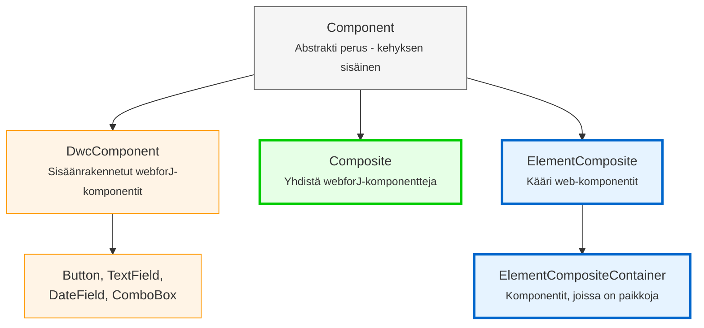

<JavadocLink type="foundation" location="com/webforj/component/Component" top='true'/> 

Ennen mukautettujen komponenttien rakentamista webforJ:ssä on tärkeää ymmärtää perustavanlaatuinen arkkitehtuuri, joka muovaa sitä, miten komponentit toimivat. Tämä artikkeli selittää komponenttihierarkian, komponentin identiteetin, elinkaarikonseptit ja miten huolenaiheyliopistot tarjoavat komponentin ominaisuuksia.

## Ymmärrä komponenttihierarkia {#understanding-the-component-hierarchy}

webforJ järjestää komponentit hierarkiaan, jossa on kaksi ryhmää: kehyksen sisäiset luokat, joita et koskaan saa laajentaa, ja luokat, jotka on erityisesti suunniteltu mukautettujen komponenttien rakentamiseen. Tämä osa selittää, miksi webforJ käyttää koostumusta perinnön sijaan ja mitä jokainen hierarkian taso tarjoaa.

### Miksi koostumus eikä laajennus? {#why-composition-instead-of-extension}

webforJ:ssä sisäänrakennetut komponentit, kuten [`Button`](../components/button) ja [`TextField`](../components/fields/textfield), ovat lopullisia luokkia—et voi laajentaa niitä:

```java
// Tämä ei toimi webforJ:ssä
public class MyButton extends Button {
    // Button on lopullinen - ei voi laajentaa 
}
```

webforJ käyttää **koostumusta perinnön ylle**. Sen sijaan, että laajentaisit olemassa olevia komponentteja, luot luokan, joka laajentaa `Composite`-luokkaa ja yhdistää komponentit sen sisälle. `Composite` toimii säiliönä, joka käärii yhden komponentin (kutsutaan sidotuksi komponentiksi) ja antaa sinun lisätä omia komponenttejasi ja käyttäytymistä siihen.

```java
public class SearchBar extends Composite<FlexLayout> {
    private final FlexLayout self = getBoundComponent();
    private TextField searchField;
    private Button searchButton;
    
    public SearchBar() {
        searchField = new TextField("Haku");
        searchButton = new Button("Siirry");
        
        self.setDirection(FlexDirection.ROW)
            .add(searchField, searchButton);
    }
}
```

### Miksi et voi laajentaa sisäänrakennettuja komponentteja {#why-you-cant-extend-built-in-components}

webforJ-komponentit on merkitty lopullisiksi, jotta säilytetään taustalla olevan asiakaspään web-komponentin eheys. webforJ-komponenttiluokkien laajentaminen myöntäisi hallinnan taustalla olevalle web-komponentille, mikä voisi johtaa tahattomiin seurauksiin ja rikkoa komponentin käyttäytymisen johdonmukaisuuden ja ennustettavuuden.

Yksityiskohtaisen selityksen saat [Lopullisista luokista ja laajennusrajoituksista](https://docs.webforj.com/docs/architecture/controls-components#final-classes-and-extension-restrictions) arkkitehtuuridokumentaatiossa.

### Komponenttihierarkia {#the-component-hierarchy}


```mermaid
graph TD
    A[Component<br/><small>Abstrakti perus - kehyksen sisäinen</small>]
    
    A --> B[DwcComponent<br/><small>Sisäänrakennetut webforJ-komponentit</small>]
    A --> C[Composite<br/><small>Yhdistä webforJ-komponentteja</small>]
    A --> D[ElementComposite<br/><small>Kääri web-komponentit</small>]
    
    B --> E[Button, TextField,<br/>DateField, ComboBox]
    
    D --> F[ElementCompositeContainer<br/><small>Komponentit, joissa on paikkoja</small>]
    
    style A fill:#f5f5f5,stroke:#666
    style B fill:#fff4e6,stroke:#ff9800
    style C fill:#e6ffe6,stroke:#00cc00
    style D fill:#e6f3ff,stroke:#0066cc
    style E fill:#fff4e6,stroke:#ff9800
    style F fill:#e6f3ff,stroke:#0066cc
    
    classDef userClass stroke-width:3px
    class C,D,F userClass
```

**Luokat kehittäjille (käytä näitä):**
- **Composite**
- **ElementComposite**
- **ElementCompositeContainer**

**Sisäiset kehyksen luokat (älä laajenna suoraan):**
- **Component**
- **DwcComponent**

:::warning[Älä laajenna `Component` tai `DwcComponent`]
Älä laajenna `Component` tai `DwcComponent` suoraan. Kaikki sisäänrakennetut komponentit ovat lopullisia. Käytä aina koostumusmalleja `Composite` tai `ElementComposite`.

Yrittäminen laajentaa `DwcComponent` heittää ajonaikaisen poikkeuksen.
:::

## Huolenaiheyliopistot {#concern-interfaces}

Huolenaiheyliopistot ovat Java-rajapintoja, jotka tarjoavat erityisiä toimintoja komponentillesi. Jokainen rajapinta lisää joukon liittyviä metodeja. Esimerkiksi `HasSize` lisää metodeja leveyden ja korkeuden hallintaan, kun taas `HasFocus` lisää metodeja fokustilan hallintaan.

Kun toteutat huolenaiheyliopiston komponentissasi, saat käyttöönsä nuo ominaisuudet ilman, että sinun tarvitsee kirjoittaa toteutuskoodia. Rajapinta tarjoaa oletustoteutuksia, jotka toimivat automaattisesti.

Huolenaiheyliopistojen toteuttaminen antaa mukautetuille komponenteillesi samat API:t kuin sisäänrakennetuilla webforJ-komponenteilla:

```java
// Toteuta HasSize saadaksesi leveyden/korkeuden metodit automaattisesti
public class SizedCard extends Composite<Div> implements HasSize<SizedCard> {
    private final Div self = getBoundComponent();
    
    public SizedCard() {
        self.setText("Kortin sisältö");
    }
    
    // Ei tarvitse toteuttaa näitä - saat ne ilmaiseksi:
    // setWidth(), setHeight(), setSize()
}

// Käytä sitä kuten mitä tahansa webforJ-komponenttia
SizedCard card = new SizedCard();
card.setWidth("300px")
    .setHeight("200px");
```

Koostumus välittää nämä kutsut automaattisesti taustalla olevalle `Div`:lle. Ei ylimääräistä koodia tarvitse.

**Yleisimmät huolenaiheyliopistot:**
- `HasSize` - `setWidth()`, `setHeight()`, `setSize()`
- `HasFocus` - `focus()`, `setFocusable()`, fokustapahtumat
- `HasClassName` - `addClassName()`, `removeClassName()`
- `HasStyle` - `setStyle()`, sisäinen CSS-hallinta
- `HasVisibility` - `setVisible()`, näyttää/piilottaa-toiminto
- `HasText` - `setText()`, tekstin sisällön hallinta
- `HasAttribute` - `setAttribute()`, HTML-attribuuttien hallinta

:::warning
Jos taustalla oleva komponentti ei tue rajapinnan ominaisuutta, saat ajonaikaisen poikkeuksen. Tarjoa oma toteutuksesi tällöin.
:::

Täydellisen luettelon saatavilla olevista huolenaiheyliopistoista löydät [webforJ JavaDocista](https://javadoc.io/doc/com.webforj/webforj-foundation/latest/com/webforj/concern/package-summary.html).

## Komponentin elinkaari-yhteenveto {#component-lifecycle-overview}

webforJ hallitsee komponentin elinkaarta automaattisesti. Kehys hoitaa komponentin luomisen, liittämisen ja tuhoamisen ilman, että manuaalista puuttumista tarvitaan.

**Elinkaaren koukut** ovat käytettävissä, kun tarvitset niitä:
- `onDidCreate()` - Kutsutaan, kun komponentti on liitetty DOM:iin
- `onDidDestroy()` - Kutsutaan, kun komponentti tuhotaan

Nämä koukut ovat **valinnaisia**. Käytä niitä, kun tarvitset:
- Vapauta resursseja (lopeta väliin, sulje yhteydet)
- Alusta komponentteja, jotka vaativat DOM-liittämistä
- Integroi asiakaspään JavaScriptin kanssa

Useimmissa yksinkertaisissa tapauksissa voit alustaa komponentteja suoraan konstruktoriin. Käytä elinkaarikoukkuja kuten `onDidCreate()`, kun työskentelyä on tarpeen viivästyttää.
