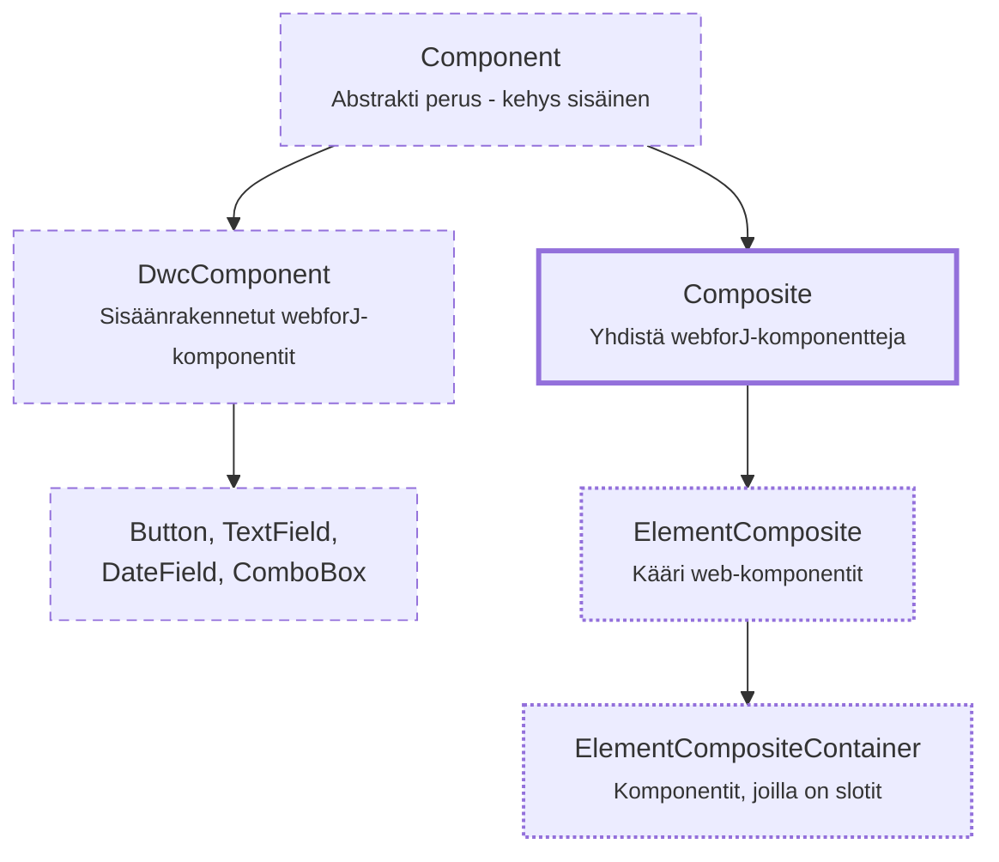

<JavadocLink type="foundation" location="com/webforj/component/Component" top='true'/>

Ennen kuin rakennat mukautettuja komponentteja webforJ:ssä, on tärkeää ymmärtää perustavanlaatuinen arkkitehtuuri, joka määrittää, miten komponentit toimivat. Tämä artikkeli selittää komponenttihierarkian, komponenttien identiteetin, elinkaarikäsitteet sekä miten concern-rajapinnat tarjoavat komponenttikykyjä.

## Ymmärtäminen komponenttihierarkiasta {#understanding-the-component-hierarchy}

webforJ järjestää komponentit hierarkiaan, jossa on kaksi ryhmää: kehys sisäiset luokat, joita et koskaan saa laajentaa, ja luokat, jotka on suunniteltu erityisesti mukautettujen komponenttien rakentamiseen. Tässä osassa selitetään, miksi webforJ käyttää komponenttien yhdistämistä perinnön sijasta ja mitä kukin hierarkian taso tarjoaa.

### Miksi yhdistäminen eikä laajentaminen? {#why-composition-instead-of-extension}

webforJ:ssä sisäänrakennetut komponentit, kuten [`Button`](../components/button) ja [`TextField`](../components/fields/textfield), ovat lopullisia luokkia — et voi laajentaa niitä:

```java
// Tämä ei toimi webforJ:ssä
public class MyButton extends Button {
  // Button on lopullinen - sitä ei voi laajentaa
}
```

webforJ käyttää **yhdistämistä perinnön sijasta**. Sen sijaan, että laajentaisit olemassa olevia komponentteja, luot luokan, joka laajentaa `Composite`-luokkaa ja yhdistää komponentteja sen sisälle. `Composite` toimii säiliönä, joka ympäröi yhtä komponenttia (kutsutaan sidotuksi komponentiksi) ja antaa sinun lisätä omia komponenttejasi ja toimintoja siihen.

```java
public class SearchBar extends Composite<FlexLayout> {
  private final FlexLayout self = getBoundComponent();
  private TextField searchField;
  private Button searchButton;

  public SearchBar() {
    searchField = new TextField("Haku");
    searchButton = new Button("Siirry");

    self.setDirection(FlexDirection.ROW)
      .add(searchField, searchButton);
  }
}
```

### Miksi et voi laajentaa sisäänrakennettuja komponentteja {#why-you-cant-extend-built-in-components}

webforJ-komponentit on merkitty lopullisiksi, jotta säilytettäisiin asiakaspuolen web-komponentin eheys. webforJ-komponenttiluokkien laajentaminen myöntäisi hallitsevasi asiakaspuolen web-komponenttia, mikä voisi johtaa odottamattomiin seurauksiin ja rikkoa komponentin toiminnan johdonmukaisuuden ja ennustettavuuden.

Yksityiskohtaisen selityksen voit nähdä kohdasta [Lopulliset luokat ja laajentamisrajoitukset](https://docs.webforj.com/docs/architecture/controls-components#final-classes-and-extension-restrictions) arkkitehtuuridokumentaatiossa.

### Komponenttihierarkia {#the-component-hierarchy}

<div style={{textAlign: 'center'}}>

```mermaid
graph TD
  A[Component<br/><small>Abstrakti perus - kehys sisäinen</small>]

  A --> B[DwcComponent<br/><small>Sisäänrakennetut webforJ-komponentit</small>]
  A --> C[Composite<br/><small>Yhdistä webforJ-komponentteja</small>]

  B --> E[Button, TextField,<br/>DateField, ComboBox]

  C --> D[ElementComposite<br/><small>Kääri web-komponentit</small>]
  D --> F[ElementCompositeContainer<br/><small>Komponentit, joilla on slotit</small>]

  classDef internal stroke-dasharray:6 4,stroke-width:1px
  classDef primary stroke-width:3px
  classDef secondary stroke-width:2px,stroke-dasharray:2 2
  class A,B,E internal
  class C primary
  class D,F secondary
```
</div>

Kehittäjille tarkoitetut luokat (käytä näitä):
- `Composite`
- `ElementComposite`
- `ElementCompositeContainer`

Sisäiset kehysluokat (älä laajenna suoraan):
- `Component`
- `DwcComponent`

:::warning[Älä koskaan laajenna `Component` tai `DwcComponent`]
Älä koskaan laajenna `Component` tai `DwcComponent` suoraan. Kaikki sisäänrakennetut komponentit ovat lopullisia. Käytä aina yhdistämismalleja `Composite`- tai `ElementComposite`-luokkien kanssa.

Yrittäminen laajentaa `DwcComponent` heittää aikarajoituspoikkeuksen.
:::

## Concern-rajapinnat {#concern-interfaces}

Concern-rajapinnat ovat Java-rajapintoja, jotka tarjoavat erityisiä kykyjä komponentillesi. Jokainen rajapinta lisää joukon yhdisteisiä metodeja. Esimerkiksi `HasSize` lisää metodeja leveyden ja korkeuden hallintaan, kun taas `HasFocus` lisää metodeja fokustilan hallintaan.

Kun toteutat concern-rajapinnan komponentissasi, saat pääsyn näihin kykyihin kirjoittamatta mitään toteutuskoodia. Rajapinta tarjoaa oletustoteutuksia, jotka toimivat automaattisesti.

Concern-rajapintojen toteuttaminen antaa mukautetuille komponenteillesi samat API:t kuin sisäänrakennetuilla webforJ-komponenteilla:

```java
// Toteuta HasSize saadaksesi leveys/korkeus metodit automaattisesti
public class SizedCard extends Composite<Div> implements HasSize<SizedCard> {
  private final Div self = getBoundComponent();

  public SizedCard() {
    self.setText("Kortin sisältö");
  }

  // Ei tarvitse toteuttaa näitä - saat ne ilmaiseksi:
  // setWidth(), setHeight(), setSize()
}

// Käytä sitä kuten mitä tahansa webforJ-komponenttia
SizedCard card = new SizedCard();
card.setWidth("300px")
  .setHeight("200px");
```

Composite eteenpäin siirtää nämä kutsut sisäiselle `Div`:lle. Ei ylimääräistä koodia tarvitaan.

### Ulkonäkö {#concern-interfaces-appearance}

Nämä rajapinnat hallitsevat komponentin visuaalista esitystä, mukaan lukien sen mitat, näkyvyys, tyylit ja teemat.

| Rajapinta | Kuvaus |
|---|---|
| `HasSize` | Hallitsee leveyttä ja korkeutta, mukaan lukien minimi- ja maksimi-rajoitukset. Laajentaa `HasWidth`, `HasHeight` ja niiden min/max -versiot. |
| `HasVisibility` | Näyttää tai piilottaa komponentin poistamatta sitä asettelusta. |
| `HasClassName` | Hallitsee CSS-luokkien nimiä komponentin juurielementissä. |
| `HasStyle` | Soveltaa ja poistaa inline CSS-tyylejä. |
| `HasHorizontalAlignment` | Hallitsee, miten sisältö on kohdistettu vaakasuunnassa komponentin sisällä. |
| `HasExpanse` | Asettaa komponentin koon variantin käyttäen standardi expanse-tunnuksia (`XSMALL` - `XLARGE`). |
| `HasTheme` | Soveltaa teema varianttia, kuten `DEFAULT`, `PRIMARY` tai `DANGER`. |
| `HasPrefixAndSuffix` | Lisää komponentteja prefix- tai suffix-slotille komponentin sisällä. |

### Sisältö {#concern-interfaces-content}

Nämä rajapinnat hallitsevat, mitä komponentti näyttää, mukaan lukien teksti, HTML, tunnisteet, vihjeet ja muut kuvailevat sisällöt.

| Rajapinta | Kuvaus |
|---|---|
| `HasText` | Asettaa ja hakee komponentin pelkän tekstin sisällön. |
| `HasHtml` | Asettaa ja hakee komponentin sisäisen HTML:n. |
| `HasLabel` | Lisää kuvailevan tunnisteen, joka liittyy komponenttiin ja jota käytetään saavutettavuudessa. |
| `HasHelperText` | Näyttää toissijaisen vihjetekstin komponentin alla. |
| `HasPlaceholder` | Asettaa paikkamerkkitekstin, joka näkyy, kun komponentilla ei ole arvoa. |
| `HasTooltip` | Liittää työkaluvihjeen, joka näkyy hiiren ollessa kohdistettuna. |

### Tila {#concern-interfaces-state}

Nämä rajapinnat hallitsevat komponentin interaktiivista tilaa, mukaan lukien onko se käytettävissä, muokattavissa, pakollinen tai onko se kohdistettuna ladattaessa.

| Rajapinta | Kuvaus |
|---|---|
| `HasEnablement` | Aktivoi tai deaktivoi komponentin. |
| `HasReadOnly` | Asettaa komponentin vain luku -tilaan, jossa arvo näkyy mutta sitä ei voi muuttaa. |
| `HasRequired` | Merkitsee komponentin pakolliseksi, tyypillisesti lomakevalidointia varten. |
| `HasAutoFocus` | Siirtää fokuksen komponenttiin automaattisesti, kun sivu latautuu. |

### Fokus {#concern-interfaces-focus}

Nämä rajapinnat hallitsevat, miten komponentti saa ja reagoi näppäimistön fokukseen.

| Rajapinta | Kuvaus |
|---|---|
| `HasFocus` | Hallitsee fokustilaa ja sitä, voiko komponentti saada fokusta. |
| `HasFocusStatus` | Tarkistaa, onko komponentti tällä hetkellä fokusoidussa tilassa. Vaatii kierroksen asiakkaalle. |
| `HasHighlightOnFocus` | Hallitsee, onko komponentin sisältö korostettu, kun se saa fokuksen, ja miten (`KEY`, `MOUSE`, `KEY_MOUSE`, `ALL` jne.). |

### Syöttörajoitukset {#concern-interfaces-input-constraints}

Nämä rajapinnat määrittävät, mitä arvoja komponentti hyväksyy, mukaan lukien nykyinen arvo, sallitut arvot, pituusrajoitukset, muotoilu maskit ja paikallisista käytännöistä riippuvainen käyttäytyminen.

| Rajapinta | Kuvaus |
|---|---|
| `HasValue` | Hakee ja asettaa komponentin nykyisen arvon. |
| `HasMin` | Asettaa sallitun minimiarvon. |
| `HasMax` | Asettaa sallitun maksimiarvon. |
| `HasStep` | Asettaa askelkorotuksen numeerisille tai alueelle. |
| `HasPattern` | Soveltaa säännöllistä lauseketta rajoittaakseen hyväksyttyä syötettä. |
| `HasMinLength` | Asettaa komponentin arvon vaaditun minimimerkkimäärän. |
| `HasMaxLength` | Asettaa komponentin arvon enimmäismäärän. |
| `HasMask` | Soveltaa muotoilumaskeja syötteelle. Käytetään naamioitujen kenttäkomponenttien. |
| `HasTypingMode` | Hallitsee, lisätäänkö kirjoitetut merkit tai ylikirjoitetaanko olemassa olevat merkit (`INSERT` tai `OVERWRITE`). Käytetään naamioiduissa kentissä ja `TextArea`:ssa. |
| `HasRestoreValue` | Määrittää arvon, johon komponentti palautuu, kun käyttäjä painaa Escape-näppäintä tai kutsuu `restoreValue()`. Käytetään naamioiduissa kentissä. |
| `HasLocale` | Tallentaa komponentin mukaan paikallisen koodin paikallisesta riippuvaisesta muotoilusta. Käytetään naamioiduissa päivämäärä- ja aikakentissä. |
| `HasPredictedText` | Asettaa ennakoidun tai automaattisen tekstin arvon. Käytetään `TextArea`:ssa inline-ehdotusten tukemiseen. |

### Validointi {#concern-interfaces-validation}

Nämä rajapinnat lisäävät asiakaspuolen validointikäyttäytymisen, mukaan lukien komponentin merkitseminen virheelliseksi, virheilmoitusten näyttäminen ja sen hallinta, milloin validointi suoritetaan.

| Rajapinta | Kuvaus |
|---|---|
| `HasClientValidation` | Merkitsee komponentin virheelliseksi, asettaa virheilmoituksen ja liittää asiakaspuolen validoijan. |
| `HasClientAutoValidation` | Hallitsee, suorittaako komponentti automaattisesti validoinnin käyttäjän kirjoittaessa. |
| `HasClientAutoValidationOnLoad` | Hallitsee, suorittaako komponentti validoinnin, kun se latautuu ensimmäisen kerran. |
| `HasClientValidationStyle` | Hallitsee, miten validointiviestit näytetään: `INLINE` (komponentin alapuolella) tai `POPOVER`. |

### DOM-pääsy {#concern-interfaces-dom-access}

Nämä rajapinnat tarjoavat matalan tason pääsyn komponentin taustalla olevaan HTML-elementtiin ja asiakaspuolen ominaisuuksiin.

| Rajapinta | Kuvaus |
|---|---|
| `HasAttribute` | Lukee ja kirjoittaa satunnaisia HTML-attributeja komponentin elementissä. |
| `HasProperty` | Lukee ja kirjoittaa DWC-komponentin ominaisuuksia suoraan asiakaspuolen elementissä. |

### i18n {#concern-interfaces-i18n}

Tämä rajapinta tarjoaa käännöstuen komponenteille, jotka tarvitsevat näyttää lokalisoitua tekstiä.

| Rajapinta | Kuvaus |
|---|---|
| `HasTranslation` | Tarjoaa `t()` apuohjelman käännösavainten ratkaisemiseksi lokalisoitujen merkkijonojen avulla sovelluksen nykyisellä paikallisella asetuksella. |

:::warning
Jos taustalla oleva komponentti ei tue rajapinnan kykyä, saat aikarajoituspoikkeuksen. Tarjoa oma toteutuksesi tuolloin.
:::

Saat täydellisen luettelon saatavilla olevista concern-rajapinnoista [webforJ JavaDoc](https://javadoc.io/doc/com.webforj/webforj-foundation/latest/com/webforj/concern/package-summary.html).

## Komponentti-identifikaattorit {#component-identifiers}

webforJ-komponenteilla on kolme erilaista identifikaattoria, jotka palvelevat eri tarkoituksia:

- **Palvelinpuolen komponentin ID** (`getComponentId()`) - Kehys myöntää automaattisesti sisäistä komponentin seurantaa varten. Käytä tätä, kun sinun täytyy kysyä erityisiä komponentteja tai toteuttaa mukautettuja komponenttirekistereitä.
- **Asiakaspuolen komponentin ID** (`getClientComponentId()`) - Tarjoaa pääsyn taustalla olevaan web-komponenttiin JavaScriptistä. Käytä tätä, kun sinun on kutsuttava alkuperäisiä web-komponentin metodeja tai integroida asiakaspuolen kirjastoja.
- **HTML `id`-attribuutti** (`setAttribute("id", "...")`) - Standardi DOM-identifikaattori. Käytä tätä CSS- kohdistamisessa, testiautomaation valitsijoissa ja lomakekenttien tunnisteiden linkittämisessä syötteisiin.

Näiden erojen ymmärtäminen auttaa sinua valitsemaan oikean identifikaattorin käyttötilanteeseesi.

### Palvelinpuolen komponentin ID {#server-side-component-id}

Jokaiselle komponentille myönnetään automaattisesti palvelinpuolen identifikaattori, kun se luodaan. Tätä identifikaattoria käytetään sisäisesti kehyksessä komponenttien jäljittämiseen. Hae se `getComponentId()`-metodilla:

```java
Button button = new Button("Napsauta minua");
String serverId = button.getComponentId();
```

Palvelinpuolen ID on hyödyllinen, kun sinun täytyy kysyä erityisiä komponentteja säiliössä tai toteuttaa mukautettua komponenttien seurantaloogikkaa.

### Asiakaspuolen komponentin ID {#client-side-component-id}

Asiakaspuolen komponentin ID tarjoaa pääsyn taustalla olevaan web-komponenttiin JavaScriptistä. Tämä mahdollistaa suoran vuorovaikutuksen asiakaspuolen komponentin kanssa tarvittaessa:

```java
Button btn = new Button("Napsauta minua");
btn.onClick(e -> {
  OptionDialog.showMessageDialog("Painiketta napsautettiin", "Tapahtuma tapahtui");
});

btn.whenAttached().thenAccept(e -> {
  Page.getCurrent().executeJs("objects.get('" + btn.getClientComponentId() + "').click()");
});
```

Käytä `getClientComponentId()`-metodia yhdessä `objects.get()`-metodin kanssa JavaScriptissä päästäksesi web-komponentin instanssiin.

:::important
Asiakaspuolen komponentin ID ei ole DOM-elementin HTML `id` -attribuutti. Testauksen tai CSS-kohdistuksen HTML-ID:den asettamiseksi, katso [Komponenttien käyttäminen](using-components).
:::

## Komponentin elinkaaren yleiskatsaus {#component-lifecycle-overview}

webforJ hallitsee komponentin elinkaarta automaattisesti. Kehys käsittelee komponentin luomisen, liittämisen ja tuhoamisen ilman manuaalista väliintuloa.

**Elinkaaren koukut** ovat saatavilla, kun niitä tarvitset:
- `onDidCreate(T container)` - Kutsutaan, kun komponentti on liitetty DOM:iin
- `onDidDestroy()` - Kutsutaan, kun komponentti tuhotaan

Nämä koukut ovat **valinnaisia**. Käytä niitä, kun sinun täytyy:
- Siivota resursseja (lopettaa väliintervallit, sulkea yhteydet)
- Alustaa komponentteja, jotka vaativat DOM:iin liittämistä
- Integrointi asiakaspuolen JavaScriptin kanssa

Useimmissa yksinkertaisissa tapauksissa voit alustaa komponentit suoraan konstruktorissa. Käytä elinkaaren koukkuja, kuten `onDidCreate()`, siirtääksesi työtä, kun se on tarpeen.
