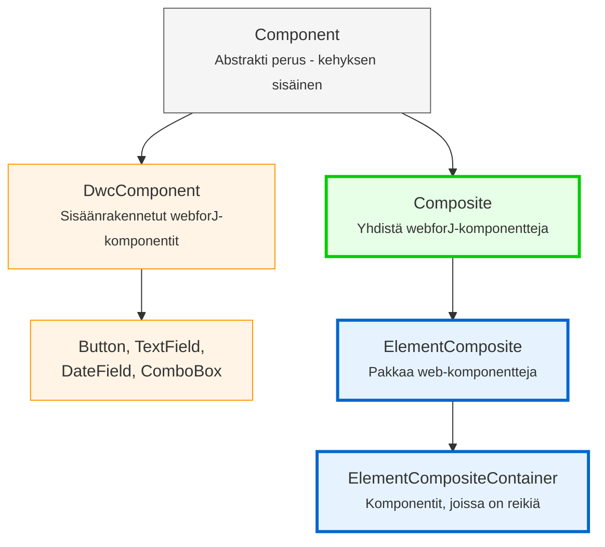

<JavadocLink type="foundation" location="com/webforj/component/Component" top='true'/> 

Ennen kuin rakennat mukautettuja komponentteja webforJ:ssä, on tärkeää ymmärtää perustavanlaatuinen arkkitehtuuri, joka muokkaa komponenttien toimintaa. Tämä artikkeli selittää komponenttihierarkian, komponenttien identiteetin, elinkaarikonseptit ja kuinka huolenaiherajapinnat tarjoavat komponenttien ominaisuuksia.

## Ymmärrä komponenttihierarkia {#understanding-the-component-hierarchy}

webforJ järjestää komponentit hierarkiaan, jossa on kaksi ryhmää: kehyksen sisäiset luokat, joita et koskaan saa laajentaa, ja luokat, jotka on suunniteltu erityisesti mukautettujen komponenttien rakentamiseen. Tämä osio selittää, miksi webforJ käyttää koostumusta perinnön sijaan ja mitä kukin hierarkian taso tarjoaa.

### Miksi koostumus perinnön sijasta? {#why-composition-instead-of-extension}

webforJ:ssä sisäänrakennetut komponentit, kuten [`Button`](../components/button) ja [`TextField`](../components/fields/textfield), ovat lopullisia luokkia—et voi laajentaa niitä:

```java
// Tämä ei toimi webforJ:ssä
public class MyButton extends Button {
  // Button on lopullinen - sitä ei voida laajentaa 
}
```

webforJ käyttää **koostumusta perinnön sijasta**. Sen sijaan, että laajentaisit olemassa olevia komponentteja, luot luokan, joka laajentaa `Composite`-luokkaa ja yhdistää komponentteja sen sisään. `Composite` toimii säiliönä, joka pakkaa yhden komponentin (kutsutaan sidotuksi komponentiksi) ja antaa sinun lisätä omia komponenttejasi ja käyttäytymistä siihen.

```java
public class SearchBar extends Composite<FlexLayout> {
  private final FlexLayout self = getBoundComponent();
  private TextField searchField;
  private Button searchButton;
  
  public SearchBar() {
    searchField = new TextField("Haku");
    searchButton = new Button("Mene");
    
    self.setDirection(FlexDirection.ROW)
      .add(searchField, searchButton);
  }
}
```

### Miksi et voi laajentaa sisäänrakennettuja komponentteja {#why-you-cant-extend-built-in-components}

webforJ-komponentit on merkitty lopullisiksi ylläpitämään perustavanlaatuisen asiakaspuolen web-komponentin eheyttä. webforJ-komponenttiluokkien laajentaminen antaisi hallinnan perustavanlaatuiselle web-komponentille, mikä saattaisi johtaa odottamattomiin seurauksiin ja rikkoa komponentin käyttäytymisen johdonmukaisuuden ja ennustettavuuden.

Yksityiskohtaisen selityksen saa lukemalla [Lopulliset luokat ja laajennusrajoitukset](https://docs.webforj.com/docs/architecture/controls-components#final-classes-and-extension-restrictions) arkkitehtuurin dokumentaatiossa.

### Komponenttihierarkia {#the-component-hierarchy}

<div style={{textAlign: 'center'}}>

```mermaid
graph TD
  A[Component<br/><small>Abstrakti perus - kehyksen sisäinen</small>]
  
  A --> B[DwcComponent<br/><small>Sisäänrakennetut webforJ-komponentit</small>]
  A --> C[Composite<br/><small>Yhdistä webforJ-komponentteja</small>]
  
  B --> E[Button, TextField,<br/>DateField, ComboBox]
  
  C --> D[ElementComposite<br/><small>Pakkaa web-komponentteja</small>]
  D --> F[ElementCompositeContainer<br/><small>Komponentit, joissa on reikiä</small>]
  
  style A fill:#f5f5f5,stroke:#666
  style B fill:#fff4e6,stroke:#ff9800
  style C fill:#e6ffe6,stroke:#00cc00
  style D fill:#e6f3ff,stroke:#0066cc
  style E fill:#fff4e6,stroke:#ff9800
  style F fill:#e6f3ff,stroke:#0066cc
  
  classDef userClass stroke-width:3px
  class C,D,F userClass
```
</div>

Luokat kehittäjille (käytä näitä):
- `Composite`
- `ElementComposite`
- `ElementCompositeContainer`

Sisäiset kehysluokat (älä laajenna suoraan):
- `Component`
- `DwcComponent`

:::warning[Älä koskaan laajenna `Component` tai `DwcComponent`]  
Älä koskaan laajenna `Component` tai `DwcComponent` suoraan. Kaikki sisäänrakennetut komponentit ovat lopullisia. Käytä aina koostumusmalleja `Composite` tai `ElementComposite`.

Yritys laajentaa `DwcComponent` heittää ajonaikaisen poikkeuksen.
:::

## Huolenaiherajapinnat {#concern-interfaces}

Huolenaiherajapinnat ovat Java-rajapintoja, jotka tarjoavat erityisiä ominaisuuksia komponentillesi. Jokainen rajapinta lisää joukon siihen liittyviä metodeja. Esimerkiksi `HasSize` lisää metodeja leveyden ja korkeuden hallintaan, kun taas `HasFocus` lisää metodeja fokus-tilan hallintaan.

Kun toteutat huolenaiherajapinnan komponentillesi, saat pääsyn näihin ominaisuuksiin ilman, että sinun tarvitsee kirjoittaa mitään toteutuskoodeja. Rajapinta tarjoaa oletustoteutuksia, jotka toimivat automaattisesti.

Huolenaiherajapintojen toteuttaminen antaa mukautetuille komponenteillesi samat rajapinnat kuin sisäänrakennetuille webforJ-komponenteille:

```java
// Toteuta HasSize saadaksesi leveys/korkeus-metodit automaattisesti
public class SizedCard extends Composite<Div> implements HasSize<SizedCard> {
  private final Div self = getBoundComponent();
  
  public SizedCard() {
    self.setText("Kortin sisältö");
  }
  
  // Ei tarvitse toteuttaa näitä - saat ne ilmaiseksi:
  // setWidth(), setHeight(), setSize()
}

// Käytä sitä kuin mitä tahansa webforJ-komponenttia
SizedCard card = new SizedCard();
card.setWidth("300px")
  .setHeight("200px");
```

Koostumus välittää automaattisesti nämä kutsut taustalla olevalle `Div`-komponentille. Ei ylimääräistä koodia tarvita.

**Yleisiä huolenaiherajapintoja:**
- `HasSize` - `setWidth()`, `setHeight()`, `setSize()`
- `HasFocus` - `focus()`, `setFocusable()`, fokus-tapahtumat
- `HasClassName` - `addClassName()`, `removeClassName()`
- `HasStyle` - `setStyle()`, inline CSS -hallinta
- `HasVisibility` - `setVisible()`, näyttää/piilottaa -ominaisuus
- `HasText` - `setText()`, tekstisisällön hallinta
- `HasAttribute` - `setAttribute()`, HTML-attribuuttien hallinta

:::warning  
Jos taustalla oleva komponentti ei tue rajapinnan ominaisuutta, saat ajonaikaisen poikkeuksen. Tarjoa silloin oma toteutuksesi.
:::

Saat täydellisen luettelon käytettävistä huolenaiherajapinnoista [webforJ Javadocista](https://javadoc.io/doc/com.webforj/webforj-foundation/latest/com/webforj/concern/package-summary.html).

## Komponentin elinkaari yleiskatsaus {#component-lifecycle-overview}

webforJ hallitsee komponentin elinkaarta automaattisesti. Kehys käsittelee komponentin luomisen, liittämisen ja tuhoamisen ilman, että manuaalista väliintuloa tarvitaan.

**Elinkaarikoukut** ovat käytettävissä tarvittaessa:
- `onDidCreate()` - Kutsutaan sen jälkeen, kun komponentti on liitetty DOM:iin
- `onDidDestroy()` - Kutsutaan, kun komponentti tuhotaan

Nämä koukut ovat **valinnaisia**. Käytä niitä tarvittaessa:
- Siivoa resursseja (lopeta väliin, sulje yhteydet)
- Alusta komponentit, jotka vaativat DOM:in liittämistä
- Integroi asiakaspuolen JavaScriptin kanssa

Useimmissa yksinkertaisissa tapauksissa voit alustaa komponentit suoraan konstruktorissa. Käytä elinkaarikoukkuja, kuten `onDidCreate()`, siirtääksesi työtä tarvittaessa.
