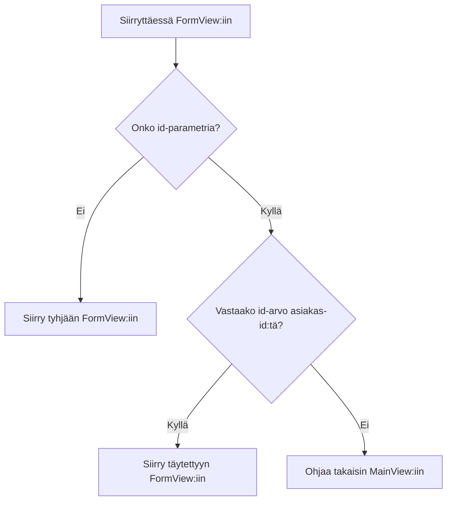

Sovellus, jota käytetään [Reitityksessä ja yhdistelmät](/docs/introduction/tutorial/routing-and-composites), voi lisätä vain uusia asiakkaita tietokantaan. Käyttämällä seuraavia käsitteitä annat käyttäjille mahdollisuuden myös muokata olemassa olevien asiakkaiden tietoja: 

- Reittikuviot
- Parametrien siirtäminen URL-osoitteen kautta
- Elinkaaripartioijat

Tämän vaiheen suorittaminen luo version [4-observers-and-route-parameters](https://github.com/webforj/webforj-tutorial/tree/main/4-observers-and-route-parameters).

## Sovelluksen suorittaminen {#running-the-app}

Kun kehität sovellustasi, voit käyttää [4-observers-and-route-parameters](https://github.com/webforj/webforj-tutorial/tree/main/4-observers-and-route-parameters) vertailukohtana. Näet sovelluksen toiminnassa:

1. Siirry huipputason hakemistoon, joka sisältää `pom.xml` -tiedoston, tämä on `4-observers-and-route-parameters`, jos seuraat GitHubin versiota.

2. Suorita seuraava Maven-komento ajaaksesi Spring Boot -sovelluksen paikallisesti:
    ```bash
    mvn
    ```

Sovelluksen suorittaminen avaa automaattisesti uuden selaimen osoitteessa `http://localhost:8080`.

## Asiakkaan `id` käyttö {#using-the-customers-id}

Jotta voit käyttää `FormView`-komponenttia olemassa olevien asiakkaiden muokkaamiseen, sinun on kerrottava, mitä asiakasta muokataan. Voit tehdä tämän tarjoamalla alkuperäisen parametrin `FormView`-komponentille, joka edustaa asiakkaan ID:tä. Osiossa [Työskentely datan kanssa](/docs/introduction/tutorial/working-with-data) loit `Customer`-entiteetin, joka osoittaa numeerisen `Long`-arvon ainutlaatuiseksi `id`:ksi asiakkaille, kun ne lisätään tietokantaan.

```java
 @Id
 @GeneratedValue(strategy = GenerationType.IDENTITY)
  private Long id;
```

Tässä vaiheessa teet muutoksia `FormView`-komponenttiin, jotta se käyttää `id`:tä alkuperäisenä parametrina ennen kuin mitään ladataan. Sitten saat `FormView`-komponentin arvioimaan `id`:n määrittääkseen, onko lomake uuden asiakkaan lisäämistä varten vai olemassa olevan päivittämistä varten. Lopuksi muokkaat `MainView`-komponenttia niin, että se lähettää `id`-arvon siirryttäessä `FormView`-komponenttiin.

## Reittikuvion lisääminen `FormView`-komponenttiin {#adding-a-route-pattern}

Edellisessä vaiheessa asettamalla reitti `FormView`-komponentissa `@Route(customer)` yhdistää luokan paikallisesti osoitteeseen `http://localhost:8080/customer`. Reittikuvion lisääminen antaa sinun lisätä `id`:n alkuperäiseen parametriin `FormView`-komponentille.

[Reittikuvio](/docs/routing/route-patterns) mahdollistaa parametrin lisäämisen URL-osoitteeseen, tekee siitä valinnaisen ja asettaa rajoituksia kelvollisille kuvioille. Käyttämällä `@Route`-annotaatiota, tässä on, mikä tekee `id`:stä valinnaisen reittiparametrin `FormView`-komponentille:

- **`/:id`** antaa reitille nimettyä parametria `id`, joten siirtyminen osoitteeseen `http://localhost:8080/customer/6` lataa `FormView`-komponentin `id`-parametrilla `6`.

- **`?`** tekee `id`-parametrista valinnaisen. Oletuksena parametrit ovat pakollisia, mutta tekemällä `id`:n valinnaiseksi voit käyttää `FormView`-komponenttia uusien asiakkaiden lisäämistä varten, joilla ei vielä ole `id`:tä.

- **`<[0-9]+>`** rajoittaa `id`:n positiiviseksi numeroksi. Kulmasulkujen `<>` sisällä voit lisätä rajoituksen säännöllisenä lausekkeena parametrille. Jos `id` ei vastaa rajoitusta, esim. `http://localhost:8080/customer/john-smith`, käyttäjä ohjataan 404-sivulle.

Lisätäksesi valinnaisen reittiparametrin `FormView`-komponenttiin, muuta `@Route`-annotaatio seuraavaksi:

```java
@Route("customer/:id?<[0-9]+>")
```

## Reititys `FormView`-komponenttiin {#routing-to-formview}

`FormView` hyväksyy nyt valinnaisen `id`-parametrin ja lataa vain, jos `id` on kokonais positiivinen numero.

Kuitenkin `FormView` voi silti ladata, kun käyttäjä syöttää manuaalisesti URL-osoitteen ei- olemassa olevalle asiakkaalle, kuten `http://localhost:8080/customer/5000`. Lisäämällä elinkaaripartioijan ennen kuin siirrytään `FormView`-komponenttiin, sovelluksesi voi määrittää, miten käsitellä saapuvaa `id`-arvoa.

### Ehtoinen reititys {#conditional-routing}

Elinkaaripartioijat mahdollistavat komponenttien reagoimislee elinkaaritapahtumiin erityisissä vaiheissa. [Elinkaaripartioijat](/docs/routing/navigation-lifecycle/observers) -artikkeli luettelee käytettävissä olevat partioijat, mutta tämä vaihe käyttää vain `WillEnterObserver`-partioijaa.

`WillEnterObserver`-ajanhetki tapahtuu ennen kuin komponentin reititys on valmis. Käyttämällä tätä partioijaa voit arvioida saapuvaa `id`:tä. Jos `id` ei vastaa olemassa olevaa asiakasta, voit ohjata käyttäjän takaisin `MainView`-komponenttiin löytääkseen kelvollisen asiakkaan muokattavaksi.

Ennen kuin käsittelet `WillEnterObserver`-koodia, seuraava kaavio esittelee mahdolliset lopputulokset siirryttäessä `FormView`-komponenttiin:



### `WillEnterObserver`:n käyttö {#using-the-willenterobserver}

Käyttämällä elinkaaripartioijaa, joka laukaisee ennen kuin komponentti latautuu täysin, `WillEnterObserver`, voit lisätä ehtoja määrittääksesi, pitäisikö sovelluksen jatkaa siirtoa `FormView`:iin, vai ohjataanko käyttäjä `MainView`:iin.

Jokainen elinkaaripartioija on rajapinta, joten toteuta `WillEnterObserver` osana `FormView`:n määrittelyä:

```java
public class FormView extends Composite<Div> implements WillEnterObserver {
```

`WillEnterObserver`-partioijalla on `onWillEnter()`-metodi, jota webforJ kutsuu ennen reittiytymistä komponenttiin. Tämä metodilla on kaksi parametria: `WillEnterEvent` ja `ParametersBag`.

`WillEnterEvent` määrää, jatkuuko reititys komponenttiin `accept()`-metodilla vai estetäänkö reititys `reject()`-metodilla. Hyväksynnän jälkeen on tarpeen ohjata käyttäjä toiseen paikkaan.

`ParametersBag` sisältää reitittimen parametrit URL-osoitteesta. Käytät `ParametersBag`:ta seuraavassa osiossa luodaksesi ehtologikan `onWillEnter()`-metodissa käyttäen `id`-parameteria.

Seuraava `onWillEnter()` on esimerkki, jossa on vain kaksi lopputulosta:

```java
@Override
public void onWillEnter(WillEnterEvent event, ParametersBag parameters) {

  //Lisää ehtologika
  if (<condition>) {

    //Salli reititys FormView:iin
    event.accept();

  } else {

    //Estä reititys FormView:iin
    event.reject();

    //Ohjaa käyttäjä MainView:iin
    navigateToMain();
  }
}
```

### `ParametersBag`:n käyttö {#using-the-parametersbag}

Kuten edellisessä osiossa mainittiin lyhyesti, `ParametersBag` sisältää reitittimen parametrit URL-osoitteesta. Jokaisella elinkaaripartioijalla on pääsy tähän objektiin, ja sen käyttö sovelluksessasi antaa sinun saada `id`-arvon.

`ParametersBag`-objekti tarjoaa useita kyselymenetelmiä parametrin noutamiseen tietyn objektityypin mukaan. Esimerkiksi `getInt()` voi antaa sinulle parametrin `Integer`-tyyppisenä.

Koska jotkut parametrit ovat valinnaisia, niin se, mitä `getInt()` todella palauttaa, on `Optional<Integer>`. Käyttämällä `ifPresentOrElse()`-metodia `Optional<Integer>`:ssä voit asettaa muuttujan käyttäen `Integer`-arvoa.

Kun `id`-arvoa ei ole olemassa, käyttäjä voi jatkaa siirtymistä `FormView`:iin lisätäkseen uuden asiakkaan.

```java
@Override
public void onWillEnter(WillEnterEvent event, ParametersBag parameters) {

  //Määritä, mikä parametri noudetaan, ja tarkista, onko se olemassa
  parameters.getInt("id").ifPresentOrElse(id -> {

    //Käytä id:tä muuttujana
    customerId = Long.valueOf(id);

  //Kun id:tä ei ole, jatka FormView:iin uudelle asiakkaalle
  }, () -> event.accept());
        
}
```

### Onko `id` kelvollinen? {#is-the-id-valid}

Tällä hetkellä `WillEnterObserver` viimeisestä osiosta hyväksyy reitityksen vain, kun `id`:tä ei ole olemassa. Partioijan on suoritettava vielä yksi tarkistus, ennen kuin se voi jatkaa siirtymistä `FormView`:iin: tarkistaa, vastaako `id` olemassa olevaa asiakasta.

Nyt `FormView` voi käyttää `CustomerService`:ia varmistaakseen asiakkaan olemassaolon käyttämällä `doesCustomerExist()`-metodia. Jos vastaavuutta ei löydy, sovellus voi kumota nykyisen reitityksen ja ohjata käyttäjän `MainView`:iin käyttäen `navigateToMain()`-metodia.

Kun on voimassa oleva `id`, sovellus voi käyttää `accept()`-metodia jatkaakseen reititystä `FormView`:iin. Luo `fillForm()`-metodi, joka asignoi `customer`-muuttujan asiakkaalle, jolla on vastaava `id` tietokannassa ja asettaa kenttien arvot:

```java
public void fillForm(Long customerId) {
  customer = customerService.getCustomerByKey(customerId);
  firstName.setValue(customer.getFirstName());
  lastName.setValue(customer.getLastName());
  company.setValue(customer.getCompany());
  country.selectKey(customer.getCountry());
}
```

Kuten uuden asiakkaan lisäämisessä, työskentelykopion käyttö mahdollistaa käyttäjien muokata asiakastietoja käyttöliittymässä ilman, että he muokkaavat suoraan tietovarastoa.

### Valmis `onWillEnter()` {#completed-onwillenter}

Kahdessa viimeisessä osiossa käsiteltiin yksityiskohtaisesti, miten käsitellään jokainen lopputulos reitittäessä `FormView`:iin käyttämällä `ParametersBag`:ia ja `CustomerService`:ia.

Seuraava on valmis `onWillEnter()` `FormView`:lle, joka käyttää `ParametersBag`:ia joko kumotakseen tai hyväksyäkseen saapuvan reitin ja kutsuu muita metodeja joko lomakkeen täyttämiseksi tai käyttäjän lähettämiseksi `MainView`:iin:

```java
@Override
public void onWillEnter(WillEnterEvent event, ParametersBag parameters) {

  //Määritä, mikä parametri noudetaan, ja tarkista, onko se olemassa
  parameters.getInt("id").ifPresentOrElse(id -> {
    customerId = Long.valueOf(id);
    //Tarkista, onko asiakasta tällä id:llä
    if (customerService.doesCustomerExist(customerId)) {
      //Tämä asiakas on olemassa, joten jatka FormView:iin, ja alustaa kentät käyttäen id:tä
      event.accept();
      fillForm(customerId);
    } else {
      //Tätä asiakasta ei ole, joten ohjaa MainView:iin
      event.reject();
      navigateToMain();
    }
  //Ei id:tä ollut, joten jatka FormView:iin uudelle asiakkaalle
  }, () -> event.accept());
        
}
```

## Asiakkaan lisääminen tai muokkaaminen {#adding-or-editing-a-customer}

Sovelluksen aikaisemmassa versiossa lisättiin vain uusia asiakkaita, kun käyttäjä lähetti lomakkeen. Nyt kun käyttäjät voivat muokata olemassa olevia asiakkaita, `submitCustomer()`-metodin on tarkistettava, onko asiakas jo olemassa ennen tietokannan päivittämistä.

Aluksi ei ollut tarpeen määrittää asiakasta `id`-muuttujaa `FormView`:ssa, sillä uusille asiakkaille annetaan ainutlaatuinen `id`, kun ne lähetetään tietokantaan. Kuitenkin, jos määrität `customerId`-muuttujan alkuperäiseksi muuttujaksi `FormView`:ssa jollakin käyttämättömällä `id`-arvolla, se pysyy koskemattomana uusille asiakkaille ja kirjoitetaan uudelleen `onWillEnter()`-metodissa olemassa oleville asiakkaille.

Tämä mahdollistaa `doesCustomerExist()`-metodin käyttämisen vahvistaaksesi, lisätäänkö uusi asiakas vai päivitetäänkö olemassa olevan asiakas. 

```java
private Long customerId = 0L;

//...

private void submitCustomer() {
  if (customerService.doesCustomerExist(customerId)) {
    customerService.updateCustomer(customer);
  } else {
    customerService.createCustomer(customer);
  }
  navigateToMain();
}
```

## Valmis `FormView` {#completed-formview}

Näin `FormView`-komponentin tulisi nyt näyttää, kun se voi käsitellä olemassa olevien asiakkaiden muokkaamista:

<ExpandableCode title="FormView.java" language="java" startLine={1} endLine={15}>
  {`@Route("customer/:id?<[0-9]+>")
  @FrameTitle("Asiakastiedot")
  public class FormView extends Composite<Div> implements WillEnterObserver {
    private final CustomerService customerService;
    private Customer customer = new Customer();
    private Long customerId = 0L;
    private Div self = getBoundComponent();
    private TextField firstName = new TextField("Etunimi", e -> customer.setFirstName(e.getValue()));
    private TextField lastName = new TextField("Sukunimi", e -> customer.setLastName(e.getValue()));
    private TextField company = new TextField("Yritys", e -> customer.setCompany(e.getValue()));
    private ChoiceBox country = new ChoiceBox("Maa", e -> customer.setCountry((Customer.Country) e.getSelectedItem().getKey()));
    private Button submit = new Button("Lähetä", ButtonTheme.PRIMARY, e -> submitCustomer());
    private Button cancel = new Button("Peruuta", ButtonTheme.OUTLINED_PRIMARY, e -> navigateToMain());
    private ColumnsLayout layout = new ColumnsLayout(
        firstName, lastName,
        company, country,
        submit, cancel);

    public FormView(CustomerService customerService) {
      this.customerService = customerService;
      fillCountries();
      setColumnsLayout();
      self.setMaxWidth(600)
          .addClassName("card")
          .add(layout);
      submit.setStyle("margin-top", "var(--dwc-space-l)");
      cancel.setStyle("margin-top", "var(--dwc-space-l)");
    }

    private void setColumnsLayout() {
      List<Breakpoint> breakpoints = List.of(
          new Breakpoint(600, 2));
      layout.setSpacing("var(--dwc-space-l)")
          .setBreakpoints(breakpoints);
    }

    private void fillCountries() {
      ArrayList<ListItem> listCountries = new ArrayList<>();
      for (Country countryItem : Customer.Country.values()) {
        listCountries.add(new ListItem(countryItem, countryItem.toString()));
      }
      country.insert(listCountries);
      country.selectIndex(0);
    }

    private void submitCustomer() {
      if (customerService.doesCustomerExist(customerId)) {
        customerService.updateCustomer(customer);
      } else {
        customerService.createCustomer(customer);
      }
      navigateToMain();
    }

    private void navigateToMain() {
      Router.getCurrent().navigate(MainView.class);
    }

    @Override
    public void onWillEnter(WillEnterEvent event, ParametersBag parameters) {
      parameters.getInt("id").ifPresentOrElse(id -> {
        customerId = Long.valueOf(id);
        if (customerService.doesCustomerExist(customerId)) {
          event.accept();
          fillForm(customerId);
        } else {
          event.reject();
          navigateToMain();
        }

      }, () -> event.accept());
    }

    public void fillForm(Long customerId) {
      customer = customerService.getCustomerByKey(customerId);
      firstName.setValue(customer.getFirstName());
      lastName.setValue(customer.getLastName());
      company.setValue(customer.getCompany());
      country.selectKey(customer.getCountry());
    }
  }
`}
</ExpandableCode>

## Navigointi `MainView`-komponentista `FormView`-komponenttiin asiakkaiden muokkaamiseksi {#navigating-from-mainview-to-formview-to-edit-customers}

Aikaisemmin tässä vaiheessa käytit olemassa olevaa `ParametersBag`-komponenttia `id`-arvon määrittämiseksi. Uuden `ParametersBag`:n luominen mahdollistaa suoran navigoinnin luokkien välillä haluamiesi parametrien avulla. Taulukon tiedot ovat kelvollinen vaihtoehto asiakkaan `id`:n lähettämiseksi `FormView`:iin.

Vastaavasti kuin painiketta käytettäessä, käyttäjän valitsemalla toiminnalla voi olla vaikutusta siihen, milloin siirrytään `FormView`:iin. Lisäämällä tapahtumakuuntelijan `Table`-komponenttiin voit lähettää käyttäjän `FormView`:iin käyttämällä `ParametersBag`:ia:

```java
table.addItemClickListener(this::editCustomer);

private void editCustomer(TableItemClickEvent<Customer> e) {
  Router.getCurrent().navigate(FormView.class,
      ParametersBag.of("id=" + e.getItemKey()));
}
```

Kuitenkin taulukon kohteiden avain luodaan automaattisesti oletuksena. Voit eksplisiittisesti tehdä jokaisesta avaimesta asiakkaan `id`:n käyttämällä `setKeyProvider()`-metodia:

```java
table.setKeyProvider(Customer::getId);
```

Lisää `MainView`-komponenttiin `addItemClickListener()` ja `setKeyProvider()` -metodit `buildTable()`-metodiin, ja lisää metodi, joka lähettää käyttäjän `FormView`:iin `id`-arvolla `ParametersBag`:issa sen perusteella, mihin taulukossa käyttäjä napsautti:

```java title="MainView.java" {30-31,34-37}
@Route("/")
@FrameTitle("Asiakastaulukko")
public class MainView extends Composite<Div> {
  private final CustomerService customerService;
  private Div self = getBoundComponent();
  private Table<Customer> table = new Table<>();
  private Button addCustomer = new Button("Lisää asiakas", ButtonTheme.PRIMARY,
      e -> Router.getCurrent().navigate(FormView.class));

  public MainView(CustomerService customerService) {
    this.customerService = customerService;
    addCustomer.setWidth(200);
    buildTable();
    self.setWidth("fit-content")
        .addClassName("card")
        .add(table, addCustomer);
  }

  private void buildTable() {
    table.setSize("1000px", "294px");
    table.setMaxWidth("90vw");
    table.addColumn("firstName", Customer::getFirstName).setLabel("Etunimi");
    table.addColumn("lastName", Customer::getLastName).setLabel("Sukunimi");
    table.addColumn("company", Customer::getCompany).setLabel("Yritys");
    table.addColumn("country", Customer::getCountry).setLabel("Maa");
    table.setColumnsToAutoFit();
    table.setColumnsToResizable(false);
    table.getColumns().forEach(column -> column.setSortable(true));
    table.setRepository(customerService.getRepositoryAdapter());
    table.setKeyProvider(Customer::getId);
    table.addItemClickListener(this::editCustomer);
  }

  private void editCustomer(TableItemClickEvent<Customer> e) {
    Router.getCurrent().navigate(FormView.class,
        ParametersBag.of("id=" + e.getItemKey()));
  }
}
```

## Seuraava vaihe {#next-step}

Nyt kun käyttäjät voivat muokata asiakastietoja suoraan, sovelluksesi tulisi validoida muutokset ennen niiden tallentamista tietovarastoon. Osiossa [Tietojen validoiminen ja sitominen](/docs/introduction/tutorial/validating-and-binding-data) luot validointisäännöt ja yhdistät datamallin suoraan käyttöliittymään, jolloin komponentit voivat näyttää virheilmoituksia, kun data on virheellinen.
