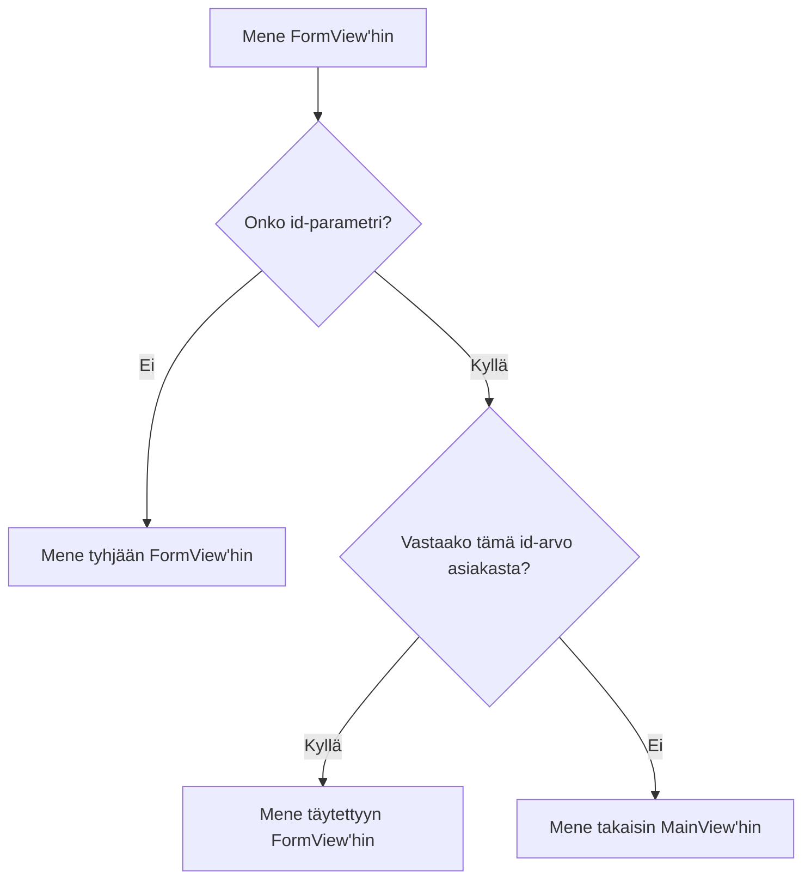

Sovelluksessa [Routing and Composites](/docs/introduction/tutorial/routing-and-composites) voidaan lisätä vain uusia asiakkaita tietokantaan. Käyttämällä seuraavia käsitteitä, annat käyttäjille mahdollisuuden myös muokata olemassa olevien asiakkaiden tietoja:

- Reittikaaviot
- Parametrien arvojen siirtäminen URL-osoitteen kautta
- Elinkaaren tarkkailijat

Tämän vaiheen suorittaminen luo version [4-observers-and-route-parameters](https://github.com/webforj/webforj-tutorial/tree/main/4-observers-and-route-parameters).

## Sovelluksen ajaminen {#running-the-app}

Sovellusta kehittäessäsi voit käyttää [4-observers-and-route-parameters](https://github.com/webforj/webforj-tutorial/tree/main/4-observers-and-route-parameters) vertailukohtana. Näytäksesi sovelluksen toiminnassa:

1. Siirry ykköskansion, joka sisältää `pom.xml`-tiedoston, tämä on `4-observers-and-route-parameters`, jos seuraat GitHubin versiota.

2. Käytä seuraavaa Maven-komentoa ajaaksesi Spring Boot -sovellusta paikallisesti:
    ```bash
    mvn
    ```

Sovelluksen ajaminen avaa automaattisesti uuden selaimen osoitteeseen `http://localhost:8080`.

## Käyttäjän `id`:n käyttäminen {#using-the-customers-id}

Käyttääksesi `FormView`-komponenttia olemassa olevien asiakkaiden muokkaamiseen, tarvitset tavan kertoa sille, mikä asiakas on kyseessä. Voit tehdä tämän antamalla aluksi parametrin `FormView`:lle, joka edustaa asiakkaan ID:tä. [Työskentely datan kanssa](/docs/introduction/tutorial/working-with-data) -osiossa loit `Customer`-entiteetin, joka määrittää numeerisen `Long`-arvon ainutlaatuiseksi `id`:ksi asiakkaille, kun ne lisätään tietokantaan.

```java
 @Id
 @GeneratedValue(strategy = GenerationType.IDENTITY)
  private Long id;
```

Tässä vaiheessa teet muutoksia `FormView`:hen, jotta se käyttää `id`:tä alustusparametrina ennen kuin mitään ladataan. Sitten saat `FormView`:n arvioimaan `id`:n selvittääkseen, onko lomake uuden asiakkaan lisääminen vai olemassa olevan päivittäminen. Lopuksi muokkaat `MainView`:ta lähettääksesi `id`-arvon navigoidessasi `FormView`:hen.

## Reittikaavion lisääminen `FormView`:hen {#adding-a-route-pattern}

Edellisessä vaiheessa asetettaessa reitti `FormView`:lle `@Route(customer)` kartoittaa luokan paikallisesti osoitteeseen `http://localhost:8080/customer`. Reittikaavion lisääminen antaa sinulle mahdollisuuden lisätä `id`:n alustusparametrina `FormView`:lle.

[Reittikaavio](/docs/routing/route-patterns) antaa sinun lisätä parametrin URL-osoitteeseen, tehdä siitä valinnaisen ja asettaa rajoituksia voimassa oleville kaavoille. Käyttämällä `@Route`-annotaatiota, tässä on, mikä tekee `id`:stä valinnaisen reittiparametrin `FormView`:lle:

- **`/:id`** antaa reitille nimitetyn parametrin `id`, joten mennä osoitteeseen `http://localhost:8080/customer/6` lataa `FormView`:n `id`:n parametrilla, jonka arvo on `6`.

- **`?`** tekee `id`-parametrista valinnaisen. Oletusarvoisesti parametrit ovat pakollisia, mutta tekemällä `id`:stä valinnaisen voit käyttää `FormView`:tä uusien asiakkaiden lisäämiseen, joilla ei vielä ole `id`:tä.

- **`<[0-9]+>`** rajoittaa `id`:n positiiviseksi numeroksi. Kulmaliuskassa `<>` voit lisätä rajoituksen säännöllisenä lausekkeena parametrille. Jos `id` ei vastaa rajoitusta, esimerkiksi `http://localhost:8080/customer/john-smith`, se ohjaa käyttäjän 404-sivulle.

Lisää valinnainen reittiparametri `FormView`:hen muuttamalla `@Route`-annotaatioa seuraavasti:

```java
@Route("customer/:id?<[0-9]+>")
```

## Reititys `FormView`:hen {#routing-to-formview}

`FormView` ottaa nyt vastaan valinnaisen `id`-parametrin ja lataa vain, jos `id` on kokonaispositiivinen luku.

Kuitenkin `FormView` voi edelleen ladata, kun käyttäjä syöttää manuaalisesti URL-osoitteen ei-olevalle asiakkaalle, kuten `http://localhost:8080/customer/5000`. Elinkaaren tarkkailijan lisääminen ennen `FormView`:hen siirtymistä antaa sovelluksellesi mahdollisuuden päättää, miten käsitellä saapuvaa `id`-arvoa.

### Ehdollinen reititys {#conditional-routing}

Elinkaaren tarkkailijat sallivat komponenttien reagoida elinkaaritapahtumiin tietyissä vaiheissa. [Elinkaaren tarkkailijat](/docs/routing/navigation-lifecycle/observers) -artikkelissa luetellaan saatavilla olevat tarkkailijat, mutta tämä vaihe käyttää vain `WillEnterObserver`-tarkkailijaa.

`WillEnterObserver`:n ajoitus tapahtuu ennen komponentin reitityksen päättymistä. Käyttämällä tätä tarkkailijaa voit arvioida saapuvaa `id`:tä. Jos `id` ei vastaa olemassa olevaa asiakasta, voit ohjata käyttäjän takaisin `MainView`:hen löytääkseen kelvollisen asiakkaan muokattavaksi.

Ennen kuin keskustellaan `WillEnterObserver`:n koodista, seuraava kaavio esittää mahdolliset tulokset, kun reititetään `FormView`:hen:



### `WillEnterObserver`:n käyttäminen {#using-the-willenterobserver}

Käyttämällä elinkaaren tarkkailijaa, joka aktivoituu ennen komponentin täydellistä lataamista, `WillEnterObserver`, voit lisätä ehtoja määrittääksesi, jatkaako sovellus siirtymistä `FormView`:hen vai tarvitseeko sen ohjata käyttäjiä `MainView`:hen.

Jokainen elinkaaren tarkkailija on rajapinta, joten toteuta `WillEnterObserver` osana `FormView`:n määrittelyä:

```java
public class FormView extends Composite<Div> implements WillEnterObserver {
```

`WillEnterObserver`:lla on `onWillEnter()`-metodi, jota webforJ kutsuu ennen reititystä komponenttiin. Tällä metodilla on kaksi parametria: `WillEnterEvent` ja `ParametersBag`.

`WillEnterEvent` määrää, jatketaanko reititystä komponenttiin `accept()`-metodilla, vai keskeytetäänkö reititys `reject()`-metodilla. Keskeyttäessäsi nykyisen reitin, sinun on ohjattava käyttäjä johonkin muuhun paikkaan.

`ParametersBag` sisältää reititinparametrit URL-osoitteesta. Käytät `ParametersBag`:ia seuraavassa osiossa luodaksesi ehdollisen logiikan `onWillEnter()` käyttäen `id`-parametria.

Seuraava `onWillEnter()` on esimerkki, jossa on vain kaksi tulosta:

```java
@Override
public void onWillEnter(WillEnterEvent event, ParametersBag parameters) {

  // Lisää ehtologiikka
  if (<condition>) {

    // Salli reititys FormView'hin jatkua
    event.accept();

  } else {

    // Estä reititys FormView'hin
    event.reject();

    // Ohjaa käyttäjä MainView'hin
    navigateToMain();
  }
}
```

### `ParametersBag`:in käyttäminen {#using-the-parametersbag}

Kuten edellisessä osiossa mainittiin lyhyesti, `ParametersBag` sisältää router-parametrin URL-osoitteesta. Jokaisella elinkaaren tarkkailijalla on pääsy tähän objektiin, ja sen käyttäminen sovelluksessasi antaa sinulle mahdollisuuden saada `id`-arvo.

`ParametersBag`-objekti tarjoaa useita kyselymenetelmiä saadaksesi parametrin tiettynä objektityyppinä. Esimerkiksi `getInt()` voi palauttaa parametrin `Integer`-tyyppisenä.

Koska jotkut parametrit ovat valinnaisia, se, mitä `getInt()` todellisuudessa palauttaa, on `Optional<Integer>`. Käyttämällä `ifPresentOrElse()`-metodia `Optional<Integer>`:lle voit asettaa muuttujan käyttäen `Integer`:ia.

Kun `id`:tä ei ole paikalla, käyttäjä voi jatkaa `FormView`:hen uuden asiakkaan lisäämiseksi.

```java
@Override
public void onWillEnter(WillEnterEvent event, ParametersBag parameters) {

  // Määritä, mikä parametri saadaan, ja tarkista, onko se paikalla vai ei
  parameters.getInt("id").ifPresentOrElse(id -> {

    // Käytä id:ttä muuttujana
    customerId = Long.valueOf(id);

  // Kun id:tä ei ole paikalla, jatka FormView'hin uuden asiakkaan vuoksi
  }, () -> event.accept());

}
```

### Onko `id` voimassa? {#is-the-id-valid}

Tällä hetkellä `WillEnterObserver`, joka käsittelee aiemman osion, hyväksyy reitityksen vain, kun `id`:tä ei ole paikalla. Tarkkailijan on suoritettava vielä yksi tarkastus ennen kuin se jatkaa `FormView`:hen: varmista, että `id` vastaa olemassa olevaa asiakasta.

Nyt `FormView` voi käyttää `CustomerService`:a varmistaakseen asiakkaan olemassaolon käyttäen `doesCustomerExist()`-metodia. Jos vastaavuutta ei löydy, sovellus voi hylätä nykyisen reitityksen ja ohjata käyttäjän `MainView`:hen käyttäen `navigateToMain()`-metodia.

Kun annetaan voimassa oleva `id`, sovellus voi käyttää `accept()`-metodia jatkaakseen reititystä `FormView`:hen. Luo `fillForm()`-metodi, joka määrittää `customer`-muuttujan asiakasta vastaavaksi `id`:ksi tietokannassa ja asettaa kenttien arvot:

```java
public void fillForm(Long customerId) {
  customer = customerService.getCustomerByKey(customerId);
  firstName.setValue(customer.getFirstName());
  lastName.setValue(customer.getLastName());
  company.setValue(customer.getCompany());
  country.selectKey(customer.getCountry());
}
```

Kuten uusien asiakkaiden lisäämisessä, työstettävän version käyttäminen sallii käyttäjien muokata asiakastietoja käyttöliittymässä ilman suoraa muokkausta varastossa.

### Valmis `onWillEnter()` {#completed-onwillenter}

Viimeiset kaksi osiota käsittelivät yksityiskohtaisesti, kuinka käsitellä kutakin tulosta reititettynä `FormView`:hen käyttäen `ParametersBag`:ia ja `CustomerService`:a.

Seuraava on valmis `onWillEnter()`-metodi `FormView`:lle, joka käyttää `ParametersBag`:ia hylätäksesi tai hyväksyäksesi saapuvan reitin, ja kutsuu muita metodeja joko täyttääkseen lomakkeen tai lähettääkseen käyttäjän `MainView`:hen:

```java
@Override
public void onWillEnter(WillEnterEvent event, ParametersBag parameters) {

  // Määritä, mikä parametri saadaan, ja tarkista, onko se paikalla vai ei
  parameters.getInt("id").ifPresentOrElse(id -> {
    customerId = Long.valueOf(id);
    // Tarkista, onko asiakkaalla tämä id
    if (customerService.doesCustomerExist(customerId)) {
        // Tämä asiakas on olemassa, joten jatka FormView'hin, ja alusta kentät käyttäen id:tä
        event.accept();
        fillForm(customerId);
      } else {
        // Tätä asiakasta ei ole olemassa, joten ohjaa MainView'hin
        event.reject();
        navigateToMain();
      }
  // Ei id:tä, joten jatka FormView'hin uuden asiakkaan vuoksi
  }, () -> event.accept());

}
```

## Asiakkaan lisääminen tai muokkaaminen {#adding-or-editing-a-customer}

Sovelluksen edellisessä versiossa lisättiin vain uusia asiakkaita, kun käyttäjä lähetti lomakkeen. Nyt kun käyttäjät voivat muokata olemassa olevia asiakkaita, `submitCustomer()`-metodin on varmistettava, että asiakas on jo olemassa ennen kuin se päivittää tietokannan.

Alun perin oli tarpeetonta määrittää muuttuja asiakkaan `id`:lle `FormView`:ssä, koska uusille asiakkaille annettiin ainutlaatuinen `id` tietokantaan lähetettäessä. Kuitenkin, jos määrität `customerId`:n alustusmuuttujaksi `FormView`:ssä arvoon, jota ei käytetä, se pysyy muuttumattomana uusille asiakkaille ja ylikirjoitettuna `onWillEnter()` jo olemassa oleville.

Tämä antaa sinun käyttää `doesCustomerExist()` varmistaaksesi, lisätäänkö uusi asiakas vai päivitetäänkö olemassa olevaa.

```java
private Long customerId = 0L;

//...

private void submitCustomer() {
  if (customerService.doesCustomerExist(customerId)) {
    customerService.updateCustomer(customer);
  } else {
    customerService.createCustomer(customer);
  }
  navigateToMain();
}
```

## Valmis `FormView` {#completed-formview}

Tässä on miltä `FormView` näyttää, nyt kun se voi käsitellä olemassa olevien asiakkaiden muokkaamista:

<ExpandableCode title="FormView.java" language="java" startLine={1} endLine={15}>
  {`@Route("customer/:id?<[0-9]+>")
  @FrameTitle("Asiakaslomake")
  public class FormView extends Composite<Div> implements WillEnterObserver {
    private final CustomerService customerService;
    private Customer customer = new Customer();
    private Long customerId = 0L;
    private Div self = getBoundComponent();
    private TextField firstName = new TextField("Etunimi", e -> customer.setFirstName(e.getValue()));
    private TextField lastName = new TextField("Sukunimi", e -> customer.setLastName(e.getValue()));
    private TextField company = new TextField("Yritys", e -> customer.setCompany(e.getValue()));
    private ChoiceBox country = new ChoiceBox("Maa",
        e -> customer.setCountry((Customer.Country) e.getSelectedItem().getKey()));
    private Button submit = new Button("Lähetä", ButtonTheme.PRIMARY, e -> submitCustomer());
    private Button cancel = new Button("Peruuta", ButtonTheme.OUTLINED_PRIMARY, e -> navigateToMain());
    private ColumnsLayout layout = new ColumnsLayout(
        firstName, lastName,
        company, country,
        submit, cancel);

    public FormView(CustomerService customerService) {
      this.customerService = customerService;
      fillCountries();
      setColumnsLayout();
      self.setMaxWidth(600)
          .addClassName("card")
          .add(layout);
      submit.setStyle("margin-top", "var(--dwc-space-l)");
      cancel.setStyle("margin-top", "var(--dwc-space-l)");
    }

    private void setColumnsLayout() {
      List<Breakpoint> breakpoints = List.of(
          new Breakpoint(600, 2));
      layout.setSpacing("var(--dwc-space-l)")
          .setBreakpoints(breakpoints);
    }

    private void fillCountries() {
      ArrayList<ListItem> listCountries = new ArrayList<>();
      for (Country countryItem : Customer.Country.values()) {
        listCountries.add(new ListItem(countryItem, countryItem.toString()));
      }
      country.insert(listCountries);
      country.selectIndex(0);
    }

    private void submitCustomer() {
      if (customerService.doesCustomerExist(customerId)) {
        customerService.updateCustomer(customer);
      } else {
        customerService.createCustomer(customer);
      }
      navigateToMain();
    }

    private void navigateToMain() {
      Router.getCurrent().navigate(MainView.class);
    }

    @Override
    public void onWillEnter(WillEnterEvent event, ParametersBag parameters) {
      parameters.getInt("id").ifPresentOrElse(id -> {
        customerId = Long.valueOf(id);
        if (customerService.doesCustomerExist(customerId)) {
          event.accept();
          fillForm(customerId);
        } else {
          event.reject();
          navigateToMain();
        }

      }, () -> event.accept());
    }

    public void fillForm(Long customerId) {
      customer = customerService.getCustomerByKey(customerId);
      firstName.setValue(customer.getFirstName());
      lastName.setValue(customer.getLastName());
      company.setValue(customer.getCompany());
      country.selectKey(customer.getCountry());
    }
  }
`}
</ExpandableCode>

## Navigointi `MainView`:stä `FormView`:hen asiakkaiden muokkaamiseksi {#navigating-from-mainview-to-formview-to-edit-customers}

Aikaisemmin tässä vaiheessa käytit olemassa olevaa `ParametersBag`:ia määrittääksesi `id`:n arvon. Uuden `ParametersBag`:in luominen antaa sinun navigoida suoraan luokkien välillä valitsemiesi parametrien kanssa. Käytetään tiedot `Table`:sta, on järkevää lähettää käyttäjiä `FormView`:hen asiakkaan `id`:llä.

Samoin kuin painikkeen kanssa, navigoinnin sitominen käyttäjän valitsemaan toimintaan antaa heidän päättää, milloin siirtyä `FormView`:hen. Tapahtumakuuntelijan lisääminen `Table`:lle antaa sinun ohjata käyttäjän `FormView`:hen `ParametersBag`:illa:

```java
table.addItemClickListener(this::editCustomer);

private void editCustomer(TableItemClickEvent<Customer> e) {
  Router.getCurrent().navigate(FormView.class,
      ParametersBag.of("id=" + e.getItemKey()));
  }
```

Kuitenkin `Table`:n kohteiden avain on oletusarvoisesti automaattisesti luotu. Voit erikseen tuottaa jokaiselle avaimelle vastaavan asiakkaan `id`:n käyttämällä `setKeyProvider()`-metodia:

```java
table.setKeyProvider(Customer::getId);
```

`MainView`:ssä lisää `addItemClickListener()`- ja `setKeyProvider()`-metodit `buildTable()`-metodiin, ja lisää metodi, joka lähettää käyttäjän `FormView`:hen `ParametersBag`:30 arvolla `id`, sen perusteella, mihin taulukkosoluun käyttäjä napsautti:

```java title="MainView.java" {30-31,34-37}
@Route("/")
@FrameTitle("Asiakas Taulukko")
public class MainView extends Composite<Div> {
  private final CustomerService customerService;
  private Div self = getBoundComponent();
  private Table<Customer> table = new Table<>();
  private Button addCustomer = new Button("Lisää asiakas", ButtonTheme.PRIMARY,
      e -> Router.getCurrent().navigate(FormView.class));

  public MainView(CustomerService customerService) {
    this.customerService = customerService;
    addCustomer.setWidth(200);
    buildTable();
    self.setWidth("fit-content")
        .addClassName("card")
        .add(table, addCustomer);
  }

  private void buildTable() {
    table.setSize("1000px", "294px");
    table.setMaxWidth("90vw");
    table.addColumn("firstName", Customer::getFirstName).setLabel("Etunimi");
    table.addColumn("lastName", Customer::getLastName).setLabel("Sukunimi");
    table.addColumn("company", Customer::getCompany).setLabel("Yritys");
    table.addColumn("country", Customer::getCountry).setLabel("Maa");
    table.setColumnsToAutoFit();
    table.setColumnsToResizable(false);
    table.getColumns().forEach(column -> column.setSortable(true));
    table.setRepository(customerService.getRepositoryAdapter());
    table.setKeyProvider(Customer::getId);
    table.addItemClickListener(this::editCustomer);
  }

  private void editCustomer(TableItemClickEvent<Customer> e) {
    Router.getCurrent().navigate(FormView.class,
        ParametersBag.of("id=" + e.getItemKey()));
  }
}
```

## Seuraava vaihe {#next-step}

Nyt, kun käyttäjät voivat muokata asiakastietoja suoraan, sovelluksesi pitäisi validoida muutokset ennen kuin sitouttaa ne varastoon. [Validointi ja datan sitominen](/docs/introduction/tutorial/validating-and-binding-data) -osiossa luot validoimis- ja sidontakäytäntöjä, mikä mahdollistaa komponenttien näyttävän virheviestejä, kun data on virheellinen.
