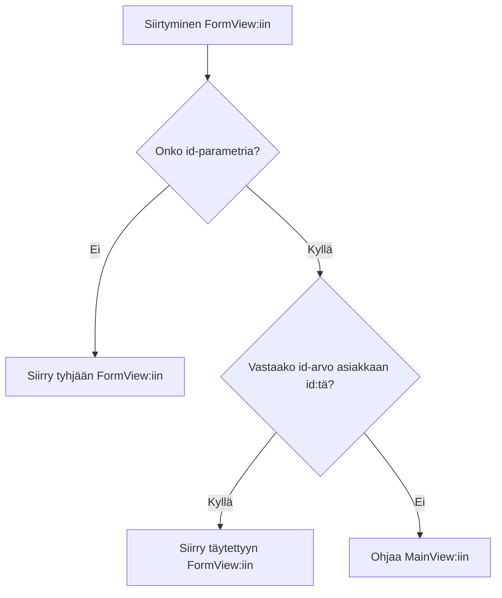

Sovellus kohdasta [Reititys ja yhdistelmät](/docs/introduction/tutorial/routing-and-composites) voi lisätä vain uusia asiakkaita tietokantaan. Käyttämällä seuraavia käsitteitä, annat käyttäjille mahdollisuuden myös muokata olemassa olevien asiakkaiden tietoja:

- Reittimallit
- Parametrien välittäminen URL-osoitteen kautta
- Elinkaaren tarkkailijat

Tämän vaiheen suorittaminen luo version [4-tarkkailijat-ja-reittiparametrit](https://github.com/webforj/webforj-tutorial/tree/main/4-observers-and-route-parameters).

## Sovelluksen ajaminen {#running-the-app}

Kun kehität sovellustasi, voit käyttää [4-tarkkailijat-ja-reittiparametrit](https://github.com/webforj/webforj-tutorial/tree/main/4-observers-and-route-parameters) vertailuna. Näet sovelluksen toiminnassa:

1. Siirry ykköstason hakemistoon, joka sisältää `pom.xml`-tiedoston, tämä on `4-tarkkailijat-ja-reittiparametrit`, jos seuraat GitHubin versiota.

2. Käytä seuraavaa Maven-komentoa ajaaksesi Spring Boot -sovellusta paikallisesti:
    ```bash
    mvn
    ```

Sovelluksen ajaminen avaa automaattisesti uuden selaimen osoitteeseen `http://localhost:8080`.

## Käyttäjän `id` käyttö {#using-the-customers-id}

Jotta voit käyttää `FormView`-komponenttia olemassa olevien asiakkaiden muokkaamiseen, sinun on kerrottava sille, mikä asiakas muokataan. Voit tehdä tämän tarjoamalla alkuperäisen parametrin `FormView`:lle, joka edustaa asiakkaan tunnusta. Osa [Työskentely datan kanssa](/docs/introduction/tutorial/working-with-data) -osiosta, loit `Customer`-entiteetin, joka määrittää numeerisen `Long`-arvon ainutlaatuiseksi `id`:ksi asiakkaille, kun ne lisätään tietokantaan.

```java
@Id
@GeneratedValue(strategy = GenerationType.IDENTITY)
private Long id;
```

Tässä vaiheessa teet muutoksia `FormView`:iin, jotta se käyttää `id`:tä alkuperäisenä parametrina ennen kuin mitään latautuu. Sitten saat `FormView`:n arvioimaan `id`:n päättääksesi, onko lomake uuden asiakkaan lisäämistä varten vai olemassa olevan päivittämistä varten. Lopuksi muokkaat `MainView`:ta, jotta se lähettää `id`-arvon siirryttäessä `FormView`:iin.

## Reittimallin lisääminen `FormView`:iin {#adding-a-route-pattern}

Aikaisemmassa vaiheessa reitin määrittäminen `FormView`:lle `@Route(customer)` yhdistää luokan paikallisesti osoitteeseen `http://localhost:8080/customer`. Reittimallin lisääminen antaa sinun liittää `id`:n alkuperäiseksi parametri `FormView`:hin.

[Reittimalli](/docs/routing/route-patterns) antaa sinun lisätä parametrin URL-osoitteeseen, tehdä siitä valinnaisen ja asettaa rajoituksia voimassa oleville malleille. Käyttämällä `@Route`-annotaatiota, tästä tulee `id`:stä valinnainen reittiparametri `FormView`:lle:

- **`/:id`** antaa reitille nimettynä parametrinä `id`, joten siirtyminen osoitteeseen `http://localhost:8080/customer/6` lataa `FormView`:n `id`-parametrilla `6`.

- **`?`** tekee `id`-parametrista valinnaisen. Oletusarvoisesti parametrit ovat pakollisia, mutta tekemällä `id`:n valinnaiseksi voit käyttää `FormView`:ta uusien asiakkaiden lisäämiseen, joilla ei vielä ole `id`:tä.

- **`<[0-9]+>`** rajoittaa `id`:n positiiviseksi numeroksi. Kulmasuluissa `<>` voit lisätä rajoituksia säännöllisen lausekkeen muodossa parametrille. Jos `id` ei vastaa rajoitusta, esim. `http://localhost:8080/customer/john-smith`, se ohjaa käyttäjän 404-sivulle.

Lisätäksesi valinnaisen reittiparametrin `FormView`:iin, muuta `@Route`-annotaatio seuraavaksi:

```java
@Route("customer/:id?<[0-9]+>")
```

## Reititys `FormView`:iin {#routing-to-formview}

`FormView` hyväksyy nyt valinnaisen `id`-parametrin ja latautuu vain, jos `id` on kokonaispositiivinen luku.

Kuitenkin `FormView` voi silti ladata, kun käyttäjä syöttää manuaalisesti URL-osoitteen ei-olemassa olevalle asiakkaalle, kuten `http://localhost:8080/customer/5000`. Elinkaaren tarkkailijan lisääminen ennen siirtymistä `FormView`:iin antaa sovelluksesi mahdollisuuden päättää, miten käsitellä saapuvaa `id`-arvoa.

### Ehdollinen reititys {#conditional-routing}

Elinkaaren tarkkailijat mahdollistavat komponenttien reagoida elinkaaritapahtumiin tietyissä vaiheissa. [Elinkaaren tarkkailijat](/docs/routing/navigation-lifecycle/observers) -artikkeli listaa käytettävissä olevat tarkkailijat, mutta tässä vaiheessa käytetään vain `WillEnterObserver`:ia.

`WillEnterObserver`-aika tapahtuu ennen, kuin komponentin reititys on valmis. Tämän tarkkailijan käyttö mahdollistaa saapuvan `id`:n arvioimisen. Jos `id` ei vastaa olemassa olevaa asiakasta, voit ohjata käyttäjän takaisin `MainView`:iin etsimään voimassa olevaa asiakasta muokattavaksi.

Ennen kuin käsittelemme `WillEnterObserver`-koodia, seuraava vuokaavio havainnollistaa mahdollisia tuloksia reititettäessä `FormView`:iin:


```mermaid
flowchart TD
    A[Siirtyminen FormView:iin] --> B{Onko id-parametria?}
    B -->|Ei| C[Siirry tyhjään FormView:iin]
    B -->|Kyllä| D{Vastaako id-arvo asiakkaan id:tä?}
    D -->|Kyllä| E[Siirry täytettyyn FormView:iin]
    D -->|Ei| F[Ohjaa MainView:iin]
```

### `WillEnterObserver`:in käyttö {#using-the-willenterobserver}

Käyttämällä elinkaaren tarkkailijaa, joka laukaisee ennen kuin komponentti latautuu kokonaan, `WillEnterObserver`, voit lisätä ehtoja määrittääksesi, tuleeko sovelluksen jatkaa `FormView`:iin vai ohjataanko käyttäjä `MainView`:iin.

Jokainen elinkaaren tarkkailija on rajapinta, joten toteuta `WillEnterObserver` osana `FormView`:n deklarointia:

```java
public class FormView extends Composite<Div> implements WillEnterObserver {
```

`WillEnterObserver`-tarkkailijassa on `onWillEnter()`-metodi, jota webforJ kutsuu ennen siirtymistä komponenttiin. Tällä metodilla on kaksi parametria: `WillEnterEvent` ja `ParametersBag`.

`WillEnterEvent` määrittää, jatketaanko reitittämistä komponenttiin `accept()`-metodilla, vai estetäänkö reititys käyttämällä `reject()`-metodia. Kun nykyinen reitti hylätään, sinun on ohjattava käyttäjä muualle.

`ParametersBag` sisältää URL-osoitteen reititysparametrit. Käytät `ParametersBag`:ia seuraavassa osiossa luodaksesi ehtologiiikan `onWillEnter()`-metodille käyttäen `id`-parametria.

Seuraava `onWillEnter()` on esimerkki, jossa on vain kaksi tulosta:

```java
@Override
public void onWillEnter(WillEnterEvent event, ParametersBag parameters) {

  //Lisää ehtologikka
  if (<condition>) {

    //Salli siirtyminen FormView:iin
    event.accept();

  } else {

    //Pysäytä siirtyminen FormView:iin
    event.reject();

    //Lähetä käyttäjä MainView:iin
    navigateToMain();
  }
}
```

### `ParametersBag`:in käyttö {#using-the-parametersbag}

Kuten edellisessä osiossa mainittiin, `ParametersBag` sisältää reititysparametrin URL-osoitteesta. Jokaisella elinkaaren tarkkailijalla on pääsy tähän objektiin, ja sen käyttö sovelluksessa antaa sinun saada `id`-arvon.

`ParametersBag`-objekti tarjoaa useita kyselymenetelmiä, joiden avulla voit noutaa parametrin tietyn objektityypin mukaan. Esimerkiksi `getInt()` voi antaa sinulle parametrin `Integer`-tyyppisenä.

Koska jotkin parametrit ovat valinnaisia, mitä `getInt()` todellisuudessa palauttaa, on `Optional<Integer>`. Käyttämällä `ifPresentOrElse()`-metodia `Optional<Integer>`:ssä voit asettaa muuttujan käyttäen `Integer`-arvoa.

Kun `id`:tä ei ole läsnä, käyttäjä voi jatkaa `FormView`:iin uuden asiakkaan lisäämistä varten.

```java
@Override
public void onWillEnter(WillEnterEvent event, ParametersBag parameters) {

  //Määritä, mikä parametrin on noudettava, ja tarkista onko se läsnä vai ei
  parameters.getInt("id").ifPresentOrElse(id -> {

    //Käytä id:tä muuttujana
    customerId = Long.valueOf(id);

  //Kun id:tä ei ole läsnä, jatka siirtymistä FormView:iin uuden asiakkaan lisäämistä varten
  }, () -> event.accept());

}
```

### Onko `id` voimassa? {#is-the-id-valid}

T tällä hetkellä `WillEnterObserver`, jonka viimeisessä osiossa käsiteltiin, hyväksyy reitityksen vain, jos `id`-parametria ei ole läsnä. Tarkkailijan on suoritettava yksi vahvistus ennen `FormView`:iin jatkamista: varmista, että `id` vastaa olemassa olevaa asiakasta.

Nyt `FormView` voi käyttää `CustomerService`:ia varmistaakseen asiakkaan olemassaolon `doesCustomerExist()`-metodin avulla. Jos vastaavuutta ei löydy, sovellus voi hylätä nykyisen reitityksen ja ohjata käyttäjän `MainView`:iin käyttäen `navigateToMain()`:ia.

Kun tarjotaan voimassa olevaa `id`:tä, sovellus voi käyttää `accept()`:ia jatkaakseen reitittämistä `FormView`:iin. Luo `fillForm()`-metodi, joka määrittää `customer`-muuttujan asiakkaaksi, jolla on vastaava `id` tietokannassa, ja asettaa kenttien arvot:

```java
public void fillForm(Long customerId) {
  customer = customerService.getCustomerByKey(customerId);
  firstName.setValue(customer.getFirstName());
  lastName.setValue(customer.getLastName());
  company.setValue(customer.getCompany());
  country.selectKey(customer.getCountry());
}
```

Kuten uuden asiakkaan lisäämisessä, työn alla oleva kopio mahdollistaa käyttäjien muokata asiakastietoja käyttöliittymässä suoraan muokkaamatta arkistointia.

### Valmis `onWillEnter()` {#completed-onwillenter}

Kaksi viimeistä osiota käsitteli tarkasti, kuinka käsitellä jokaista tulosta reitittäessä `FormView`:iin käyttäen `ParametersBag`:ia ja `CustomerService`:a.

Seuraava on valmis `onWillEnter()` `FormView`:lle, joka käyttää `ParametersBag`:ia hylätä tai hyväksyä saapuva reitti ja kutsuu muita metodeja täyttääkseen lomakkeen tai lähettääkseen käyttäjän `MainView`:iin:

```java
@Override
public void onWillEnter(WillEnterEvent event, ParametersBag parameters) {

  //Määritä, mikä parametrin on noudettava, ja tarkista onko se läsnä vai ei
  parameters.getInt("id").ifPresentOrElse(id -> {
    customerId = Long.valueOf(id);
    //Tarkista, onko asiakasta tämän id:n kanssa
    if (customerService.doesCustomerExist(customerId)) {
        //Tämä asiakas on olemassa, joten jatka reitittämistä FormView:iin ja alustaa kentät käyttäen id:tä
        event.accept();
        fillForm(customerId);
      } else {
        //Tätä asiakasta ei ole, joten ohjaa MainView:iin
        event.reject();
        navigateToMain();
      }
  //Ei id:tä ollut läsnä, joten jatka reitittämistä FormView:iin uuden asiakkaan lisäämistä varten
  }, () -> event.accept());
}
```

## Asiakkaan lisääminen tai muokkaaminen {#adding-or-editing-a-customer}

Aikaisemmassa versiossa tätä sovellusta lisättiin vain uusia asiakkaita, kun käyttäjä lähetti lomakkeen. Nyt kun käyttäjät voivat muokata olemassa olevia asiakkaita, `submitCustomer()`-metodin on varmista, että asiakas on jo olemassa ennen tietokannan päivittämistä.

Aluksi ei ollut tarpeen määrittää muuttujaa asiakkaan `id`:lle `FormView`:ssa, koska uusille asiakkaille annetaan ainutlaatuinen `id`, kun ne lähetetään tietokantaan. Kuitenkin, jos määrittelet `customerId`:n ensimmäiseksi muuttujaksi `FormView`:ssa, jossa on käyttämätön `id`-arvo, se pysyy koskemattomana uusille asiakkaille ja ylikirjoitetaan `onWillEnter()`-metodissa olemassa oleville.

Tämä sallii käyttää `doesCustomerExist()`-metodia tarkistaaksesi, lisätäänkö uusi asiakas vai päivitetäänkö olemassa oleva.

```java
private Long customerId = 0L;

//...

private void submitCustomer() {
  if (customerService.doesCustomerExist(customerId)) {
    customerService.updateCustomer(customer);
  } else {
    customerService.createCustomer(customer);
  }
  navigateToMain();
}
```

## Valmis `FormView` {#completed-formview}

Tässä on miltä `FormView` pitäisi näyttää, nyt kun se voi käsitellä olemassa olevien asiakkaiden muokkaamista:

```java
@Route("customer/:id?<[0-9]+>")
@FrameTitle("Asiakastiedot")
public class FormView extends Composite<Div> implements WillEnterObserver {
  private final CustomerService customerService;
  private Customer customer = new Customer();
  private Long customerId = 0L;
  private Div self = getBoundComponent();
  private TextField firstName = new TextField("Etunimi", e -> customer.setFirstName(e.getValue()));
  private TextField lastName = new TextField("Sukunimi", e -> customer.setLastName(e.getValue()));
  private TextField company = new TextField("Yritys", e -> customer.setCompany(e.getValue()));
  private ChoiceBox country = new ChoiceBox("Maa", e -> customer.setCountry((Customer.Country) e.getSelectedItem().getKey()));
  private Button submit = new Button("Lähetä", ButtonTheme.PRIMARY, e -> submitCustomer());
  private Button cancel = new Button("Peruuta", ButtonTheme.OUTLINED_PRIMARY, e -> navigateToMain());
  private ColumnsLayout layout = new ColumnsLayout(
      firstName, lastName,
      company, country,
      submit, cancel);

  public FormView(CustomerService customerService) {
    this.customerService = customerService;
    fillCountries();
    setColumnsLayout();
    self.setMaxWidth(600)
        .addClassName("card")
        .add(layout);
    submit.setStyle("margin-top", "var(--dwc-space-l)");
    cancel.setStyle("margin-top", "var(--dwc-space-l)");
  }

  private void setColumnsLayout() {
    List<Breakpoint> breakpoints = List.of(new Breakpoint(600, 2));
    layout.setSpacing("var(--dwc-space-l)")
        .setBreakpoints(breakpoints);
  }

  private void fillCountries() {
    ArrayList<ListItem> listCountries = new ArrayList<>();
    for (Country countryItem : Customer.Country.values()) {
      listCountries.add(new ListItem(countryItem, countryItem.toString()));
    }
    country.insert(listCountries);
    country.selectIndex(0);
  }

  private void submitCustomer() {
    if (customerService.doesCustomerExist(customerId)) {
      customerService.updateCustomer(customer);
    } else {
      customerService.createCustomer(customer);
    }
    navigateToMain();
  }

  private void navigateToMain() {
    Router.getCurrent().navigate(MainView.class);
  }

  @Override
  public void onWillEnter(WillEnterEvent event, ParametersBag parameters) {
    parameters.getInt("id").ifPresentOrElse(id -> {
      customerId = Long.valueOf(id);
      if (customerService.doesCustomerExist(customerId)) {
        event.accept();
        fillForm(customerId);
      } else {
        event.reject();
        navigateToMain();
      }

    }, () -> event.accept());
  }

  public void fillForm(Long customerId) {
    customer = customerService.getCustomerByKey(customerId);
    firstName.setValue(customer.getFirstName());
    lastName.setValue(customer.getLastName());
    company.setValue(customer.getCompany());
    country.selectKey(customer.getCountry());
  }
}
```

## Siirtyminen `MainView`:ista `FormView`:iin asiakkaiden muokkaamista varten {#navigating-from-mainview-to-formview-to-edit-customers}

Aikaisemmin tässä vaiheessa käytit olemassa olevaa `ParametersBag`:ia määrittämään `id`:n arvon. Uuden `ParametersBag`:in luominen antaa sinun siirtyä luokkien välillä suoraan valitsemiesi parametrien kanssa. Käyttäjien lähettäminen `FormView`:iin asiakkaan `id`:n kera taulukoissa on mahdollista.

Samalla tavalla kuten napsautat painiketta, siirtymisen sitominen käyttäjän valitsemaan toimintaan antaa heidän päättää, milloin mennä `FormView`:iin. Lisäämällä tapahtumakuuntelijan `Table`:lle voit lähettää käyttäjän `FormView`:iin `ParametersBag`:in kanssa:

```java
table.addItemClickListener(this::editCustomer);

private void editCustomer(TableItemClickEvent<Customer> e) {
  Router.getCurrent().navigate(FormView.class,
      ParametersBag.of("id=" + e.getItemKey()));
}
```

Kuitenkin, `Table`-elementtien avaimet luodaan automaattisesti oletusarvoisesti. Voit nimenomaisesti tehdä jokaisesta avaimesta vastaavan asiakkaan `id`:n käyttämällä `setKeyProvider()`-menetelmää:

```java
table.setKeyProvider(Customer::getId);
```

`MainView`:ssa lisää `addItemClickListener()` ja `setKeyProvider()`-menetelmät `buildTable()`-metodiin, ja lisää sitten metodi, joka lähettää käyttäjän `FormView`:iin `ParametersBag`:illa, jossa on `id`-arvo riippuen siitä, mihin taulukossa käyttäjä napsautti:

```java title="MainView.java" {30-31,34-37}
@Route("/")
@FrameTitle("Asiakastaulukko")
public class MainView extends Composite<Div> {
  private final CustomerService customerService;
  private Div self = getBoundComponent();
  private Table<Customer> table = new Table<>();
  private Button addCustomer = new Button("Lisää asiakas", ButtonTheme.PRIMARY,
      e -> Router.getCurrent().navigate(FormView.class));

  public MainView(CustomerService customerService) {
    this.customerService = customerService;
    addCustomer.setWidth(200);
    buildTable();
    self.setWidth("fit-content")
        .addClassName("card")
        .add(table, addCustomer);
  }

  private void buildTable() {
    table.setSize("1000px", "294px");
    table.setMaxWidth("90vw");
    table.addColumn("firstName", Customer::getFirstName).setLabel("Etunimi");
    table.addColumn("lastName", Customer::getLastName).setLabel("Sukunimi");
    table.addColumn("company", Customer::getCompany).setLabel("Yritys");
    table.addColumn("country", Customer::getCountry).setLabel("Maa");
    table.setColumnsToAutoFit();
    table.setColumnsToResizable(false);
    table.getColumns().forEach(column -> column.setSortable(true));
    table.setRepository(customerService.getRepositoryAdapter());
    table.setKeyProvider(Customer::getId);
    table.addItemClickListener(this::editCustomer);
  }

  private void editCustomer(TableItemClickEvent<Customer> e) {
    Router.getCurrent().navigate(FormView.class,
        ParametersBag.of("id=" + e.getItemKey()));
  }
}
```

## Seuraava vaihe {#next-step}

Nyt kun käyttäjät voivat muokata asiakastietoja suoraan, sovelluksesi tulisi validoida muutokset ennen niiden tallentamista arkistoon. Osa [Validointi ja datan sitominen](/docs/introduction/tutorial/validating-and-binding-data) luodaan validointisäännöt ja liitetään datamalli suoraan käyttöliittymään, jolloin komponentit voivat näyttää virheilmoituksia, kun data on virheellistä.
