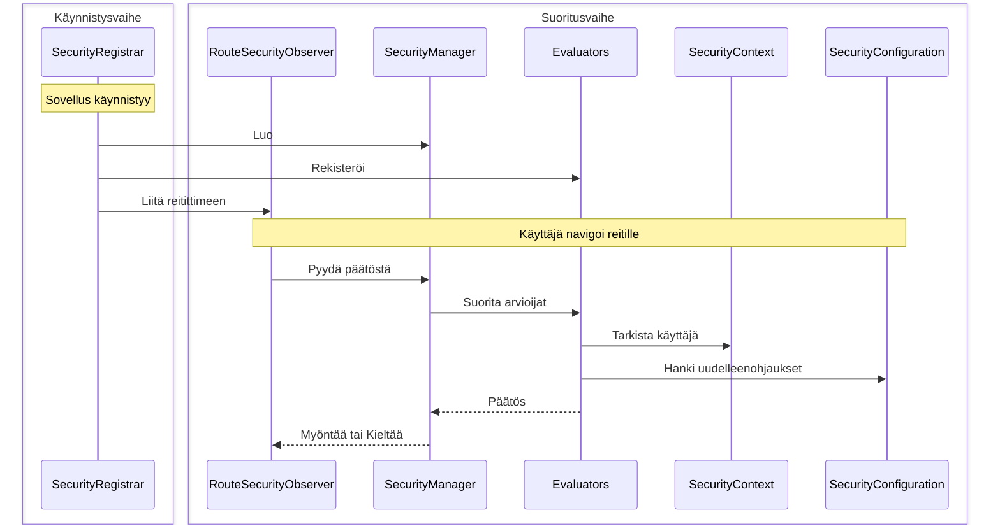

Tämä opas käy läpi rakentamisen täydellisen mukautetun turvallisuusratkaisun käyttäen istuntoon perustuvaa todennusta. Opit, miten neljä ydintoimintoliittymää toimii yhdessä toteuttamalla ne alusta alkaen.

:::tip[Useimmat sovellukset pitäisi käyttää Spring Securityä]
[Spring Security -integraatio](/docs/security/getting-started) konfiguroi automaattisesti kaiken, mitä täällä on esitetty. Rakenna vain mukautettu turvallisuus, jos sinulla on erityisiä vaatimuksia tai et käytä Spring Bootia.
:::

## Mitä rakennat {#what-youll-build}

Toimiva turvallisuusjärjestelmä, jossa on neljä luokkaa:

- **SecurityConfiguration** - Määrittelee turvallisuuskäyttäytymisen ja uudelleenohjauspaikat
- **SecurityContext** - Seuraa, kuka on kirjautuneena sisään käyttäen HTTP-istuntoja
- **SecurityManager** - Koordinoi turvallisuustarkistuksia ja tarjoaa kirjautumis-/uloskirjautumismahdollisuuden
- **SecurityRegistrar** - Yhdistää kaiken sovelluksen käynnistämisen yhteydessä

Esimerkki käyttää istuntoon perustuvaa tallennusta, mutta voit toteuttaa samat toimintoliittymät käyttäen tietokantakyselyitä, LDAP:ta tai mitä tahansa muuta todennusbackendiä.

## Miten osat toimivat yhdessä {#how-the-pieces-work-together}



**Prosessi:**
1. **`SecurityRegistrar`** suorittaa käynnistyksen yhteydessä, luo hallitsijan, rekisteröi arvioijat ja liittää tarkkailijan
2. **`SecurityManager`** koordinoi kaiken - se tarjoaa kontekstin ja konfiguraation arvioijille
3. **`SecurityContext`** vastaa kysymykseen "Kuka on kirjautuneena?" lukemalla HTTP-istunnoista
4. **`SecurityConfiguration`** vastaa kysymykseen "Mihin ohjata?" kirjautumis- ja pääsykielto -sivuille
5. **`Evaluators`** tekevät pääsypäätöksiä käyttäen kontekstia ja konfiguraatiota

## Vaihe 1: Määritä turvallisuuskonfiguraatio {#step-1-define-security-configuration}

Konfigurointi kertoo turvallisuusjärjestelmälle, miten käyttäytyä ja minne ohjata käyttäjiä:

```java title="SecurityConfiguration.java"
package com.securityplain.security;

import com.webforj.router.history.Location;
import com.webforj.router.security.RouteSecurityConfiguration;
import java.util.Optional;

/**
 * Turvallisuuskonfiguraatio sovellukselle.
 *
 * <p>
 * Määrittelee minne ohjata käyttäjiä, kun todennus on vaadittu tai pääsy on kielletty.
 * </p>
 */
public class SecurityConfiguration implements RouteSecurityConfiguration {

  @Override
  public boolean isEnabled() {
    return true;
  }

  @Override
  public boolean isSecureByDefault() {
    return false;
  }

  @Override
  public Optional<Location> getAuthenticationLocation() {
    return Optional.of(new Location("/login"));
  }

  @Override
  public Optional<Location> getDenyLocation() {
    return Optional.of(new Location("/access-denied"));
  }
}
```

- `isEnabled() = true` - Turvallisuus on aktiivinen
- `isSecureByDefault() = false` - Reitit ovat julkisia, ellei toisin ole merkattu (käytä `true` vaatiaksesi todennusta kaikilla reiteillä oletuksena)
- `/login` - Minne todennusta vailla olevat käyttäjät menevät
- `/access-denied` - Minne todennetut käyttäjät, joilla ei ole oikeuksia, menevät

## Vaihe 2: Toteuta turvallisuuskonteksti {#step-2-implement-security-context}

Konteksti seuraa, kuka on kirjautuneena. Tämä toteutus käyttää HTTP-istuntoja käyttäjätietojen tallentamiseen:

<!-- vale off -->

<ExpandableCode title="SecurityContext.java" language="java">
{`package com.securityplain.security;

import com.webforj.Environment;
import com.webforj.router.security.RouteSecurityContext;
import java.util.HashMap;
import java.util.Map;
import java.util.Optional;
import java.util.Set;

/**
 * Yksinkertainen istuntoon perustuva turvallisuuskonteksti.
 *
 * <p>
 * Tallentaa käyttäjäpään ja roolit HTTP-istuntoon. Tämä on minimaalinen toteutus opetus
 * tarkoituksiin.
 * </p>
 */
public class SecurityContext implements RouteSecurityContext {
  private static final String SESSION_USER_KEY = "security.user";
  private static final String SESSION_ROLES_KEY = "security.roles";
  private static final String SESSION_ATTRS_KEY = "security.attributes";

  /**
   * {@inheritDoc}
   */
  @Override
  public boolean isAuthenticated() {
    return getPrincipal().isPresent();
  }

  /**
   * {@inheritDoc}
   */
  @Override
  public Optional<Object> getPrincipal() {
    return getSessionAttribute(SESSION_USER_KEY);
  }

  /**
   * {@inheritDoc}
   */
  @Override
  public boolean hasRole(String role) {
    Optional<Object> rolesObj = getSessionAttribute(SESSION_ROLES_KEY);
    if (rolesObj.isPresent() && rolesObj.get() instanceof Set) {
      @SuppressWarnings("unchecked")
      Set<String> roles = (Set<String>) rolesObj.get();
      return roles.contains(role);
    }
    return false;
  }

  /**
   * {@inheritDoc}
   */
  @Override
  public boolean hasAuthority(String authority) {
    // Tässä yksinkertaisessa toteutuksessa, valtuudet ovat samoja kuin roolit
    return hasRole(authority);
  }

  /**
   * {@inheritDoc}
   */
  @Override
  public Optional<Object> getAttribute(String name) {
    Optional<Object> attrsObj = getSessionAttribute(SESSION_ATTRS_KEY);
    if (attrsObj.isPresent() && attrsObj.get() instanceof Map) {
      @SuppressWarnings("unchecked")
      Map<String, Object> attrs = (Map<String, Object>) attrsObj.get();
      return Optional.ofNullable(attrs.get(name));
    }
    return Optional.empty();
  }

  /**
   * {@inheritDoc}
   */
  @Override
  public void setAttribute(String name, Object value) {
    Environment.ifPresent(env -> {
      env.getSessionAccessor().ifPresent(accessor -> {
        accessor.access(session -> {
          @SuppressWarnings("unchecked")
          Map<String, Object> attrs =
              (Map<String, Object>) session.getAttribute(SESSION_ATTRS_KEY);
          if (attrs == null) {
            attrs = new HashMap<>();
            session.setAttribute(SESSION_ATTRS_KEY, attrs);
          }
          attrs.put(name, value);
        });
      });
    });
  }

  private Optional<Object> getSessionAttribute(String key) {
    final Object[] result = new Object[1];
    Environment.ifPresent(env -> {
      env.getSessionAccessor().ifPresent(accessor -> {
        accessor.access(session -> {
          result[0] = session.getAttribute(key);
        });
      });
    });
    return Optional.ofNullable(result[0]);
  }
}`}
</ExpandableCode>

<!-- vale on -->

**Miten se toimii:**

- `isAuthenticated()` tarkistaa, onko istunnossa käyttäjäpää
- `getPrincipal()` noutaa käyttäjätunnuksen istuntotallennuksesta
- `hasRole()` tarkistaa, sisältääkö käyttäjän roolijoukko määritellyn roolin
- `getAttribute()` / `setAttribute()` hallitsevat mukautettuja turvallisuusattribuutteja
- `Environment.getSessionAccessor()` tarjoaa säikeestä turvallisen pääsyn istuntoon

## Vaihe 3: Luo turvallisuusmanageri {#step-3-create-security-manager}

Hallitsija koordinoi turvallisuuspäätöksiä. Se laajentaa `AbstractRouteSecurityManager`-luokkaa, joka käsittelee arvioijaketjuja ja pääsyn eväämistä:

<!-- vale off -->

<ExpandableCode title="SecurityManager.java" language="java">
{`package com.securityplain.security;

import com.webforj.environment.ObjectTable;
import com.webforj.environment.SessionObjectTable;
import com.webforj.router.Router;
import com.webforj.router.security.AbstractRouteSecurityManager;
import com.webforj.router.security.RouteAccessDecision;
import com.webforj.router.security.RouteSecurityConfiguration;
import com.webforj.router.security.RouteSecurityContext;

import java.util.Set;

/**
 * Yksinkertainen turvallisuusmanagerin toteutus.
 *
 * <p>
 * Tarjoaa staattisia menetelmiä kirjautumiseen/uloskirjautumiseen ja hallitsee turvallisuuskontekstiä.
 * </p>
 */
public class SecurityManager extends AbstractRouteSecurityManager {
  private static final String SESSION_USER_KEY = "security.user";
  private static final String SESSION_ROLES_KEY = "security.roles";

  /**
   * {@inheritDoc}
   */
  @Override
  public RouteSecurityConfiguration getConfiguration() {
    return new SecurityConfiguration();
  }

  /**
   * {@inheritDoc}
   */
  @Override
  public RouteSecurityContext getSecurityContext() {
    return new SecurityContext();
  }

  /**
   * Kirjautuu käyttäjä sisään rooleilla.
   *
   * @param username käyttäjätunnus
   * @param password salasana
   */
  public RouteAccessDecision login(String username, String password) {
    if ("user".equals(username) && "password".equals(password)) {
      Set<String> roles = Set.of("USER");
      persistUser(username, roles);
      return RouteAccessDecision.grant();
    } else if ("admin".equals(username) && "admin".equals(password)) {
      Set<String> roles = Set.of("USER", "ADMIN");
      persistUser(username, roles);
      return RouteAccessDecision.grant();
    }

    return RouteAccessDecision.deny("Virheellinen käyttäjätunnus tai salasana");
  }

  /**
   * Kirjaudu ulos nykyisestä käyttäjästä ja ohjaa kirjautumissivulle.
   */
  public void logout() {
    SessionObjectTable.clear(SESSION_USER_KEY);
    SessionObjectTable.clear(SESSION_ROLES_KEY);

    Router router = Router.getCurrent();
    if (router != null) {
      getConfiguration().getAuthenticationLocation().ifPresent(location -> router.navigate(location));
    }
  }

  /**
   * Hanki nykyinen hallitsijaeläin.
   *
   * @return nykyinen hallitsijaeläin
   */
  public static SecurityManager getCurrent() {
    String key = SecurityManager.class.getName();
    if (ObjectTable.contains(key)) {
      return (SecurityManager) ObjectTable.get(key);
    }

    SecurityManager instance = new SecurityManager();
    ObjectTable.put(key, instance);

    return instance;
  }

  void saveCurrent(SecurityManager manager) {
    String key = SecurityManager.class.getName();
    ObjectTable.put(key, manager);
  }

  private void persistUser(String username, Set<String> roles) {
    SessionObjectTable.put(SESSION_USER_KEY, username);
    SessionObjectTable.put(SESSION_ROLES_KEY, roles);
  }
}`}
</ExpandableCode>

<!-- vale on -->

**Miten se toimii:**

- Laajentaa `AbstractRouteSecurityManager` perii arvioijaketjun logiikan
- Tarjoaa `getConfiguration()` ja `getSecurityContext()` -toteutukset
- Lisää `login()` käyttäjien todennusta varten ja tallentaa kirjautumistiedot istuntoon
- Lisää `logout()` tyhjentää istunnon ja ohjaa kirjautumissivulle
- Käyttää [`SessionObjectTable`](/docs/advanced/object-string-tables#sessionobjecttable) yksinkertaista istuntotallennusta varten
- Tallentaa itsensä [`ObjectTable`](/docs/advanced/object-string-tables#objecttable) sovelluksen laajuista käyttöä varten

## Vaihe 4: Liitä kaikki käynnistyksessä {#step-4-wire-everything-at-startup}

Rekisteröijä yhdistää kaikki osat, kun sovellus käynnistyy:

```java title="SecurityRegistrar.java"
package com.securityplain.security;

import com.webforj.App;
import com.webforj.AppLifecycleListener;
import com.webforj.annotation.AppListenerPriority;
import com.webforj.router.Router;
import com.webforj.router.security.RouteSecurityObserver;
import com.webforj.router.security.evaluator.AnonymousAccessEvaluator;
import com.webforj.router.security.evaluator.DenyAllEvaluator;
import com.webforj.router.security.evaluator.PermitAllEvaluator;
import com.webforj.router.security.evaluator.RolesAllowedEvaluator;

/**
 * Rekisteröi reitin turvallisuuskomponentit sovelluksen käynnistämisen aikana.
 *
 * <p>
 * Määritys turvallisuusmanagerista ja arvioijista reitittimen kanssa.
 * </p>
 */
@AppListenerPriority(1)
public class SecurityRegistrar implements AppLifecycleListener {

  /**
   * {@inheritDoc}
   */
  @Override
  public void onWillRun(App app) {
    // Luo turvallisuusmanageri
    SecurityManager securityManager = new SecurityManager();
    securityManager.saveCurrent(securityManager);

    // Rekisteröi sisäänrakennetut arvioijat prioriteetit
    securityManager.registerEvaluator(new DenyAllEvaluator(), 0);
    securityManager.registerEvaluator(new AnonymousAccessEvaluator(), 1);
    securityManager.registerEvaluator(new PermitAllEvaluator(), 2);
    securityManager.registerEvaluator(new RolesAllowedEvaluator(), 3);

    // Luo turvallisuustarkkailija ja liitä reitittimeen
    RouteSecurityObserver securityObserver = new RouteSecurityObserver(securityManager);
    Router router = Router.getCurrent();
    if (router != null) {
      router.getRenderer().addObserver(securityObserver);
    }
  }
}
```

**Rekisteröi kuuntelija:**

Luo `src/main/resources/META-INF/services/com.webforj.AppLifecycleListener` seuraavalla sisällöllä:

```text
com.securityplain.security.SecurityRegistrar
```

Tämä rekisteröi [`AppLifecycleListener`](/docs/advanced/lifecycle-listeners), jotta se ajetaan sovelluksen käynnistyessä.

**Miten se toimii:**

- Suoritetaan aikaisessa vaiheessa (`@AppListenerPriority(1)`) määrittääkseen turvallisuus ennen reittien lataamista
- Luo turvallisuusmanagerin ja tallentaa sen globaalisti
- Rekisteröi sisäänrakennetut arvioijat prioriteettijärjestyksessä (alemmat numerot suoritetaan ensin)
- Luo tarkkailijan, joka keskeyttää navigoinnin
- Liittää tarkkailijan reitittimeen, jotta turvallisuustarkastukset tapahtuvat automaattisesti

Kun tämä on suoritettu, turvallisuus on aktiivinen kaikessa navigoinnissa.

## Käytä toteutustasi {#using-your-implementation}

### Luo kirjautumisnäkymä {#create-a-login-view}

Seuraava näkymä käyttää [`Login`](/docs/components/login) komponenttia.

```java title="LoginView.java"
package com.securityplain.views;

import com.securityplain.security.SecurityManager;
import com.webforj.component.Composite;
import com.webforj.component.login.Login;
import com.webforj.router.Router;
import com.webforj.router.annotation.FrameTitle;
import com.webforj.router.annotation.Route;
import com.webforj.router.history.Location;
import com.webforj.router.security.annotation.AnonymousAccess;

@Route("/login")
@FrameTitle("Kirjaudu sisään")
@AnonymousAccess
public class LoginView extends Composite<Login> {
  private Login self = getBoundComponent();

  public LoginView() {
    self.onSubmit(e -> {
      var result = SecurityManager.getCurrent().login(
        e.getUsername(), e.getPassword()
      );
      
      if (result.isGranted()) {
        Router.getCurrent().navigate(new Location("/"));
      } else {
        self.setError(true);
        self.setEnabled(true);
      }
    });

    self.whenAttached().thenAccept(c -> self.open());
  }
}
```
