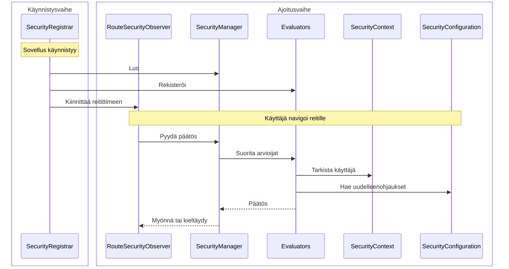

Tämä opas kuljettaa läpi täydellisen räätälöidyn tietoturvan toteuttamisen käyttäen istuntoon perustuvaa todennusta. Opit, miten neljä keskeistä rajapintaa toimivat yhdessä toteuttamalla ne alusta alkaen.

:::tip[Useimmissa sovelluksissa tulisi käyttää Spring Securityä]
[Spring Security integrointi](/docs/security/getting-started) määrittää automaattisesti kaiken, mikä on esitetty tässä. Räätälöidyn tietoturvan rakentaminen on tarpeen vain, jos sinulla on erityisiä vaatimuksia tai et käytä Spring Bootia.
:::

## Mitä tulet rakentamaan {#what-youll-build}

Toimiva tietoturvajärjestelmä, jossa on neljä luokkaa:

- **SecurityConfiguration** - Määrittelee tietoturvatoiminnat ja uudelleenohjauspaikat
- **SecurityContext** - Seuraa, kuka on kirjautunut sisään käyttäen HTTP-istuntoja
- **SecurityManager** - Koordinoi tietoturvatarkastuksia ja tarjoaa kirjautumis-/uloskirjautumistoimintoja
- **SecurityRegistrar** - Kytkee kaiken yhteen sovelluksen käynnistyessä

Esimerkki käyttää istuntoon perustuvaa tallennusta, mutta voit toteuttaa samat rajapinnat käyttäen tietokantakyselyitä, LDAP:ta tai mitä tahansa muuta todennuspalvelinta.

## Kuinka osat toimivat yhdessä {#how-the-pieces-work-together}


```mermaid
sequenceDiagram
  box Käynnistysvaihe
  participant Registrar as SecurityRegistrar
  end
  box Ajoitusvaihe
  participant Observer as RouteSecurityObserver
  participant Manager as SecurityManager
  participant Evaluators
  participant Context as SecurityContext
  participant Config as SecurityConfiguration
  end

  Note over Registrar: Sovellus käynnistyy
  Registrar->>Manager: Luo
  Registrar->>Evaluators: Rekisteröi
  Registrar->>Observer: Kiinnittää reitittimeen

  Note over Observer,Config: Käyttäjä navigoi reitille
  Observer->>Manager: Pyydä päätös
  Manager->>Evaluators: Suorita arvioijat
  Evaluators->>Context: Tarkista käyttäjä
  Evaluators->>Config: Hae uudelleenohjaukset
  Evaluators-->>Manager: Päätös
  Manager-->>Observer: Myönnä tai kieltäydy
```

**Virta:**
1. **`SecurityRegistrar`** toimii käynnistyksessä, luo hallitsijan, rekisteröi arvioijat ja kiinnittää tarkkailijan
2. **`SecurityManager`** koordinoi kaiken - se tarjoaa kontekstin ja määrityksen arvioijille
3. **`SecurityContext`** vastaa kysymykseen "Kuka on kirjautunut sisään?" lukemalla HTTP-istunnoista
4. **`SecurityConfiguration`** vastaa kysymykseen "Mihin uudelleenohjata?" kirjautumis- ja pääsykieltosivuille
5. **`Evaluators`** tekevät pääsypäätöksiä käyttäen kontekstia ja määritystä

## Vaihe 1: Määritä tietoturvamääritys {#step-1-define-security-configuration}

Määritys kertoo tietoturvajärjestelmälle, miten käyttäytyä ja minne ohjata käyttäjiä:

```java title="SecurityConfiguration.java"
package com.securityplain.security;

import com.webforj.router.history.Location;
import com.webforj.router.security.RouteSecurityConfiguration;
import java.util.Optional;

/**
 * Tietoturvamääritys sovellukselle.
 *
 * <p>
 * Määrittelee minne ohjata käyttäjiä, kun todennus on vaadittu tai pääsy on kielletty.
 * </p>
 */
public class SecurityConfiguration implements RouteSecurityConfiguration {

  @Override
  public boolean isEnabled() {
    return true;
  }

  @Override
  public boolean isSecureByDefault() {
    return false;
  }

  @Override
  public Optional<Location> getAuthenticationLocation() {
    return Optional.of(new Location("/login"));
  }

  @Override
  public Optional<Location> getDenyLocation() {
    return Optional.of(new Location("/access-denied"));
  }
}
```

- `isEnabled() = true` - Tietoturva on aktiivinen
- `isSecureByDefault() = false` - Reitit ovat julkisia, ellei niitä ole merkitty (käytä `true` vaatiaksesi todennusta kaikilta reiteiltä oletuksena)
- `/login` - Minne todennusvaatimukset täyttämättömät käyttäjät menevät
- `/access-denied` - Minne todennus vaatimukset täyttäneet mutta pääsyoikeudet puuttuvat käyttäjät menevät

## Vaihe 2: Toteuta tietoturvakonteksti {#step-2-implement-security-context}

Konteksti seuraa, kuka on kirjautunut sisään. Tämä toteutus käyttää HTTP-istuntoja käyttäjätietojen tallentamiseen:

<!-- vale off -->

<ExpandableCode title="SecurityContext.java" language="java">
{`package com.securityplain.security;

import com.webforj.Environment;
import com.webforj.router.security.RouteSecurityContext;
import java.util.HashMap;
import java.util.Map;
import java.util.Optional;
import java.util.Set;

/**
 * Yksinkertainen istuntoon perustuva tietoturvakonteksti.
 *
 * <p>
 * Tallentaa käyttäjäpääsyn ja roolit HTTP-istuntoon. Tämä on minimaalinen toteutus opetus
 * tarkoituksiin.
 * </p>
 */
public class SecurityContext implements RouteSecurityContext {
  private static final String SESSION_USER_KEY = "security.user";
  private static final String SESSION_ROLES_KEY = "security.roles";
  private static final String SESSION_ATTRS_KEY = "security.attributes";

  /**
   * {@inheritDoc}
   */
  @Override
  public boolean isAuthenticated() {
    return getPrincipal().isPresent();
  }

  /**
   * {@inheritDoc}
   */
  @Override
  public Optional<Object> getPrincipal() {
    return getSessionAttribute(SESSION_USER_KEY);
  }

  /**
   * {@inheritDoc}
   */
  @Override
  public boolean hasRole(String role) {
    Optional<Object> rolesObj = getSessionAttribute(SESSION_ROLES_KEY);
    if (rolesObj.isPresent() && rolesObj.get() instanceof Set) {
      @SuppressWarnings("unchecked")
      Set<String> roles = (Set<String>) rolesObj.get();
      return roles.contains(role);
    }
    return false;
  }

  /**
   * {@inheritDoc}
   */
  @Override
  public boolean hasAuthority(String authority) {
    // Tässä yksinkertaisessa toteutuksessa, valtuudet ovat samat kuin roolit
    return hasRole(authority);
  }

  /**
   * {@inheritDoc}
   */
  @Override
  public Optional<Object> getAttribute(String name) {
    Optional<Object> attrsObj = getSessionAttribute(SESSION_ATTRS_KEY);
    if (attrsObj.isPresent() && attrsObj.get() instanceof Map) {
      @SuppressWarnings("unchecked")
      Map<String, Object> attrs = (Map<String, Object>) attrsObj.get();
      return Optional.ofNullable(attrs.get(name));
    }
    return Optional.empty();
  }

  /**
   * {@inheritDoc}
   */
  @Override
  public void setAttribute(String name, Object value) {
    Environment.ifPresent(env -> {
      env.getSessionAccessor().ifPresent(accessor -> {
        accessor.access(session -> {
          @SuppressWarnings("unchecked")
          Map<String, Object> attrs =
              (Map<String, Object>) session.getAttribute(SESSION_ATTRS_KEY);
          if (attrs == null) {
            attrs = new HashMap<>();
            session.setAttribute(SESSION_ATTRS_KEY, attrs);
          }
          attrs.put(name, value);
        });
      });
    });
  }

  private Optional<Object> getSessionAttribute(String key) {
    final Object[] result = new Object[1];
    Environment.ifPresent(env -> {
      env.getSessionAccessor().ifPresent(accessor -> {
        accessor.access(session -> {
          result[0] = session.getAttribute(key);
        });
      });
    });
    return Optional.ofNullable(result[0]);
  }
}`}
</ExpandableCode>

<!-- vale on -->

**Kuinka se toimii:**

- `isAuthenticated()` tarkistaa, onko käyttäjäpääsy olemassa istunnossa
- `getPrincipal()` palauttaa käyttäjänimen istunto tallennuksesta
- `hasRole()` tarkistaa, sisältääkö käyttäjän roolijoukko määritellyn roolin
- `getAttribute()` / `setAttribute()` hallitsevat mukautettuja tietoturva-attribuutteja
- `Environment.getSessionAccessor()` tarjoaa säiekohtaisen pääsyn istuntoon

## Vaihe 3: Luo tietoturvahallinta {#step-3-create-security-manager}

Hallinta koordinoi tietoturvapäätöksiä. Se laajentaa `AbstractRouteSecurityManager` -luokkaa, joka käsittelee arvioijaketjuja ja pääsyn kieltoa:

<!-- vale off -->

<ExpandableCode title="SecurityManager.java" language="java">
{`package com.securityplain.security;

import com.webforj.environment.ObjectTable;
import com.webforj.environment.SessionObjectTable;
import com.webforj.router.Router;
import com.webforj.router.security.AbstractRouteSecurityManager;
import com.webforj.router.security.RouteAccessDecision;
import com.webforj.router.security.RouteSecurityConfiguration;
import com.webforj.router.security.RouteSecurityContext;

import java.util.Set;

/**
 * Yksinkertainen tietoturvahallintatoteutus.
 *
 * <p>
 * Tarjoaa staattisia menetelmiä kirjautumiseen/uloskirjautumiseen ja hallitsee tietoturvakontekstia.
 * </p>
 */
public class SecurityManager extends AbstractRouteSecurityManager {
  private static final String SESSION_USER_KEY = "security.user";
  private static final String SESSION_ROLES_KEY = "security.roles";

  /**
   * {@inheritDoc}
   */
  @Override
  public RouteSecurityConfiguration getConfiguration() {
    return new SecurityConfiguration();
  }

  /**
   * {@inheritDoc}
   */
  @Override
  public RouteSecurityContext getSecurityContext() {
    return new SecurityContext();
  }

  /**
   * Kirjaa käyttäjän sisään rooleilla.
   *
   * @param username käyttäjätunnus
   * @param password salasana
   */
  public RouteAccessDecision login(String username, String password) {
    if ("user".equals(username) && "password".equals(password)) {
      Set<String> roles = Set.of("USER");
      persistUser(username, roles);
      return RouteAccessDecision.grant();
    } else if ("admin".equals(username) && "admin".equals(password)) {
      Set<String> roles = Set.of("USER", "ADMIN");
      persistUser(username, roles);
      return RouteAccessDecision.grant();
    }

    return RouteAccessDecision.deny("Virheellinen käyttäjätunnus tai salasana");
  }

  /**
   * Kirjaa nykyisen käyttäjän ulos ja ohjaa kirjautumissivulle.
   */
  public void logout() {
    SessionObjectTable.clear(SESSION_USER_KEY);
    SessionObjectTable.clear(SESSION_ROLES_KEY);

    Router router = Router.getCurrent();
    if (router != null) {
      getConfiguration().getAuthenticationLocation().ifPresent(location -> router.navigate(location));
    }
  }

  /**
   * Hanki nykyinen hallinta-instanssi.
   *
   * @return nykyinen hallinta-instanssi
   */
  public static SecurityManager getCurrent() {
    String key = SecurityManager.class.getName();
    if (ObjectTable.contains(key)) {
      return (SecurityManager) ObjectTable.get(key);
    }

    SecurityManager instance = new SecurityManager();
    ObjectTable.put(key, instance);

    return instance;
  }

  void saveCurrent(SecurityManager manager) {
    String key = SecurityManager.class.getName();
    ObjectTable.put(key, manager);
  }

  private void persistUser(String username, Set<String> roles) {
    SessionObjectTable.put(SESSION_USER_KEY, username);
    SessionObjectTable.put(SESSION_ROLES_KEY, roles);
  }
}`}
</ExpandableCode>

<!-- vale on -->

**Kuinka se toimii:**

- Laajentaa `AbstractRouteSecurityManager` -luokkaa perimään arvioijaketjun logiikka
- Tarjoaa `getConfiguration()` ja `getSecurityContext()` toteutukset
- Lisää `login()` autentikoimaan käyttäjiä ja tallentamaan käyttäjätiedot istuntoon
- Lisää `logout()` tyhjentämään istunto ja ohjaamaan kirjautumissivulle
- Käyttää [`SessionObjectTable`](/docs/advanced/object-string-tables#sessionobjecttable) yksinkertaiseen istunto tallennukseen
- Tallentaa itsensä [`ObjectTable`](/docs/advanced/object-string-tables#objecttable) sovelluksen laajuista käyttöä varten

## Vaihe 4: Kytke kaikki käynnistyksessä {#step-4-wire-everything-at-startup}

Rekisteröijä yhdistää kaikki osat kun sovellus käynnistyy:

```java title="SecurityRegistrar.java"
package com.securityplain.security;

import com.webforj.App;
import com.webforj.AppLifecycleListener;
import com.webforj.annotation.AppListenerPriority;
import com.webforj.router.Router;
import com.webforj.router.security.RouteSecurityObserver;
import com.webforj.router.security.evaluator.AnonymousAccessEvaluator;
import com.webforj.router.security.evaluator.DenyAllEvaluator;
import com.webforj.router.security.evaluator.PermitAllEvaluator;
import com.webforj.router.security.evaluator.RolesAllowedEvaluator;

/**
 * Rekisteröi reittien tietoturvakomponentit sovelluksen käynnistyksen aikana.
 *
 * <p>
 * Määrittelee tietoturvahallinnan ja arvioijat reitittimen kanssa.
 * </p>
 */
@AppListenerPriority(1)
public class SecurityRegistrar implements AppLifecycleListener {

  /**
   * {@inheritDoc}
   */
  @Override
  public void onWillRun(App app) {
    // Luo tietoturvahallinta
    SecurityManager securityManager = new SecurityManager();
    securityManager.saveCurrent(securityManager);

    // Rekisteröi sisäänrakennetut arvioijat prioriteettijärjestyksessä
    securityManager.registerEvaluator(new DenyAllEvaluator(), 0);
    securityManager.registerEvaluator(new AnonymousAccessEvaluator(), 1);
    securityManager.registerEvaluator(new PermitAllEvaluator(), 2);
    securityManager.registerEvaluator(new RolesAllowedEvaluator(), 3);

    // Luo tietoturvatarkkailija ja kiinnitä reitittimeen
    RouteSecurityObserver securityObserver = new RouteSecurityObserver(securityManager);
    Router router = Router.getCurrent();
    if (router != null) {
      router.getRenderer().addObserver(securityObserver);
    }
  }
}
```

**Rekisteröi kuuntelija:**

Luo `src/main/resources/META-INF/services/com.webforj.AppLifecycleListener` seuraavalla sisällöllä:

```text
com.securityplain.security.SecurityRegistrar
```

Tämä rekisteröi [`AppLifecycleListener`](/docs/advanced/lifecycle-listeners) niin, että se suoritetaan sovelluksen käynnistyessä.

**Kuinka se toimii:**

- Suoritetaan aikaisessa vaiheessa (`@AppListenerPriority(1)`) asettaakseen tietoturva ennen reittien lataamista
- Luo tietoturvahallinnan ja tallentaa sen globaalisti
- Rekisteröi sisäänrakennetut arvioijat prioriteetti järjestyksessä (pienemmät numerot suoritetaan ensin)
- Luo tarkkailijan, joka keskeyttää navigoinnin
- Kiinnittää tarkkailijan reitittimeen, jotta tietotarkastukset tapahtuvat automaattisesti

Kun tämä on suoritettu, tietoturva on aktiivinen kaikelle navigoinnille.

## Käyttäminen toteutustasi {#using-your-implementation}

### Luo kirjautumisnäkymä {#create-a-login-view}

Seuraava näkymä käyttää [`Login`](/docs/components/login) komponenttia.

```java title="LoginView.java"
package com.securityplain.views;

import com.securityplain.security.SecurityManager;
import com.webforj.component.Composite;
import com.webforj.component.login.Login;
import com.webforj.router.Router;
import com.webforj.router.annotation.FrameTitle;
import com.webforj.router.annotation.Route;
import com.webforj.router.history.Location;
import com.webforj.router.security.annotation.AnonymousAccess;

@Route("/login")
@FrameTitle("Kirjautuminen")
@AnonymousAccess
public class LoginView extends Composite<Login> {
  private final Login self = getBoundComponent();

  public LoginView() {
    self.onSubmit(e -> {
      var result = SecurityManager.getCurrent().login(
        e.getUsername(), e.getPassword()
      );
      
      if (result.isGranted()) {
        Router.getCurrent().navigate(new Location("/"));
      } else {
        self.setError(true);
        self.setEnabled(true);
      }
    });

    self.whenAttached().thenAccept(c -> self.open());
  }
}
```
