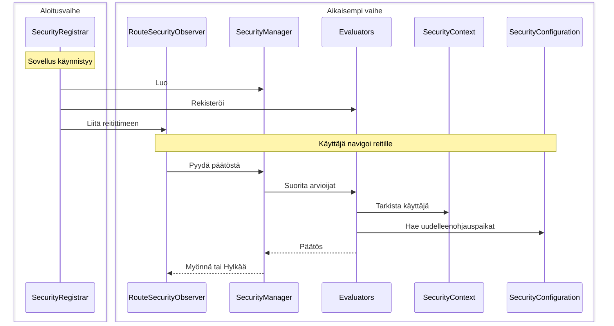

Tämä opas käy läpi täydellisen mukautetun turvallisuustoteutuksen luomisen, joka käyttää istuntopohjaista todennusta. Opit, miten neljä keskeistä rajapintaa toimivat yhdessä toteuttamalla ne alusta alkaen.

:::tip[Useimmat sovellukset voivat käyttää Spring Securityä]
[Spring Security -integraatio](/docs/security/getting-started) määrittää automaattisesti kaiken, mitä tässä on esitetty. Rakenna mukautettu turvallisuus vain, jos sinulla on erityisiä vaatimuksia tai et käytä Spring Bootia.
:::

## Mitä rakennat {#what-youll-build}

Toimiva turvallisuusjärjestelmä, jossa on neljä luokkaa:

- **SecurityConfiguration** - Määrittelee turvallisuuskäyttäytymisen ja uudelleenohjauspaikat
- **SecurityContext** - Seuraa, kuka on kirjautuneena HTTP-istuntojen avulla
- **SecurityManager** - Koordinoi turvallisuustarkastuksia ja tarjoaa kirjautumis-/uloskirjautumismahdollisuudet
- **SecurityRegistrar** - Yhdistää kaiken sovelluksen käynnistyksessä

Tässä esimerkissä käytetään istuntopohjaista tallennusta, mutta voit toteuttaa samat rajapinnat käyttämällä tietokantakyselyitä, LDAP:ia tai mitä tahansa muuta todennuspohjaa.

## Miten osat toimivat yhdessä {#how-the-pieces-work-together}


```mermaid
sequenceDiagram
  box Aloitusvaihe
  participant Registrar as SecurityRegistrar
  end
  box Aikaisempi vaihe
  participant Observer as RouteSecurityObserver
  participant Manager as SecurityManager
  participant Evaluators
  participant Context as SecurityContext
  participant Config as SecurityConfiguration
  end

  Note over Registrar: Sovellus käynnistyy
  Registrar->>Manager: Luo
  Registrar->>Evaluators: Rekisteröi
  Registrar->>Observer: Liitä reitittimeen

  Note over Observer,Config: Käyttäjä navigoi reitille
  Observer->>Manager: Pyydä päätöstä
  Manager->>Evaluators: Suorita arvioijat
  Evaluators->>Context: Tarkista käyttäjä
  Evaluators->>Config: Hae uudelleenohjauspaikat
  Evaluators-->>Manager: Päätös
  Manager-->>Observer: Myönnä tai Hylkää
```

**Virtaus:**
1. **`SecurityRegistrar`** toimii käynnistyksen aikana, luo hallitsijan, rekisteröi arvioijat ja liittää tarkkailijan
2. **`SecurityManager`** koordinoi kaiken - se antaa kontekstin ja määrityksen arvioijille
3. **`SecurityContext`** vastaa kysymykseen "Kuka on kirjautuneena?" lukemalla HTTP-istunnoista
4. **`SecurityConfiguration`** vastaa kysymykseen "Minne ohjata?" kirjautuminen ja pääsy hylätty -sivuille
5. **`Evaluators`** tekevät pääsypäätöksiä käyttämällä kontekstia ja määritystä

## Vaihe 1: Määritä turvallisuusmääritys {#step-1-define-security-configuration}

Määritys kertoo turvallisuusjärjestelmälle, miten sen tulisi toimia ja minne käyttäjät tulisi ohjata:

```java title="SecurityConfiguration.java"
package com.securityplain.security;

import com.webforj.router.history.Location;
import com.webforj.router.security.RouteSecurityConfiguration;
import java.util.Optional;

/**
 * Turvallisuusmääritys sovellukselle.
 *
 * <p>
 * Määrittelee, minne käyttäjät ohjataan, kun todennus on vaadittu tai pääsy on hylätty.
 * </p>
 */
public class SecurityConfiguration implements RouteSecurityConfiguration {

  @Override
  public boolean isEnabled() {
    return true;
  }

  @Override
  public boolean isSecureByDefault() {
    return false;
  }

  @Override
  public Optional<Location> getAuthenticationLocation() {
    return Optional.of(new Location("/login"));
  }

  @Override
  public Optional<Location> getDenyLocation() {
    return Optional.of(new Location("/access-denied"));
  }
}
```

- `isEnabled() = true` - Turvallisuus on aktiivinen
- `isSecureByDefault() = false` - Reitit ovat julkisia, ellei niitä ole merkitty (käytä `true`, jos haluat vaatia todennusta kaikilla reiteillä oletuksena)
- `/login` - Minne toteamattomat käyttäjät menevät
- `/access-denied` - Minne tunnistetut käyttäjät, joilla ei ole oikeuksia, menevät

## Vaihe 2: Toteuta turvallisuuskonteksti {#step-2-implement-security-context}

Konteksti seuraa, kuka on kirjautuneena. Tämä toteutus käyttää HTTP-istuntoja käyttäjätietojen tallentamiseen:

<!-- vale off -->

<ExpandableCode title="SecurityContext.java" language="java">

```java
package com.securityplain.security;

import com.webforj.Environment;
import com.webforj.router.security.RouteSecurityContext;
import java.util.HashMap;
import java.util.Map;
import java.util.Optional;
import java.util.Set;

/**
 * Yksinkertainen istuntopohjainen turvallisuuskonteksti.
 *
 * <p>
 * Tallentaa käyttäjän pääsyn ja roolit HTTP-istunnossa. Tämä on minimaalinen toteutus opetus
 * tarkoituksiin.
 * </p>
 */
public class SecurityContext implements RouteSecurityContext {
  private static final String SESSION_USER_KEY = "security.user";
  private static final String SESSION_ROLES_KEY = "security.roles";
  private static final String SESSION_ATTRS_KEY = "security.attributes";

  /**
   * {@inheritDoc}
   */
  @Override
  public boolean isAuthenticated() {
    return getPrincipal().isPresent();
  }

  /**
   * {@inheritDoc}
   */
  @Override
  public Optional<Object> getPrincipal() {
    return getSessionAttribute(SESSION_USER_KEY);
  }

  /**
   * {@inheritDoc}
   */
  @Override
  public boolean hasRole(String role) {
    Optional<Object> rolesObj = getSessionAttribute(SESSION_ROLES_KEY);
    if (rolesObj.isPresent() && rolesObj.get() instanceof Set) {
      @SuppressWarnings("unchecked")
      Set<String> roles = (Set<String>) rolesObj.get();
      return roles.contains(role);
    }
    return false;
  }

  /**
   * {@inheritDoc}
   */
  @Override
  public boolean hasAuthority(String authority) {
    // Tässä yksinkertaisessa toteutuksessa, valtuudet ovat samoja kuin roolit
    return hasRole(authority);
  }

  /**
   * {@inheritDoc}
   */
  @Override
  public Optional<Object> getAttribute(String name) {
    Optional<Object> attrsObj = getSessionAttribute(SESSION_ATTRS_KEY);
    if (attrsObj.isPresent() && attrsObj.get() instanceof Map) {
      @SuppressWarnings("unchecked")
      Map<String, Object> attrs = (Map<String, Object>) attrsObj.get();
      return Optional.ofNullable(attrs.get(name));
    }
    return Optional.empty();
  }

  /**
   * {@inheritDoc}
   */
  @Override
  public void setAttribute(String name, Object value) {
    Environment.ifPresent(env -> {
      env.getSessionAccessor().ifPresent(accessor -> {
        accessor.access(session -> {
          @SuppressWarnings("unchecked")
          Map<String, Object> attrs =
              (Map<String, Object>) session.getAttribute(SESSION_ATTRS_KEY);
          if (attrs == null) {
            attrs = new HashMap<>();
            session.setAttribute(SESSION_ATTRS_KEY, attrs);
          }
          attrs.put(name, value);
        });
      });
    });
  }

  private Optional<Object> getSessionAttribute(String key) {
    final Object[] result = new Object[1];
    Environment.ifPresent(env -> {
      env.getSessionAccessor().ifPresent(accessor -> {
        accessor.access(session -> {
          result[0] = session.getAttribute(key);
        });
      });
    });
    return Optional.ofNullable(result[0]);
  }
}
```

</ExpandableCode>

<!-- vale on -->

**Miten se toimii:**

- `isAuthenticated()` tarkistaa, onko käyttäjän pääsytieto olemassa istunnossa
- `getPrincipal()` palauttaa käyttäjänimen istuntoTallennuksesta
- `hasRole()` tarkistaa, sisältääkö käyttäjän roolijoukko määritetyn roolin
- `getAttribute()` / `setAttribute()` hallinnoi mukautettuja turvallisuusominaisuuksia
- `Environment.getSessionAccessor()` tarjoaa säikeen turvallisen pääsyn istuntoon

## Vaihe 3: Luo turvallisuuden hallinta {#step-3-create-security-manager}

Hallinta koordinoi turvallisuuspäätöksiä. Se laajentaa `AbstractRouteSecurityManager`-luokkaa, joka käsittelee arvioijaketjuja ja pääsyn hylkäämistä:

<!-- vale off -->

<ExpandableCode title="SecurityManager.java" language="java">

```java
package com.securityplain.security;

import com.webforj.environment.ObjectTable;
import com.webforj.environment.SessionObjectTable;
import com.webforj.router.Router;
import com.webforj.router.security.AbstractRouteSecurityManager;
import com.webforj.router.security.RouteAccessDecision;
import com.webforj.router.security.RouteSecurityConfiguration;
import com.webforj.router.security.RouteSecurityContext;

import java.util.Set;

/**
 * Yksinkertainen turvallisuuden hallinta toteutus.
 *
 * <p>
 * Tarjoaa staattisia menetelmiä sisäänkirjautumiseen/uloskirjautumiseen ja hallitsee turvallisuuskontekstiä.
 * </p>
 */
public class SecurityManager extends AbstractRouteSecurityManager {
  private static final String SESSION_USER_KEY = "security.user";
  private static final String SESSION_ROLES_KEY = "security.roles";

  /**
   * {@inheritDoc}
   */
  @Override
  public RouteSecurityConfiguration getConfiguration() {
    return new SecurityConfiguration();
  }

  /**
   * {@inheritDoc}
   */
  @Override
  public RouteSecurityContext getSecurityContext() {
    return new SecurityContext();
  }

  /**
   * Kirjaa käyttäjän sisään rooleilla.
   *
   * @param username käyttäjänimi
   * @param password salasana
   */
  public RouteAccessDecision login(String username, String password) {
    if ("user".equals(username) && "password".equals(password)) {
      Set<String> roles = Set.of("USER");
      persistUser(username, roles);
      return RouteAccessDecision.grant();
    } else if ("admin".equals(username) && "admin".equals(password)) {
      Set<String> roles = Set.of("USER", "ADMIN");
      persistUser(username, roles);
      return RouteAccessDecision.grant();
    }

    return RouteAccessDecision.deny("Virheellinen käyttäjänimi tai salasana");
  }

  /**
   * Kirjaa ulos nykyisen käyttäjän ja ohjaa kirjautumissivulle.
   */
  public void logout() {
    SessionObjectTable.clear(SESSION_USER_KEY);
    SessionObjectTable.clear(SESSION_ROLES_KEY);

    Router router = Router.getCurrent();
    if (router != null) {
      getConfiguration().getAuthenticationLocation().ifPresent(location -> router.navigate(location));
    }
  }

  /**
   * Hanki nykyinen hallinta-instanssi.
   *
   * @return nykyinen hallinta-instanssi
   */
  public static SecurityManager getCurrent() {
    String key = SecurityManager.class.getName();
    if (ObjectTable.contains(key)) {
      return (SecurityManager) ObjectTable.get(key);
    }

    SecurityManager instance = new SecurityManager();
    ObjectTable.put(key, instance);

    return instance;
  }

  void saveCurrent(SecurityManager manager) {
    String key = SecurityManager.class.getName();
    ObjectTable.put(key, manager);
  }

  private void persistUser(String username, Set<String> roles) {
    SessionObjectTable.put(SESSION_USER_KEY, username);
    SessionObjectTable.put(SESSION_ROLES_KEY, roles);
  }
}
```

</ExpandableCode>

<!-- vale on -->

**Miten se toimii:**

- Laajentaa `AbstractRouteSecurityManager` saadakseen arvioijaketjun logiikan
- Tarjoaa `getConfiguration()` ja `getSecurityContext()` toteutukset
- Lisää `login()` autentikoimaan käyttäjiä ja tallentamaan todennustiedot istuntoon
- Lisää `logout()` tyhjentämään istunnon ja ohjaamaan kirjautumissivulle
- Käyttää [`SessionObjectTable`](/docs/advanced/object-string-tables#sessionobjecttable) yksinkertaiseen istuntotallennukseen
- Tallentaa itsensä [`ObjectTable`](/docs/advanced/object-string-tables#objecttable) sovelluksen laajuiseen käyttöön

## Vaihe 4: Yhdistä kaikki käynnistyksessä {#step-4-wire-everything-at-startup}

Rekisteröijä yhdistää kaikki osat sovelluksen käynnistyessä:

```java title="SecurityRegistrar.java"
package com.securityplain.security;

import com.webforj.App;
import com.webforj.AppLifecycleListener;
import com.webforj.annotation.AppListenerPriority;
import com.webforj.router.Router;
import com.webforj.router.security.RouteSecurityObserver;
import com.webforj.router.security.evaluator.AnonymousAccessEvaluator;
import com.webforj.router.security.evaluator.DenyAllEvaluator;
import com.webforj.router.security.evaluator.PermitAllEvaluator;
import com.webforj.router.security.evaluator.RolesAllowedEvaluator;

/**
 * Rekisteröi reitin turvallisuuskomponentit sovelluksen käynnistyksen aikana.
 *
 * <p>
 * Määrittelee turvallisuuden hallinnan ja arvioijat reitittimen kanssa.
 * </p>
 */
@AppListenerPriority(1)
public class SecurityRegistrar implements AppLifecycleListener {

  /**
   * {@inheritDoc}
   */
  @Override
  public void onWillRun(App app) {
    // Luo turvallisuuden hallinta
    SecurityManager securityManager = new SecurityManager();
    securityManager.saveCurrent(securityManager);

    // Rekisteröi sisäänrakennetut arvioijat prioriteetti järjestyksessä
    securityManager.registerEvaluator(new DenyAllEvaluator(), 0);
    securityManager.registerEvaluator(new AnonymousAccessEvaluator(), 1);
    securityManager.registerEvaluator(new PermitAllEvaluator(), 2);
    securityManager.registerEvaluator(new RolesAllowedEvaluator(), 3);

    // Luo turvallisuustarkkailija ja liitä se reitittimeen
    RouteSecurityObserver securityObserver = new RouteSecurityObserver(securityManager);
    Router router = Router.getCurrent();
    if (router != null) {
      router.getRenderer().addObserver(securityObserver);
    }
  }
}
```

**Rekisteröi kuuntelija:**

Luo `src/main/resources/META-INF/services/com.webforj.AppLifecycleListener` seuraavalla sisällöllä:

```text
com.securityplain.security.SecurityRegistrar
```

Tämä rekisteröi sinun [`AppLifecycleListener`](/docs/advanced/lifecycle-listeners), jotta se toimii sovelluksen käynnistyksessä.

**Miten se toimii:**

- Toimii varhain (`@AppListenerPriority(1)`) määrittämään turvallisuuden ennen reittien lataamista
- Luo turvallisuuden hallinnan ja tallentaa sen globaalisti
- Rekisteröi sisäänrakennetut arvioijat prioriteetti järjestyksessä (alhaisemmat numerot suoritetaan ensin)
- Luo tarkkailijan, joka keskeyttää navigoinnin
- Liittää tarkkailijan reitittimeen siten, että turvallisuustarkastukset tapahtuvat automaattisesti

Kun tämä on suoritettu, turvallisuus on aktivoitu kaikelle navigoinnille.

## Toteuttamisesi käyttäminen {#using-your-implementation}

### Luo kirjautumissivu {#create-a-login-view}

Seuraava näkymä käyttää [`Login`](/docs/components/login) -komponenttia.

```java title="LoginView.java"
package com.securityplain.views;

import com.securityplain.security.SecurityManager;
import com.webforj.component.Composite;
import com.webforj.component.login.Login;
import com.webforj.router.Router;
import com.webforj.router.annotation.FrameTitle;
import com.webforj.router.annotation.Route;
import com.webforj.router.history.Location;
import com.webforj.router.security.annotation.AnonymousAccess;

@Route("/login")
@FrameTitle("Kirjautuminen")
@AnonymousAccess
public class LoginView extends Composite<Login> {
  private final Login self = getBoundComponent();

  public LoginView() {
    self.onSubmit(e -> {
      var result = SecurityManager.getCurrent().login(
        e.getUsername(), e.getPassword()
      );

      if (result.isGranted()) {
        Router.getCurrent().navigate(new Location("/"));
      } else {
        self.setError(true);
        self.setEnabled(true);
      }
    });

    self.whenAttached().thenAccept(c -> self.open());
  }
}
```
