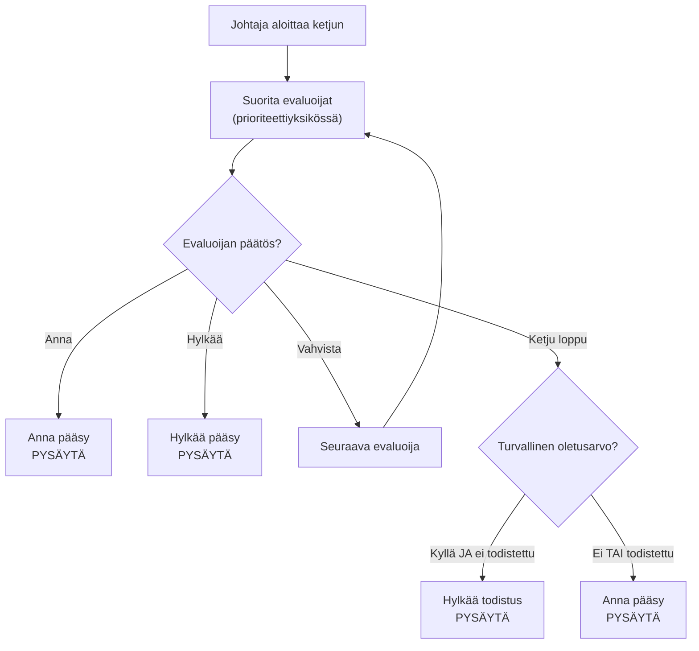

Evaluointiketju on webforJ:n turvallisuusjärjestelmän sydän. Se on prioriteettijärjestyksessä oleva evaluoijien sekvenssi, joka tutkii reittejä ja tekee pääsypäätöksiä vastuuketjun suunnittelumallin avulla. Ymmärtämällä, miten ketju toimii, voit luoda mukautettuja evaluoijia ja ratkaista odottamattomia pääsyn estämisiä.

## Vastuuketjun malli {#the-chain-of-responsibility-pattern}

Evaluointiketju käyttää vastuuketjun mallia, jossa jokainen sekvenssin evaluoija voi joko käsitellä navigointipyyntöä tai siirtää sen seuraavalle evaluoijalle. Tämä luo järjestelmän, jossa turvallisuuslogiikka on hajautettu useille erikoistuneille evaluoijille sen sijaan, että se olisi keskitetty yhteen monoliittiseen tarkistajaan.

Kun reittiä on arvioitava, turvallisuusjohtaja luo ketjun ja aloittaa sen ensimmäisestä evaluoijasta. Tämä evaluoija tarkastaa reitin ja tekee yhden kolmena vaihtoehtona:

1. **Anna käyttöoikeus:** Evaluoija hyväksyy reitin ja palaa heti. Ei muita evaluoijia suoriteta.
2. **Hylkää käyttöoikeus:** Evaluoija estää reitin ja palaa heti. Ei muita evaluoijia suoriteta.
3. **Vahvista:** Evaluoija ei tee päätöstä ja kutsuu `chain.evaluate()` siirtääkseen kontrollin seuraavalle evaluoijalle.

Tämä malli mahdollistaa evaluoijien keskittymisen erityistapauksiin. Jokainen evaluoija toteuttaa `supports(Class<?> routeClass)` ilmoittaakseen, mitkä reitit se käsittelee. Esimerkiksi `AnonymousAccessEvaluator` suoritetaan vain reiteille, jotka on merkitty `@AnonymousAccess`, ja johtaja ei koskaan kutsu sitä muille reiteille.

## Kuinka ketju rakennetaan {#how-the-chain-is-built}

Turvallisuusjohtaja ylläpitää rekisteröityjen evaluoijien luetteloa, joilla on liittyvä prioriteetti. Kun reittiä on arvioitava, johtaja lajittelee evaluoijat prioriteetin mukaan (pienemmät numerot ensin) ja luo ketjun.

Evaluoijat rekisteröidään johtajan `registerEvaluator()`-menetelmällä:

```java
// Rekisteröi sisäänrakennetut evaluoijat
securityManager.registerEvaluator(new DenyAllEvaluator(), 0);
securityManager.registerEvaluator(new AnonymousAccessEvaluator(), 1);
securityManager.registerEvaluator(new PermitAllEvaluator(), 2);
securityManager.registerEvaluator(new RolesAllowedEvaluator(), 3);

// Rekisteröi mukautetut evaluoijat
securityManager.registerEvaluator(new SubscriptionEvaluator(), 10);
```

Prioriteetti määrittää arviointijärjestyksen. Pienemmät prioriteetit suoritetaan ensin, jolloin niillä on ensimmäinen mahdollisuus tehdä pääsypäätöksiä. Tämä on tärkeää turvallisuuden kannalta, koska se mahdollistaa kriittisten evaluoijien estää pääsy ennen kuin sallivat evaluoijat voivat sallia sen.

Ketju on tilaton ja luodaan uudelleen jokaiselle navigointipyynnölle niin, ettei yhden navigoinnin arviointi vaikuta toiseen.

## Ketjun suoritusvirta {#chain-execution-flow}

Kun ketju alkaa, se alkaa ensimmäisestä evaluoijasta (matala prioriteetti) ja etenee kysymykseen:



Ketju pysähtyy heti, kun jokin evaluoija myöntää tai hylkää pääsyn. Jos kaikki evaluoijat vahvistavat, ketju loppuu ja siirtyy oletusarvoiseen turvallisuus käyttäytymiseen.

## Sisäänrakennettujen evaluoijien järjestys {#built-in-evaluator-ordering}

Neljä sisäänrakennettua evaluoijaa käsittelee standardinotaatioita:

| Evaluoija | Annotaatiot | Käyttäytyminen | Ketjun käyttäytyminen | Tyypillinen järjestys |
|-----------|------------|----------|----------------|---------------|
| `DenyAllEvaluator` | `@DenyAll` | Estää aina pääsyn | Pysäyttää ketjun (terminaalinen) | Suoritetaan ensimmäisenä |
| `AnonymousAccessEvaluator` | `@AnonymousAccess` | Sallii kaikille (todistettu tai ei) | Pysäyttää ketjun (terminaalinen) | Suoritetaan aikaisin |
| `PermitAllEvaluator` | `@PermitAll` | Vaatii todistusta, sallii kaikki todistetut käyttäjät | Pysäyttää ketjun (terminaalinen) | Suoritetaan keskivaiheilla |
| `RolesAllowedEvaluator` | `@RolesAllowed` | Vaatii todistusta ja tietyn roolin | **Jatkaa ketjua** (koostettavissa) | Suoritetaan myöhemmin |

:::note
Tarkat prioriteettinumerot määritellään evaluoijien rekisteröinnin aikana ja ne vaihtelevat toteutusten välillä. Katso [Spring Security](/docs/security/getting-started) tai [Mukautettu toteutus](/docs/security/architecture/custom-implementation) saadaksesi tarkkoja arvoja.
:::

## Kuinka evaluoijat delegoivat {#how-evaluators-delegate}

Ennen evaluoijan kutsumista johtaja kutsuu sen `supports(Class<?> routeClass)`-menetelmää. Vain evaluoijat, jotka palauttavat `true`, kutsutaan. Tämä suodatus pakottaa evaluoijat suorittamaan vain reiteille, joita ne on suunniteltu käsittelemään.

Kun evaluoija kutsutaan, se voi joko:
- **Tehdä päätöksen:** Palauttaa myönteiset tai kielteiset pysäyttääkseen ketjun
- **Delegoida:** Kutsua `chain.evaluate()` siirtääkseen kontrollin seuraavalle evaluoijalle prioriteettijärjestyksessä

Esimerkiksi `RolesAllowedEvaluator` tarkistaa, onko käyttäjällä vaadittu rooli. Jos on, se kutsuu `chain.evaluate()` salliakseen ylimpien prioriteettien evaluoijien tehdä lisätarkistuksia. Tämä aktiivinen delegointi mahdollistaa evaluoijien koostamisen.

Terminaaliset evaluoijat kuten `PermitAllEvaluator` tekevät lopulliset päätökset ilman ketjun kutsumista, estäen lisäarvioinnin.

## Kun ketju loppuu {#when-the-chain-exhausts}

Jos jokainen evaluoija delegoi eikä kukaan tee päätöstä, ketju loppuu, eikä enää ole evaluoijia suoritettavana. Tällöin turvallisuusjärjestelmä soveltaa varalle jäävää toimintatapaa perustuen `isSecureByDefault()`-konfigurointiin:

**Oletuksena turvallinen käytössä** (`isSecureByDefault() == true`):
- Jos käyttäjä on kirjautunut sisään: Anna pääsy
- Jos käyttäjä ei ole kirjautunut: Hylkää ja vaadi todistus

**Oletuksena turvallinen ei käytössä** (`isSecureByDefault() == false`):
- Anna pääsy riippumatta todistuksesta

Reitit, joilla ei ole turvallisuusnotaatiota, toimivat silti määriteltyjen käyttäytymiset. Oletuksena turvallinen käytössä, ilman annotaatioita olevat reitit vaativat todistuksen. Sen ollessa ei käytössä, ilman annotaatioita olevat reitit ovat julkisia.

## Mukautettujen evaluoijien prioriteetit {#custom-evaluator-priorities}

Luoessasi mukautettuja evaluoijia valitse prioriteetit huolellisesti:

- **0-9**: Varattuja ydinraamisunyä evaluoijille. Vältä näiden prioriteettien käyttöä, ellei korvata sisäänrakennettuja evaluoijia.
- **10-99**: Suositeltu mukautettujen liiketoimintalogiikan evaluoijille. Nämä suoritetaan ydin evaluoijien jälkeen mutta ennen yleisiä varareittejä.

Esimerkki:

```java title="SubscriptionEvaluator.java"
// Mukautettu evaluoija tilausten pohjalta
@RegisteredEvaluator(priority = 10)
public class SubscriptionEvaluator implements RouteSecurityEvaluator {
  @Override
  public boolean supports(Class<?> routeClass) {
    return routeClass.isAnnotationPresent(RequiresSubscription.class);
  }

  @Override
  public RouteAccessDecision evaluate(Class<?> routeClass,
                                       NavigationContext context,
                                       RouteSecurityContext securityContext,
                                       SecurityEvaluatorChain chain) {
    // Tarkista, onko käyttäjällä aktiivinen tilaus
    boolean hasSubscription = checkSubscription(securityContext);

    if (!hasSubscription) {
      return RouteAccessDecision.deny("Aktiivinen tilaus vaaditaan");
    }

    // Käyttäjällä on tilaus - jatka ketjua lisätarkistuksia varten
    return chain.evaluate(routeClass, context, securityContext);
  }
}
```

Tämä evaluoija toimii prioriteetilla 10, ydin evaluoijien jälkeen. Jos käyttäjällä on aktiivinen tilaus, se delegoi ketjulle, mikä mahdollistaa koostumisen muiden evaluoijien kanssa.

## Evaluoinnin koostaminen {#evaluator-composition}

Useimmat sisäänrakennetut evaluoijat ovat **terminaalisia**, ne tekevät lopullisen päätöksen ja pysäyttävät ketjun. Vain `RolesAllowedEvaluator` jatkaa ketjua pääsyn myöntämisen jälkeen, sallien koostamisen mukautettujen evaluoijien kanssa.

**Terminaaliset evaluoijat (eivät voi olla koottuja):**
- `@DenyAll`: Estää aina, pysäyttää ketjun
- `@AnonymousAccess`: Sallii aina, pysäyttää ketjun
- `@PermitAll`: Sallii todistettuille käyttäjille, pysäyttää ketjun

**Koostettavat evaluoijat:**
- `@RolesAllowed`: Jos käyttäjällä on rooli, **jatkaa ketjua** lisätarkistuksia varten

### Koostuminen, joka toimii {#composition-that-works}

Voit koostaa `@RolesAllowed` mukautettujen evaluoijien kanssa:

```java
@Route("/premium-admin")
@RolesAllowed("ADMIN")  // Tarkistaa roolin, sitten jatkaa ketjua
@RequiresSubscription   // Mukautettu tarkistus suoritetaan roolitarkistuksen jälkeen
public class PremiumAdminView extends Composite<Div> {
  // Vaatii ADMIN roolia JA aktiivisen tilauksen
}
```

Virta:
1. `RolesAllowedEvaluator` tarkistaa, onko käyttäjällä `ADMIN`-rooli
2. Jos on, kutsuu `chain.evaluate()` jatkaakseen
3. `SubscriptionEvaluator` tarkistaa tilauksen tilan (suoritetaan myöhemmin ketjussa)
4. Jos tilaus on aktiivinen, myönnetään pääsy; muuten hylätään

### Koostuminen, joka ei toimi {#composition-that-does-not-work}

Et voi yhdistää `@PermitAll` muita evaluoijia, koska se pysäyttää ketjun:

```java
@Route("/wrong")
@PermitAll           // Sallii heti, pysäyttää ketjun
@RolesAllowed("ADMIN")  // EI KOSKAAN suorita!
public class WrongView extends Composite<Div> {
  // Tämä sallii pääsyn KENEEN tahansa todistettuun käyttäjään
  // @RolesAllowed -tarkistus ohitetaan
}
```

`PermitAllEvaluator` suoritetaan ensin (rekisteröity alhaisemman prioriteetin mukaan), myöntää pääsyn kaikille todistetuille käyttäjille ja palaa ilman, että kutsuu `chain.evaluate()`. `RolesAllowedEvaluator` ei koskaan suoriteta.
