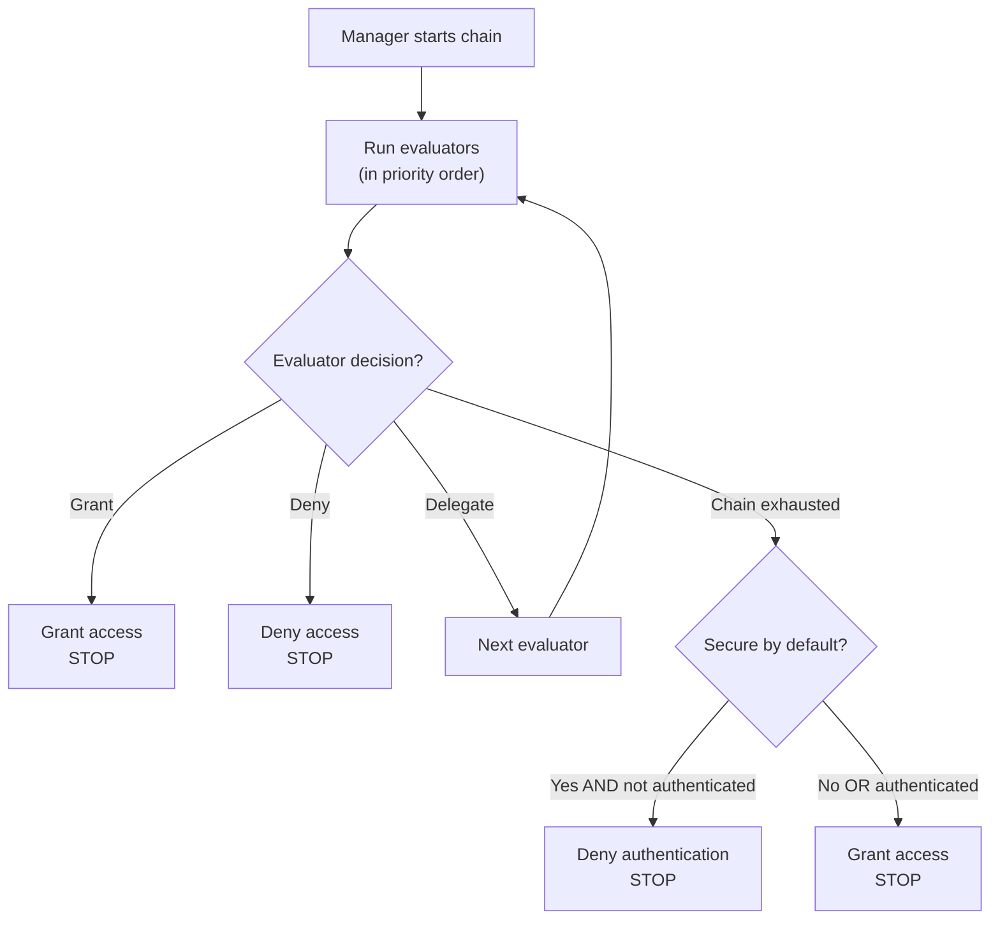

Arviointiketju on webforJ:n turvallisuusjärjestelmän sydän. Se on prioriteettijärjestyksessä oleva arvioijien sekvenssi, joka tutkii reittejä ja tekee pääsypäätöksiä vastuuketjun suunnittelumallia käyttäen. Ymmärtäminen siitä, miten ketju toimii, auttaa sinua luomaan mukautettuja arvioijia ja ratkaisemaan odottamattomia pääsyn kieltämiä.

## Vastuuketjun malli {#the-chain-of-responsibility-pattern}

Arviointiketju käyttää vastuuketjun mallia, jossa jokainen sekvenssin arvioija voi joko käsitellä navigointipyyntöä tai siirtää sen seuraavalle arvioijalle. Tämä luo järjestelmän, jossa turvallisuuslogiikka on hajautettu useiden erikoistuneiden arvioijien kesken eikä keskittynyt yhteen monoliittiseen tarkistimeen.

Kun reitti tarvitsee arviointia, turvallisuusmanageri luo ketjun ja aloittaa sen ensimmäisestä arvioijasta. Tämä arvioija tutkii reittiä ja tekee yhden kolmesta valinnasta:

1. **Myönnä pääsy:** Arvioija hyväksyy reitin ja palaa heti. Ei muita arvioijia käynnistettä.
2. **Kieltä pääsy:** Arvioija estää reitin ja palaa heti. Ei muita arvioijia käynnistettä.
3. **Delegoi:** Arvioija ei tee päätöstä ja kutsuu `chain.evaluate()` siirtääkseen ohjauksen seuraavalle arvioijalle.

Tämä malli mahdollistaa arvioijien keskittymisen spesifisiin tapauksiin. Jokainen arvioija toteuttaa `supports(Class<?> routeClass)` osoittaakseen, mitkä reitit se käsittelee. Esimerkiksi `AnonymousAccessEvaluator` toimii vain reiteille, jotka on merkitty merkinnällä `@AnonymousAccess`, ja manageri ei koskaan kutsu sitä muille reiteille.

## Kuinka ketju rakennetaan {#how-the-chain-is-built}

Turvallisuusmanageri ylläpitää rekisteröityjen arvioijien luetteloa, jokaisella on liitetty prioriteetti. Kun reitti tarvitsee arviointia, manageri lajittelee arvioijat prioriteetin mukaan (alemmat numerot ensin) ja luo ketjun.

Arvioijat rekisteröidään managerin `registerEvaluator()`-menetelmällä:

```java
// Rekisteröi sisäänrakennetut arvioijat
securityManager.registerEvaluator(new DenyAllEvaluator(), 0);
securityManager.registerEvaluator(new AnonymousAccessEvaluator(), 1);
securityManager.registerEvaluator(new PermitAllEvaluator(), 2);
securityManager.registerEvaluator(new RolesAllowedEvaluator(), 3);

// Rekisteröi mukautetut arvioijat
securityManager.registerEvaluator(new SubscriptionEvaluator(), 10);
```

Prioriteetti määrittää arviointijärjestyksen. Alhaisemmat prioriteetit käynnistyvät ensin, mikä antaa niille ensimmäisen mahdollisuuden tehdä pääsypäätöksiä. Tämä on tärkeää turvallisuuden kannalta, sillä se mahdollistaa kriittisten arvioijien estää pääsy ennen kuin sallivat arvioijat voivat myöntää sen.

Ketju on tilaton ja luodaan tuoreena jokaiselle navigointipyyntöä varten, jotta yhden navigoinnin arviointi ei vaikuta toiseen.

## Ketjun suorituksen virtaus {#chain-execution-flow}

Kun ketju käynnistyy, se alkaa ensimmäisestä arvioijasta (alhaisin prioriteetti) ja etenee peräkkäin:



Ketju pysähtyy heti, kun jokin arvioija myöntää tai kieltää pääsyn. Jos kaikki arvioijat delegoivat, ketju ehtyy ja siirtyy turvallisuus oletusarvoisesti -käyttäytymiseen.

## Sisäänrakennettujen arvioijien järjestys {#built-in-evaluator-ordering}

Neljä sisäänrakennettua arvioijaa käsittelee standardimerkintöjä:

| Arvioija | Merkintä | Käyttäytyminen | Ketjun käyttäytyminen | Tyypillinen järjestys |
|-----------|------------|----------|----------------|---------------|
| `DenyAllEvaluator` | `@DenyAll` | Estää aina pääsyn | Pysäyttää ketjun (terminaalinen) | Käynnistyy ensimmäisenä |
| `AnonymousAccessEvaluator` | `@AnonymousAccess` | Sallii kaikille (todennettu tai ei) | Pysäyttää ketjun (terminaalinen) | Käynnistyy aikaisin |
| `PermitAllEvaluator` | `@PermitAll` | Vaatii todennuksen, sallii kaikki todennetut käyttäjät | Pysäyttää ketjun (terminaalinen) | Käynnistyy ketjun keskivaiheilla |
| `RolesAllowedEvaluator` | `@RolesAllowed` | Vaatii todennuksen ja erityisen roolin | **Jatkaa ketjua** (koostettava) | Käynnistyy myöhemmin |

:::note
Tarkat prioriteettinumerot määritetään arvioijien rekisteröinnin aikana ja ne vaihtelevat toteutuksittain. Katso [Spring Security](/docs/security/getting-started) tai [Mukautettu toteutus](/docs/security/architecture/custom-implementation#securityregistrar) saadaksesi tarkat arvot.
:::

## Kuinka arvioijat delegoivat {#how-evaluators-delegate}

Ennen arvioijan kutsumista manageri kutsuu sen `supports(Class<?> routeClass)`-menetelmää. Vain arvioijat, jotka palauttavat `true`, kutsutaan. Tämä suodatus pakottaa arvioijat toimimaan vain reiteille, joita ne on suunniteltu käsittelemään.

Kun arvioija kutsutaan, se voi joko:
- **Tehdä päätös:** Palauttaa myönnön tai kielon pysäyttääkseen ketjun
- **Delegoi:** Kutsua `chain.evaluate()` siirtääkseen ohjauksen seuraavalle arvioijalle prioriteettijärjestyksessä

Esimerkiksi `RolesAllowedEvaluator` tarkistaa, onko käyttäjällä vaadittu rooli. Jos on, se kutsuu `chain.evaluate()` salliakseen lisätarkastuksia korkeampiprioriteettisilta arvioijoilta. Tämä aktiivinen delegointi mahdollistaa arvioijien koostamisen.

Terminatiiviset arvioijat, kuten `PermitAllEvaluator`, tekevät lopullisia päätöksiä ilman, että ketjua kutsutaan, estäen edelleen arvioinnin.

## Kun ketju ehtyy {#when-the-chain-exhausts}

Jos jokainen arvioija delegoi eikä kukaan tee päätöstä, ketju ehtyy, eikä enää arvioijia ole suoritettavana. Tässä vaiheessa turvallisuusjärjestelmä soveltaa varautumista `isSecureByDefault()`-kokoonpanon mukaan:

**Oletusarvoisesti turvallinen päällä** (`isSecureByDefault() == true`):
- Jos käyttäjä on todennettu: Myönnä pääsy
- Jos käyttäjä ei ole todennettu: Kieltä todennus vaaditaan

**Oletusarvoisesti turvallinen pois päältä** (`isSecureByDefault() == false`):
- Myönnä pääsy riippumatta todennuksesta

Reiteillä, joilla ei ole turvallisuusmerkkauksia, on silti määritelty käyttäytyminen. Kun oletusarvoisesti turvallinen on päällä, merkitsemättömät reitit vaativat todennuksen. Kun se on pois päältä, merkitsemättömät reitit ovat julkisia.

## Mukautettujen arvioijien prioriteetit {#custom-evaluator-priorities}

Kun luot mukautettuja arvioijia, valitse prioriteetit huolellisesti:

- **0-9**: Varattu ydinkehysarvioijille. Vältä näiden prioriteettien käyttöä, ellei tarkoituksena ole korvata sisäänrakennettuja arvioijia.
- **10-99**: Suositeltu mukautetuille liiketoimintalogikka-arvioijille. Nämä toimivat ydin arvioijien jälkeen, mutta ennen yleisiä varautumisia.

Esimerkki:

```java title="SubscriptionEvaluator.java"
// Mukautettu arvioija tilaustyyppiselle pääsylle
@RegisteredEvaluator(priority = 10)
public class SubscriptionEvaluator implements RouteSecurityEvaluator {
  @Override
  public boolean supports(Class<?> routeClass) {
    return routeClass.isAnnotationPresent(RequiresSubscription.class);
  }

  @Override
  public RouteAccessDecision evaluate(Class<?> routeClass,
                                       NavigationContext context,
                                       RouteSecurityContext securityContext,
                                       SecurityEvaluatorChain chain) {
    // Tarkista, onko käyttäjällä aktiivinen tilaus
    boolean hasSubscription = checkSubscription(securityContext);

    if (!hasSubscription) {
      return RouteAccessDecision.deny("Aktiivinen tilaus vaaditaan");
    }

    // Käyttäjällä on tilaus - jatka ketjua lisätarkistuksia varten
    return chain.evaluate(routeClass, context, securityContext);
  }
}
```

Tämä arvioija toimii prioriteetilla 10, ydin arvioijien jälkeen. Jos käyttäjällä on aktiivinen tilaus, se delegoi ketjulle, salliakseen koostamisen muiden arvioijien kanssa.

## Arvioijien koostaminen {#evaluator-composition}

Useimmat sisäänrakennetut arvioijat ovat **terminaalisia**, ne tekevät lopullisen päätöksen ja pysäyttävät ketjun. Vain `RolesAllowedEvaluator` jatkaa ketjua pääsyn myöntämisen jälkeen, jolloin se mahdollistaa koostamisen mukautettujen arvioijien kanssa.

**Terminatiiviset arvioijat (eivät voi olla koostettu):**
- `@DenyAll`: Aina kieltää, pysäyttää ketjun
- `@AnonymousAccess`: Aina myöntää, pysäyttää ketjun
- `@PermitAll`: Myöntää todennetuille käyttäjille, pysäyttää ketjun

**Koostettavat arvioijat:**
- `@RolesAllowed`: Jos käyttäjällä on rooli, **jatkaa ketjua** salliakseen lisätarkistukset

### Toimiva koostaminen {#composition-that-works}

Voit koostaa `@RolesAllowed` mukautettujen arvioijien kanssa:

```java
@Route("/premium-admin")
@RolesAllowed("ADMIN")  // Tarkistaa roolin, sitten jatkaa ketjua
@RequiresSubscription   // Mukautettu tarkistus toimii roolitarkistuksen jälkeen
public class PremiumAdminView extends Composite<Div> {
  // Vaatii ADMIN-roolin JA aktiivisen tilauksen
}
```

Virtaus:
1. `RolesAllowedEvaluator` tarkistaa, onko käyttäjällä `ADMIN`-rooli
2. Jos on, kutsuu `chain.evaluate()` jatkaakseen
3. `SubscriptionEvaluator` tarkistaa tilauksen tilan (toimii myöhemmin ketjussa)
4. Jos tilaus on aktiivinen, myönnetään pääsy; muuten kielletään

### Ei-toimiva koostaminen {#composition-that-does-not-work}

Et voi yhdistää `@PermitAll` muiden arvioijien kanssa, koska se pysäyttää ketjun:

```java
@Route("/wrong")
@PermitAll           // Myöntää heti, pysäyttää ketjun
@RolesAllowed("ADMIN")  // EI KOSKAAN suoritetaan!
public class WrongView extends Composite<Div> {
  // Tämä myöntää pääsyn KENELLE VAIN todennetulle käyttäjälle
  // @RolesAllowed jätetään huomiotta
}
```

`PermitAllEvaluator` toimii ensin (rekisteröity alhaisemmalla prioriteetilla), myöntää pääsyn kaikille todennetuille käyttäjille, ja palaa ilman, että `chain.evaluate()` kutsutaan. `RolesAllowedEvaluator` ei koskaan suoriteta.
