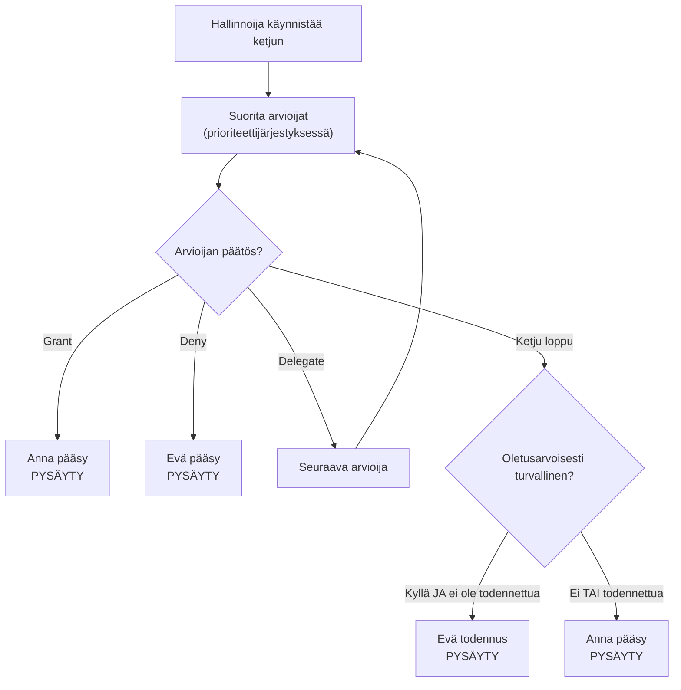

Evaluointiketju on webforJ:n tietoturvajärjestelmän sydän. Se on priorisoitu arvioijien sekvenssi, joka tutkii reittejä ja tekee pääsypäätöksiä vastuuketjun suunnittelumallin avulla. Ymmärtämällä, miten ketju toimii, voit luoda mukautettuja arvioijia ja ratkaista odottamattomia pääsyn evätyksiä.

## Vastuuketjun malli {#the-chain-of-responsibility-pattern}

Evaluointiketju hyödyntää vastuuketjun mallia, jossa jokainen sekvenssin arvioija voi joko käsitellä navigointipyyntöä tai siirtää sen seuraavalle arvioijalle. Tämä luo järjestelmän, jossa tietoturvalogiikka on hajautettu useiden erikoistuneiden arvioijien kesken sen sijaan, että se olisi keskitetty yhteen monoliittiseen tarkistimeen.

Kun reittiä on arvioitava, tietoturvajohtaja luo ketjun ja käynnistää sen ensimmäisestä arvioijasta. Tämä arvioija tutkii reitin ja tekee yhden kolmesta valinnasta:

1. **Anna pääsy:** Arvioija hyväksyy reitin ja palauttaa sen heti. Tallentamattomia arvioijia ei suorita.
2. **Evä pääsy:** Arvioija estää reitin ja palauttaa sen heti. Tallentamattomia arvioijia ei suorita.
3. **Delegoi:** Arvioija ei tee päätöstä ja kutsuu `chain.evaluate()`, jotta se siirtää hallinnan seuraavalle arvioijalle.

Tämä malli mahdollistaa arvioijien keskittymisen erityisiin tapauksiin. Jokainen arvioija toteuttaa `supports(Class<?> routeClass)` ilmoittaakseen, mitkä reitit se käsittelee. Esimerkiksi `AnonymousAccessEvaluator` suoritetaan vain reiteille, joilla on `@AnonymousAccess`, eikä hallinnoija koskaan kutsu sitä muihin reitteihin.

## Kuinka ketju rakennetaan {#how-the-chain-is-built}

Tietoturvajohtaja ylläpitää luetteloa rekisteröidyistä arvioijista, joilla on kullekin liittyvä prioriteetti. Kun reitti tarvitsee arviointia, johtaja järjestää arvioijat prioriteetin mukaan (matalimmat numerot ensin) ja luo ketjun.

Arvioijat rekisteröidään hallinnoijan `registerEvaluator()`-menetelmällä:

```java
// Rekisteröi sisäänrakennetut arvioijat
securityManager.registerEvaluator(new DenyAllEvaluator(), 0);
securityManager.registerEvaluator(new AnonymousAccessEvaluator(), 1);
securityManager.registerEvaluator(new PermitAllEvaluator(), 2);
securityManager.registerEvaluator(new RolesAllowedEvaluator(), 3);

// Rekisteröi mukautetut arvioijat
securityManager.registerEvaluator(new SubscriptionEvaluator(), 10);
```

Prioriteetti määrittää arviointijärjestyksen. Matalammat prioriteetit suoritetaan ensin, jolloin niillä on ensisijainen mahdollisuus tehdä pääsypäätöksiä. Tämä on tärkeää tietoturvan kannalta, koska se mahdollistaa kriittisten arvioijien estää pääsyn ennen kuin sallivat arvioijat voivat myöntää sen.

Ketju on tilaton ja luodaan uudelleen jokaiselle navigointipyyntöön, jotta yhden navigoinnin arviointi ei vaikuta toiseen.

## Ketjun suoritusprosessi {#chain-execution-flow}

Kun ketju alkaa, se alkaa ensimmäisestä arvioijasta (matalin prioriteetti) ja etenee järjestyksessä:


```mermaid
flowchart TD
  Start["Hallinnoija käynnistää ketjun"] --> Eval["Suorita arvioijat<br/>(prioriteettijärjestyksessä)"]

  Eval --> Check{"Arvioijan päätös?"}
  Check -->|Grant| Grant["Anna pääsy<br/>PYSÄYTY"]
  Check -->|Deny| Deny["Evä pääsy<br/>PYSÄYTY"]
  Check -->|Delegate| Next["Seuraava arvioija"]

  Next --> Eval

  Check -->|Ketju loppu| Default{"Oletusarvoisesti turvallinen?"}
  Default -->|Kyllä JA ei ole todennettua| DenyDefault["Evä todennus<br/>PYSÄYTY"]
  Default -->|Ei TAI todennettua| GrantDefault["Anna pääsy<br/>PYSÄYTY"]
```

Ketju pysähtyy heti, kun mikä tahansa arvioija myöntää tai evää pääsyn. Jos kaikki arvioijat delegoivat, ketju loppuu ja palaa oletusarvoisesti turvalliseen käyttäytymiseen.

## Sisäänrakennettujen arvioijien järjestys {#built-in-evaluator-ordering}

Neljä sisäänrakennettua arvioijaa käsittelee vakio-annotaatioita:

| Arvioija | Annoitus | Käyttäytyminen | Ketjun käyttäytyminen | Tyypillinen järjestys |
|----------|----------|----------------|----------------------|----------------------|
| `DenyAllEvaluator` | `@DenyAll` | Aina estää pääsyn | Pysäyttää ketjun (terminaalinen) | Suoritetaan ensin |
| `AnonymousAccessEvaluator` | `@AnonymousAccess` | Sallii kaikille (todennettu tai ei) | Pysäyttää ketjun (terminaalinen) | Suoritetaan aikaisin |
| `PermitAllEvaluator` | `@PermitAll` | Vaatimuksena todennus, sallii kaikki todennetut käyttäjät | Pysäyttää ketjun (terminaalinen) | Suoritetaan ketjun keskivaiheilla |
| `RolesAllowedEvaluator` | `@RolesAllowed` | Vaatimuksena todennus ja erityinen rooli | **Jatkaa ketjua** (koostettavissa) | Suoritetaan myöhemmin |

:::note
Tarkat prioriteettinumerot määritellään arvioijien rekisteröinnin aikana ja ne vaihtelevat toteutusten välillä. Katso [Spring Security](/docs/security/getting-started) tai [Mukautettu toteutus](/docs/security/architecture/custom-implementation) tarkkoja arvoja varten.
:::

## Kuinka arvioijat delegoivat {#how-evaluators-delegate}

Ennen arvioijan kutsumista hallinnoija kutsuu sen `supports(Class<?> routeClass)`-menetelmää. Vain arvioijat, jotka palauttavat `true`, kutsutaan. Tämä suodatus pakottaa arvioijat suorittamaan vain niille suunnitelluissa reiteissä.

Kun arvioija kutsutaan, se voi joko:
- **Tehdä päätös:** Palauttaa hyväksynnän tai evätyksen pysäyttääkseen ketjun
- **Delegoi:** Kutsua `chain.evaluate()` siirtääkseen hallinnan seuraavalle arvioijalle prioriteettijärjestyksessä

Esimerkiksi `RolesAllowedEvaluator` tarkistaa, onko käyttäjällä vaadittu rooli. Jos kyllä, se kutsuu `chain.evaluate()` jatkaakseen tarkistuksia korkeammalle prioriteetille kuuluvilta arvioijilta. Tämä aktiivinen delegointi mahdollistaa arvioijien koostamisen.

Terminaaliarvioijat, kuten `PermitAllEvaluator`, tekevät lopullisia päätöksiä ilman, että kutsuvat ketjua, estäen lisäarvioinnin.

## Kun ketju loppuu {#when-the-chain-exhausts}

Jos jokainen arvioija delegoi eikä kukaan tee päätöstä, ketju loppuu, eikä enää ole arvioijia suoritettavaksi. Tässä vaiheessa tietoturvajärjestelmä soveltaa varautumista `isSecureByDefault()`-asetusten perusteella:

**Oletusarvoisesti turvallinen sallittu** (`isSecureByDefault() == true`):
- Jos käyttäjä on todennettu: Anna pääsy
- Jos käyttäjä ei ole todennettu: Evä todennus vaaditaan

**Oletusarvoisesti turvallinen estetty** (`isSecureByDefault() == false`):
- Anna pääsy riippumatta todennuksesta

Reitit, joilla ei ole minkäänlaisia tietoturvaannotaatioita, käyttäytyvät silti määriteltyjen käytäntöjen mukaan. Kun oletusarvoisesti turvallinen on sallittu, annotaatiottomat reitit vaativat todennuksen. Kun se on estetty, annotaatiottomat reitit ovat julkisia.

## Mukautettujen arvioijien prioriteetit {#custom-evaluator-priorities}

Kun luot mukautettuja arvioijia, valitse prioriteetit huolellisesti:

- **0-9**: Varattu ydintoimintakehyksen arvioijille. Vältä näiden prioriteettien käyttöä, ellet vaihda sisäänrakennettuja arvioijia.
- **10-99**: Suositeltu mukautetuille liiketoimintalogiikan arvioijille. Nämä suoritetaan ydinarvioijien jälkeen, mutta ennen yleisiä varatoimia.

Esimerkki:

```java title="SubscriptionEvaluator.java"
// Mukautettu arvioija tilauspohjaiseen pääsyyn
@RegisteredEvaluator(priority = 10)
public class SubscriptionEvaluator implements RouteSecurityEvaluator {
  @Override
  public boolean supports(Class<?> routeClass) {
    return routeClass.isAnnotationPresent(RequiresSubscription.class);
  }

  @Override
  public RouteAccessDecision evaluate(Class<?> routeClass,
                                       NavigationContext context,
                                       RouteSecurityContext securityContext,
                                       SecurityEvaluatorChain chain) {
    // Tarkista, onko käyttäjällä aktiivinen tilaus
    boolean hasSubscription = checkSubscription(securityContext);

    if (!hasSubscription) {
      return RouteAccessDecision.deny("Aktiivinen tilaus vaaditaan");
    }

    // Käyttäjällä on tilaus - jatka ketjua lisätarkistuksia varten
    return chain.evaluate(routeClass, context, securityContext);
  }
}
```

Tämä arvioija suoritetaan prioriteetilla 10, ydinarvioijien jälkeen. Jos käyttäjällä on aktiivinen tilaus, se delegoi ketjulle, jolloin koostaminen muiden arvioijien kanssa on mahdollista.

## Arvioijien koostaminen {#evaluator-composition}

Useimmat sisäänrakennetut arvioijat ovat **terminaaleja**, ne tekevät lopullisen päätöksen ja pysäyttävät ketjun. Vain `RolesAllowedEvaluator` jatkaa ketjua pääsyn myöntämisen jälkeen, mikä mahdollistaa koostamisen mukautettujen arvioijien kanssa.

**Terminaaliarvioijat (eivät voi muodostaa koostumusta):**
- `@DenyAll`: Aina kieltää, pysäyttää ketjun
- `@AnonymousAccess`: Aina myöntää, pysäyttää ketjun
- `@PermitAll`: Myöntää todennetuille käyttäjille, pysäyttää ketjun

**Koostettavat arvioijat:**
- `@RolesAllowed`: Jos käyttäjällä on rooli, **jatkuu ketjua**, jolloin voidaan tehdä lisä tarkastuksia

### Toimiva koostaminen {#composition-that-works}

Voit koostaa `@RolesAllowed` mukautettujen arvioijien kanssa:

```java
@Route("/premium-admin")
@RolesAllowed("ADMIN")  // Tarkistaa roolin, sitten jatkuu ketjussa
@RequiresSubscription   // Mukautettu tarkistus suoritetaan roolitarkistuksen jälkeen
public class PremiumAdminView extends Composite<Div> {
  // Vaatimuksena on ADMIN-rooli JA aktiivinen tilaus
}
```

Virta:
1. `RolesAllowedEvaluator` tarkistaa, onko käyttäjällä `ADMIN` -rooli
2. Jos kyllä, se kutsuu `chain.evaluate()` jatkaakseen
3. `SubscriptionEvaluator` tarkistaa tilauksen tilan (suoritetaan myöhemmin ketjussa)
4. Jos tilaus on aktiivinen, pääsy myönnetään; muuten evätään

### Toimimaton koostaminen {#composition-that-does-not-work}

Sinä **et voi** yhdistää `@PermitAll` muihin arvioijihin, koska se pysäyttää ketjun:

```java
@Route("/wrong")
@PermitAll           // Myöntää heti, pysäyttää ketjun
@RolesAllowed("ADMIN")  // EI KOSKAAN suorita!
public class WrongView extends Composite<Div> {
  // Tämä myöntää pääsyn KAIKEN todennetun käyttäjän
  // @RolesAllowed jätetään huomiotta
}
```

`PermitAllEvaluator` suoritetaan ensin (rekisteröity matalammalla prioriteetilla), myöntää pääsyn mihin tahansa todennettuun käyttäjään ja palaa ilman `chain.evaluate()` kutsumista. `RolesAllowedEvaluator` ei koskaan suoriteta.
