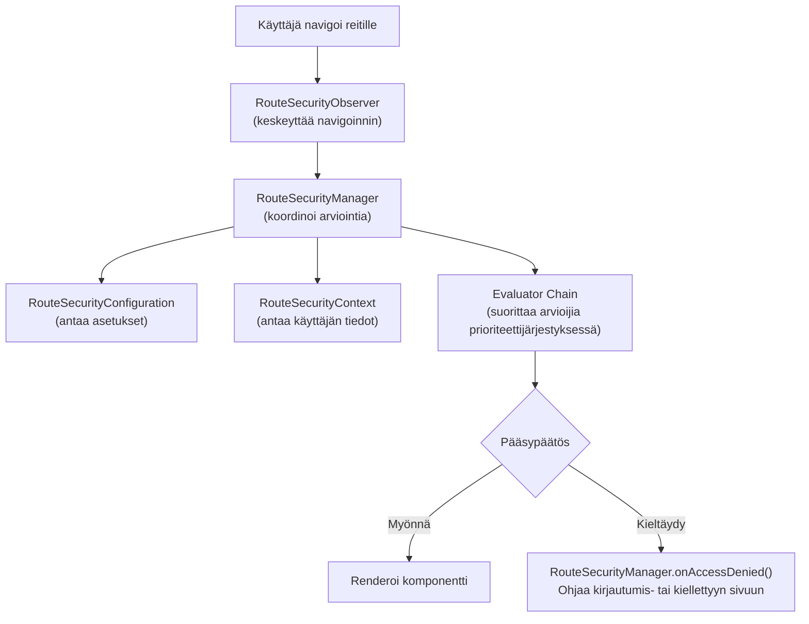

WebforJ:n turvallisuusjärjestelmä perustuu ydinkäyttöliittymien pohjalle, jotka toimivat yhdessä tarjotakseen reittikohtaista pääsynhallintaa. Nämä käyttöliittymät määrittelevät turvallisuuskäyttäytymisen sopimukset, jolloin erilaiset toteutukset, olipa kyseessä sessioon perustuva, JSON Web Tokenien (JWT) käyttöön perustuva, LDAP-integroitu tai tietokannan tukema, voivat liittää itseensä samaan taustarakenteeseen.

Tämän arkkitehtuurin ymmärtäminen auttaa sinua näkemään, miten turvallisuusannot kuten `@RolesAllowed` ja `@PermitAll` arvioidaan, miten navigoinnin keskeytys toimii ja miten voit rakentaa mukautettuja turvallisuustoteutuksia erityistarpeidesi mukaan.

## Ydinkäyttöliittymät {#the-four-core-interfaces}

Turvallisuuden perusta rakennetaan keskeisten abstrahoituneiden käsitteiden varaan, joilla jokaisella on tietty vastuualue:

### `RouteSecurityManager` {#routesecuritymanager}

`RouteSecurityManager` on turvallisuusjärjestelmän keskeinen koordinaattori. Se hallinnoi turvallisuusarvioijia, ohjaa arviointiprosessia ja käsittelee pääsyn kiellon ohjaamalla käyttäjiä asianmukaisille sivuille.

**Vastuut:**

- Rekisteröi ja hallinnoi turvallisuusarvioijia prioriteettien mukaan
- Koordinoi arviointiprosessia, kun käyttäjä navigoi reittiä
- Käsittele pääsyn kieltoa laukaisemalla ohjauksia kirjautumis- tai pääsy kielletään -sivuille
- Tallenna ja hae ennakkovaatimusten sijainteja kirjautumisen jälkeisiä ohjauksia varten

```java
public interface RouteSecurityManager {
  RouteAccessDecision evaluate(Class<?> routeClass, NavigationContext context);
  void onAccessDenied(RouteAccessDecision decision, NavigationContext context);
  RouteSecurityContext getSecurityContext();
  RouteSecurityConfiguration getConfiguration();
  void registerEvaluator(RouteSecurityEvaluator evaluator, int priority);
  Optional<Location> consumePreAuthenticationLocation();
}
```

Johtaja ei tee turvallisuuspäätöksiä itse, vaan delegoi arvioijille ja konfiguraatioille. Se on liima, joka yhdistää kaikki turvallisuuskontaktit.

### `RouteSecurityContext` {#routesecuritycontext}

`RouteSecurityContext` tarjoaa pääsyn nykyisen käyttäjän todennustilaan. Se vastaa kysymyksiin, kuten onko käyttäjä todennettu, mikä on hänen käyttäjänimensä ja onko hänellä `ADMIN`-rooli.

**Vastuut:**

- Määritä, onko nykyinen käyttäjä todennettu
- Tarjoa käyttäjän päähenkilö (yleensä heidän käyttäjänimensä tai käyttäjäobjektinsa)
- Tarkista, onko käyttäjällä tiettyjä rooleja tai valtuuksia
- Tallenna ja hae mukautettuja turvallisuusattribuutteja

```java
public interface RouteSecurityContext {
  boolean isAuthenticated();
  Optional<Object> getPrincipal();
  boolean hasRole(String role);
  boolean hasAuthority(String authority);
  Optional<Object> getAttribute(String name);
  void setAttribute(String name, Object value);
}
```

Toteutukset vaihtelevat käytettävän todennusjärjestelmän, HTTP-istunnon tallennuksen, otsikoista purettujen JWT-tokenien, tietokantakyselyjen, LDAP-hakuja tai muiden mekanismien mukaan.

### `RouteSecurityConfiguration` {#routesecurityconfiguration}

`RouteSecurityConfiguration` määrittelee turvallisuuskäyttäytymisen ja ohjaussijainnit. Se kertoo turvallisuusjärjestelmälle, minne käyttäjiä lähetetään, kun todennusta vaaditaan tai pääsy on kielletty.

**Vastuut:**

- Määritä, onko turvallisuus käytössä
- Määritä oletuksena turvallinen käyttäytyminen
- Anna todennus sivun sijainti (yleensä `/login`)
- Anna pääsy kielletty -sivun sijainti

```java
public interface RouteSecurityConfiguration {
  default boolean isEnabled() { return true; }
  default boolean isSecureByDefault() { return true; }
  default Optional<Location> getAuthenticationLocation() {
    return Optional.of(new Location("/login"));
  }
  default Optional<Location> getDenyLocation() { /* ... */ }
}
```

Tämä käyttöliittymä erottuu turvallisuuspolitiikasta ja -valvonnasta. Voit muuttaa ohjaussijainteja tai kytkeä oletuksena turvallisen käyttäytymisen päälle ilman, että sinun tarvitsee muuttaa johtajaa tai arvioijia.

### `RouteSecurityEvaluator` {#routesecurityevaluator}

`RouteSecurityEvaluator` on paikka, jossa todellisia turvallisuus sääntöjä tarkastellaan. Jokainen arvioija tutkii reittiä ja päättää, myönnetäänkö pääsy, kieltäytyminen vai siirretäänkö päätös seuraavalle arvioijalle ketjussa.

**Vastuut:**

- Määritä, käsitteleekö tämä arvioija annettua reittiä
- Arvioi turvallisuusannot reittiluokassa
- Myönnä pääsy, kiellä pääsy tai delegoi seuraavalle arvioijalle
- Osallistu vastuuketjupatteriin

```java
public interface RouteSecurityEvaluator {
  RouteAccessDecision evaluate(Class<?> routeClass,
                                NavigationContext context,
                                RouteSecurityContext securityContext,
                                SecurityEvaluatorChain chain);
  default boolean supports(Class<?> routeClass) { return true; }
}
```

Sisäänrakennetut arvioijat käsittelevät vakioanot kuten `@RolesAllowed`, `@PermitAll`, `@DenyAll`, ja `@AnonymousAccess`. Voit luoda mukautettuja arvioijia toteuttaaksesi aluekohtaisia turvallisuuslogiikoita.

## Kuinka käyttöliittymät toimivat yhdessä {#how-the-interfaces-work-together}

Nämä neljä käyttöliittymää tekevät yhteistyötä navigoinnin aikana turvallissääntöjen valvomiseksi:



Kun käyttäjä navigoi, `RouteSecurityObserver` keskeyttää navigoinnin ja pyytää `RouteSecurityManager`-yhteydessä arvioimaan pääsyä. Johtaja kuulee `RouteSecurityConfiguration`-asetuksia, saa käyttäätietori `RouteSecurityContext`-yhteydessä ja suorittaa jokaisen `RouteSecurityEvaluator`-yhteydessä prioriteetti-järjestyksessä kunnes yksi tekee päätöksen.

## Käyttöliittymät sopimuksina {#the-interfaces-as-contracts}

Jokainen käyttöliittymä määrittelee sopimuksen, sarjan kysymyksiä, joihin turvallisuusjärjestelmän tulee saada vastaukset. **Miten** vastaat näihin kysymyksiin on toteutusvalintasi:

**`RouteSecurityContext` sopimus:**

- "Onko nykyinen käyttäjä todennettu?" (`isAuthenticated()`)
- "Kuka on käyttäjä?" (`getPrincipal()`)
- "Onko käyttäjällä rooli X?" (`hasRole()`)

Päätät, mistä tämä tieto tulee: HTTP-istunnoista, otsikoista puretuista JWT-tokeneista, tietokantahauista, LDAP-kyselyistä tai muista todennuspalveluista.

**`RouteSecurityConfiguration` sopimus:**

- "Onko turvallisuus käytössä?" (`isEnabled()`)
- "Pitäisikö reittien olla oletuksena turvallisia?" (`isSecureByDefault()`)
- "Minne todennetut käyttäjät menevät?" (`getAuthenticationLocation()`)

Päätät, miten nämä arvot saadaan: kiinteinä, konfiguraatiotiedostoista, ympäristömuuttujista, tietokannasta tai laskemalla dynaamisesti.

**`RouteSecurityManager` sopimus:**

- "Saako tämä käyttäjä käyttää tätä reittiä?" (`evaluate()`)
- "Mitä tapahtuu, kun pääsy kielletään?" (`onAccessDenied()`)
- "Mitkä arvioijat pitäisi suorittaa?" (`registerEvaluator()`)

Päätät todennusvirran, minne ennakkovaatimusten sijainti tallennetaan ja miten käsitellä mukautettuja kiellon skenaarioita.

Perusta-arkkitehtuuri määrittelee nämä sopimukset, mutta toteutus on joustavaa. Eri järjestelmät voivat toteuttaa nämä käyttöliittymät täysin eri tavoilla erityisvaatimusten mukaan.

## `AbstractRouteSecurityManager` perusluokka {#the-abstractroutesecuritymanager-base-class}

Useimmat toteutukset eivät toteuta `RouteSecurityManager` suoraan. Sen sijaan ne laajentavat `AbstractRouteSecurityManager`, joka tarjoaa:

- Arvioijien rekisteröinti ja prioriteettipohjainen lajittelu
- Ketjun suorituslogiikka
- Pääsyn kieltämisen käsittely automaattisilla ohjauksilla
- Ennakkovaatimusten sijainnin tallennus HTTP-istunnossa
- Oletuksena turvallinen varakäyttäytyminen

Perusluokka toteuttaa `RouteSecurityManager`-käyttöliittymän ja tarjoaa konkreettiset toteutukset arvioijien hallintaan, pääsyn arvioimiseen ja kiellon käsittelyyn. Alaluokkien tarvitsee vain tarjota turvallisuusyhteys ja konfiguraatio. Perusluokka hoitaa arvioijien hallinnan, ketjun suorituksen ja kiellon käsittelyn automaattisesti.
