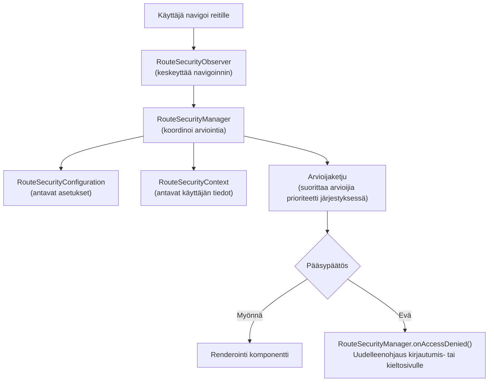

webforJ -turvajärjestelmä perustuu ydinliittymien perusrakenteeseen, joka toimii yhdessä tarjotakseen reittikohtaista pääsynvalvontaa. Nämä liittymät määrittelevät turvallisuuskäyttäytymiseen liittyvät sopimukset, jolloin erilaiset toteutukset, olivatpa ne istuntopohjaisia, JSON Web Tokeneihin (JWT) perustuvia, LDAP-integroituja tai tietokantapohjaisia, voivat liittää samaan perustavaan kehykseen.

Tämän arkkitehtuurin ymmärtäminen auttaa sinua näkemään, miten turvallisuusannotaatioita, kuten `@RolesAllowed` ja `@PermitAll`, arvioidaan, miten navigoinnin keskeyttäminen toimii, ja miten voit rakentaa mukautettuja turvallisuustoteutuksia erityistarpeitasi varten.

## Ydinliittymät {#the-four-core-interfaces}

Turvallisuuden perusta rakentuu tärkeiden abstrahointien varaan, joilla jokaisella on erityinen vastuu:

### `RouteSecurityManager` {#routesecuritymanager}

`RouteSecurityManager` on turvallisuusjärjestelmän keskeinen koordinaattori. Se hallinnoi turvallisuusarvioijia, koordinoi arviointiprosessia ja käsittelee pääsyn kieltoja ohjaamalla käyttäjiä asianmukaisille sivuille.

**Vastuut:**

- Rekisteröi ja hallinnoi turvallisuusarvioijia prioriteeteilla
- Koordinoi arviointiprosessia, kun käyttäjä navigoi reitille
- Käsittelee pääsyn kieltoja käynnistämällä uudelleenohjaukset kirjautumis- tai pääsykieltosivuille
- Tallentaa ja palauttaa ennakkovalmistellen paikkoja kirjautumisen jälkeisiin uudelleenohjauksiin

```java
public interface RouteSecurityManager {
  RouteAccessDecision evaluate(Class<?> routeClass, NavigationContext context);
  void onAccessDenied(RouteAccessDecision decision, NavigationContext context);
  RouteSecurityContext getSecurityContext();
  RouteSecurityConfiguration getConfiguration();
  void registerEvaluator(RouteSecurityEvaluator evaluator, int priority);
  Optional<Location> consumePreAuthenticationLocation();
}
```

Johtaja ei tee turvallisuuspäätöksiä itse, vaan delegoi arvioijille ja määrityksille. Se on liima, joka yhdistää kaikki turvallisuuskomponentit.

### `RouteSecurityContext` {#routesecuritycontext}

`RouteSecurityContext` tarjoaa pääsyn nykyisen käyttäjän todennus-tilaan. Se vastaa kysymyksiin, kuten onko käyttäjä todennettu, mikä heidän käyttäjänimensä on, ja onko heillä `ADMIN`-rooli.

**Vastuut:**

- Määritä, onko nykyinen käyttäjä todennettu
- Tarjoa käyttäjän perimmäinen (tyypillisesti heidän käyttäjänimensä tai käyttäjäobjekti)
- Tarkista, onko käyttäjällä erityisiä rooleja tai valtuuksia
- Tallentaa ja palauttaa mukautettuja turvallisuusattribuutteja 

```java
public interface RouteSecurityContext {
  boolean isAuthenticated();
  Optional<Object> getPrincipal();
  boolean hasRole(String role);
  boolean hasAuthority(String authority);
  Optional<Object> getAttribute(String name);
  void setAttribute(String name, Object value);
}
```

Toteutukset vaihtelevat riippuen todennusjärjestelmästä, HTTP-istuntotallennuksesta, päähakemistoista dekoodatuista JWT-tokenista, tietokantakyselyistä, LDAP-hauista tai muista mekanismeista.

### `RouteSecurityConfiguration` {#routesecurityconfiguration}

`RouteSecurityConfiguration` määrittelee turvallisuuskäyttäytymisen ja uudelleenohjauspaikat. Se kertoo turvallisuusjärjestelmälle, minne käyttäjät lähetetään, kun todennusta vaaditaan tai pääsy on kielletty.

**Vastuut:**

- Määritä, onko turvallisuus käytössä
- Määritä oletusarvoinen käyttäytyminen turvallisena
- Tarjoa todennus-sivun sijainti (tyypillisesti `/login`)
- Tarjoa pääsykielto-sivun sijainti

```java
public interface RouteSecurityConfiguration {
  default boolean isEnabled() { return true; }
  default boolean isSecureByDefault() { return true; }
  default Optional<Location> getAuthenticationLocation() {
    return Optional.of(new Location("/login"));
  }
  default Optional<Location> getDenyLocation() { /* ... */ }
}
```

Tämä liittymä erottaa turvallisuuspolitiikan turvallisuuden täytäntöönpanosta. Voit muuttaa uudelleenohjauspaikkoja tai kytkeä turvallisena oletusarvon ilman, että sinun tarvitsee muuttaa johtajaa tai arvioijia.

### `RouteSecurityEvaluator` {#routesecurityevaluator}

`RouteSecurityEvaluator` on paikka, jossa varsinaiset turvallisuus säännöt tarkistetaan. Jokainen arvioija tarkastelee reittiä ja päättää, myönnetäänkö pääsy, evätäänkö pääsy vai delegoidaanko päätös seuraavalle arvioijalle ketjussa.

**Vastuut:**

- Määritä, käsittääkö tämä arvioija annetun reitin
- Arvioi turvallisuusannotaatioita reittiluokassa
- Myönnä pääsy, evä pääsy tai delegoi seuraavalle arvioijalle
- Osallistu vastuuketjun malliin

```java
public interface RouteSecurityEvaluator {
  RouteAccessDecision evaluate(Class<?> routeClass,
                                NavigationContext context,
                                RouteSecurityContext securityContext,
                                SecurityEvaluatorChain chain);
  default boolean supports(Class<?> routeClass) { return true; }
}
```

Sisäänrakennetut arvioijat käsittelevät standardiannotaatioita, kuten `@RolesAllowed`, `@PermitAll`, `@DenyAll` ja `@AnonymousAccess`. Voit luoda mukautettuja arvioijia toteuttaaksesi erityisesti tietyn alan turvallisuuslogiikkaa.

## Kuinka liittymät toimivat yhdessä {#how-the-interfaces-work-together}

Nämä neljä liittymää tekevät yhteistyötä navigoinnin aikana turvallisuussääntöjen täytäntöönpanemiseksi:


```mermaid
flowchart TB
  User["Käyttäjä navigoi reitille"] --> Observer["RouteSecurityObserver<br/>(keskeyttää navigoinnin)"]
  Observer --> Manager["RouteSecurityManager<br/>(koordinoi arviointia)"]

  Manager --> Config["RouteSecurityConfiguration<br/>(antavat asetukset)"]
  Manager --> Context["RouteSecurityContext<br/>(antavat käyttäjän tiedot)"]
  Manager --> Chain["Arvioijaketju<br/>(suorittaa arvioijia prioriteetti järjestyksessä)"]

  Chain --> Decision{"Pääsypäätös"}
  Decision -->|"Myönnä"| Render["Renderointi komponentti"]
  Decision -->|"Evä"| Redirect["RouteSecurityManager.onAccessDenied()<br/>Uudelleenohjaus kirjautumis- tai kieltosivulle"]
```

Kun käyttäjä navigoi, `RouteSecurityObserver` keskeyttää navigoinnin ja pyytää `RouteSecurityManager`-toteutusta arvioimaan pääsyn. Johtaja konsultoi `RouteSecurityConfiguration`-toteutusta asetusten osalta, saa käyttäjtiedot `RouteSecurityContext`-toteutuksesta ja suorittaa jokaisen `RouteSecurityEvaluator`-toteutuksen prioriteetti-järjestyksessä, kunnes joku tekee päätöksen.

## Liittymät sopimuksina {#the-interfaces-as-contracts}

Jokainen liittymä määrittelee sopimuksen, joukon kysymyksiä, joihin turvallisuusjärjestelmän tarvitaan vastauksia. **Miten** vastaat näihin kysymyksiin on sinun toteutuksesi valinta:

**`RouteSecurityContext` sopimus:**

- "Onko nykyinen käyttäjä todennettu?" (`isAuthenticated()`)
- "Kuka on käyttäjä?" (`getPrincipal()`)
- "Onko käyttäjällä rooli X?" (`hasRole()`)

Päätät, mistä tämä tieto tulee: HTTP-istunnoista, päähakemistoista dekoodatuista JWT-tokenista, tietokantahauista, LDAP-hauista tai mistä tahansa muusta todennus taustasta.

**`RouteSecurityConfiguration` sopimus:**

- "Onko turvallisuus käytössä?" (`isEnabled()`)
- "Pitäisikö reittien olla oletusarvoisesti turvallisia?" (`isSecureByDefault()`)
- "Mihin todennetut käyttäjät pitäisi ohjata?" (`getAuthenticationLocation()`)

Päätät, miten nämä arvot saadaan: kovakoodattuina, konfiguraatiotiedostoista, ympäristömuuttujista, tietokannasta tai lasketaan dynaamisesti.

**`RouteSecurityManager` sopimus:**

- "Pitäisikö tälle käyttäjälle myöntää pääsy tälle reitille?" (`evaluate()`)
- "Mitä tapahtuu, kun pääsy evätään?" (`onAccessDenied()`)
- "Mitä arvioijia pitäisi suorittaa?" (`registerEvaluator()`)

Päätät todennusprosessin, minne tallennetaan ennakkovalmistellut sijainnit ja miten käsitellään mukautettuja kieltoskenaarioita.

Perusta-arkkitehtuuri määrittelee nämä sopimukset, mutta toteutus on joustavaa. Eri järjestelmät voivat toteuttaa nämä liittymät täysin eri tavoilla erityisten vaatimusten mukaan.

## `AbstractRouteSecurityManager` perusluokka {#the-abstractroutesecuritymanager-base-class}

Useimmat toteutukset eivät toteuta `RouteSecurityManager`-liittymää suoraan. Sen sijaan ne laajentavat `AbstractRouteSecurityManager`-luokkaa, joka tarjoaa:

- Arvioijien rekisteröintiä ja prioriteetti-pohjaista lajittelua
- Ketjun suorituslogiikkaa
- Pääsyn kieltojen käsittely automaattisilla uudelleenohjauksilla
- Ennakkovalmistellen sijaintien tallennus HTTP-istuntoon
- Turvallisena oletusarvoisen käyttäytymisen varayhteys

Perusluokka toteuttaa `RouteSecurityManager`-liittymän ja tarjoaa konkreettisia toteutuksia arvioijien hallinnasta, pääsyn arvioinnista ja kieltojen käsittelyistä. Aliluokkien tarvitsee vain tarjota turvallisuuskonteksti ja -määritykset. Perusluokka käsittelee arvioijien hallintaa, ketjun suorittamista ja kieltojen käsittelyä automaattisesti.
