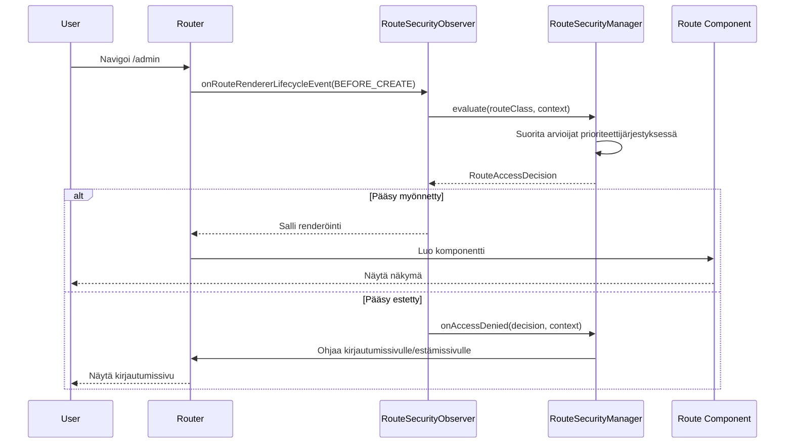

Turvallisuuden valvonta webforJ:ssä tapahtuu automaattisesti navigoinnin aikana. Kun käyttäjä napsauttaa linkkiä tai navigoi reitille, turvallisuusjärjestelmä keskeyttää navigoinnin, arvioi pääsy säännöt ja joko sallii navigoinnin jatkua tai ohjaa käyttäjän sopivalle sivulle. Tämä keskeytys on käyttäjille näkymätön ja ei vaadi manuaalisia turvallisuustarkistuksia komponenttikoodissasi.

Ymmärtäminen siitä, miten navigoinnin keskeytys toimii, auttaa sinua ratkaisemaan turvallisuusongelmia ja rakentamaan mukautettua navigointilogiiikkaa, joka integroituu turvallisuusjärjestelmään.

## RouteSecurityObserver {#the-routesecurityobserver}

RouteSecurityObserver on navigointivalvoja, joka liitetään reitittimen elinkaaren tapahtumiin. Se kuuntelee navigointitapahtumia ja arvioi turvallisuussääntöjä ennen kuin mitään komponenttia renderöidään.

Valvoja liitetään reitittimen renderöijään sovelluksen käynnistyksen aikana:

```java
// Luo valvoja turvallisuusmanagerisi kanssa
RouteSecurityObserver observer = new RouteSecurityObserver(securityManager);

// Liitä se reitittimen renderöijään
Router router = Router.getCurrent();
if (router != null) {
  router.getRenderer().addObserver(observer);
}
```

Kun liitetty, valvoja keskeyttää jokaisen navigointipyynnön. Valvoja istuu navigointipyyntöjen ja komponentin renderöinnin välillä; kun navigointi alkaa, se pyytää turvallisuusmanagerilta arvioimaan pääsyn. Vain jos pääsy myönnetään, komponentti renderöidään.

## Navigoinnin keskeytysprosessi {#navigation-interception-flow}

Kun käyttäjä navigoi reitille, seuraava sekvenssi tapahtuu:



Tämä prosessi osoittaa, että turvallisuuden arviointi tapahtuu ennen kuin mitään herkkiä reittikoodin osia suoritetaan. Jos pääsy evätään, komponenttia ei koskaan instansioida, estäen valtuuttamattomia käyttäjiä laukaistamasta liiketoimintalogiikkaa tai pääsemästä suojattuihin tietoihin.

## Keskeytyspisteet {#interception-points}

Valvoja keskeyttää navigoinnin tietyssä kohdassa reitityselinkaarta:

**Ennen renderöintiä** Valvojan onRouteRendererLifecycleEvent() -menetelmää kutsutaan tapahtumalla LifecycleEvent.BEFORE_CREATE sen jälkeen, kun reitti on ratkaistu, mutta ennen kuin komponentti luodaan. Tämä on kriittinen turvallisuuspiste.

Tässä vaiheessa reititin tietää, mikä reittiluokka renderöidään, mutta reittiä ei ole vielä instansioitu. Valvoja voi arvioida turvallisuusannotaatiot luokalla ilman, että reittilogiiikkaa suoritetaan.

Jos pääsy evätään, valvoja estää renderöinnin ja laukaisee uudelleenohjauksen. Alkuperäistä reittiä ei koskaan instansioida.

## Arviointiprosessi {#the-evaluation-process}

Kun valvoja keskeyttää navigoinnin, se delegoi arvioinnin turvallisuusmanagerille. Valvoja noutaa reittiluokan navigointikontekstista ja pyytää manageria arvioimaan pääsyn. Jos päätös myöntää pääsyn, navigointi etenee normaalisti. Jos päätös evää pääsyn, valvoja pysäyttää propagoinnin estääkseen renderöinnin ja antaa managerin käsitellä evätyn pääsyn.

Manageri koordinoi arviointia:

1. Tarkistaa, onko turvallisuus käytössä asetuksissa
2. Hakee nykyisen turvallisuuskontekstin (käyttäjäinformaatio)
3. Suorittaa arvioijaketjun prioriteettijärjestyksessä
4. Palauttaa lopullisen pääsypäätöksen

Valvoja toimii päätöksen mukaan: jos myönnetty, navigointi etenee; jos evätty, valvoja pysäyttää propagoinnin ja antaa managerin käsitellä evätyn pääsyn.

## Miten pääsypäätökset tehdään {#how-access-decisions-are-made}

Turvallisuusmanageri luo arvioijaketjun ja suorittaa jokaisen arvioijan prioriteettijärjestyksessä. Arvioijat voivat tehdä kolmea tyyppiä päätöksiä:

- **Myönnä pääsy:** Arvioija hyväksyy navigoinnin, ja reitti renderöidään. Enempää arvioijia ei konsultoida. Arvioija palauttaa päätöksen, joka ilmoittaa, että pääsy on myönnetty.

- **Estä pääsy:** Arvioija estää navigoinnin. Valvoja pysäyttää renderöinnin ja laukaisee uudelleenohjauksen. Arvioija palauttaa evätyn päätöksen, mahdollisesti syyviestin kanssa. Evääminen voi johtua autentikoinnin puutteesta (vaaditaan kirjautuminen) tai valtuutuksen puutteesta (riittämättömät oikeudet).

- **Delegoi seuraavalle arvioijalle:** Arvioija ei tee päätöstä ja siirtää hallinnan seuraavalle arvioijalle ketjussa. Arvioija kutsuu ketjun arviointimenetelmää, joka etenee seuraavaan arvioijaan prioriteettijärjestyksessä.

Useimmat arvioijat käsittelevät vain reittejä, joilla on erityisiä annotaatioita. Esimerkiksi RolesAllowedEvaluator arvioi vain reittejä, jotka on merkitty @RolesAllowed annotaatiolla. Jos annotaatiota ei ole, se delegoi seuraavalle arvioijalle.

## Evätyn pääsyn käsittely {#handling-access-denial}

Kun pääsy evätään, managerin onAccessDenied() -menetelmä käsittelee evätyn pääsyn tyypin mukaan:

- **Autentikointi vaaditaan:** Käyttäjä ei ole kirjautunut sisään. Ohjaa kirjautumissivulle, joka on määritetty RouteSecurityConfiguration.getAuthenticationLocation() -menetelmässä.

- **Pääsy evätty:** Käyttäjä on kirjautunut sisään, mutta häneltä puuttuu oikeudet. Ohjaa estämissivulle, joka on määritetty RouteSecurityConfiguration.getDenyLocation() -menetelmässä.

Ennen uudelleenohjausta manageri tallentaa alkuperäisesti pyydetyn sijainnin HTTP-istuntoon. Kirjautumisen onnistumisen jälkeen tätä sijaintia voidaan hakea managerin consumePreAuthenticationLocation() -menetelmän avulla, joka palauttaa tallennetun sijainnin ja tyhjentää sen istunnosta. Jos sijainti on tallennettu, sovellus voi navigoida sinne; muuten se navigoi oletussivulle.

## Kun turvallisuus on pois päältä {#when-security-is-disabled}

Jos RouteSecurityConfiguration.isEnabled() palauttaa false, manageri ohittaa kaikki arvioinnit ja myöntää pääsyn kaikille reiteille välittömästi. Arvioijaketjua ei koskaan suoriteta, eikä turvallisuustarkistuksia tapahdu.

Tämä on hyödyllistä kehityksen aikana tai sovelluksille, jotka eivät vaadi turvallisuutta. Voit kytkeä turvallisuuden päälle ja pois ilman, että tarvitsee poistaa annotaatioita tai rekisteröidä valvojaa uudelleen.

## Integraatio navigointielinkaareen {#integration-with-navigation-lifecycle}

Turvallisuusvalvoja integroituu laajempaan [navigointielinkaareen](/docs/routing/navigation-lifecycle/overview), jossa useat valvojat voivat liittyä navigointitapahtumiin. Turvallisuuden arviointi tapahtuu varhain tässä elinkaaren vaiheessa, ennen navigoinnin estoa tai komponentin elinkaari tapahtumia.

Jos toteutat mukautettuja navigointivalvojia, ole tietoinen siitä, että turvallisuusarviointi tapahtuu ensin. Jos pääsy evätään, valvojan onRouteRendererLifecycleEvent() -menetelmää ei kutsuta tapahtumalla BEFORE_CREATE, koska navigointi on estetty.
