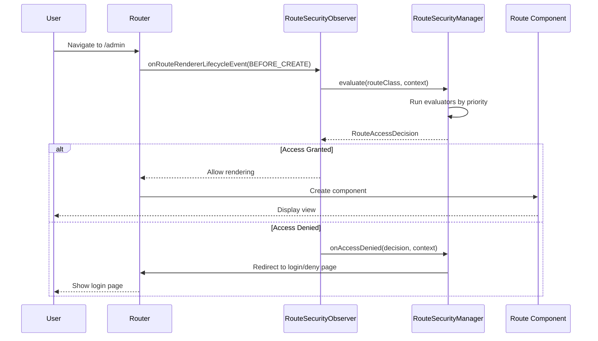

Turvallisuuden valvonta webforJ:ssä tapahtuu automaattisesti navigoinnin aikana. Kun käyttäjä klikkaa linkkiä tai navigoi reitille, turvallisuusjärjestelmä keskeyttää navigoinnin, arvioi pääsääntöjä ja joko sallii navigoinnin jatkamisen tai ohjaa käyttäjän sopivalle sivulle. Tämä keskeytys on käyttäjille näkymätön, eikä se vaadi manuaalisia turvallisuustarkastuksia komponenttikoodissasi.

Ymmärtäminen siitä, kuinka navigoinnin keskeytys toimii, auttaa sinua vianetsimään turvallisuuteen liittyviä ongelmia ja rakentamaan mukautettua navigaatiologia, joka integroituu turvallisuusjärjestelmään.

## The `RouteSecurityObserver` {#the-routesecurityobserver}

`RouteSecurityObserver` on navigointivalvoja, joka kytkeytyy reitittimen elinkaarimekanismiin. Se kuuntelee navigointitapahtumia ja arvioi turvallisuussääntöjä ennen kuin mitään komponenttia renderöidään.

Valvoja liitetään reitittimen renderöijään sovelluksen käynnistyksen aikana:

```java
// Luo valvoja turvallisuusmanagerisi kanssa
RouteSecurityObserver observer = new RouteSecurityObserver(securityManager);

// Liitä se reitittimen renderöijään
Router router = Router.getCurrent();
if (router != null) {
  router.getRenderer().addObserver(observer);
}
```

Kun valvoja on liitetty, se keskeyttää jokaisen navigointipyyntö. Valvoja istuu navigointipyyntöjen ja komponentin renderöinnin välissä, ja kun navigointi alkaa, se pyytää turvallisuusmanagerilta pääsyn arvioimiseksi. Vasta jos pääsy myönnetään, komponentti renderöidään.

## Navigoinnin keskeytyksen kulku {#navigation-interception-flow}

Kun käyttäjä navigoi reitille, seuraava sekvenssi tapahtuu:


```mermaid
sequenceDiagram
  participant User
  participant Router
  participant Observer as RouteSecurityObserver
  participant Manager as RouteSecurityManager
  participant Component as Route Component

  User->>Router: Navigate to /admin
  Router->>Observer: onRouteRendererLifecycleEvent(BEFORE_CREATE)
  Observer->>Manager: evaluate(routeClass, context)
  Manager->>Manager: Run evaluators by priority
  Manager-->>Observer: RouteAccessDecision

  alt Access Granted
    Observer-->>Router: Allow rendering
    Router->>Component: Create component
    Component-->>User: Display view
  else Access Denied
    Observer->>Manager: onAccessDenied(decision, context)
    Manager->>Router: Redirect to login/deny page
    Router-->>User: Show login page
  end
```

Tämä kulku osoittaa, että turvallisuusarviointi tapahtuu ennen kuin mikään arkaluonteinen reittikoodi suoritetaan. Jos pääsy kielletään, komponenttia ei koskaan instansioida, minkä vuoksi valtuuttamattomat käyttäjät eivät voi käynnistää liiketoimintalogiikkaa tai päästä käsiksi suojattuihin tietoihin.

## Keskeytyspisteet {#interception-points}

Valvoja keskeyttää navigoinnin tiettyyn kohtaan reititysjaksoa:

**Ennen renderöintiä** Valvojan `onRouteRendererLifecycleEvent()`-metodia kutsutaan `LifecycleEvent.BEFORE_CREATE`-tapahtumalla reitin ratkaisemisen jälkeen, mutta ennen kuin komponentti luodaan. Tämä on kriittinen turvallisuuspiste.

Tässä vaiheessa reititin tietää, mikä reittiluokka renderöidään, mutta reittiä ei ole vielä instansioitu. Valvoja voi arvioida turvallisuusanotaatioita luokassa suorittamatta reittilogikkaa.

Jos pääsy kielletään, valvoja estää renderöinnin ja laukaisee ohjauksen. Alkuperäistä reittiä ei koskaan instansioida.

## Arviointiprosessi {#the-evaluation-process}

Kun valvoja keskeyttää navigoinnin, se delegoi arvioinnin turvallisuusmanagerille. Valvoja noutaa reittiluokan navigointikontekstista ja pyytää manageria arvioimaan pääsyä. Jos päätös myöntää pääsyn, navigointi etenee normaalisti. Jos päätös kieltää pääsyn, valvoja estää propagoinnin estääkseen renderöinnin ja antaa managerin käsitellä kieltämistä.

Manageri koordinoi arviointia:

1. Tarkistamalla, onko turvallisuus aktivoitu kokoonpanossa
2. Saamalla nykyisen turvallisuuskontekstin (käyttäjätiedot)
3. Suorittamalla arvioijaketju prioriteetti järjestyksessä
4. Palauttamalla lopullinen pääsypäätös

Valvoja toimii päätöksen mukaan: jos myönnetty, navigointi etenee; jos kielletty, valvoja pysäyttää propagoinnin ja antaa managerin käsitellä kieltämistä.

## Kuinka pääsypäätökset tehdään {#how-access-decisions-are-made}

Turvallisuusmanageri luo arvioijaketjun ja suorittaa jokaisen arvioijan prioriteetti järjestyksessä. Arvioijat voivat tehdä kolmenlaisia päätöksiä:

- **Myöntää pääsy:** Arvioija hyväksyy navigoinnin ja reitti renderöidään. Enempää arvioijia ei kysytä. Arvioija palauttaa päätöksen, joka osoittaa, että pääsy on myönnetty.

- **Kieltää pääsy:** Arvioija estää navigoinnin. Valvoja pysäyttää renderöinnin ja laukaisee ohjauksen. Arvioija palauttaa kieltämispäätöksen, mahdollisesti syyviestin kanssa. Kieltäminen voi johtua autentikoinnin puutteesta (vaaditaan kirjautuminen) tai valtuutuksen puutteesta (riittämättömät oikeudet).

- **Delegoi seuraavalle arvioijalle:** Arvioija ei tee päätöstä ja siirtää kontrollin ketjun seuraavalle arvioijalle. Arvioija kutsuu ketjun arviointimetodia, joka etenee seuraavalle arvioijalle prioriteetti järjestyksessä.

Useimmat arvioijat käsittelevät vain reittejä, joilla on erityisiä anotaatiota. Esimerkiksi `RolesAllowedEvaluator` arvioi vain reittejä, joilla on anotaatio `@RolesAllowed`. Jos anotaatiota ei ole, se delegoi seuraavalle arvioijalle.

## Kieltämisen käsittely {#handling-access-denial}

Kun pääsy kielletään, managerin `onAccessDenied()`-metodi käsittelee kieltämistä kieltotyypin perusteella:

- **Autentikointi vaaditaan:** Käyttäjä ei ole kirjautunut sisään. Ohjaa kirjautumissivulle, joka on määritetty `RouteSecurityConfiguration.getAuthenticationLocation()`.

- **Pääsy kielletty:** Käyttäjä on kirjautunut sisään mutta ei omaa oikeuksia. Ohjaa pääsy kielletty -sivulle, joka on määritetty `RouteSecurityConfiguration.getDenyLocation()`.

Ennen ohjausta manageri tallentaa alkuperäisesti pyydetyn sijainnin HTTP-istuntoon. Onnistuneen kirjautumisen jälkeen tämä sijainti voidaan noutaa managerin `consumePreAuthenticationLocation()`-metodilla, joka palauttaa tallennetun sijainnin ja tyhjentää sen istunnosta. Jos sijainti oli tallennettuna, sovellus voi navigoida sinne; muuten se navigoi oletussivulle.

## Kun turvallisuus on poistettu käytöstä {#when-security-is-disabled}

Jos `RouteSecurityConfiguration.isEnabled()` palauttaa `false`, manageri ohittaa kaikki arvioinnit ja myöntää pääsyn heti jokaiselle reitille. Arvioijaketjua ei koskaan käynnistetä, eikä turvallisuustarkastuksia suoriteta.

Tämä on hyödyllistä kehitysvaiheessa tai sovelluksille, jotka eivät vaadi turvallisuutta. Voit vaihtaa turvallisuuden päälle ja pois ilman, että sinun tarvitsee poistaa anotaatiota tai poistaa valvojaa rekisteristä.

## Integrointi navigointielinkaaren kanssa {#integration-with-navigation-lifecycle}

Turvallisuusvalvoja integroituu laajempaan [navigointielinkaaren](/docs/routing/navigation-lifecycle/overview) kanssa, jossa useat valvojat voivat kytkeytyä navigointitapahtumiin. Turvallisuusarviointi tapahtuu aikaisessa vaiheessa tätä elinkaarta, ennen navigoinnin estämistä tai komponentin elinkaaritapahtumia.

Jos toteutat mukautettuja navigointivalvojia, ole tietoinen siitä, että turvallisuusarviointi tapahtuu ensin. Jos pääsy kielletään, valvojan `onRouteRendererLifecycleEvent()`-metodia ei kutsuta `BEFORE_CREATE` vaiheessa, koska navigointi estetään.
