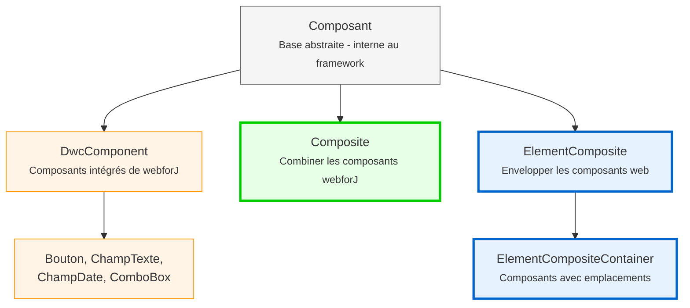

<DocChip chip='since' label='23.05' />
<JavadocLink type="foundation" location="com/webforj/component/Component" top='true'/> 

Avant de construire des composants personnalisés dans webforJ, il est important de comprendre l'architecture fondamentale qui façonne le fonctionnement des composants. Cet article explique la hiérarchie des composants, l'identité des composants, les concepts du cycle de vie, et comment les interfaces de préoccupation fournissent des capacités aux composants.

## Comprendre la hiérarchie des composants

webforJ organise les composants en une hiérarchie avec deux groupes : des classes internes au framework que vous ne devez jamais étendre, et des classes conçues spécifiquement pour la construction de composants personnalisés. Cette section explique pourquoi webforJ privilégie la composition à l'héritage et ce que chaque niveau de la hiérarchie fournit.

### Pourquoi la composition plutôt que l'extension ?

Dans webforJ, les composants intégrés comme [`Button`](../components/button) et [`TextField`](../components/fields/textfield) sont des classes finales—vous ne pouvez pas les étendre :

```java
// Cela ne fonctionnera pas dans webforJ
public class MyButton extends Button {
    // Button est final - ne peut pas être étendu 
}
```

webforJ utilise **la composition plutôt que l'héritage**. Au lieu d'étendre des composants existants, vous créez une classe qui étend `Composite` et combine des composants à l'intérieur. `Composite` agit comme un conteneur qui enveloppe un seul composant (appelé le composant lié) et vous permet d'ajouter vos propres composants et comportements.

```java
public class SearchBar extends Composite<FlexLayout> {
    private TextField searchField;
    private Button searchButton;
    
    public SearchBar() {
        searchField = new TextField("Recherche");
        searchButton = new Button("Aller");
        
        getBoundComponent()
            .setDirection(FlexDirection.ROW)
            .add(searchField, searchButton);
    }
}
```

### Pourquoi vous ne pouvez pas étendre les composants intégrés

Les composants webforJ sont marqués comme finaux pour maintenir l'intégrité du composant web sous-jacent. Étendre les classes de composants webforJ accorderait un contrôle sur le composant web sous-jacent, ce qui pourrait entraîner des conséquences indésirables et compromettre la cohérence et la prévisibilité du comportement des composants.

Pour une explication détaillée, voir [Final Classes and Extension Restrictions](https://docs.webforj.com/docs/architecture/controls-components#final-classes-and-extension-restrictions) dans la documentation d'architecture.

### La hiérarchie des composants



**Classes pour les développeurs (utilisez celles-ci) :**
- **Composite**
- **ElementComposite**
- **ElementCompositeContainer**

**Classes internes au framework (ne jamais étendre directement) :**
- **Component**
- **DwcComponent**

:::warning[Never extend `Component` or `DwcComponent`]
Ne jamais étendre directement `Component` ou `DwcComponent`. Tous les composants intégrés sont finaux. Utilisez toujours des modèles de composition avec `Composite` ou `ElementComposite`.

Tenter d'étendre `DwcComponent` lèvera une exception à l'exécution.
:::

## Interfaces de préoccupation : Ajouter des capacités à vos composants

Les interfaces de préoccupation sont des interfaces Java qui fournissent des capacités spécifiques à vos composants. Chaque interface ajoute un ensemble de méthodes liées. Par exemple, `HasSize` ajoute des méthodes pour contrôler la largeur et la hauteur, tandis que `HasFocus` ajoute des méthodes pour gérer l'état de focus.

Lorsque vous implémentez une interface de préoccupation sur votre composant, vous obtenez l'accès à ces capacités sans écrire de code d'implémentation. L'interface fournit des implémentations par défaut qui fonctionnent automatiquement.

L'implémentation des interfaces de préoccupation donne à vos composants personnalisés les mêmes API que les composants intégrés de webforJ :

```java
// Implémentez HasSize pour obtenir automatiquement les méthodes de largeur/hauteur
public class SizedCard extends Composite<Div> implements HasSize<SizedCard> {
    
    public SizedCard() {
        getBoundComponent().setText("Contenu de la carte");
    }
    
    // Pas besoin d'implémenter ces méthodes - vous les obtenez gratuitement :
    // setWidth(), setHeight(), setSize()
}

// Utilisez-le comme n'importe quel composant webforJ
SizedCard card = new SizedCard();
card.setWidth("300px")
    .setHeight("200px");
```

Le composite transmet automatiquement ces appels au `Div` sous-jacent. Pas besoin de code supplémentaire.

**Interfaces de préoccupation courantes :**
- `HasSize` - `setWidth()`, `setHeight()`, `setSize()`
- `HasFocus` - `focus()`, `setFocusable()`, événements de focus
- `HasClassName` - `addClassName()`, `removeClassName()`
- `HasStyle` - `setStyle()`, gestion du CSS en ligne
- `HasVisibility` - `setVisible()`, capacité d'afficher/masquer
- `HasText` - `setText()`, gestion du contenu textuel
- `HasAttribute` - `setAttribute()`, gestion des attributs HTML

:::warning
Si le composant sous-jacent ne prend pas en charge la capacité de l'interface, vous obtiendrez une exception à l'exécution. Fournissez votre propre implémentation dans ce cas.
:::

Pour une liste complète des interfaces de préoccupation disponibles, voir le [webforJ JavaDoc](https://javadoc.io/doc/com.webforj/webforj-foundation/latest/com/webforj/concern/package-summary.html).

## Aperçu du cycle de vie des composants

webforJ gère automatiquement le cycle de vie des composants. Le framework s'occupe de la création, de l'attachement et de la destruction des composants sans nécessiter d'intervention manuelle.

**Les hooks de cycle de vie** sont disponibles lorsque vous en avez besoin :
- `onDidCreate()` - Appelé après que le composant soit attaché au DOM
- `onDidDestroy()` - Appelé lorsque le composant est détruit

Ces hooks sont **optionnels**. Utilisez-les lorsque vous en avez besoin :
- Libérer des ressources (arrêter des intervalles, fermer des connexions)
- Initialiser des composants qui nécessitent un attachement au DOM
- S'intégrer avec JavaScript côté client

Pour la plupart des cas simples, vous pouvez initialiser des composants directement dans le constructeur. Utilisez des hooks de cycle de vie comme `onDidCreate()` pour reporter le travail si nécessaire.
