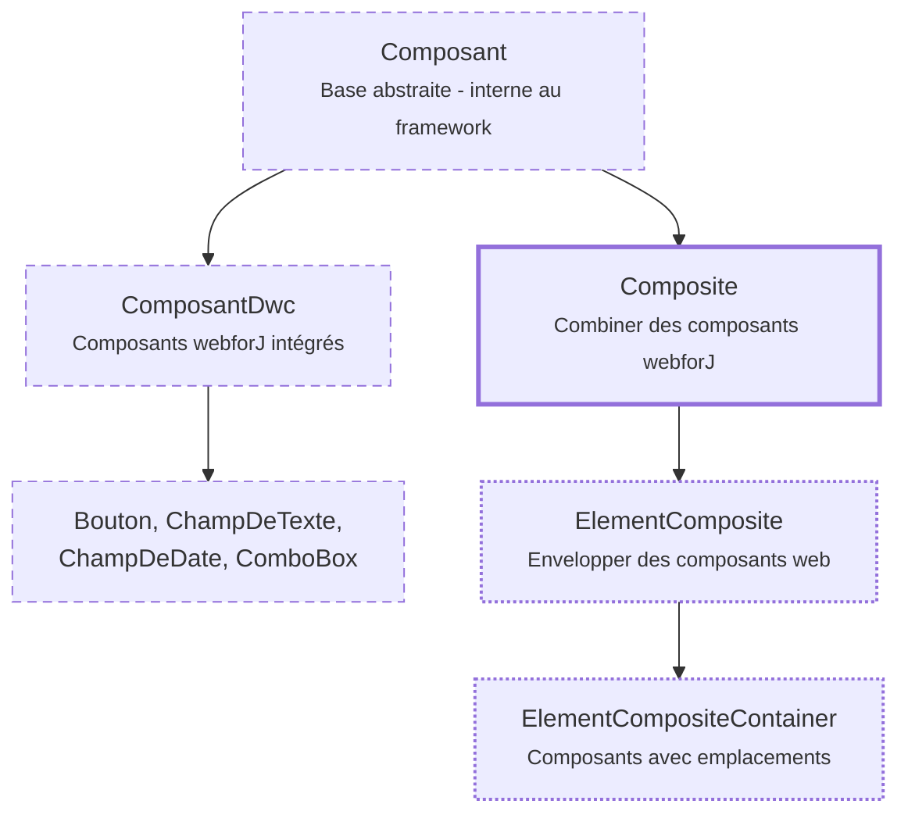

<JavadocLink type="foundation" location="com/webforj/component/Component" top='true'/> 

Avant de créer des composants personnalisés dans webforJ, il est important de comprendre l'architecture fondamentale qui façonne le fonctionnement des composants. Cet article explique la hiérarchie des composants, l'identité des composants, les concepts du cycle de vie et comment les interfaces de préoccupation fournissent des capacités aux composants.

## Comprendre la hiérarchie des composants {#understanding-the-component-hierarchy}

webforJ organise les composants en une hiérarchie avec deux groupes : les classes internes au framework que vous ne devriez jamais étendre, et les classes conçues spécifiquement pour créer des composants personnalisés. Cette section explique pourquoi webforJ privilégie la composition à l'héritage et ce que chaque niveau de la hiérarchie fournit.

### Pourquoi la composition plutôt que l'extension ? {#why-composition-instead-of-extension}

Dans webforJ, les composants intégrés comme [`Button`](../components/button) et [`TextField`](../components/fields/textfield) sont des classes finales : vous ne pouvez pas les étendre :

```java
// Cela ne fonctionnera pas dans webforJ
public class MyButton extends Button {
  // Button est final - ne peut pas être étendu 
}
```

webforJ utilise **la composition plutôt que l'héritage**. Au lieu d'étendre des composants existants, vous créez une classe qui étend `Composite` et combine les composants à l'intérieur. `Composite` agit comme un conteneur qui enveloppe un seul composant (appelé composant lié) et vous permet d'ajouter vos propres composants et comportements.

```java
public class SearchBar extends Composite<FlexLayout> {
  private final FlexLayout self = getBoundComponent();
  private TextField searchField;
  private Button searchButton;
  
  public SearchBar() {
    searchField = new TextField("Recherche");
    searchButton = new Button("Aller");
    
    self.setDirection(FlexDirection.ROW)
      .add(searchField, searchButton);
  }
}
```

### Pourquoi vous ne pouvez pas étendre les composants intégrés {#why-you-cant-extend-built-in-components}

Les composants webforJ sont marqués comme finaux pour maintenir l'intégrité du composant web côté client sous-jacent. Étendre les classes de composants webforJ donnerait le contrôle sur le composant web sous-jacent, ce qui pourrait entraîner des conséquences indésirables et briser la cohérence et la prévisibilité du comportement des composants.

Pour une explication détaillée, consultez [Classes finales et restrictions d'extension](https://docs.webforj.com/docs/architecture/controls-components#final-classes-and-extension-restrictions) dans la documentation sur l'architecture.

### La hiérarchie des composants {#the-component-hierarchy}

<div style={{textAlign: 'center'}}>

```mermaid
graph TD
  A[Composant<br/><small>Base abstraite - interne au framework</small>]
  
  A --> B[ComposantDwc<br/><small>Composants webforJ intégrés</small>]
  A --> C[Composite<br/><small>Combiner des composants webforJ</small>]
  
  B --> E[Bouton, ChampDeTexte,<br/>ChampDeDate, ComboBox]
  
  C --> D[ElementComposite<br/><small>Envelopper des composants web</small>]
  D --> F[ElementCompositeContainer<br/><small>Composants avec emplacements</small>]

  classDef internal stroke-dasharray:6 4,stroke-width:1px
  classDef primary stroke-width:3px
  classDef secondary stroke-width:2px,stroke-dasharray:2 2
  class A,B,E internal
  class C primary
  class D,F secondary
```
</div>

Classes pour les développeurs (utilisez celles-ci) :
- `Composite`
- `ElementComposite`
- `ElementCompositeContainer`

Classes internes au framework (ne jamais étendre directement) :
- `Component`
- `DwcComponent`

:::warning[Never extend `Component` or `DwcComponent`]
Ne jamais étendre `Component` ou `DwcComponent` directement. Tous les composants intégrés sont finaux. Utilisez toujours des modèles de composition avec `Composite` ou `ElementComposite`.

Tenter d'étendre `DwcComponent` déclenchera une exception d'exécution.
:::

## Interfaces de préoccupation {#concern-interfaces}

Les interfaces de préoccupation sont des interfaces Java qui offrent des capacités spécifiques à vos composants. Chaque interface ajoute un ensemble de méthodes liées. Par exemple, `HasSize` ajoute des méthodes pour contrôler la largeur et la hauteur, tandis que `HasFocus` ajoute des méthodes pour gérer l'état de focus.

Lorsque vous implémentez une interface de préoccupation sur votre composant, vous avez accès à ces capacités sans écrire de code d'implémentation. L'interface fournit des implémentations par défaut qui fonctionnent automatiquement.

Implémenter des interfaces de préoccupation donne à vos composants personnalisés les mêmes API que les composants intégrés de webforJ :

```java
// Implémentez HasSize pour obtenir des méthodes de largeur/hauteur automatiquement
public class SizedCard extends Composite<Div> implements HasSize<SizedCard> {
  private final Div self = getBoundComponent();
  
  public SizedCard() {
    self.setText("Contenu de la carte");
  }
  
  // Pas besoin d'implémenter ces méthodes - vous les obtenez gratuitement :
  // setWidth(), setHeight(), setSize()
}

// Utilisez-le comme n'importe quel composant webforJ
SizedCard card = new SizedCard();
card.setWidth("300px")
  .setHeight("200px");
```

Le composite transfère automatiquement ces appels au `Div` sous-jacent. Pas besoin de code supplémentaire.

### Apparence {#concern-interfaces-appearance}

Ces interfaces contrôlent la présentation visuelle d'un composant, y compris ses dimensions, sa visibilité, son style et son thème.

| Interface | Description |
|---|---|
| `HasSize` | Contrôle la largeur et la hauteur, y compris les contraintes min et max. Étend `HasWidth`, `HasHeight`, et leurs variantes min/max. |
| `HasVisibility` | Affiche ou masque le composant sans l'enlever de la mise en page. |
| `HasClassName` | Gère les noms de classes CSS sur l'élément racine du composant. |
| `HasStyle` | Applique et supprime les styles CSS en ligne. |
| `HasHorizontalAlignment` | Contrôle comment le contenu est aligné horizontalement au sein du composant. |
| `HasExpanse` | Définit la variante de taille du composant en utilisant les tokens d'expanse standard (`XSMALL` à `XLARGE`). |
| `HasTheme` | Applique une variante de thème telle que `DEFAULT`, `PRIMARY`, ou `DANGER`. |
| `HasPrefixAndSuffix` | Ajoute des composants à l'emplacement de préfixe ou de suffixe à l'intérieur du composant. |

### Contenu {#concern-interfaces-content}

Ces interfaces gèrent ce qu'un composant affiche, y compris le texte, le HTML, les étiquettes, les indices et d'autres contenus descriptifs.

| Interface | Description |
|---|---|
| `HasText` | Définit et récupère le contenu texte brut du composant. |
| `HasHtml` | Définit et récupère le HTML interne du composant. |
| `HasLabel` | Ajoute une étiquette descriptive associée au composant, utilisée pour l'accessibilité. |
| `HasHelperText` | Affiche un texte d'indice secondaire sous le composant. |
| `HasPlaceholder` | Définit un texte de remplacement affiché lorsque le composant n'a pas de valeur. |
| `HasTooltip` | Attache une infobulle qui apparaît au survol. |

### État {#concern-interfaces-state}

Ces interfaces contrôlent l'état interactif d'un composant, y compris s'il est activé, modifiable, requis ou focalisé au chargement.

| Interface | Description |
|---|---|
| `HasEnablement` | Active ou désactive le composant. |
| `HasReadOnly` | Met le composant dans un état de lecture seule où la valeur est visible mais ne peut pas être changée. |
| `HasRequired` | Marque le composant comme requis, généralement pour la validation des formulaires. |
| `HasAutoFocus` | Déplace le focus vers le composant automatiquement lorsque la page se charge. |

### Focus {#concern-interfaces-focus}

Ces interfaces gèrent comment un composant reçoit et répond au focus clavier.

| Interface | Description |
|---|---|
| `HasFocus` | Gère l'état de focus et si le composant peut recevoir le focus. |
| `HasFocusStatus` | Vérifie si le composant a actuellement le focus. Nécessite un aller-retour vers le client. |
| `HasHighlightOnFocus` | Contrôle si le contenu du composant est mis en surbrillance lorsqu'il reçoit le focus, et comment (`KEY`, `MOUSE`, `KEY_MOUSE`, `ALL`, etc.). |

### Contraintes d'entrée {#concern-interfaces-input-constraints}

Ces interfaces définissent quelles valeurs un composant accepte, y compris la valeur actuelle, les plages autorisées, les limites de longueur, les masques de format et le comportement spécifique à la locale.

| Interface | Description |
|---|---|
| `HasValue` | Obtient et définit la valeur actuelle du composant. |
| `HasMin` | Définit une valeur minimale autorisée. |
| `HasMax` | Définit une valeur maximale autorisée. |
| `HasStep` | Définit l'incrément de pas pour les entrées numériques ou de plage. |
| `HasPattern` | Applique un motif d'expression régulière pour contraindre l'entrée acceptée. |
| `HasMinLength` | Définit le nombre minimal de caractères requis dans la valeur du composant. |
| `HasMaxLength` | Définit le nombre maximal de caractères autorisés dans la valeur du composant. |
| `HasMask` | Applique un masque de format à l'entrée. Utilisé par les composants de champ masqué. |
| `HasTypingMode` | Contrôle si les caractères tapés sont insérés ou remplacent les caractères existants (`INSERT` ou `OVERWRITE`). Utilisé par les champs masqués et `TextArea`. |
| `HasRestoreValue` | Définit une valeur à laquelle le composant se réinitialise lorsque l'utilisateur appuie sur Échap ou appelle `restoreValue()`. Utilisé par les champs masqués. |
| `HasLocale` | Stocke une locale spécifique au composant pour le formatage sensible à la locale. Utilisé par les champs de date et d'heure masqués. |
| `HasPredictedText` | Définit une valeur de texte prédite ou d'auto-complétion. Utilisé par `TextArea` pour supporter des suggestions en ligne. |

### Validation {#concern-interfaces-validation}

Ces interfaces ajoutent un comportement de validation côté client, y compris le marquage des composants invalides, l'affichage de messages d'erreur et le contrôle du moment où la validation s'exécute.

| Interface | Description |
|---|---|
| `HasClientValidation` | Marque un composant comme invalide, définit le message d'erreur et attache un validateur côté client. |
| `HasClientAutoValidation` | Contrôle si le composant valide automatiquement pendant que l'utilisateur tape. |
| `HasClientAutoValidationOnLoad` | Contrôle si le composant valide lors de son premier chargement. |
| `HasClientValidationStyle` | Contrôle comment les messages de validation sont affichés : `INLINE` (sous le composant) ou `POPOVER`. |

### Accès au DOM {#concern-interfaces-dom-access}

Ces interfaces fournissent un accès de bas niveau à l'élément HTML sous-jacent du composant et aux propriétés côté client.

| Interface | Description |
|---|---|
| `HasAttribute` | Lit et écrit des attributs HTML arbitraires sur l'élément du composant. |
| `HasProperty` | Lit et écrit des propriétés de composant DWC directement sur l'élément client. |

### i18n {#concern-interfaces-i18n}

Cette interface fournit un support de traduction pour les composants qui doivent afficher du texte localisé.

| Interface | Description |
|---|---|
| `HasTranslation` | Fournit la méthode auxiliaire `t()` pour résoudre les clés de traduction en chaînes localisées utilisant la locale actuelle de l'application. |

:::warning
Si le composant sous-jacent ne prend pas en charge la capacité de l'interface, vous obtiendrez une exception d'exécution. Fournissez votre propre implémentation dans ce cas.
:::

Pour une liste complète des interfaces de préoccupation disponibles, consultez le [webforJ JavaDoc](https://javadoc.io/doc/com.webforj/webforj-foundation/latest/com/webforj/concern/package-summary.html).

## Identifiants de composant {#component-identifiers}

Les composants webforJ ont trois types distincts d'identifiants qui servent à différents objectifs :

- **Identifiant de composant côté serveur** (`getComponentId()`) - Assigné automatiquement par le framework pour le suivi interne des composants. Utilisez cela lorsque vous devez interroger des composants spécifiques ou implémenter des registres de composants personnalisés.
- **Identifiant de composant côté client** (`getClientComponentId()`) - Fournit un accès au composant web sous-jacent depuis JavaScript. Utilisez cela lorsque vous devez appeler des méthodes de composant web natif ou intégrer des bibliothèques côté client.
- **Attribut `id` HTML** (`setAttribute("id", "...")`) - Identifiant DOM standard. Utilisez cela pour le ciblage CSS, les sélecteurs d'automatisation des tests et le lien entre les étiquettes de formulaire et les entrées.

Comprendre ces différences vous aide à choisir le bon identifiant pour votre cas d'utilisation.

### Identifiant de composant côté serveur {#server-side-component-id}

Chaque composant se voit automatiquement attribuer un identifiant côté serveur lors de sa création. Cet identifiant est utilisé en interne par le framework pour le suivi des composants. Récupérez-le avec `getComponentId()` :

```java
Button button = new Button("Cliquez Moi");
String serverId = button.getComponentId();
```

L'ID côté serveur est utile lorsque vous devez interroger des composants spécifiques au sein d'un conteneur ou mettre en œuvre une logique de suivi des composants personnalisés.

### Identifiant de composant côté client {#client-side-component-id}

L'identifiant de composant côté client fournit un accès au composant web sous-jacent depuis JavaScript. Cela vous permet d'interagir directement avec le composant côté client si nécessaire :

```java
Button btn = new Button("Cliquez moi");
btn.onClick(e -> {
  OptionDialog.showMessageDialog("Le bouton a été cliqué", "Un événement s'est produit");
});

btn.whenAttached().thenAccept(e -> {
  Page.getCurrent().executeJs("objects.get('" + btn.getClientComponentId() + "').click()");
});
```

Utilisez `getClientComponentId()` avec `objects.get()` en JavaScript pour accéder à l'instance du composant web.

:::important
L'identifiant de composant côté client n'est pas l'attribut `id` HTML de l'élément DOM. Pour définir des ID HTML pour les tests ou le ciblage CSS, consultez [Utilisation des composants](using-components).
:::

## Aperçu du cycle de vie des composants {#component-lifecycle-overview}

webforJ gère le cycle de vie des composants automatiquement. Le framework s'occupe de la création, de l'attachement et de la destruction des composants sans nécessiter d'intervention manuelle.

**Les hooks de cycle de vie** sont disponibles lorsque vous en avez besoin :
- `onDidCreate(T container)` - Appelé après que le composant soit attaché au DOM
- `onDidDestroy()` - Appelé lorsque le composant est détruit

Ces hooks sont **optionnels**. Utilisez-les lorsque vous devez :
- Nettoyer des ressources (arrêter des intervalles, fermer des connexions)
- Initialiser des composants qui nécessitent une attache au DOM
- Intégrer avec JavaScript côté client

Pour la plupart des cas simples, vous pouvez initialiser des composants directement dans le constructeur. Utilisez des hooks de cycle de vie comme `onDidCreate()` pour retarder le travail lorsque cela est nécessaire.
