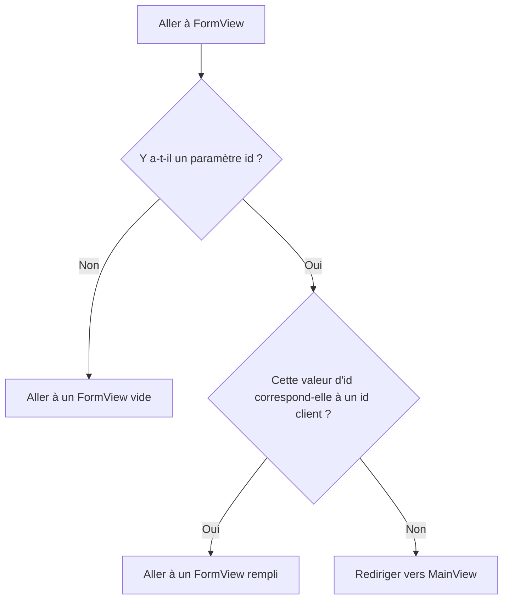

L'application provenant de [Routing and Composites](/docs/introduction/tutorial/routing-and-composites) ne peut ajouter de nouveaux clients à la base de données. En utilisant les concepts suivants, vous donnerez aux utilisateurs la possibilité également de modifier les données des clients existants :

- Modèles de routes
- Passage de valeurs de paramètres via une URL
- Observateurs de cycle de vie

Compléter cette étape crée une version de [4-observers-and-route-parameters](https://github.com/webforj/webforj-tutorial/tree/main/4-observers-and-route-parameters).

## Exécution de l'application {#running-the-app}

Au fur et à mesure que vous développez votre application, vous pouvez utiliser [4-observers-and-route-parameters](https://github.com/webforj/webforj-tutorial/tree/main/4-observers-and-route-parameters) comme comparaison. Pour voir l'application en action :

1. Accédez au répertoire de niveau supérieur contenant le fichier `pom.xml`, c'est `4-observers-and-route-parameters` si vous suivez la version sur GitHub.

2. Utilisez la commande Maven suivante pour exécuter l'application Spring Boot localement :
    ```bash
    mvn
    ```

L'exécution de l'application ouvre automatiquement un nouveau navigateur à `http://localhost:8080`.

## Utilisation de l'`id` du client {#using-the-customers-id}

Pour utiliser `FormView` pour modifier des clients existants, vous aurez besoin d'un moyen pour indiquer quel client modifier.
Vous pouvez le faire en fournissant un paramètre initial à `FormView` représentant l'ID du client.
Dans [Travailler avec les données](/docs/introduction/tutorial/working-with-data), vous avez créé une entité `Customer` qui attribue une valeur numérique `Long` comme `id` unique aux clients lorsqu'ils sont ajoutés à la base de données.

```java
 @Id
 @GeneratedValue(strategy = GenerationType.IDENTITY)
  private Long id;
```

Dans cette étape, vous allez apporter des modifications à `FormView` afin qu'il utilise un `id` comme paramètre initial avant tout chargement. Ensuite, vous ferez en sorte que `FormView` évalue l'`id` pour déterminer si le formulaire est destiné à ajouter un nouveau client ou à mettre à jour un existant. Enfin, vous modifierez `MainView` afin qu'il envoie une valeur d'`id` lors de la navigation vers `FormView`.

## Ajout d'un modèle de route à `FormView` {#adding-a-route-pattern}

Dans l'étape précédente, le fait de définir la route dans `FormView` à `@Route(customer)` mappe la classe localement à `http://localhost:8080/customer`. L'ajout d'un modèle de route vous permet d'ajouter un `id` comme paramètre initial à `FormView`.

Un [modèle de route](/docs/routing/route-patterns) vous permet d'ajouter un paramètre dans l'URL, de le rendre optionnel et de définir des contraintes sur les modèles valides. En utilisant l'annotation `@Route`, voici ce qui rend l'`id` un paramètre de route optionnel pour `FormView` :

- **`/:id`** donne au route un paramètre nommé `id`, donc en allant à `http://localhost:8080/customer/6`, `FormView` se charge avec un paramètre `id` de `6`.

- **`?`** rend le paramètre `id` optionnel. Par défaut, les paramètres sont requis, mais en rendant l'`id` optionnel, vous pouvez utiliser `FormView` pour ajouter des nouveaux clients qui n'ont pas encore d'`id`.

- **`<[0-9]+>`** contraint l'`id` à être un nombre positif. Dans les chevrons, `<>`, vous pouvez ajouter une contrainte sous forme d'expression régulière au paramètre. Si l'`id` ne correspond pas à la contrainte, par exemple, `http://localhost:8080/customer/john-smith`, cela envoie l'utilisateur vers une page 404.

Pour ajouter le paramètre de route optionnel à `FormView`, modifiez l'annotation `@Route` comme ceci :

```java
@Route("customer/:id?<[0-9]+>")
```

## Routage vers `FormView` {#routing-to-formview}

`FormView` accepte maintenant un paramètre `id` optionnel et ne se charge que si l'`id` est un nombre entier positif.

Cependant, `FormView` peut toujours se charger lorsqu'un utilisateur saisit manuellement une URL pour un client non existant, comme `http://localhost:8080/customer/5000`. L'ajout d'un observateur de cycle de vie avant d'entrer dans `FormView` permet à votre application de déterminer comment gérer la valeur d'`id` entrante.

### Routage conditionnel {#conditional-routing}

Les observateurs de cycle de vie permettent aux composants de réagir aux événements de cycle de vie à des étapes spécifiques. L'article sur les [observateurs de cycle de vie](/docs/routing/navigation-lifecycle/observers) répertorie les observateurs disponibles, mais cette étape utilise uniquement le `WillEnterObserver`.

Le `WillEnterObserver` se déclenche avant que le routage du composant ne soit terminé.
Utiliser cet observateur vous permet d'évaluer l'`id` entrant. Si l'`id` ne correspond pas à un client existant, vous pouvez rediriger l'utilisateur vers `MainView` pour trouver un client valide à modifier.

Avant de discuter du code pour le `WillEnterObserver`, le diagramme de flux suivant expose quels devraient être les résultats possibles lors du routage vers `FormView` :



### Utilisation du `WillEnterObserver` {#using-the-willenterobserver}

En utilisant l'observateur de cycle de vie qui se déclenche avant que le composant ne se charge entièrement, `WillEnterObserver`, vous pouvez ajouter des conditions pour déterminer si l'application doit continuer vers `FormView`, ou si elle doit rediriger les utilisateurs vers `MainView`.

Chaque observateur de cycle de vie est une interface, donc implémentez `WillEnterObserver` comme partie de la déclaration pour `FormView` :

```java
public class FormView extends Composite<Div> implements WillEnterObserver {
```

L'observateur `WillEnterObserver` a la méthode `onWillEnter()` que webforJ appelle avant de router vers le composant. Cette méthode a deux paramètres : l'`WillEnterEvent` et le `ParametersBag`.

L'`WillEnterEvent` détermine s'il faut continuer le routage vers le composant avec la méthode `accept()`, ou arrêter le routage en utilisant la méthode `reject()`. Après avoir rejeté la route actuelle, vous devez rediriger l'utilisateur ailleurs.

Le `ParametersBag` contient les paramètres du routeur provenant de l'URL. Vous utiliserez le `ParametersBag` dans la section suivante pour créer la logique conditionnelle pour `onWillEnter()` en utilisant le paramètre `id`.

Le code suivant pour `onWillEnter()` est un exemple avec seulement deux résultats :

```java
@Override
public void onWillEnter(WillEnterEvent event, ParametersBag parameters) {

  //Ajouter la logique conditionnelle
  if (<condition>) {

    //Permettre au routage vers FormView de se poursuivre
    event.accept();

  } else {

    //Arrêter le routage vers FormView
    event.reject();

    //Envoyer l'utilisateur vers MainView
    navigateToMain();
  }
}
```

### Utilisation de `ParametersBag` {#using-the-parametersbag}

Comme mentionné brièvement dans la section précédente, le `ParametersBag` contient le paramètre de route provenant de l'URL. Chaque observateur de cycle de vie a accès à cet objet, et l'utiliser dans votre application vous permet d'obtenir la valeur `id`.

L'objet `ParametersBag` fournit plusieurs méthodes de requête pour récupérer un paramètre sous un type d'objet spécifique. Par exemple, `getInt()` peut vous donner un paramètre en tant qu'`Integer`.

Cependant, comme certains paramètres sont optionnels, ce que `getInt()` renvoie effectivement est `Optional<Integer>`. En utilisant la méthode `ifPresentOrElse()` sur l'`Optional<Integer>`, vous pouvez définir une variable en utilisant l'`Integer`.

Lorsqu'il n'y a pas d'`id` présent, l'utilisateur peut continuer à aller vers `FormView` pour ajouter un nouveau client.

```java
@Override
public void onWillEnter(WillEnterEvent event, ParametersBag parameters) {

  //Déterminer quel paramètre obtenir et vérifier s'il est présent ou non
  parameters.getInt("id").ifPresentOrElse(id -> {

    //Utiliser l'id comme une variable
    customerId = Long.valueOf(id);

  //Lorsqu'aucun id n'est présent, continuer vers FormView pour un nouveau client
  }, () -> event.accept());

}
```

### L'`id` est-il valide ? {#is-the-id-valid}

À l'heure actuelle, le `WillEnterObserver` de la section précédente n'accepte le routage que lorsqu'aucun `id` n'est présent. L'observateur doit effectuer une vérification de plus avant de continuer vers `FormView` : vérifier que l'`id` correspond à un client existant.

Maintenant, `FormView` peut utiliser `CustomerService` pour confirmer l'existence d'un client en utilisant la méthode `doesCustomerExist()`. S'il n'y a pas de correspondance, l'application peut rejeter le routage en cours et rediriger l'utilisateur vers `MainView` en utilisant `navigateToMain()`.

Lorsque l'`id` donné est valide, l'application peut utiliser `accept()` pour continuer le routage vers `FormView`. Créez une méthode `fillForm()` pour assigner la variable `customer` au client ayant l'`id` correspondant dans la base de données et définir les valeurs des champs :

```java
public void fillForm(Long customerId) {
  customer = customerService.getCustomerByKey(customerId);
  firstName.setValue(customer.getFirstName());
  lastName.setValue(customer.getLastName());
  company.setValue(customer.getCompany());
  country.selectKey(customer.getCountry());
}
```

Tout comme lors de l'ajout d'un nouveau client, l'utilisation de la copie de travail permet aux utilisateurs de modifier les données des clients dans l'interface utilisateur sans éditer directement le référentiel.

### `onWillEnter()` complété {#completed-onwillenter}

Les deux dernières sections ont détaillé comment gérer chaque résultat pour le routage vers `FormView` en utilisant le `ParametersBag` et le `CustomerService`.

Voici le `onWillEnter()` complété pour `FormView` qui utilise le `ParametersBag` pour soit rejeter soit accepter le routage entrant, et appelle d'autres méthodes pour soit remplir le formulaire soit envoyer l'utilisateur vers `MainView` :

```java
@Override
public void onWillEnter(WillEnterEvent event, ParametersBag parameters) {

  //Déterminer quel paramètre obtenir et vérifier s'il est présent ou non
  parameters.getInt("id").ifPresentOrElse(id -> {
    customerId = Long.valueOf(id);
    //Vérifier s'il existe un client avec cet id
    if (customerService.doesCustomerExist(customerId)) {
      //Ce client existe, donc continuer vers FormView et initialiser les champs en utilisant l'id
      event.accept();
      fillForm(customerId);
    } else {
      //Ce client n'existe pas, donc rediriger vers MainView
      event.reject();
      navigateToMain();
    }

  //Aucun id n'était présent, donc continuer vers FormView pour un nouveau client
  }, () -> event.accept());

}
```

## Ajout ou modification d'un client {#adding-or-editing-a-customer}

La version précédente de cette application ajoutait uniquement de nouveaux clients lorsque l'utilisateur soumettait le formulaire. Maintenant que les utilisateurs peuvent modifier des clients existants, la méthode `submitCustomer()` doit vérifier si le client existe déjà avant de mettre à jour la base de données.

Au début, il n'était pas nécessaire d'assigner une variable pour l'`id` du client dans `FormView`, car les nouveaux clients se voient attribuer un `id` unique lorsqu'ils sont soumis dans la base de données. Cependant, si vous déclarez `customerId` comme une variable initiale dans `FormView` avec une valeur d'`id` qui n'est pas utilisée, elle reste intacte pour les nouveaux clients, et est réécrite dans `onWillEnter()` pour les existants.

Cela vous permet d'utiliser `doesCustomerExist()` pour vérifier s'il faut ajouter un nouveau client ou mettre à jour un existant.

```java
private Long customerId = 0L;

//...

private void submitCustomer() {
  if (customerService.doesCustomerExist(customerId)) {
    customerService.updateCustomer(customer);
  } else {
    customerService.createCustomer(customer);
  }
  navigateToMain();
}
```

## `FormView` complété {#completed-formview}

Voici à quoi devrait ressembler `FormView`, maintenant qu'il peut gérer la modification de clients existants :

```java
@Route("customer/:id?<[0-9]+>")
@FrameTitle("Formulaire Client")
public class FormView extends Composite<Div> implements WillEnterObserver {
  private final CustomerService customerService;
  private Customer customer = new Customer();
  private Long customerId = 0L;
  private Div self = getBoundComponent();
  private TextField firstName = new TextField("Prénom", e -> customer.setFirstName(e.getValue()));
  private TextField lastName = new TextField("Nom de famille", e -> customer.setLastName(e.getValue()));
  private TextField company = new TextField("Société", e -> customer.setCompany(e.getValue()));
  private ChoiceBox country = new ChoiceBox("Pays",
      e -> customer.setCountry((Customer.Country) e.getSelectedItem().getKey()));
  private Button submit = new Button("Soumettre", ButtonTheme.PRIMARY, e -> submitCustomer());
  private Button cancel = new Button("Annuler", ButtonTheme.OUTLINED_PRIMARY, e -> navigateToMain());
  private ColumnsLayout layout = new ColumnsLayout(
      firstName, lastName,
      company, country,
      submit, cancel);

  public FormView(CustomerService customerService) {
    this.customerService = customerService;
    fillCountries();
    setColumnsLayout();
    self.setMaxWidth(600)
        .addClassName("card")
        .add(layout);
    submit.setStyle("margin-top", "var(--dwc-space-l)");
    cancel.setStyle("margin-top", "var(--dwc-space-l)");
  }

  private void setColumnsLayout() {
    List<Breakpoint> breakpoints = List.of(
        new Breakpoint(600, 2));
    layout.setSpacing("var(--dwc-space-l)")
        .setBreakpoints(breakpoints);
  }

  private void fillCountries() {
    ArrayList<ListItem> listCountries = new ArrayList<>();
    for (Country countryItem : Customer.Country.values()) {
      listCountries.add(new ListItem(countryItem, countryItem.toString()));
    }
    country.insert(listCountries);
    country.selectIndex(0);
  }

  private void submitCustomer() {
    if (customerService.doesCustomerExist(customerId)) {
      customerService.updateCustomer(customer);
    } else {
      customerService.createCustomer(customer);
    }
    navigateToMain();
  }

  private void navigateToMain() {
    Router.getCurrent().navigate(MainView.class);
  }

  @Override
  public void onWillEnter(WillEnterEvent event, ParametersBag parameters) {
    parameters.getInt("id").ifPresentOrElse(id -> {
      customerId = Long.valueOf(id);
      if (customerService.doesCustomerExist(customerId)) {
        event.accept();
        fillForm(customerId);
      } else {
        event.reject();
        navigateToMain();
      }

    }, () -> event.accept());
  }

  public void fillForm(Long customerId) {
    customer = customerService.getCustomerByKey(customerId);
    firstName.setValue(customer.getFirstName());
    lastName.setValue(customer.getLastName());
    company.setValue(customer.getCompany());
    country.selectKey(customer.getCountry());
  }
}
```

## Navigation de `MainView` vers `FormView` pour modifier des clients {#navigating-from-mainview-to-formview-to-edit-customers}

Au début de cette étape, vous avez utilisé un `ParametersBag` existant pour déterminer la valeur d'un `id`. La création d'un nouveau `ParametersBag` vous permet de naviguer entre les classes directement avec les paramètres de votre choix. Utiliser les données dans le `Table` est une option viable pour envoyer les utilisateurs vers `FormView` avec un `id` de client.

Similaire au bouton, lier la navigation à une action choisie par l'utilisateur lui permet de décider quand aller à `FormView`. Ajouter un écouteur d'événements au `Table` vous permet d'envoyer l'utilisateur vers `FormView` avec un `ParametersBag` :

```java
table.addItemClickListener(this::editCustomer);

private void editCustomer(TableItemClickEvent<Customer> e) {
  Router.getCurrent().navigate(FormView.class,
      ParametersBag.of("id=" + e.getItemKey()));
}
```

Cependant, la clé des éléments du `Table` est générée automatiquement par défaut. Vous pouvez explicitement faire en sorte que chaque clé corresponde à l'`id` d'un client en utilisant la méthode `setKeyProvider()` :

```java
table.setKeyProvider(Customer::getId);
```

Dans `MainView`, ajoutez les méthodes `addItemClickListener()` et `setKeyProvider()` à `buildTable()`, puis ajoutez la méthode qui envoie l'utilisateur vers `FormView` avec une valeur pour l'`id` dans le `ParametersBag` en fonction de l'endroit où l'utilisateur a cliqué sur le tableau :

```java title="MainView.java" {30-31,34-37}
@Route("/")
@FrameTitle("Tableau des Clients")
public class MainView extends Composite<Div> {
  private final CustomerService customerService;
  private Div self = getBoundComponent();
  private Table<Customer> table = new Table<>();
  private Button addCustomer = new Button("Ajouter un client", ButtonTheme.PRIMARY,
      e -> Router.getCurrent().navigate(FormView.class));

  public MainView(CustomerService customerService) {
    this.customerService = customerService;
    addCustomer.setWidth(200);
    buildTable();
    self.setWidth("fit-content")
        .addClassName("card")
        .add(table, addCustomer);
  }

  private void buildTable() {
    table.setSize("1000px", "294px");
    table.setMaxWidth("90vw");
    table.addColumn("firstName", Customer::getFirstName).setLabel("Prénom");
    table.addColumn("lastName", Customer::getLastName).setLabel("Nom de famille");
    table.addColumn("company", Customer::getCompany).setLabel("Société");
    table.addColumn("country", Customer::getCountry).setLabel("Pays");
    table.setColumnsToAutoFit();
    table.setColumnsToResizable(false);
    table.getColumns().forEach(column -> column.setSortable(true));
    table.setRepository(customerService.getRepositoryAdapter());
    table.setKeyProvider(Customer::getId);
    table.addItemClickListener(this::editCustomer);
  }

  private void editCustomer(TableItemClickEvent<Customer> e) {
    Router.getCurrent().navigate(FormView.class,
        ParametersBag.of("id=" + e.getItemKey()));
  }
}
```

## Prochaine étape {#next-step}

Maintenant que les utilisateurs peuvent modifier directement les données des clients, votre application doit valider les changements avant de les valider dans le référentiel. Dans [Validation et liaison des données](/docs/introduction/tutorial/validating-and-binding-data), vous allez créer des règles de validation et associer directement le modèle de données à l'interface utilisateur, permettant aux composants d'afficher des messages d'erreur lorsque les données sont invalides.
