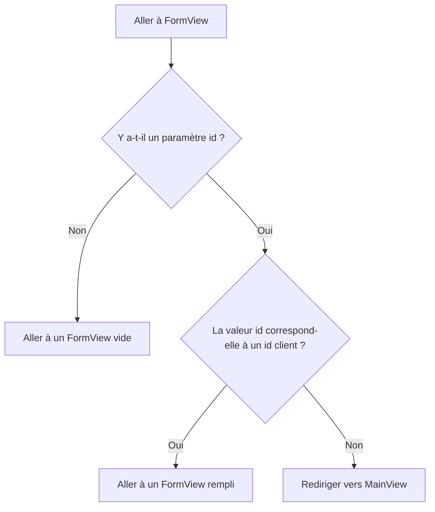

L'application de [Routing and Composites](/docs/introduction/tutorial/routing-and-composites) ne peut ajouter que de nouveaux clients à la base de données. En utilisant les concepts suivants, vous donnerez aux utilisateurs la possibilité de modifier également les données des clients existants :

- Modèles de route
- Passage des valeurs de paramètre via une URL
- Observateurs de cycle de vie

Compléter cette étape crée une version de [4-observers-and-route-parameters](https://github.com/webforj/webforj-tutorial/tree/main/4-observers-and-route-parameters).

## Exécution de l'application {#running-the-app}

Au fur et à mesure que vous développez votre application, vous pouvez utiliser [4-observers-and-route-parameters](https://github.com/webforj/webforj-tutorial/tree/main/4-observers-and-route-parameters) comme comparaison. Pour voir l'application en action :

1. Naviguez vers le répertoire racine contenant le fichier `pom.xml`, qui est `4-observers-and-route-parameters` si vous suivez la version sur GitHub.

2. Utilisez la commande Maven suivante pour exécuter l'application Spring Boot localement :
    ```bash
    mvn
    ```

L'exécution de l'application ouvre automatiquement un nouveau navigateur à `http://localhost:8080`.

## Utilisation de l'`id` du client {#using-the-customers-id}

Pour utiliser `FormView` pour modifier les clients existants, vous aurez besoin d'un moyen de lui indiquer quel client modifier. Vous pouvez le faire en fournissant un paramètre initial à `FormView` représentant l'ID du client. Dans [Working with Data](/docs/introduction/tutorial/working-with-data), vous avez créé une entité `Customer` qui attribue une valeur numérique `Long` comme `id` unique aux clients lorsqu'ils sont ajoutés à la base de données.

```java
 @Id
 @GeneratedValue(strategy = GenerationType.IDENTITY)
  private Long id;
```

Dans cette étape, vous apporterez des modifications à `FormView` afin qu'il utilise un `id` comme paramètre initial avant le chargement. Ensuite, vous ferez en sorte que `FormView` évalue l'`id` pour déterminer si le formulaire est destiné à ajouter un nouveau client ou à mettre à jour un client existant. Enfin, vous modifierez `MainView` afin qu'il envoie une valeur d'`id` lors de la navigation vers `FormView`.

## Ajout d'un modèle de route à `FormView` {#adding-a-route-pattern}

Dans l'étape précédente, la définition de la route dans `FormView` à `@Route(customer)` mappe la classe localement à `http://localhost:8080/customer`. L'ajout d'un modèle de route vous permet d'ajouter un `id` comme paramètre initial à `FormView`.

Un [Modèle de Route](/docs/routing/route-patterns) vous permet d'ajouter un paramètre dans l'URL, de le rendre optionnel et de définir des contraintes sur les modèles valides. En utilisant l'annotation `@Route`, voici ce qui rend `id` un paramètre de route optionnel pour `FormView` :

- **`/:id`** donne au route un paramètre nommé `id`, donc aller à `http://localhost:8080/customer/6` charge `FormView` avec un paramètre `id` de `6`.

- **`?`** rend le paramètre `id` optionnel. Par défaut, les paramètres sont requis, mais rendre l'`id` optionnel vous permet d'utiliser `FormView` pour ajouter de nouveaux clients qui n'ont pas encore d'`id`.

- **`<[0-9]+>`** contraint `id` à être un nombre positif. Dans des chevrons, `<>`, vous pouvez ajouter une contrainte sous forme d'expression régulière au paramètre. Si l'`id` ne correspond pas à la contrainte, par exemple, `http://localhost:8080/customer/john-smith`, cela envoie l'utilisateur à une page 404.

Pour ajouter le paramètre de route optionnel à `FormView`, modifiez l'annotation `@Route` comme suit :

```java
@Route("customer/:id?<[0-9]+>")
```

## Routage vers `FormView` {#routing-to-formview}

`FormView` accepte désormais un paramètre `id` optionnel et ne se charge que si l'`id` est un nombre positif entier.

Cependant, `FormView` peut encore se charger lorsqu'un utilisateur saisit manuellement une URL pour un client non existant, comme `http://localhost:8080/customer/5000`. L'ajout d'un observateur de cycle de vie avant d'entrer dans `FormView` permet à votre application de déterminer comment gérer la valeur `id` entrante.

### Routage conditionnel {#conditional-routing}

Les observateurs de cycle de vie permettent aux composants de réagir aux événements de cycle de vie à des étapes spécifiques. L'article sur les [Observateurs de Cycle de Vie](/docs/routing/navigation-lifecycle/observers) liste les observateurs disponibles, mais cette étape n'utilise que le `WillEnterObserver`.

Le `WillEnterObserver` se déclenche avant que le routage du composant ne soit terminé. En utilisant cet observateur, vous pouvez évaluer l'`id` entrant. Si l'`id` ne correspond pas à un client existant, vous pouvez rediriger l'utilisateur vers `MainView` pour trouver un client valide à modifier.

Avant de discuter du code pour le `WillEnterObserver`, le diagramme de flux suivant présente les résultats possibles lors du routage vers `FormView` :



### Utilisation du `WillEnterObserver` {#using-the-willenterobserver}

En utilisant l'observateur de cycle de vie qui se déclenche avant que le composant ne se charge complètement, `WillEnterObserver`, vous pouvez ajouter des conditions pour déterminer si l'application doit continuer vers `FormView`, ou si elle doit rediriger les utilisateurs vers `MainView`.

Chaque observateur de cycle de vie est une interface, donc implémentez `WillEnterObserver` comme partie de la déclaration pour `FormView` :

```java
public class FormView extends Composite<Div> implements WillEnterObserver {
```

L'observateur `WillEnterObserver` possède la méthode `onWillEnter()` que webforJ appelle avant le routage vers le composant. Cette méthode a deux paramètres : le `WillEnterEvent` et le `ParametersBag`.

Le `WillEnterEvent` détermine s'il faut continuer à router vers le composant avec la méthode `accept()`, ou arrêter le routage en utilisant la méthode `reject()`. Après avoir rejeté la route actuelle, vous devez rediriger l'utilisateur ailleurs.

Le `ParametersBag` contient les paramètres de routage de l'URL. Vous utiliserez le `ParametersBag` dans la section suivante pour créer la logique conditionnelle pour `onWillEnter()` à l'aide du paramètre `id`.

Le `onWillEnter()` suivant est un exemple avec seulement deux résultats :

```java
@Override
public void onWillEnter(WillEnterEvent event, ParametersBag parameters) {

  //Ajoutez la logique conditionnelle
  if (<condition>) {

    //Permettre le routage vers FormView de se poursuivre
    event.accept();

  } else {

    //Arrêter le routage vers FormView
    event.reject();

    //Envoyer l'utilisateur à MainView
    navigateToMain();
  }
}
```

### Utilisation du `ParametersBag` {#using-the-parametersbag}

Comme mentionné brièvement dans la section précédente, le `ParametersBag` contient le paramètre de routage de l'URL. Chaque observateur de cycle de vie a accès à cet objet, et son utilisation dans votre application vous permet d'obtenir la valeur `id`.

L'objet `ParametersBag` fournit plusieurs méthodes de requête pour récupérer un paramètre sous un type d'objet spécifique. Par exemple, `getInt()` peut vous donner un paramètre sous forme d'`Integer`.

Cependant, comme certains paramètres sont optionnels, ce que `getInt()` retourne en réalité est `Optional<Integer>`. En utilisant la méthode `ifPresentOrElse()` sur l'`Optional<Integer>`, vous pouvez définir une variable en utilisant l'`Integer`.

Lorsqu'il n'y a pas d'`id` présent, l'utilisateur peut continuer à aller à `FormView` pour ajouter un nouveau client.

```java
@Override
public void onWillEnter(WillEnterEvent event, ParametersBag parameters) {

  //Déterminez quel paramètre obtenir, et vérifiez s'il est présent ou non
  parameters.getInt("id").ifPresentOrElse(id -> {

    //Utilisez l'id comme une variable
    customerId = Long.valueOf(id);

  //Lorsque aucun id n'est présent, continuez vers FormView pour un nouveau client
  }, () -> event.accept());
        
}
```

### L'`id` est-il valide ? {#is-the-id-valid}

Pour le moment, le `WillEnterObserver` de la section précédente n'accepte le routage que lorsqu'aucun `id` n'est présent. L'observateur doit réaliser une vérification supplémentaire avant de continuer vers `FormView` : vérifier que l'`id` correspond à un client existant.

Maintenant, `FormView` peut utiliser `CustomerService` pour confirmer l'existence d'un client à l'aide de la méthode `doesCustomerExist()`. S'il n'y a pas de correspondance, l'application peut rejeter le routage actuel et rediriger l'utilisateur vers `MainView` à l'aide de `navigateToMain()`.

Lorsqu'un `id` valide est donné, l'application peut utiliser `accept()` pour continuer le routage vers `FormView`. Créez une méthode `fillForm()` pour assigner la variable `customer` au client avec l'`id` correspondant dans la base de données et définir les valeurs des champs :

```java
public void fillForm(Long customerId) {
  customer = customerService.getCustomerByKey(customerId);
  firstName.setValue(customer.getFirstName());
  lastName.setValue(customer.getLastName());
  company.setValue(customer.getCompany());
  country.selectKey(customer.getCountry());
}
```

Comme lors de l'ajout d'un nouveau client, l'utilisation de la copie de travail permet aux utilisateurs de modifier les données du client dans l'interface utilisateur sans modifier directement le dépôt.

### `onWillEnter()` complété {#completed-onwillenter}

Les deux dernières sections ont détaillé comment gérer chaque résultat pour le routage vers `FormView` en utilisant le `ParametersBag` et le `CustomerService`.

Voici le `onWillEnter()` complété pour `FormView` qui utilise le `ParametersBag` pour rejeter ou accepter la route entrante, et appelle d'autres méthodes pour remplir le formulaire ou envoyer l'utilisateur à `MainView` :

```java
@Override
public void onWillEnter(WillEnterEvent event, ParametersBag parameters) {

  //Déterminez quel paramètre obtenir, et vérifiez s'il est présent ou non
  parameters.getInt("id").ifPresentOrElse(id -> {
    customerId = Long.valueOf(id);
    if (customerService.doesCustomerExist(customerId)) {
      //Ce client existe, donc continuez vers FormView, et initialisez les champs en utilisant l'id
      event.accept();
      fillForm(customerId);
    } else {
      //Ce client n'existe pas, donc redirigez vers MainView
      event.reject();
      navigateToMain();
    }

  //Aucun id n'était présent, donc continuez vers FormView pour un nouveau client
  }, () -> event.accept());
        
}
```

## Ajout ou modification d'un client {#adding-or-editing-a-customer}

La version précédente de cette application n'ajoutait que de nouveaux clients lorsque l'utilisateur soumettait le formulaire. Maintenant que les utilisateurs peuvent modifier des clients existants, la méthode `submitCustomer()` doit vérifier si le client existe déjà avant de mettre à jour la base de données.

Au départ, il n'était pas nécessaire d'assigner une variable pour l'`id` du client dans `FormView`, car les nouveaux clients se voient attribuer un `id` unique lorsqu'ils sont soumis dans la base de données. Cependant, si vous déclarez `customerId` comme une variable initiale dans `FormView` avec une valeur d'`id` qui n'est pas utilisée, elle reste intacte pour les nouveaux clients et est écrasée dans `onWillEnter()` pour les existants.

Cela vous permet d'utiliser `doesCustomerExist()` pour vérifier s'il faut ajouter un nouveau client ou mettre à jour un existant.

```java
private Long customerId = 0L;

//...

private void submitCustomer() {
  if (customerService.doesCustomerExist(customerId)) {
    customerService.updateCustomer(customer);
  } else {
    customerService.createCustomer(customer);
  }
  navigateToMain();
}
```

## `FormView` complété {#completed-formview}

Voici à quoi `FormView` devrait ressembler, maintenant qu'il peut gérer la modification de clients existants : 

## Navigation depuis `MainView` vers `FormView` pour modifier des clients {#navigating-from-mainview-to-formview-to-edit-customers}

Plus tôt dans cette étape, vous avez utilisé un `ParametersBag` existant pour déterminer la valeur d'un `id`. La création d'un nouveau `ParametersBag` vous permet de naviguer entre les classes directement avec les paramètres de votre choix. L'utilisation des données dans le `Table` est une option viable pour envoyer les utilisateurs vers `FormView` avec un `id` client.

Similaire au bouton, lier la navigation à une action choisie par l'utilisateur lui permet de décider quand aller à `FormView`. Ajouter un auditeur d'événements au `Table` vous permet d'envoyer l'utilisateur vers `FormView` avec un `ParametersBag` :

```java
table.addItemClickListener(this::editCustomer);

private void editCustomer(TableItemClickEvent<Customer> e) {
  Router.getCurrent().navigate(FormView.class,
      ParametersBag.of("id=" + e.getItemKey()));
}
```

Cependant, la clé des éléments du `Table` est générée automatiquement par défaut. Vous pouvez faire en sorte que chaque clé corresponde explicitement à l'`id` d'un client en utilisant la méthode `setKeyProvider()` :

```java
table.setKeyProvider(Customer::getId);
```

Dans `MainView`, ajoutez les méthodes `addItemClickListener()` et `setKeyProvider()` à `buildTable()`, puis ajoutez la méthode qui envoie l'utilisateur vers `FormView` avec une valeur pour l'`id` dans le `ParametersBag` en fonction de l'endroit où l'utilisateur a cliqué dans le tableau :

```java title="MainView.java" {30-31,34-37}
@Route("/")
@FrameTitle("Table des Clients")
public class MainView extends Composite<Div> {
  private final CustomerService customerService;
  private Div self = getBoundComponent();
  private Table<Customer> table = new Table<>();
  private Button addCustomer = new Button("Ajouter un Client", ButtonTheme.PRIMARY,
      e -> Router.getCurrent().navigate(FormView.class));

  public MainView(CustomerService customerService) {
    this.customerService = customerService;
    addCustomer.setWidth(200);
    buildTable();
    self.setWidth("fit-content")
        .addClassName("card")
        .add(table, addCustomer);
  }

  private void buildTable() {
    table.setSize("1000px", "294px");
    table.setMaxWidth("90vw");
    table.addColumn("firstName", Customer::getFirstName).setLabel("Prénom");
    table.addColumn("lastName", Customer::getLastName).setLabel("Nom");
    table.addColumn("company", Customer::getCompany).setLabel("Société");
    table.addColumn("country", Customer::getCountry).setLabel("Pays");
    table.setColumnsToAutoFit();
    table.setColumnsToResizable(false);
    table.getColumns().forEach(column -> column.setSortable(true));
    table.setRepository(customerService.getRepositoryAdapter());
    table.setKeyProvider(Customer::getId);
    table.addItemClickListener(this::editCustomer);
  }

  private void editCustomer(TableItemClickEvent<Customer> e) {
    Router.getCurrent().navigate(FormView.class,
        ParametersBag.of("id=" + e.getItemKey()));
  }
}
```

## Prochaine étape {#next-step}

Maintenant que les utilisateurs peuvent modifier directement les données des clients, votre application doit valider les modifications avant de les engager dans le dépôt. Dans [Validating and Binding Data](/docs/introduction/tutorial/validating-and-binding-data), vous allez créer des règles de validation et associer directement le modèle de données à l'interface utilisateur, permettant aux composants d'afficher des messages d'erreur lorsque les données sont invalides.
