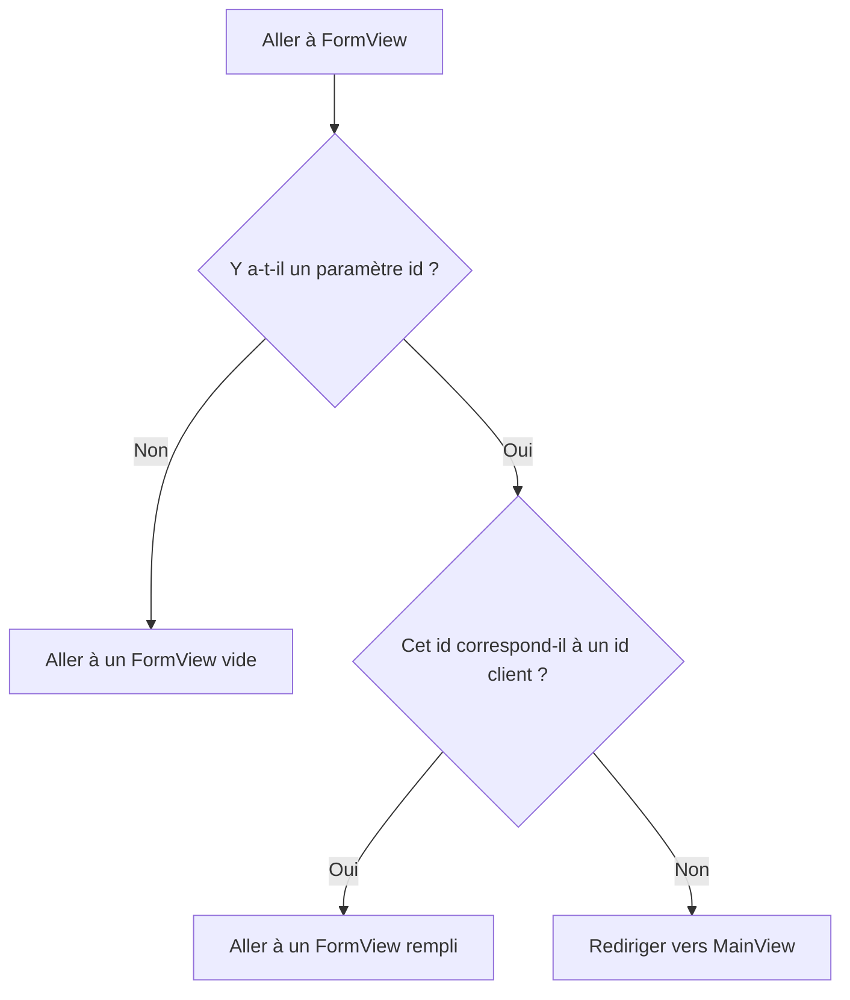

L’application de [Routing and Composites](/docs/introduction/tutorial/routing-and-composites) ne peut ajouter de nouveaux clients qu'à la base de données. En utilisant les concepts suivants, vous permettrez aux utilisateurs d’éditer également les données des clients existants :

- Modèles de route
- Passer des valeurs de paramètres via une URL
- Observateurs de cycle de vie

Compléter cette étape crée une version de [4-observers-and-route-parameters](https://github.com/webforj/webforj-tutorial/tree/main/4-observers-and-route-parameters).

## Exécution de l'application {#running-the-app}

Au fur et à mesure que vous développez votre application, vous pouvez utiliser [4-observers-and-route-parameters](https://github.com/webforj/webforj-tutorial/tree/main/4-observers-and-route-parameters) comme comparaison. Pour voir l'application en action :

1. Naviguez jusqu'au répertoire de niveau supérieur contenant le fichier `pom.xml`, qui est `4-observers-and-route-parameters` si vous suivez la version sur GitHub.

2. Utilisez la commande Maven suivante pour exécuter l'application Spring Boot localement :
    ```bash
    mvn
    ```

L'exécution de l'application ouvre automatiquement un nouveau navigateur à `http://localhost:8080`.

## Utilisation de l'`id` du client {#using-the-customers-id}

Pour utiliser `FormView` pour éditer des clients existants, vous aurez besoin d'un moyen de lui indiquer quel client éditer. Vous pouvez le faire en fournissant un paramètre initial à `FormView` représentant l'ID du client. Dans [Travailler avec les données](/docs/introduction/tutorial/working-with-data), vous avez créé une entité `Customer` qui attribue une valeur numérique `Long` comme identifiant unique `id` aux clients lorsqu'ils sont ajoutés à la base de données.

```java
 @Id
 @GeneratedValue(strategy = GenerationType.IDENTITY)
  private Long id;
```

Dans cette étape, vous allez apporter des modifications à `FormView` afin qu'il utilise un `id` en tant que paramètre initial avant que quoi que ce soit ne soit chargé. Ensuite, vous ferez en sorte que `FormView` évalue l'`id` pour déterminer si le formulaire est destiné à ajouter un nouveau client ou à mettre à jour un existant. Enfin, vous modifierez `MainView` pour qu'elle envoie une valeur d'`id` lors de la navigation vers `FormView`.

## Ajout d'un modèle de route à `FormView` {#adding-a-route-pattern}

Dans l'étape précédente, la définition de la route dans `FormView` comme `@Route(customer)` associe la classe localement à `http://localhost:8080/customer`. Ajouter un modèle de route vous permet d’ajouter un `id` comme paramètre initial à `FormView`.

Un [Modèle de Route](/docs/routing/route-patterns) vous permet d’ajouter un paramètre dans l'URL, de le rendre optionnel et de définir des contraintes sur les modèles valides. En utilisant l'annotation `@Route`, voici ce qui rend l'`id` un paramètre de route optionnel pour `FormView` :

- **`/:id`** attribue un paramètre nommé `id` à la route, donc en accédant à `http://localhost:8080/customer/6`, `FormView` se charge avec un paramètre `id` de `6`.

- **`?`** rend le paramètre `id` optionnel. Par défaut, les paramètres sont requis, mais en rendant l'`id` optionnel, vous pouvez utiliser `FormView` pour ajouter des nouveaux clients qui n'ont pas encore d'`id`.

- **`<[0-9]+>`** contraint l'`id` à être un nombre positif. Dans les chevrons, `<>`, vous pouvez ajouter une contrainte sous forme d’expression régulière au paramètre. Si l'`id` ne correspond pas à la contrainte, par exemple `http://localhost:8080/customer/john-smith`, cela envoie l'utilisateur à une page 404.

Pour ajouter le paramètre de route optionnel à `FormView`, changez l'annotation `@Route` en ceci :

```java
@Route("customer/:id?<[0-9]+>")
```

## Routr à `FormView` {#routing-to-formview}

`FormView` accepte désormais un paramètre `id` optionnel et ne se charge que si l'`id` est un nombre entier positif.

Cependant, `FormView` peut toujours se charger lorsqu'un utilisateur saisit manuellement une URL pour un client inexistant, comme `http://localhost:8080/customer/5000`. Ajouter un observateur de cycle de vie avant d'entrer dans `FormView` permet à votre application de déterminer comment gérer la valeur `id` entrante.

### Routage conditionnel {#conditional-routing}

Les observateurs de cycle de vie permettent aux composants de réagir aux événements de cycle de vie à des étapes spécifiques. L'article [Observateurs de Cycle de Vie](/docs/routing/navigation-lifecycle/observers) répertorie les observateurs disponibles, mais cette étape n'utilise que le `WillEnterObserver`.

Le moment d'`WillEnterObserver` se produit avant que le routage du composant ne soit terminé. Utiliser cet observateur vous permet d'évaluer l'`id` entrant. Si l'`id` ne correspond pas à un client existant, vous pouvez rediriger l'utilisateur vers `MainView` pour trouver un client valide à éditer.

Avant de discuter du code pour le `WillEnterObserver`, le diagramme ci-dessous expose ce que devraient être les résultats possibles lors du routage vers `FormView` :


```mermaid
flowchart TD
    A[Aller à FormView] --> B{Y a-t-il un paramètre id ?}
    B -->|Non| C[Aller à un FormView vide]
    B -->|Oui| D{Cet id correspond-il à un id client ?}
    D -->|Oui| E[Aller à un FormView rempli]
    D -->|Non| F[Rediriger vers MainView]
```

### Utilisation du `WillEnterObserver` {#using-the-willenterobserver}

L'utilisation de l'observateur de cycle de vie qui se déclenche avant que le composant ne soit entièrement chargé, `WillEnterObserver`, vous permet d'ajouter des conditions pour déterminer si l'application doit continuer vers `FormView`, ou si elle doit rediriger les utilisateurs vers `MainView`.

Chaque observateur de cycle de vie est une interface, donc implémentez `WillEnterObserver` comme partie de la déclaration de `FormView` :

```java
public class FormView extends Composite<Div> implements WillEnterObserver {
```

L'observateur `WillEnterObserver` a la méthode `onWillEnter()` que webforJ appelle avant le routage vers le composant. Cette méthode a deux paramètres : le `WillEnterEvent` et le `ParametersBag`.

Le `WillEnterEvent` détermine si le routage doit continuer vers le composant avec la méthode `accept()`, ou arrêter le routage en utilisant la méthode `reject()`. Après avoir rejeté la route courante, vous devez rediriger l'utilisateur vers un autre endroit.

Le `ParametersBag` contient les paramètres du routeur de l'URL. Vous utiliserez le `ParametersBag` dans la section suivante pour créer la logique conditionnelle pour `onWillEnter()` en utilisant le paramètre `id`.

L’exemple suivant de `onWillEnter()` est un exemple avec seulement deux résultats :

```java
@Override
public void onWillEnter(WillEnterEvent event, ParametersBag parameters) {

  //Ajouter la logique conditionnelle
  if (<condition>) {

    //Permettre au routage vers FormView de se poursuivre
    event.accept();

  } else {

    //Arrêter le routage vers FormView
    event.reject();

    //Envoyer l'utilisateur à MainView
    navigateToMain();
  }
}
```

### Utilisation du `ParametersBag` {#using-the-parametersbag}

Comme mentionné brièvement dans la section précédente, le `ParametersBag` contient le paramètre du routeur de l'URL. Chaque observateur de cycle de vie a accès à cet objet, et l'utiliser dans votre application vous permet d'obtenir la valeur `id`.

L'objet `ParametersBag` fournit plusieurs méthodes de requête pour récupérer un paramètre sous un type d'objet spécifique. Par exemple, `getInt()` peut vous obtenir un paramètre sous forme d'`Integer`.

Cependant, puisque certains paramètres sont optionnels, ce que `getInt()` retourne en réalité est `Optional<Integer>`. Utiliser la méthode `ifPresentOrElse()` sur l’`Optional<Integer>` vous permet de définir une variable en utilisant l’`Integer`.

Lorsqu'aucun `id` n'est présent, l'utilisateur peut continuer à se rendre à `FormView` pour ajouter un nouveau client.

```java
@Override
public void onWillEnter(WillEnterEvent event, ParametersBag parameters) {

  //Déterminer quel paramètre obtenir et vérifier s'il est présent ou non
  parameters.getInt("id").ifPresentOrElse(id -> {

    //Utiliser l'id comme variable
    customerId = Long.valueOf(id);

  //Lorsque aucun id n'est présent, continuer à FormView pour un nouveau client
  }, () -> event.accept());

}
```

### L'`id` est-il valide ? {#is-the-id-valid}

Pour le moment, le `WillEnterObserver` de la section précédente n'accepte le routage que lorsqu'aucun `id` n'est présent. L'observateur doit effectuer une vérification supplémentaire avant de continuer vers `FormView` : vérifier que l'`id` correspond à un client existant.

Maintenant, `FormView` peut utiliser `CustomerService` pour confirmer l'existence d'un client en utilisant la méthode `doesCustomerExist()`. S'il n'y a pas de correspondance, l'application peut rejeter le routage courant et rediriger l'utilisateur vers `MainView` à l'aide de `navigateToMain()`.

Lorsqu'un `id` valide est donné, l'application peut utiliser `accept()` pour continuer le routage vers `FormView`. Créez une méthode `fillForm()` pour attribuer la variable `customer` au client correspondant à l'`id` dans la base de données et définir les valeurs des champs :

```java
public void fillForm(Long customerId) {
  customer = customerService.getCustomerByKey(customerId);
  firstName.setValue(customer.getFirstName());
  lastName.setValue(customer.getLastName());
  company.setValue(customer.getCompany());
  country.selectKey(customer.getCountry());
}
```

Comme lors de l'ajout d'un nouveau client, l'utilisation de la copie de travail permet aux utilisateurs d'éditer les données du client dans l'interface utilisateur sans pour autant éditer directement le dépôt.

### `onWillEnter()` complété {#completed-onwillenter}

Les deux dernières sections ont examiné en détail comment gérer chaque résultat pour le routage dans `FormView` en utilisant le `ParametersBag` et le `CustomerService`.

Voici le `onWillEnter()` complet pour `FormView` qui utilise le `ParametersBag` pour rejeter ou accepter la route entrante et appelle d'autres méthodes pour remplir le formulaire ou envoyer l'utilisateur à `MainView` :

```java
@Override
public void onWillEnter(WillEnterEvent event, ParametersBag parameters) {

  //Déterminer quel paramètre obtenir et vérifier s'il est présent ou non
  parameters.getInt("id").ifPresentOrElse(id -> {
    customerId = Long.valueOf(id);
    //Vérifier s'il existe un client avec cet id
    if (customerService.doesCustomerExist(customerId)) {
        //Ce client existe, donc continuer vers FormView, et initialiser les champs en utilisant l'id
        event.accept();
        fillForm(customerId);
      } else {
        //Ce client n'existe pas, donc rediriger vers MainView
        event.reject();
        navigateToMain();
      }
  //Aucun id n'était présent, donc continuer vers FormView pour un nouveau client
  }, () -> event.accept());
}
```

## Ajouter ou éditer un client {#adding-or-editing-a-customer}

La version précédente de cette application ne faisait qu’ajouter de nouveaux clients lorsque l'utilisateur soumettait le formulaire. Maintenant que les utilisateurs peuvent éditer des clients existants, la méthode `submitCustomer()` doit vérifier si le client existe déjà avant de mettre à jour la base de données.

Initialement, il n'était pas nécessaire d'assigner une variable pour l'`id` du client dans `FormView`, car de nouveaux clients se voient attribuer un identifiant unique un `id` lorsqu'ils sont soumis dans la base de données. Cependant, si vous déclarez `customerId` comme une variable initiale dans `FormView` avec une valeur d'`id` qui n'est pas utilisée, elle reste intacte pour les nouveaux clients et est écrasée dans `onWillEnter()` pour les existants.

Cela vous permet d'utiliser `doesCustomerExist()` pour vérifier si vous devez ajouter un nouveau client ou mettre à jour un existant.

```java
private Long customerId = 0L;

//...

private void submitCustomer() {
  if (customerService.doesCustomerExist(customerId)) {
    customerService.updateCustomer(customer);
  } else {
    customerService.createCustomer(customer);
  }
  navigateToMain();
}
```

## `FormView` complété {#completed-formview}

Voici à quoi `FormView` devrait ressembler, maintenant qu'il peut gérer l'édition de clients existants :

<ExpandableCode title="FormView.java" language="java" startLine={1} endLine={15}>

```java
@Route("customer/:id?<[0-9]+>")
@FrameTitle("Formulaire Client")
public class FormView extends Composite<Div> implements WillEnterObserver {
  private final CustomerService customerService;
  private Customer customer = new Customer();
  private Long customerId = 0L;
  private Div self = getBoundComponent();
  private TextField firstName = new TextField("Prénom", e -> customer.setFirstName(e.getValue()));
  private TextField lastName = new TextField("Nom de famille", e -> customer.setLastName(e.getValue()));
  private TextField company = new TextField("Société", e -> customer.setCompany(e.getValue()));
  private ChoiceBox country = new ChoiceBox("Pays",
      e -> customer.setCountry((Customer.Country) e.getSelectedItem().getKey()));
  private Button submit = new Button("Soumettre", ButtonTheme.PRIMARY, e -> submitCustomer());
  private Button cancel = new Button("Annuler", ButtonTheme.OUTLINED_PRIMARY, e -> navigateToMain());
  private ColumnsLayout layout = new ColumnsLayout(
      firstName, lastName,
      company, country,
      submit, cancel);

  public FormView(CustomerService customerService) {
    this.customerService = customerService;
    fillCountries();
    setColumnsLayout();
    self.setMaxWidth(600)
        .addClassName("card")
        .add(layout);
    submit.setStyle("margin-top", "var(--dwc-space-l)");
    cancel.setStyle("margin-top", "var(--dwc-space-l)");
  }

  private void setColumnsLayout() {
    List<Breakpoint> breakpoints = List.of(
        new Breakpoint(600, 2));
    layout.setSpacing("var(--dwc-space-l)")
        .setBreakpoints(breakpoints);
  }

  private void fillCountries() {
    ArrayList<ListItem> listCountries = new ArrayList<>();
    for (Country countryItem : Customer.Country.values()) {
      listCountries.add(new ListItem(countryItem, countryItem.toString()));
    }
    country.insert(listCountries);
    country.selectIndex(0);
  }

  private void submitCustomer() {
    if (customerService.doesCustomerExist(customerId)) {
      customerService.updateCustomer(customer);
    } else {
      customerService.createCustomer(customer);
    }
    navigateToMain();
  }

  private void navigateToMain() {
    Router.getCurrent().navigate(MainView.class);
  }

  @Override
  public void onWillEnter(WillEnterEvent event, ParametersBag parameters) {
    parameters.getInt("id").ifPresentOrElse(id -> {
      customerId = Long.valueOf(id);
      if (customerService.doesCustomerExist(customerId)) {
        event.accept();
        fillForm(customerId);
      } else {
        event.reject();
        navigateToMain();
      }
    }, () -> event.accept());
  }

  public void fillForm(Long customerId) {
    customer = customerService.getCustomerByKey(customerId);
    firstName.setValue(customer.getFirstName());
    lastName.setValue(customer.getLastName());
    company.setValue(customer.getCompany());
    country.selectKey(customer.getCountry());
  }
}
```

</ExpandableCode>

## Navigation de `MainView` à `FormView` pour éditer les clients {#navigating-from-mainview-to-formview-to-edit-customers}

Plus tôt dans cette étape, vous avez utilisé un `ParametersBag` existant pour déterminer la valeur d'un `id`. Créer un nouveau `ParametersBag` vous permet de naviguer entre les classes directement avec les paramètres de votre choix. Utiliser les données dans la `Table` est une option viable pour envoyer les utilisateurs vers `FormView` avec un `id` client.

Similaire au bouton, lier la navigation à une action choisie par l'utilisateur lui permet de décider quand aller à `FormView`. Ajouter un écouteur d'événements à la `Table` vous permet d'envoyer l'utilisateur vers `FormView` avec un `ParametersBag` :

```java
table.addItemClickListener(this::editCustomer);

private void editCustomer(TableItemClickEvent<Customer> e) {
  Router.getCurrent().navigate(FormView.class,
      ParametersBag.of("id=" + e.getItemKey()));
}
```

Cependant, la clé des éléments `Table` est générée automatiquement par défaut. Vous pouvez explicitement faire en sorte que chaque clé corresponde à l’`id` d'un client en utilisant la méthode `setKeyProvider()` :

```java
table.setKeyProvider(Customer::getId);
```

Dans `MainView`, ajoutez les méthodes `addItemClickListener()` et `setKeyProvider()` à `buildTable()`, puis ajoutez la méthode qui envoie l'utilisateur à `FormView` avec une valeur pour le `id` dans le `ParametersBag` en fonction de l’emplacement sur la table où l'utilisateur a cliqué :

```java title="MainView.java" {30-31,34-37}
@Route("/")
@FrameTitle("Table des Clients")
public class MainView extends Composite<Div> {
  private final CustomerService customerService;
  private Div self = getBoundComponent();
  private Table<Customer> table = new Table<>();
  private Button addCustomer = new Button("Ajouter un Client", ButtonTheme.PRIMARY,
      e -> Router.getCurrent().navigate(FormView.class));

  public MainView(CustomerService customerService) {
    this.customerService = customerService;
    addCustomer.setWidth(200);
    buildTable();
    self.setWidth("fit-content")
        .addClassName("card")
        .add(table, addCustomer);
  }

  private void buildTable() {
    table.setSize("1000px", "294px");
    table.setMaxWidth("90vw");
    table.addColumn("firstName", Customer::getFirstName).setLabel("Prénom");
    table.addColumn("lastName", Customer::getLastName).setLabel("Nom de famille");
    table.addColumn("company", Customer::getCompany).setLabel("Société");
    table.addColumn("country", Customer::getCountry).setLabel("Pays");
    table.setColumnsToAutoFit();
    table.setColumnsToResizable(false);
    table.getColumns().forEach(column -> column.setSortable(true));
    table.setRepository(customerService.getRepositoryAdapter());
    table.setKeyProvider(Customer::getId);
    table.addItemClickListener(this::editCustomer);
  }

  private void editCustomer(TableItemClickEvent<Customer> e) {
    Router.getCurrent().navigate(FormView.class,
        ParametersBag.of("id=" + e.getItemKey()));
  }
}
```

## Prochaine étape {#next-step}

Maintenant que les utilisateurs peuvent éditer les données des clients directement, votre application doit valider les modifications avant de les engager dans le dépôt. Dans [Validation et Liaison des Données](/docs/introduction/tutorial/validating-and-binding-data), vous créerez des règles de validation et associerez directement le modèle de données à l'interface utilisateur, permettant aux composants d'afficher des messages d'erreur lorsque les données sont invalides.
