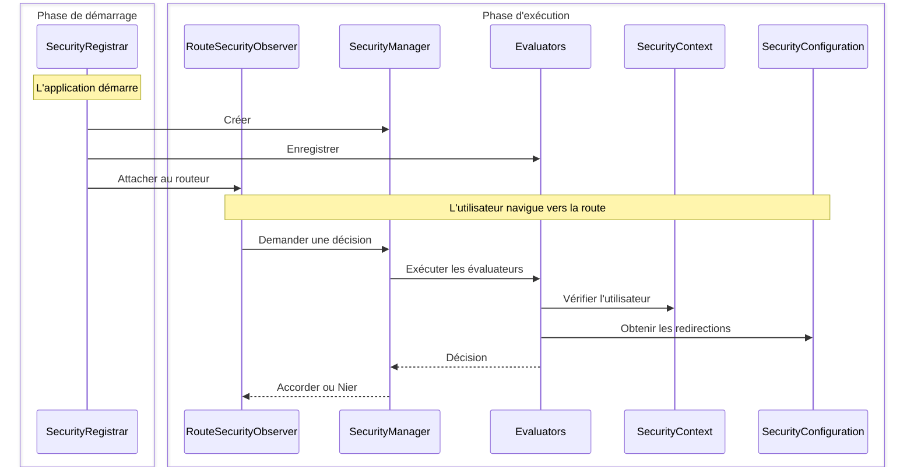

Ce guide explique comment construire une implémentation de sécurité personnalisée complète utilisant l'authentification basée sur les sessions. Vous apprendrez comment les quatre interfaces principales fonctionnent ensemble en les mettant en œuvre à partir de zéro.

:::tip[La plupart des applications devraient utiliser Spring Security]
L'[intégration de Spring Security](/docs/security/getting-started) configure automatiquement tout ce qui est montré ici. Ne créez une sécurité personnalisée que si vous avez des exigences spécifiques ou si vous n'utilisez pas Spring Boot.
:::

## Ce que vous allez construire {#what-youll-build}

Un système de sécurité fonctionnel avec quatre classes :

- **SecurityConfiguration** - Définit le comportement de sécurité et les emplacements de redirection
- **SecurityContext** - Suit qui est connecté en utilisant des sessions HTTP
- **SecurityManager** - Coordonne les vérifications de sécurité et fournit les fonctionnalités de connexion/déconnexion
- **SecurityRegistrar** - Relie tout ensemble au démarrage de l'application

Cet exemple utilise un stockage basé sur les sessions, mais vous pourriez implémenter les mêmes interfaces en utilisant des requêtes de base de données, LDAP, ou tout autre backend d'authentification.

## Comment les pièces fonctionnent ensemble {#how-the-pieces-work-together}



**Flux :**
1. **`SecurityRegistrar`** s'exécute au démarrage, crée le manager, enregistre les évaluateurs et attache l'observateur.
2. **`SecurityManager`** coordonne tout - il fournit le contexte et la configuration aux évaluateurs.
3. **`SecurityContext`** répond à "Qui est connecté ?" en lisant à partir des sessions HTTP.
4. **`SecurityConfiguration`** répond à "Où rediriger ?" pour les pages de connexion et d'accès refusé.
5. **`Evaluators`** prennent des décisions d'accès en utilisant le contexte et la configuration.

## Étape 1 : Définir la configuration de sécurité {#step-1-define-security-configuration}

La configuration indique au système de sécurité comment se comporter et où rediriger les utilisateurs :

```java title="SecurityConfiguration.java"
package com.securityplain.security;

import com.webforj.router.history.Location;
import com.webforj.router.security.RouteSecurityConfiguration;
import java.util.Optional;

/**
 * Configuration de sécurité pour l'application.
 *
 * <p>
 * Définit où rediriger les utilisateurs lorsque l'authentification est requise ou que l'accès est refusé.
 * </p>
 */
public class SecurityConfiguration implements RouteSecurityConfiguration {

  @Override
  public boolean isEnabled() {
    return true;
  }

  @Override
  public boolean isSecureByDefault() {
    return false;
  }

  @Override
  public Optional<Location> getAuthenticationLocation() {
    return Optional.of(new Location("/login"));
  }

  @Override
  public Optional<Location> getDenyLocation() {
    return Optional.of(new Location("/access-denied"));
  }
}
```

- `isEnabled() = true` - La sécurité est active
- `isSecureByDefault() = false` - Les routes sont publiques à moins d'être annotées (utilisez `true` pour exiger l'authentification sur toutes les routes par défaut)
- `/login` - Où vont les utilisateurs non authentifiés
- `/access-denied` - Où vont les utilisateurs authentifiés sans autorisation

## Étape 2 : Implémenter le contexte de sécurité {#step-2-implement-security-context}

Le contexte suit qui est connecté. Cette implémentation utilise les sessions HTTP pour stocker les informations de l'utilisateur :

<!-- vale off -->

<ExpandableCode title="SecurityContext.java" language="java">
{`package com.securityplain.security;

import com.webforj.Environment;
import com.webforj.router.security.RouteSecurityContext;
import java.util.HashMap;
import java.util.Map;
import java.util.Optional;
import java.util.Set;

/**
 * Contexte de sécurité simple basé sur les sessions.
 *
 * <p>
 * Stocke le principal utilisateur et les rôles dans la session HTTP. C'est une implémentation minimale à des fins pédagogiques.
 * </p>
 */
public class SecurityContext implements RouteSecurityContext {
  private static final String SESSION_USER_KEY = "security.user";
  private static final String SESSION_ROLES_KEY = "security.roles";
  private static final String SESSION_ATTRS_KEY = "security.attributes";

  /**
   * {@inheritDoc}
   */
  @Override
  public boolean isAuthenticated() {
    return getPrincipal().isPresent();
  }

  /**
   * {@inheritDoc}
   */
  @Override
  public Optional<Object> getPrincipal() {
    return getSessionAttribute(SESSION_USER_KEY);
  }

  /**
   * {@inheritDoc}
   */
  @Override
  public boolean hasRole(String role) {
    Optional<Object> rolesObj = getSessionAttribute(SESSION_ROLES_KEY);
    if (rolesObj.isPresent() && rolesObj.get() instanceof Set) {
      @SuppressWarnings("unchecked")
      Set<String> roles = (Set<String>) rolesObj.get();
      return roles.contains(role);
    }
    return false;
  }

  /**
   * {@inheritDoc}
   */
  @Override
  public boolean hasAuthority(String authority) {
    // Dans cette implémentation simple, les autorités sont les mêmes que les rôles
    return hasRole(authority);
  }

  /**
   * {@inheritDoc}
   */
  @Override
  public Optional<Object> getAttribute(String name) {
    Optional<Object> attrsObj = getSessionAttribute(SESSION_ATTRS_KEY);
    if (attrsObj.isPresent() && attrsObj.get() instanceof Map) {
      @SuppressWarnings("unchecked")
      Map<String, Object> attrs = (Map<String, Object>) attrsObj.get();
      return Optional.ofNullable(attrs.get(name));
    }
    return Optional.empty();
  }

  /**
   * {@inheritDoc}
   */
  @Override
  public void setAttribute(String name, Object value) {
    Environment.ifPresent(env -> {
      env.getSessionAccessor().ifPresent(accessor -> {
        accessor.access(session -> {
          @SuppressWarnings("unchecked")
          Map<String, Object> attrs =
              (Map<String, Object>) session.getAttribute(SESSION_ATTRS_KEY);
          if (attrs == null) {
            attrs = new HashMap<>();
            session.setAttribute(SESSION_ATTRS_KEY, attrs);
          }
          attrs.put(name, value);
        });
      });
    });
  }

  private Optional<Object> getSessionAttribute(String key) {
    final Object[] result = new Object[1];
    Environment.ifPresent(env -> {
      env.getSessionAccessor().ifPresent(accessor -> {
        accessor.access(session -> {
          result[0] = session.getAttribute(key);
        });
      });
    });
    return Optional.ofNullable(result[0]);
  }
}`}
</ExpandableCode>

<!-- vale on -->

**Comment cela fonctionne :**

- `isAuthenticated()` vérifie si un principal utilisateur existe dans la session
- `getPrincipal()` récupère le nom d'utilisateur à partir du stockage de session
- `hasRole()` vérifie si l'ensemble des rôles de l'utilisateur contient le rôle spécifié
- `getAttribute()` / `setAttribute()` gèrent les attributs de sécurité personnalisés
- `Environment.getSessionAccessor()` fournit un accès à la session thread-safe

## Étape 3 : Créer un gestionnaire de sécurité {#step-3-create-security-manager}

Le gestionnaire coordonne les décisions de sécurité. Il étend `AbstractRouteSecurityManager`, qui gère les chaînes d'évaluateurs et le refus d'accès :

<!-- vale off -->

<ExpandableCode title="SecurityManager.java" language="java">
{`package com.securityplain.security;

import com.webforj.environment.ObjectTable;
import com.webforj.environment.SessionObjectTable;
import com.webforj.router.Router;
import com.webforj.router.security.AbstractRouteSecurityManager;
import com.webforj.router.security.RouteAccessDecision;
import com.webforj.router.security.RouteSecurityConfiguration;
import com.webforj.router.security.RouteSecurityContext;

import java.util.Set;

/**
 * Implémentation simple de gestionnaire de sécurité.
 *
 * <p>
 * Fournit des méthodes statiques pour la connexion/déconnexion et gère le contexte de sécurité.
 * </p>
 */
public class SecurityManager extends AbstractRouteSecurityManager {
  private static final String SESSION_USER_KEY = "security.user";
  private static final String SESSION_ROLES_KEY = "security.roles";

  /**
   * {@inheritDoc}
   */
  @Override
  public RouteSecurityConfiguration getConfiguration() {
    return new SecurityConfiguration();
  }

  /**
   * {@inheritDoc}
   */
  @Override
  public RouteSecurityContext getSecurityContext() {
    return new SecurityContext();
  }

  /**
   * Connecte un utilisateur avec des rôles.
   *
   * @param username le nom d'utilisateur
   * @param password le mot de passe
   */
  public RouteAccessDecision login(String username, String password) {
    if ("user".equals(username) && "password".equals(password)) {
      Set<String> roles = Set.of("USER");
      persistUser(username, roles);
      return RouteAccessDecision.grant();
    } else if ("admin".equals(username) && "admin".equals(password)) {
      Set<String> roles = Set.of("USER", "ADMIN");
      persistUser(username, roles);
      return RouteAccessDecision.grant();
    }

    return RouteAccessDecision.deny("Nom d'utilisateur ou mot de passe invalide");
  }

  /**
   * Déconnecte l'utilisateur actuel et redirige vers la page de connexion.
   */
  public void logout() {
    SessionObjectTable.clear(SESSION_USER_KEY);
    SessionObjectTable.clear(SESSION_ROLES_KEY);

    Router router = Router.getCurrent();
    if (router != null) {
      getConfiguration().getAuthenticationLocation().ifPresent(location -> router.navigate(location));
    }
  }

  /**
   * Obtient l'instance actuelle du gestionnaire.
   *
   * @return l'instance actuelle du gestionnaire
   */
  public static SecurityManager getCurrent() {
    String key = SecurityManager.class.getName();
    if (ObjectTable.contains(key)) {
      return (SecurityManager) ObjectTable.get(key);
    }

    SecurityManager instance = new SecurityManager();
    ObjectTable.put(key, instance);

    return instance;
  }

  void saveCurrent(SecurityManager manager) {
    String key = SecurityManager.class.getName();
    ObjectTable.put(key, manager);
  }

  private void persistUser(String username, Set<String> roles) {
    SessionObjectTable.put(SESSION_USER_KEY, username);
    SessionObjectTable.put(SESSION_ROLES_KEY, roles);
  }
}`}
</ExpandableCode>

<!-- vale on -->

**Comment cela fonctionne :**

- Étend `AbstractRouteSecurityManager` pour hériter de la logique de chaîne d'évaluateurs
- Fournit des implémentations de `getConfiguration()` et `getSecurityContext()`
- Ajoute `login()` pour authentifier les utilisateurs et stocker les identifiants dans la session
- Ajoute `logout()` pour effacer la session et rediriger vers la page de connexion
- Utilise [`SessionObjectTable`](/docs/advanced/object-string-tables#sessionobjecttable) pour un stockage de session simple
- Se stocke dans [`ObjectTable`](/docs/advanced/object-string-tables#objecttable) pour un accès global à l'application

## Étape 4 : Relier tout au démarrage {#step-4-wire-everything-at-startup}

Le registrar connecte toutes les pièces lorsque l'application démarre :

```java title="SecurityRegistrar.java"
package com.securityplain.security;

import com.webforj.App;
import com.webforj.AppLifecycleListener;
import com.webforj.annotation.AppListenerPriority;
import com.webforj.router.Router;
import com.webforj.router.security.RouteSecurityObserver;
import com.webforj.router.security.evaluator.AnonymousAccessEvaluator;
import com.webforj.router.security.evaluator.DenyAllEvaluator;
import com.webforj.router.security.evaluator.PermitAllEvaluator;
import com.webforj.router.security.evaluator.RolesAllowedEvaluator;

/**
 * Enregistre les composants de sécurité des routes lors du démarrage de l'application.
 *
 * <p>
 * Configure le gestionnaire de sécurité et les évaluateurs avec le routeur.
 * </p>
 */
@AppListenerPriority(1)
public class SecurityRegistrar implements AppLifecycleListener {

  /**
   * {@inheritDoc}
   */
  @Override
  public void onWillRun(App app) {
    // Créer le gestionnaire de sécurité
    SecurityManager securityManager = new SecurityManager();
    securityManager.saveCurrent(securityManager);

    // Enregistrer les évaluateurs intégrés avec des priorités
    securityManager.registerEvaluator(new DenyAllEvaluator(), 0);
    securityManager.registerEvaluator(new AnonymousAccessEvaluator(), 1);
    securityManager.registerEvaluator(new PermitAllEvaluator(), 2);
    securityManager.registerEvaluator(new RolesAllowedEvaluator(), 3);

    // Créer un observateur de sécurité et l'attacher au routeur
    RouteSecurityObserver securityObserver = new RouteSecurityObserver(securityManager);
    Router router = Router.getCurrent();
    if (router != null) {
      router.getRenderer().addObserver(securityObserver);
    }
  }
}
```

**Enregistrer l'écouteur :**

Créez `src/main/resources/META-INF/services/com.webforj.AppLifecycleListener` avec :

```text
com.securityplain.security.SecurityRegistrar
```

Cela enregistre votre [`AppLifecycleListener`](/docs/advanced/lifecycle-listeners) afin qu'il s'exécute au démarrage de l'application.

**Comment cela fonctionne :**

- S'exécute tôt (`@AppListenerPriority(1)`) pour configurer la sécurité avant le chargement des routes
- Crée le gestionnaire de sécurité et le stocke globalement
- Enregistre les évaluateurs intégrés dans l'ordre de priorité (les nombres plus bas s'exécutent en premier)
- Crée l'observateur qui intercepte la navigation
- Attache l'observateur au routeur pour que les vérifications de sécurité soient automatiques

Après cela, la sécurité est active pour toute navigation.

## Utiliser votre implémentation {#using-your-implementation}

### Créer une vue de connexion {#create-a-login-view}

La vue suivante utilise le composant [`Login`](/docs/components/login).

```java title="LoginView.java"
package com.securityplain.views;

import com.securityplain.security.SecurityManager;
import com.webforj.component.Composite;
import com.webforj.component.login.Login;
import com.webforj.router.Router;
import com.webforj.router.annotation.FrameTitle;
import com.webforj.router.annotation.Route;
import com.webforj.router.history.Location;
import com.webforj.router.security.annotation.AnonymousAccess;

@Route("/login")
@FrameTitle("Connexion")
@AnonymousAccess
public class LoginView extends Composite<Login> {
  private Login self = getBoundComponent();

  public LoginView() {
    self.onSubmit(e -> {
      var result = SecurityManager.getCurrent().login(
        e.getUsername(), e.getPassword()
      );
      
      if (result.isGranted()) {
        Router.getCurrent().navigate(new Location("/"));
      } else {
        self.setError(true);
        self.setEnabled(true);
      }
    });

    self.whenAttached().thenAccept(c -> self.open());
  }
}
```
