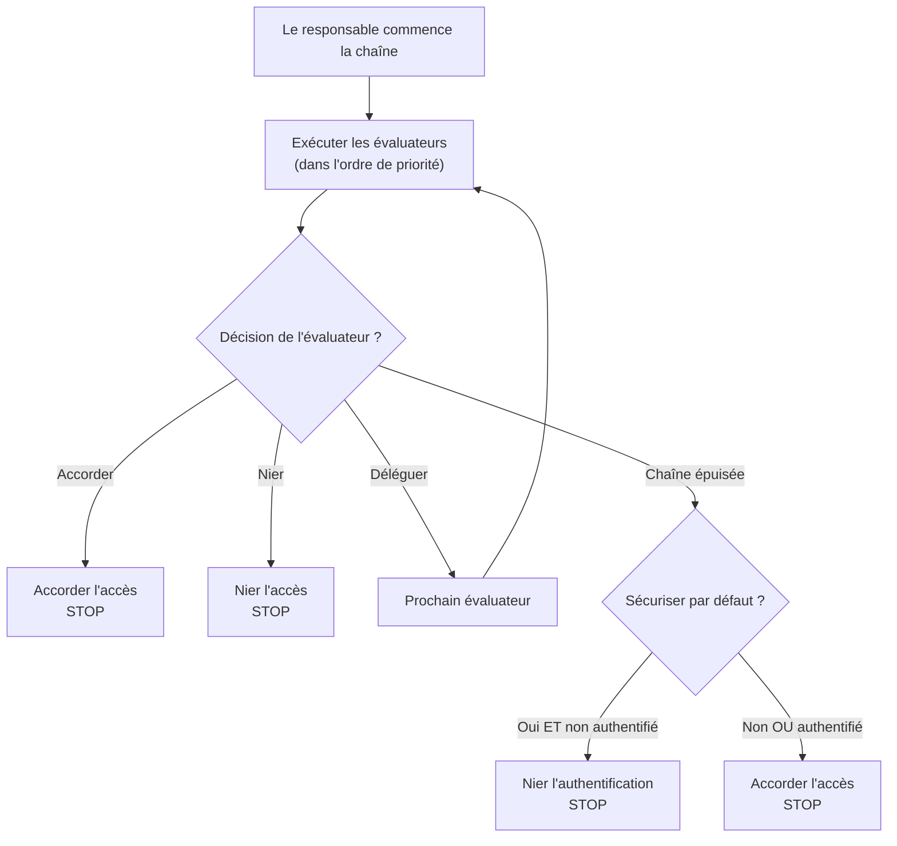

La chaîne des évaluateurs est le cœur du système de sécurité de webforJ. C'est une séquence d'évaluateurs ordonnée par priorité qui examine les routes et prend des décisions d'accès en utilisant le motif de conception de la chaîne de responsabilité. Comprendre comment la chaîne fonctionne vous aide à créer des évaluateurs personnalisés et à résoudre les refus d'accès inattendus.

## Le motif de la chaîne de responsabilité {#the-chain-of-responsibility-pattern}

La chaîne des évaluateurs utilise le motif de la chaîne de responsabilité, où chaque évaluateur de la séquence peut soit traiter une demande de navigation, soit la transmettre au prochain évaluateur. Cela crée un système où la logique de sécurité est distribuée entre plusieurs évaluateurs spécialisés plutôt que centralisée dans un seul vérificateur monolithique.

Lorsqu'une route nécessite une évaluation, le responsable de la sécurité crée une chaîne et la commence au premier évaluateur. Cet évaluateur examine la route et prend l'une des trois décisions :

1. **Accorder l'accès :** L'évaluateur approuve la route et retourne immédiatement. Aucun autre évaluateur n'est exécuté.
2. **Nier l'accès :** L'évaluateur bloque la route et retourne immédiatement. Aucun autre évaluateur n'est exécuté.
3. **Déléguer :** L'évaluateur ne prend pas de décision et appelle `chain.evaluate()` pour passer le contrôle au prochain évaluateur.

Ce motif permet aux évaluateurs de se concentrer sur des cas spécifiques. Chaque évaluateur implémente `supports(Class<?> routeClass)` pour indiquer quelles routes il traite. Par exemple, `AnonymousAccessEvaluator` ne s'exécute que pour les routes marquées avec `@AnonymousAccess`, le responsable ne l'invoque jamais pour d'autres routes.

## Comment la chaîne est construite {#how-the-chain-is-built}

Le responsable de la sécurité maintient une liste d'évaluateurs enregistrés, chacun avec une priorité associée. Lorsqu'une route nécessite une évaluation, le responsable trie les évaluateurs par priorité (numéros plus bas en premier) et crée une chaîne.

Les évaluateurs sont enregistrés en utilisant la méthode `registerEvaluator()` du responsable :

```java
// Enregistrer les évaluateurs intégrés
securityManager.registerEvaluator(new DenyAllEvaluator(), 0);
securityManager.registerEvaluator(new AnonymousAccessEvaluator(), 1);
securityManager.registerEvaluator(new PermitAllEvaluator(), 2);
securityManager.registerEvaluator(new RolesAllowedEvaluator(), 3);

// Enregistrer des évaluateurs personnalisés
securityManager.registerEvaluator(new SubscriptionEvaluator(), 10);
```

La priorité détermine l'ordre d'évaluation. Les priorités plus basses s'exécutent en premier, leur donnant la première opportunité de prendre des décisions d'accès. Cela est important pour la sécurité car cela permet aux évaluateurs critiques de bloquer l'accès avant que les évaluateurs permissifs ne puissent l'accorder.

La chaîne est sans état et créée de manière fraîche pour chaque demande de navigation afin qu'une évaluation d'une navigation n'affecte pas une autre.

## Flux d'exécution de la chaîne {#chain-execution-flow}

Lorsque la chaîne commence, elle débute au premier évaluateur (priorité la plus basse) et progresse séquentiellement :



La chaîne s'arrête dès qu'un évaluateur accorde ou nie l'accès. Si tous les évaluateurs délèguent, la chaîne s'épuise et revient à un comportement sécurisé par défaut.

## Ordonnancement des évaluateurs intégrés {#built-in-evaluator-ordering}

Quatre évaluateurs intégrés traitent les annotations standard :

| Évaluateur | Annotation | Comportement | Comportement de la chaîne | Ordre typique |
|------------|------------|--------------|---------------------------|---------------|
| `DenyAllEvaluator` | `@DenyAll` | Bloque toujours l'accès | Arrête la chaîne (terminal) | S'exécute en premier |
| `AnonymousAccessEvaluator` | `@AnonymousAccess` | Autorise tout le monde (authentifié ou non) | Arrête la chaîne (terminal) | S'exécute tôt |
| `PermitAllEvaluator` | `@PermitAll` | Nécessite une authentification, permet à tous les utilisateurs authentifiés | Arrête la chaîne (terminal) | S'exécute au milieu de la chaîne |
| `RolesAllowedEvaluator` | `@RolesAllowed` | Nécessite une authentification et un rôle spécifique | **Continuer la chaîne** (composable) | S'exécute plus tard |

:::note
Les numéros de priorité exacts sont attribués lors de l'enregistrement de l'évaluateur et diffèrent entre les implémentations. Voir [Spring Security](/docs/security/getting-started) ou [Implémentation personnalisée](/docs/security/architecture/custom-implementation) pour des valeurs spécifiques.
:::

## Comment les évaluateurs délèguent {#how-evaluators-delegate}

Avant d'invoquer un évaluateur, le responsable appelle sa méthode `supports(Class<?> routeClass)`. Seuls les évaluateurs retournant `true` sont invoqués. Ce filtrage oblige les évaluateurs à ne s'exécuter que pour les routes qu'ils sont conçus pour traiter.

Lorsqu'un évaluateur est invoqué, il peut soit :
- **Prendre une décision** : Retourner accorder ou nier pour arrêter la chaîne
- **Déléguer** : Appeler `chain.evaluate()` pour passer le contrôle au prochain évaluateur dans la séquence de priorité

Par exemple, `RolesAllowedEvaluator` vérifie si l'utilisateur a le rôle requis. Si oui, il appelle `chain.evaluate()` pour autoriser d'autres vérifications par des évaluateurs de priorité plus élevée. Cette délégation active permet la composition des évaluateurs.

Les évaluateurs terminaux comme `PermitAllEvaluator` prennent des décisions finales sans appeler la chaîne, empêchant toute évaluation ultérieure.

## Lorsque la chaîne est épuisée {#when-the-chain-exhausts}

Si chaque évaluateur délègue et qu'aucun ne prend de décision, la chaîne s'épuise, il n'y a plus d'évaluateurs à exécuter. À ce stade, le système de sécurité applique un retour en fonction de la configuration `isSecureByDefault()` :

**Sécuriser par défaut activé** (`isSecureByDefault() == true`):
- Si l'utilisateur est authentifié : Accorder l'accès
- Si l'utilisateur n'est pas authentifié : Nier avec authentification requise

**Sécuriser par défaut désactivé** (`isSecureByDefault() == false`):
- Accorder l'accès indépendamment de l'authentification

Les routes sans annotations de sécurité ont toujours un comportement défini. Avec la sécurisation par défaut activée, les routes non annotées nécessitent une authentification. Avec cela désactivé, les routes non annotées sont publiques.

## Priorités des évaluateurs personnalisés {#custom-evaluator-priorities}

Lors de la création d'évaluateurs personnalisés, choisissez les priorités avec soin :

- **0-9** : Réservé aux évaluateurs du cœur du framework. Évitez d'utiliser ces priorités à moins de remplacer les évaluateurs intégrés.
- **10-99** : Recommandé pour les évaluateurs de logique métier personnalisée. Ceux-ci s'exécutent après les évaluateurs de base mais avant les retours génériques.

Exemple :

```java title="SubscriptionEvaluator.java"
// Évaluateur personnalisé pour l'accès basé sur l'abonnement
@RegisteredEvaluator(priority = 10)
public class SubscriptionEvaluator implements RouteSecurityEvaluator {
  @Override
  public boolean supports(Class<?> routeClass) {
    return routeClass.isAnnotationPresent(RequiresSubscription.class);
  }

  @Override
  public RouteAccessDecision evaluate(Class<?> routeClass,
                                       NavigationContext context,
                                       RouteSecurityContext securityContext,
                                       SecurityEvaluatorChain chain) {
    // Vérifier si l'utilisateur a un abonnement actif
    boolean hasSubscription = checkSubscription(securityContext);

    if (!hasSubscription) {
      return RouteAccessDecision.deny("Abonnement actif requis");
    }

    // L'utilisateur a un abonnement - continuer la chaîne pour d'autres vérifications
    return chain.evaluate(routeClass, context, securityContext);
  }
}
```

Cet évaluateur s'exécute à la priorité 10, après les évaluateurs de base. Si l'utilisateur a un abonnement actif, il délègue à la chaîne, permettant la composition avec d'autres évaluateurs.

## Composition des évaluateurs {#evaluator-composition}

La plupart des évaluateurs intégrés sont **terminaux**, ils prennent une décision finale et arrêtent la chaîne. Seul `RolesAllowedEvaluator` continue la chaîne après avoir accordé l'accès, permettant la composition avec des évaluateurs personnalisés.

**Évaluateurs terminaux (ne peuvent pas être composés) :**
- `@DenyAll` : Nier toujours, arrêter la chaîne
- `@AnonymousAccess` : Toujours accorder, arrêter la chaîne
- `@PermitAll` : Accorde aux utilisateurs authentifiés, arrêter la chaîne

**Évaluateurs composables :**
- `@RolesAllowed` : Si l'utilisateur a le rôle, **continue la chaîne** pour permettre d'autres vérifications

### Composition qui fonctionne {#composition-that-works}

Vous pouvez composer `@RolesAllowed` avec des évaluateurs personnalisés :

```java
@Route("/premium-admin")
@RolesAllowed("ADMIN")  // Vérifie le rôle, puis continue la chaîne
@RequiresSubscription   // Vérification personnalisée s'exécute après la vérification du rôle
public class PremiumAdminView extends Composite<Div> {
  // Nécessite le rôle ADMIN ET un abonnement actif
}
```

Flux :
1. `RolesAllowedEvaluator` vérifie si l'utilisateur a le rôle `ADMIN`
2. Si oui, appelle `chain.evaluate()` pour continuer
3. `SubscriptionEvaluator` vérifie le statut d'abonnement (s'exécute plus tard dans la chaîne)
4. Si l'abonnement est actif, l'accès est accordé ; sinon, il est refusé

### Composition qui ne fonctionne pas {#composition-that-does-not-work}

Vous **ne pouvez pas** combiner `@PermitAll` avec d'autres évaluateurs car cela arrête la chaîne :

```java
@Route("/wrong")
@PermitAll           // Accorde immédiatement, arrête la chaîne
@RolesAllowed("ADMIN")  // NE S'EXÉCUTE JAMAIS !
public class WrongView extends Composite<Div> {
  // Cela accorde l'accès à TOUS les utilisateurs authentifiés
  // @RolesAllowed est ignoré
}
```

`PermitAllEvaluator` s'exécute en premier (enregistré avec une priorité plus basse), accorde l'accès à tout utilisateur authentifié et retourne sans appeler `chain.evaluate()`. L'`RolesAllowedEvaluator` ne s'exécute jamais.
