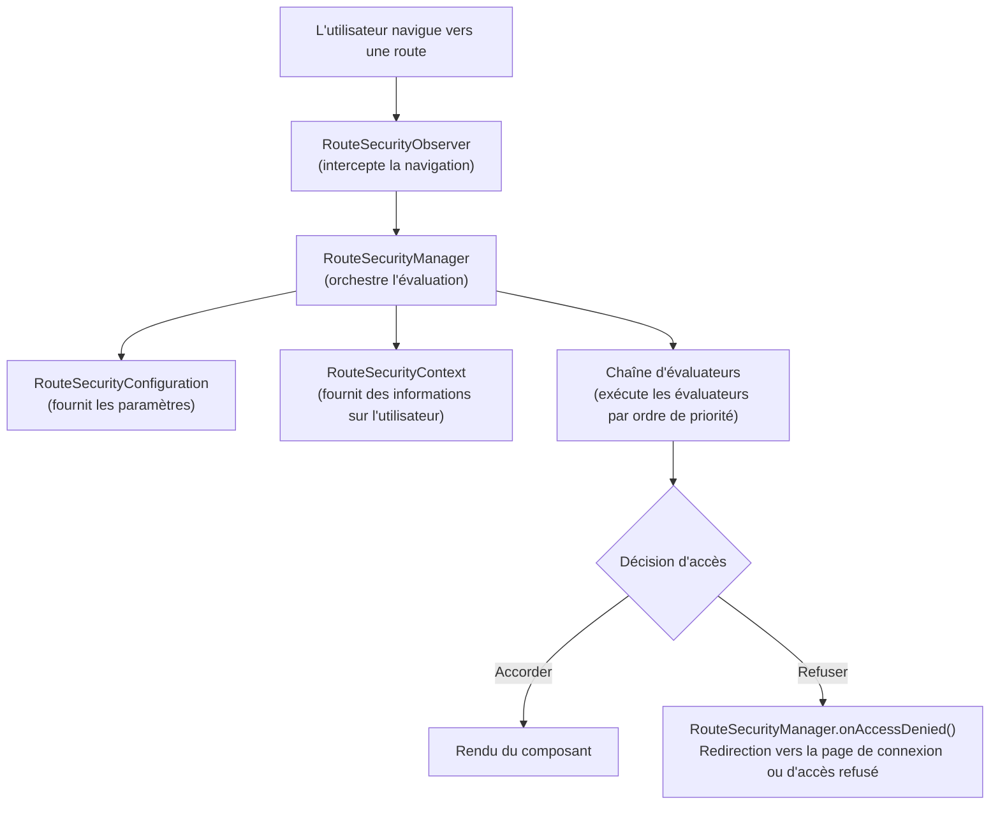

Le système de sécurité webforJ est construit sur une fondation d'interfaces de base qui travaillent ensemble pour fournir un contrôle d'accès au niveau des routes. Ces interfaces définissent les contrats pour le comportement de sécurité, permettant à différentes implémentations, qu'elles soient basées sur des sessions, sur des JSON Web Tokens (JWT), intégrées à LDAP ou basées sur des bases de données, de s'intégrer dans le même cadre sous-jacent.

Comprendre cette architecture vous aide à voir comment les annotations de sécurité comme `@RolesAllowed` et `@PermitAll` sont évaluées, comment fonctionne l'interception de navigation, et comment vous pouvez construire des implémentations de sécurité personnalisées pour vos besoins spécifiques.

## Les interfaces de base {#the-four-core-interfaces}

La fondation de la sécurité est construite sur des abstractions clés, chacune ayant une responsabilité spécifique :

### `RouteSecurityManager` {#routesecuritymanager}

Le `RouteSecurityManager` est le coordinateur central du système de sécurité. Il gère les évaluateurs de sécurité, orchestre le processus d'évaluation et gère le refus d'accès en redirigeant les utilisateurs vers des pages appropriées.

**Responsabilités :**

- Enregistrer et gérer les évaluateurs de sécurité avec des priorités
- Coordonner le processus d'évaluation lorsque l'utilisateur navigue vers une route
- Gérer le refus d'accès en déclenchant des redirections vers des pages de connexion ou d'accès refusé
- Stocker et récupérer les emplacements de pré-authentification pour les redirections post-connexion

```java
public interface RouteSecurityManager {
  RouteAccessDecision evaluate(Class<?> routeClass, NavigationContext context);
  void onAccessDenied(RouteAccessDecision decision, NavigationContext context);
  RouteSecurityContext getSecurityContext();
  RouteSecurityConfiguration getConfiguration();
  void registerEvaluator(RouteSecurityEvaluator evaluator, int priority);
  Optional<Location> consumePreAuthenticationLocation();
}
```

Le gestionnaire ne prend pas lui-même les décisions de sécurité, il délègue aux évaluateurs et à la configuration. C'est le lien qui connecte tous les composants de sécurité.

### `RouteSecurityContext` {#routesecuritycontext}

Le `RouteSecurityContext` fournit un accès à l'état d'authentification de l'utilisateur actuel. Il répond à des questions telles que savoir si l'utilisateur est authentifié, quel est son nom d'utilisateur et s'il a le rôle `ADMIN`.

**Responsabilités :**

- Déterminer si l'utilisateur actuel est authentifié
- Fournir le principal de l'utilisateur (typiquement son nom d'utilisateur ou objet utilisateur)
- Vérifier si l'utilisateur a des rôles ou autorités spécifiques
- Stocker et récupérer des attributs de sécurité personnalisés

```java
public interface RouteSecurityContext {
  boolean isAuthenticated();
  Optional<Object> getPrincipal();
  boolean hasRole(String role);
  boolean hasAuthority(String authority);
  Optional<Object> getAttribute(String name);
  void setAttribute(String name, Object value);
}
```

Les implémentations varient en fonction du système d'authentification, du stockage de session HTTP, des jetons JWT décodés à partir des en-têtes, des requêtes de base de données, des recherches LDAP ou d'autres mécanismes.

### `RouteSecurityConfiguration` {#routesecurityconfiguration}

Le `RouteSecurityConfiguration` définit le comportement de sécurité et les emplacements de redirection. Il indique au système de sécurité où envoyer les utilisateurs lorsque l'authentification est requise ou lorsque l'accès est refusé.

**Responsabilités :**

- Définir si la sécurité est activée
- Préciser le comportement sécurisé par défaut
- Fournir l'emplacement de la page d'authentification (généralement `/login`)
- Fournir l'emplacement de la page d'accès refusé

```java
public interface RouteSecurityConfiguration {
  default boolean isEnabled() { return true; }
  default boolean isSecureByDefault() { return true; }
  default Optional<Location> getAuthenticationLocation() {
    return Optional.of(new Location("/login"));
  }
  default Optional<Location> getDenyLocation() { /* ... */ }
}
```

Cette interface sépare la politique de sécurité de l'application de sécurité. Vous pouvez changer les emplacements de redirection ou activer/désactiver le comportement sécurisé par défaut sans modifier le gestionnaire ou les évaluateurs.

### `RouteSecurityEvaluator` {#routesecurityevaluator}

Le `RouteSecurityEvaluator` est l'endroit où les règles de sécurité réelles sont vérifiées. Chaque évaluateur examine une route et décide d'accorder l'accès, de refuser l'accès ou de déléguer la décision au prochain évaluateur de la chaîne.

**Responsabilités :**

- Déterminer si cet évaluateur gère la route donnée
- Évaluer les annotations de sécurité sur la classe de route
- Accorder l'accès, refuser l'accès ou déléguer au prochain évaluateur
- Participer au modèle de chaîne de responsabilité

```java
public interface RouteSecurityEvaluator {
  RouteAccessDecision evaluate(Class<?> routeClass,
                                NavigationContext context,
                                RouteSecurityContext securityContext,
                                SecurityEvaluatorChain chain);
  default boolean supports(Class<?> routeClass) { return true; }
}
```

Les évaluateurs intégrés gèrent les annotations standard telles que `@RolesAllowed`, `@PermitAll`, `@DenyAll` et `@AnonymousAccess`. Vous pouvez créer des évaluateurs personnalisés pour mettre en œuvre une logique de sécurité spécifique au domaine.

## Comment les interfaces fonctionnent ensemble {#how-the-interfaces-work-together}

Ces quatre interfaces collaborent lors de la navigation pour appliquer les règles de sécurité :



Lorsqu'un utilisateur navigue, le `RouteSecurityObserver` intercepte la navigation et demande au `RouteSecurityManager` d'évaluer l'accès. Le gestionnaire consulte le `RouteSecurityConfiguration` pour les paramètres, obtient des informations sur l'utilisateur à partir du `RouteSecurityContext`, et exécute chaque `RouteSecurityEvaluator` par ordre de priorité jusqu'à ce qu'un prenne une décision.

## Interfaces en tant que contrats {#the-interfaces-as-contracts}

Chaque interface définit un contrat, un ensemble de questions auxquelles le système de sécurité a besoin de réponses. **Comment** vous répondez à ces questions est votre choix d'implémentation :

**Contrat `RouteSecurityContext` :**

- "L'utilisateur actuel est-il authentifié ?" (`isAuthenticated()`)
- "Qui est l'utilisateur ?" (`getPrincipal()`)
- "L'utilisateur a-t-il le rôle X ?" (`hasRole()`)

Vous décidez d'où provient cette information : des sessions HTTP, des jetons JWT décodés à partir des en-têtes, des recherches dans la base de données, des requêtes LDAP ou tout autre backend d'authentification.

**Contrat `RouteSecurityConfiguration` :**

- "La sécurité est-elle activée ?" (`isEnabled()`)
- "Les routes doivent-elles être sécurisées par défaut ?" (`isSecureByDefault()`)
- "Où doivent aller les utilisateurs non authentifiés ?" (`getAuthenticationLocation()`)

Vous décidez comment obtenir ces valeurs : codées en dur, à partir de fichiers de configuration, de variables d'environnement, d'une base de données, ou calculées dynamiquement.

**Contrat `RouteSecurityManager` :**

- "Cet utilisateur doit-il accéder à cette route ?" (`evaluate()`)
- "Que se passe-t-il lorsque l'accès est refusé ?" (`onAccessDenied()`)
- "Quels évaluateurs doivent être exécutés ?" (`registerEvaluator()`)

Vous décidez du flux d'authentification, où stocker les emplacements de pré-authentification, et comment gérer des scénarios de refus personnalisés.

L'architecture de fond définit ces contrats, mais l'implémentation est flexible. Différents systèmes peuvent mettre en œuvre ces interfaces de manières totalement différentes en fonction des exigences spécifiques.

## La classe de base `AbstractRouteSecurityManager` {#the-abstractroutesecuritymanager-base-class}

La plupart des implémentations n'implémentent pas directement `RouteSecurityManager`. Au lieu de cela, elles étendent `AbstractRouteSecurityManager`, qui fournit :

- Enregistrement d'évaluateurs et tri par priorité
- Logique d'exécution de la chaîne
- Gestion du refus d'accès avec redirections automatiques
- Stockage des emplacements de pré-authentification dans la session HTTP
- Comportement par défaut sécurisé

La classe de base implémente l'interface `RouteSecurityManager` et fournit des implémentations concrètes pour la gestion des évaluateurs, l'évaluation d'accès et la gestion des refus. Les sous-classes n'ont besoin de fournir que le contexte de sécurité et la configuration. La classe de base gère automatiquement la gestion des évaluateurs, l'exécution de la chaîne et la gestion des refus.
