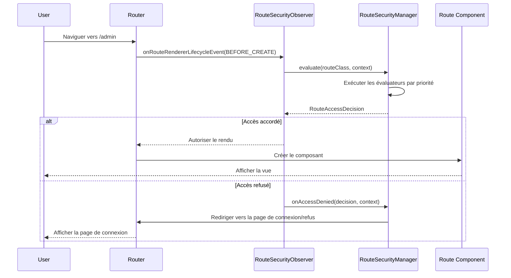

La mise en œuvre de la sécurité dans webforJ se fait automatiquement lors de la navigation. Lorsqu'un utilisateur clique sur un lien ou navigue vers une route, le système de sécurité intercepte la navigation, évalue les règles d'accès et permet soit à la navigation de se poursuivre, soit redirige l'utilisateur vers une page appropriée. Cette interception est invisible pour les utilisateurs et ne nécessite aucune vérification manuelle de la sécurité dans le code de votre composant.

Comprendre comment fonctionne l'interception de la navigation vous aide à résoudre les problèmes de sécurité et à créer une logique de navigation personnalisée qui s'intègre avec le système de sécurité.

## Le `RouteSecurityObserver` {#the-routesecurityobserver}

Le `RouteSecurityObserver` est un observateur de navigation qui s'intègre au cycle de vie du routeur. Il écoute les événements de navigation et évalue les règles de sécurité avant qu'un composant ne soit rendu.

L'observateur est attaché au renderer du routeur lors du démarrage de l'application :

```java
// Créez l'observateur avec votre gestionnaire de sécurité
RouteSecurityObserver observer = new RouteSecurityObserver(securityManager);

// Attachez-le au renderer du routeur
Router router = Router.getCurrent();
if (router != null) {
  router.getRenderer().addObserver(observer);
}
```

Une fois attaché, l'observateur intercepte chaque demande de navigation. L'observateur se situe entre les demandes de navigation et le rendu des composants ; lorsque la navigation commence, il demande au gestionnaire de sécurité d'évaluer l'accès. Ce n'est que si l'accès est accordé que le composant est rendu.

## Flux d'interception de la navigation {#navigation-interception-flow}

Lorsqu'un utilisateur navigue vers une route, la séquence suivante se produit :



Ce flux montre que l'évaluation de la sécurité se produit avant que tout code de route sensible ne s'exécute. Si l'accès est refusé, le composant n'est jamais instancié, empêchant ainsi les utilisateurs non autorisés de déclencher la logique métier ou d'accéder à des données protégées.

## Points d'interception {#interception-points}

L'observateur intercepte la navigation à un point spécifique dans le cycle de vie du routage :

**Avant le rendu** La méthode `onRouteRendererLifecycleEvent()` de l'observateur est appelée avec l'événement `LifecycleEvent.BEFORE_CREATE` après que la route a été résolue mais avant que le composant ne soit créé. C'est le point de contrôle de sécurité critique.

À ce stade, le routeur sait quelle classe de route sera rendue, mais la route n'a pas encore été instanciée. L'observateur peut évaluer les annotations de sécurité sur la classe sans exécuter la logique de route.

Si l'accès est refusé, l'observateur empêche le rendu et déclenche une redirection. La route d'origine n'est jamais instanciée.

## Le processus d'évaluation {#the-evaluation-process}

Lorsque l'observateur intercepte la navigation, il délègue l'évaluation au gestionnaire de sécurité. L'observateur récupère la classe de route à partir du contexte de navigation et demande au gestionnaire d'évaluer l'accès. Si la décision accorde l'accès, la navigation se poursuit normalement. Si la décision refuse l'accès, l'observateur stoppe la propagation pour empêcher le rendu et laisse le gestionnaire gérer le refus.

Le gestionnaire coordonne l'évaluation en :

1. Vérifiant si la sécurité est activée dans la configuration
2. Obtenant le contexte de sécurité actuel (informations sur l'utilisateur)
3. Exécutant la chaîne d'évaluateurs dans l'ordre de priorité
4. Renvoyant la décision d'accès finale

L'observateur agit en fonction de la décision : si accordé, la navigation se poursuit ; si refusé, l'observateur stoppe la propagation et laisse le gestionnaire gérer le refus.

## Comment les décisions d'accès sont prises {#how-access-decisions-are-made}

Le gestionnaire de sécurité crée une chaîne d'évaluateurs et exécute chaque évaluateur dans l'ordre de priorité. Les évaluateurs peuvent prendre trois types de décisions :

- **Accorder l'accès :** L'évaluateur approuve la navigation, et la route se rend. Aucun autre évaluateur n'est consulté. L'évaluateur renvoie une décision indiquant que l'accès est accordé.

- **Refuser l'accès :** L'évaluateur bloque la navigation. L'observateur arrête le rendu et déclenche une redirection. L'évaluateur renvoie une décision de refus, éventuellement avec un message de raison. Le refus peut être dû à un manque d'authentification (requérant une connexion) ou à un manque d'autorisation (permissions insuffisantes).

- **Déléguer au prochain évaluateur :** L'évaluateur ne prend pas de décision et passe le contrôle au prochain évaluateur dans la chaîne. L'évaluateur appelle la méthode d'évaluation de la chaîne, qui progresse vers le prochain évaluateur dans l'ordre de priorité.

La plupart des évaluateurs ne gèrent que les routes avec des annotations spécifiques. Par exemple, `RolesAllowedEvaluator` évalue uniquement les routes annotées avec `@RolesAllowed`. Si l'annotation n'est pas présente, il délègue au prochain évaluateur.

## Gestion du refus d'accès {#handling-access-denial}

Lorsque l'accès est refusé, la méthode `onAccessDenied()` du gestionnaire gère le refus en fonction du type de refus :

- **Authentification requise :** L'utilisateur n'est pas connecté. Redirigez vers la page de connexion configurée dans `RouteSecurityConfiguration.getAuthenticationLocation()`.

- **Accès refusé :** L'utilisateur est connecté mais n'a pas les permissions. Redirigez vers la page d'accès refusé configurée dans `RouteSecurityConfiguration.getDenyLocation()`.

Avant de rediriger, le gestionnaire stocke l'emplacement initialement demandé dans la session HTTP. Après une connexion réussie, cet emplacement peut être récupéré à l'aide de la méthode `consumePreAuthenticationLocation()` du gestionnaire, qui renvoie l'emplacement stocké et le supprime de la session. Si un emplacement a été stocké, l'application peut y naviguer ; sinon, elle navigue vers une page par défaut.

## Lorsque la sécurité est désactivée {#when-security-is-disabled}

Si `RouteSecurityConfiguration.isEnabled()` renvoie `false`, le gestionnaire contourne toute évaluation et accorde immédiatement l'accès à toutes les routes. La chaîne d'évaluateurs ne s'exécute jamais et aucune vérification de sécurité n'a lieu.

Cela est utile pendant le développement ou pour les applications qui n'exigent pas de sécurité. Vous pouvez activer ou désactiver la sécurité sans retirer les annotations ou désinscrire l'observateur.

## Intégration avec le cycle de vie de la navigation {#integration-with-navigation-lifecycle}

L'observateur de sécurité s'intègre avec le [cycle de vie de la navigation](/docs/routing/navigation-lifecycle/overview), où plusieurs observateurs peuvent s'accrocher aux événements de navigation. L'évaluation de la sécurité se produit tôt dans ce cycle de vie, avant les événements de blocage de la navigation ou du cycle de vie des composants.

Si vous mettez en œuvre des observateurs de navigation personnalisés, soyez conscient que l'évaluation de la sécurité se produit en premier. Si l'accès est refusé, l'événement `onRouteRendererLifecycleEvent()` de votre observateur ne sera pas appelé avec `BEFORE_CREATE` car la navigation est arrêtée.
