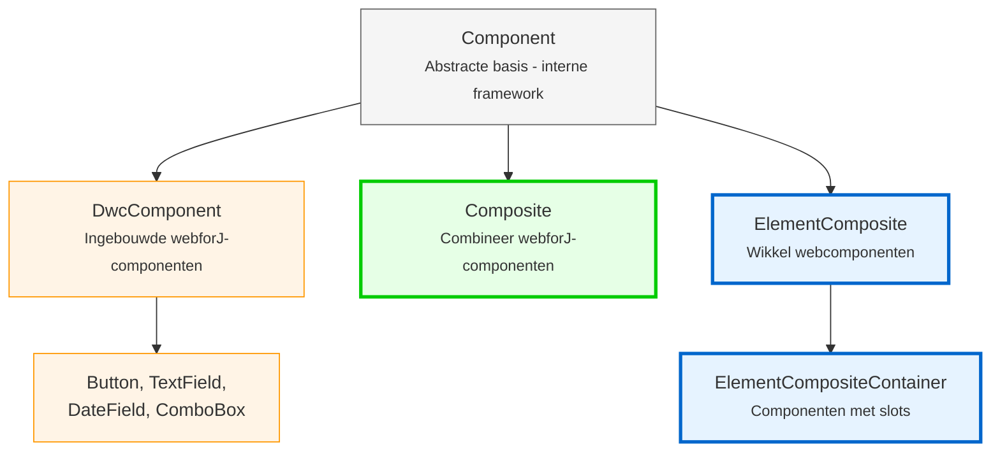

<DocChip chip='since' label='23.05' />
<JavadocLink type="foundation" location="com/webforj/component/Component" top='true'/> 

Voordat je aangepaste componenten bouwt in webforJ, is het belangrijk om de fundamentele architectuur te begrijpen die bepaalt hoe componenten functioneren. Dit artikel legt de componenthiërarchie, componentidentiteit, levenscyclusconcepten en hoe zorginterfaces componentmogelijkheden bieden uit.

## De componenthiërarchie begrijpen

webforJ organiseert componenten in een hiërarchie met twee groepen: interne klassen van het framework die je nooit moet uitbreiden, en klassen die specifiek zijn ontworpen voor het bouwen van aangepaste componenten. Deze sectie legt uit waarom webforJ compositie boven overerving gebruikt en wat elk niveau van de hiërarchie biedt.

### Waarom compositie in plaats van uitbreiding?

In webforJ zijn ingebouwde componenten zoals [`Button`](../components/button) en [`TextField`](../components/fields/textfield) finale klassen - je kunt ze niet uitbreiden:

```java
// Dit werkt niet in webforJ
public class MyButton extends Button {
    // Button is final - kan niet worden uitgebreid 
}
```

webforJ gebruikt **compositie boven overerving**. In plaats van bestaande componenten uit te breiden, maak je een klasse die `Composite` uitbreidt en componenten binnenin combineert. `Composite` fungeert als een container die een enkele component (de gebonden component genoemd) wikkelt en je in staat stelt om je eigen componenten en gedrag toe te voegen.

```java
public class SearchBar extends Composite<FlexLayout> {
    private TextField searchField;
    private Button searchButton;
    
    public SearchBar() {
        searchField = new TextField("Zoeken");
        searchButton = new Button("Ga");
        
        getBoundComponent()
            .setDirection(FlexDirection.ROW)
            .add(searchField, searchButton);
    }
}
```

### Waarom je ingebouwde componenten niet kunt uitbreiden

webforJ-componenten zijn gemarkeerd als final om de integriteit van de onderliggende client-side webcomponent te behouden. Het uitbreiden van webforJ-componentklassen zou controle over de onderliggende webcomponent geven, wat onbedoelde gevolgen kan hebben en de consistentie en voorspelbaarheid van het componentgedrag kan verstoren.

Voor een gedetailleerde uitleg, zie [Final Classes and Extension Restrictions](https://docs.webforj.com/docs/architecture/controls-components#final-classes-and-extension-restrictions) in de architectuurdocumentatie.

### De componenthiërarchie



**Klassen voor ontwikkelaars (gebruik deze):**
- **Composite**
- **ElementComposite**
- **ElementCompositeContainer**

**Interne frameworkklassen (nooit rechtstreeks uitbreiden):**
- **Component**
- **DwcComponent**

:::warning[Verander nooit `Component` of `DwcComponent`]
Verander nooit `Component` of `DwcComponent` rechtstreeks. Alle ingebouwde componenten zijn final. Gebruik altijd samenstellingspatronen met `Composite` of `ElementComposite`.

Proberen `DwcComponent` uit te breiden zal een runtime-exceptie veroorzaken.
:::

## Zorginterfaces: Mogelijkheden toevoegen aan je componenten

Zorginterfaces zijn Java-interfaces die specifieke mogelijkheden aan je componenten bieden. Elke interface voegt een set gerelateerde methoden toe. Bijvoorbeeld, `HasSize` voegt methoden toe voor het beheersen van breedte en hoogte, terwijl `HasFocus` methoden toevoegt voor het beheren van de focusstatus.

Wanneer je een zorginterface in je component implementeert, krijg je toegang tot die mogelijkheden zonder implementatiecode te schrijven. De interface biedt standaardimplementaties die automatisch werken.

Het implementeren van zorginterfaces geeft je aangepaste componenten dezelfde API's als ingebouwde webforJ-componenten:

```java
// Implementeer HasSize om breedte/hoogte-methoden automatisch te krijgen
public class SizedCard extends Composite<Div> implements HasSize<SizedCard> {
    
    public SizedCard() {
        getBoundComponent().setText("Inhoud kaart");
    }
    
    // Geen behoefte om deze te implementeren - je krijgt ze gratis:
    // setWidth(), setHeight(), setSize()
}

// Gebruik het zoals elke webforJ-component
SizedCard card = new SizedCard();
card.setWidth("300px")
    .setHeight("200px");
```

De composite geeft deze oproepen automatisch door aan de onderliggende `Div`. Geen extra code nodig.

**Veelvoorkomende zorginterfaces:**
- `HasSize` - `setWidth()`, `setHeight()`, `setSize()`
- `HasFocus` - `focus()`, `setFocusable()`, focus-events
- `HasClassName` - `addClassName()`, `removeClassName()`
- `HasStyle` - `setStyle()`, inline CSS-beheer
- `HasVisibility` - `setVisible()`, toon/verberg mogelijkheid
- `HasText` - `setText()`, tekstinhoudsbeheer
- `HasAttribute` - `setAttribute()`, HTML-attribute beheer

:::warning
Als de onderliggende component de interface-mogelijkheid niet ondersteunt, krijg je een runtime-exceptie. Geef in dat geval je eigen implementatie.
:::

Voor een complete lijst van beschikbare zorginterfaces, zie de [webforJ JavaDoc](https://javadoc.io/doc/com.webforj/webforj-foundation/latest/com/webforj/concern/package-summary.html).

## Overzicht van de levenscyclus van componenten

webforJ beheert de levenscyclus van componenten automatisch. Het framework behandelt de creatie, aansluiting en vernietiging van componenten zonder dat handmatige tussenkomst vereist is.

**Levenscyclus-hooks** zijn beschikbaar wanneer je ze nodig hebt:
- `onDidCreate()` - Wordt aangeroepen nadat de component aan de DOM is gehecht
- `onDidDestroy()` - Wordt aangeroepen wanneer de component wordt vernietigd

Deze hooks zijn **optioneel**. Gebruik ze wanneer je moet:
- Hulpbronnen opruimen (stop intervallen, sluit verbindingen)
- Componenten initialiseren die DOM-aansluiting vereisen
- Integratie met client-side JavaScript

Voor de meeste eenvoudige gevallen kun je componenten rechtstreeks in de constructor initialiseren. Gebruik levenscyclus-hooks zoals `onDidCreate()` om werk indien nodig uit te stellen.
