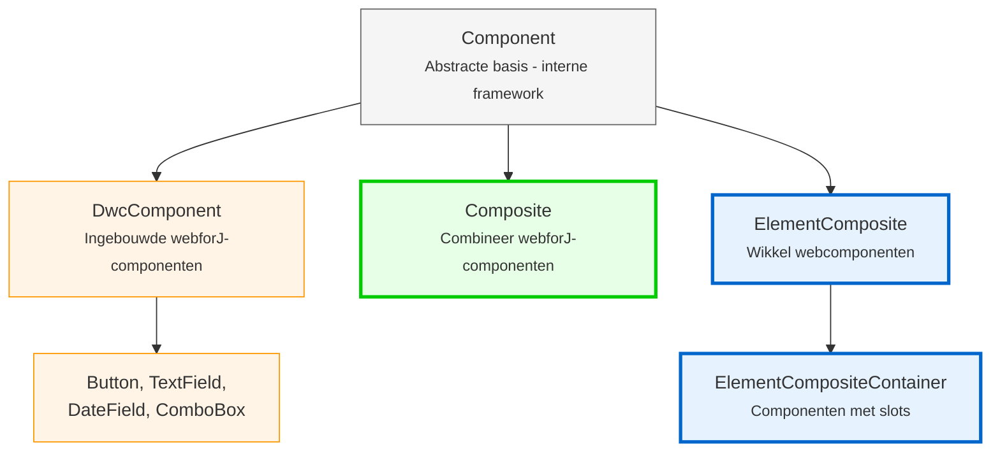

<JavadocLink type="foundation" location="com/webforj/component/Component" top='true'/>

Voordat je aangepaste componenten in webforJ bouwt, is het belangrijk om de fundamentele architectuur te begrijpen die bepaalt hoe componenten werken. Dit artikel legt de componenthiërarchie, componentidentiteit, levenscyclusconcepten en hoe concerninterfaces componentfunctionaliteiten bieden uit.

## Begrijpen van de componenthiërarchie {#understanding-the-component-hierarchy}

webforJ organiseert componenten in een hiërarchie met twee groepen: interne klassen van het framework die je nooit moet uitbreiden, en klassen die specifiek zijn ontworpen voor het bouwen van aangepaste componenten. Deze sectie legt uit waarom webforJ compositie boven inherentie gebruikt en wat elk niveau van de hiërarchie biedt.

### Waarom compositie in plaats van uitbreiding? {#why-composition-instead-of-extension}

In webforJ zijn ingebouwde componenten zoals [`Button`](../components/button) en [`TextField`](../components/fields/textfield) finale klassen - je kunt ze niet uitbreiden:

```java
// Dit werkt niet in webforJ
public class MyButton extends Button {
    // Button is final - kan niet worden uitgebreid 
}
```

webforJ gebruikt **compositie boven inherentie**. In plaats van bestaande componenten uit te breiden, maak je een klasse die `Composite` uitbreidt en combineer je componenten daarin. `Composite` fungeert als een container die een enkele component (de gebonden component) omsluit en je in staat stelt om je eigen componenten en gedrag toe te voegen.

```java
public class SearchBar extends Composite<FlexLayout> {
    private final FlexLayout self = getBoundComponent();
    private TextField searchField;
    private Button searchButton;
    
    public SearchBar() {
        searchField = new TextField("Zoeken");
        searchButton = new Button("Ga");
        
        self.setDirection(FlexDirection.ROW)
            .add(searchField, searchButton);
    }
}
```

### Waarom je ingebouwde componenten niet kunt uitbreiden {#why-you-cant-extend-built-in-components}

webforJ-componenten zijn gemarkeerd als final om de integriteit van de onderliggende client-side webcomponent te behouden. Het uitbreiden van webforJ-componentklassen zou controle geven over de onderliggende webcomponent, wat onbedoelde gevolgen kan hebben en de consistentie en voorspelbaarheid van componentgedrag kan verstoren.

Voor een gedetailleerde uitleg, zie [Final Classes and Extension Restrictions](https://docs.webforj.com/docs/architecture/controls-components#final-classes-and-extension-restrictions) in de architectuurdocumentatie.

### De componenthiërarchie {#the-component-hierarchy}


```mermaid
graph TD
    A[Component<br/><small>Abstracte basis - interne framework</small>]
    
    A --> B[DwcComponent<br/><small>Ingebouwde webforJ-componenten</small>]
    A --> C[Composite<br/><small>Combineer webforJ-componenten</small>]
    A --> D[ElementComposite<br/><small>Wikkel webcomponenten</small>]
    
    B --> E[Button, TextField,<br/>DateField, ComboBox]
    
    D --> F[ElementCompositeContainer<br/><small>Componenten met slots</small>]
    
    style A fill:#f5f5f5,stroke:#666
    style B fill:#fff4e6,stroke:#ff9800
    style C fill:#e6ffe6,stroke:#00cc00
    style D fill:#e6f3ff,stroke:#0066cc
    style E fill:#fff4e6,stroke:#ff9800
    style F fill:#e6f3ff,stroke:#0066cc
    
    classDef userClass stroke-width:3px
    class C,D,F userClass
```

**Klassen voor ontwikkelaars (gebruik deze):**
- **Composite**
- **ElementComposite**
- **ElementCompositeContainer**

**Interne frameworkklassen (nooit direct uitbreiden):**
- **Component**
- **DwcComponent**

:::warning[Never extend `Component` or `DwcComponent`]
Nooit `Component` of `DwcComponent` direct uitbreiden. Alle ingebouwde componenten zijn final. Gebruik altijd compositiepatronen met `Composite` of `ElementComposite`.

Proberen om `DwcComponent` uit te breiden zal een runtime-exceptie veroorzaken.
:::

## Concerninterfaces {#concern-interfaces}

Concerninterfaces zijn Java-interfaces die specifieke functionaliteiten aan je componenten bieden. Elke interface voegt een set gerelateerde methoden toe. Bijvoorbeeld, `HasSize` voegt methoden toe voor het controleren van breedte en hoogte, terwijl `HasFocus` methoden toevoegt voor het beheren van de focusstatus.

Wanneer je een concerninterface op je component implementeert, krijg je toegang tot die functionaliteiten zonder dat je implementatiecode hoeft te schrijven. De interface biedt standaardimplementaties die automatisch werken.

Het implementeren van concerninterfaces geeft je aangepaste componenten dezelfde API's als ingebouwde webforJ-componenten:

```java
// Implementeer HasSize om automatisch breedte/hoogte methoden te krijgen
public class SizedCard extends Composite<Div> implements HasSize<SizedCard> {
    private final Div self = getBoundComponent();
    
    public SizedCard() {
        self.setText("Kaartinhoud");
    }
    
    // Geen nood om deze te implementeren - je krijgt ze gratis:
    // setWidth(), setHeight(), setSize()
}

// Gebruik het zoals elke webforJ-component
SizedCard card = new SizedCard();
card.setWidth("300px")
    .setHeight("200px");
```

De composite stuurt deze oproepen automatisch door naar de onderliggende `Div`. Geen extra code nodig.

**Veelvoorkomende concerninterfaces:**
- `HasSize` - `setWidth()`, `setHeight()`, `setSize()`
- `HasFocus` - `focus()`, `setFocusable()`, focusgebeurtenissen
- `HasClassName` - `addClassName()`, `removeClassName()`
- `HasStyle` - `setStyle()`, inline CSS-beheer
- `HasVisibility` - `setVisible()`, tonen/verbergen mogelijkheid
- `HasText` - `setText()`, tekstinhoudbeheer
- `HasAttribute` - `setAttribute()`, HTML-attribuutbeheer

:::warning
Als de onderliggende component de interfacefunctionaliteit niet ondersteunt, krijg je een runtime-exceptie. Zorg in dat geval voor je eigen implementatie.
:::

Voor een complete lijst van beschikbare concerninterfaces, zie de [webforJ JavaDoc](https://javadoc.io/doc/com.webforj/webforj-foundation/latest/com/webforj/concern/package-summary.html).

## Overzicht van de componentlevenscyclus {#component-lifecycle-overview}

webforJ beheert de componentlevenscyclus automatisch. Het framework behandelt het maken, hechten en vernietigen van componenten zonder dat handmatige tussenkomst nodig is.

**Levenscyclushooks** zijn beschikbaar wanneer je ze nodig hebt:
- `onDidCreate()` - Wordt aangeroepen nadat de component aan de DOM is gehecht
- `onDidDestroy()` - Wordt aangeroepen wanneer de component wordt vernietigd

Deze hooks zijn **optioneel**. Gebruik ze wanneer je dat nodig hebt:
- Hulpbronnen opruimen (intervallen stoppen, verbindingen sluiten)
- Componenten initialiseren die DOM-hechting vereisen
- Integreren met client-side JavaScript

Voor de meeste eenvoudige gevallen kun je componenten direct in de constructor initialiseren. Gebruik levenscyclushooks zoals `onDidCreate()` om werk uit te stellen wanneer dat nodig is.
