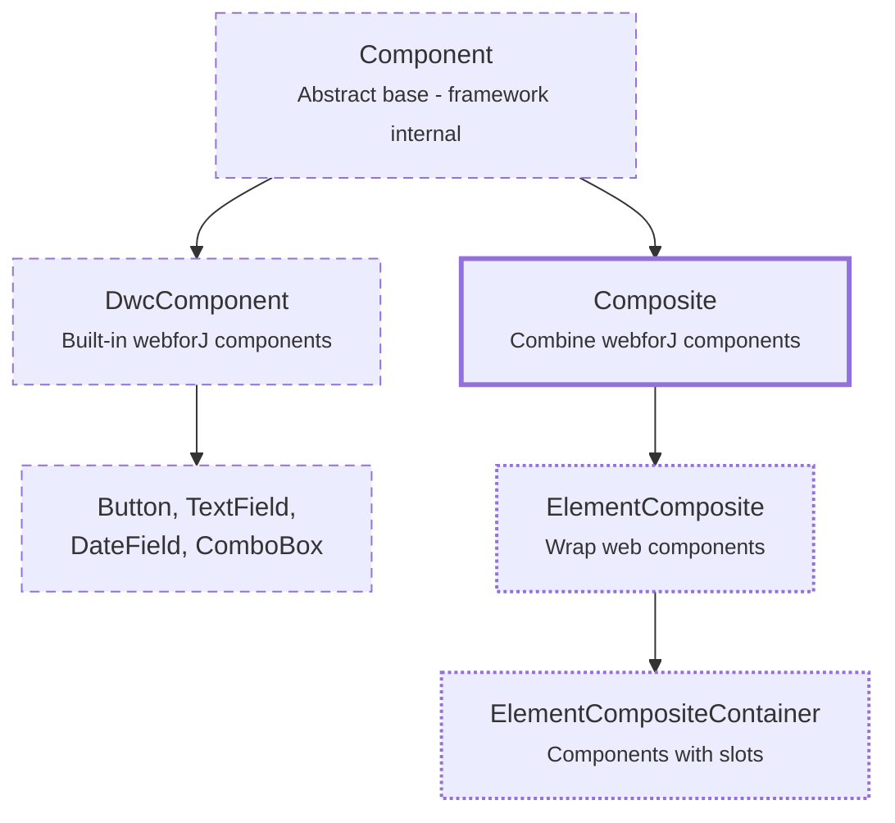

<JavadocLink type="foundation" location="com/webforj/component/Component" top='true'/> 

Voordat je aangepaste componenten in webforJ bouwt, is het belangrijk om de fundamentele architectuur te begrijpen die bepaalt hoe componenten werken. Dit artikel legt de componenthiërarchie, componentidentiteit, levenscyclusconcepten uit, en hoe concerninterfaces componentcapaciteiten bieden.

## Begrijpen van de componenthiërarchie {#understanding-the-component-hierarchy}

webforJ organiseert componenten in een hiërarchie met twee groepen: interne klassen van het framework die je nooit mag uitbreiden, en klassen die specifiek zijn ontworpen voor het bouwen van aangepaste componenten. Deze sectie legt uit waarom webforJ compositie boven overerving gebruikt en wat elk niveau van de hiërarchie biedt.

### Waarom compositie in plaats van extensie? {#why-composition-instead-of-extension}

In webforJ zijn ingebouwde componenten zoals [`Button`](../components/button) en [`TextField`](../components/fields/textfield) finale klassen—je kunt ze niet uitbreiden:

```java
// Dit werkt niet in webforJ
public class MyButton extends Button {
  // Button is final - kan niet worden uitgebreid 
}
```

webforJ gebruikt **compositie boven overerving**. In plaats van bestaande componenten uit te breiden, maak je een klasse die `Composite` uitbreidt en combineer je componenten erin. `Composite` functioneert als een container die een enkele component (de gebonden component) omhult en stelt je in staat om je eigen componenten en gedrag toe te voegen.

```java
public class SearchBar extends Composite<FlexLayout> {
  private final FlexLayout self = getBoundComponent();
  private TextField searchField;
  private Button searchButton;
  
  public SearchBar() {
    searchField = new TextField("Zoeken");
    searchButton = new Button("Ga");
    
    self.setDirection(FlexDirection.ROW)
      .add(searchField, searchButton);
  }
}
```

### Waarom je ingebouwde componenten niet kunt uitbreiden {#why-you-cant-extend-built-in-components}

webforJ componenten zijn gemarkeerd als final om de integriteit van de onderliggende client-side webcomponent te behouden. Het uitbreiden van webforJ componentklassen zou controle geven over de onderliggende webcomponent, wat zou kunnen leiden tot onbedoelde gevolgen en de consistentie en voorspelbaarheid van het gedrag van componenten zou kunnen verstoren.

Voor een gedetailleerde uitleg, zie [Final Classes and Extension Restrictions](https://docs.webforj.com/docs/architecture/controls-components#final-classes-and-extension-restrictions) in de architectuurdocumentatie.

### De componenthiërarchie {#the-component-hierarchy}

<div style={{textAlign: 'center'}}>

```mermaid
graph TD
  A[Component<br/><small>Abstract base - framework internal</small>]
  
  A --> B[DwcComponent<br/><small>Built-in webforJ components</small>]
  A --> C[Composite<br/><small>Combine webforJ components</small>]
  
  B --> E[Button, TextField,<br/>DateField, ComboBox]
  
  C --> D[ElementComposite<br/><small>Wrap web components</small>]
  D --> F[ElementCompositeContainer<br/><small>Components with slots</small>]

  classDef internal stroke-dasharray:6 4,stroke-width:1px
  classDef primary stroke-width:3px
  classDef secondary stroke-width:2px,stroke-dasharray:2 2
  class A,B,E internal
  class C primary
  class D,F secondary
```
</div>

Klassen voor ontwikkelaars (gebruik deze):
- `Composite`
- `ElementComposite`
- `ElementCompositeContainer`

Interne frameworkklassen (nooit direct uitbreiden):
- `Component`
- `DwcComponent`

:::warning[Never extend `Component` or `DwcComponent`]
Nooit `Component` of `DwcComponent` direct uitbreiden. Alle ingebouwde componenten zijn final. Gebruik altijd compositiepatronen met `Composite` of `ElementComposite`.

Proberen `DwcComponent` uit te breiden zal een runtime-exceptie genereren.
:::

## Concerninterfaces {#concern-interfaces}

Concerninterfaces zijn Java-interfaces die specifieke mogelijkheden aan je componenten bieden. Elke interface voegt een set van gerelateerde methoden toe. Bijvoorbeeld, `HasSize` voegt methoden toe voor het beheersen van breedte en hoogte, terwijl `HasFocus` methoden toevoegt voor het beheren van de focusstatus.

Wanneer je een concerninterface op je component implementeert, krijg je toegang tot die mogelijkheden zonder implementatiecode te schrijven. De interface biedt standaardimplementaties die automatisch werken.

Het implementeren van concerninterfaces geeft je aangepaste componenten dezelfde API's als ingebouwde webforJ-componenten:

```java
// Implementeer HasSize om automatisch breedte/hoogte methoden te krijgen
public class SizedCard extends Composite<Div> implements HasSize<SizedCard> {
  private final Div self = getBoundComponent();
  
  public SizedCard() {
    self.setText("Inhoud kaart");
  }
  
  // Geen behoefte om deze te implementeren - je krijgt ze gratis:
  // setWidth(), setHeight(), setSize()
}

// Gebruik het zoals elke webforJ-component
SizedCard card = new SizedCard();
card.setWidth("300px")
  .setHeight("200px");
```

De composiet stuurt deze oproepen automatisch door naar de onderliggende `Div`. Geen extra code nodig.

### Uiterlijk {#concern-interfaces-appearance}

Deze interfaces regelen de visuele presentatie van een component, inclusief zijn afmetingen, zichtbaarheid, styling en thema.

| Interface | Omschrijving |
|---|---|
| `HasSize` | Beheert breedte en hoogte, inclusief minimale en maximale beperkingen. Extend `HasWidth`, `HasHeight`, en hun min/max varianten. |
| `HasVisibility` | Toont of verbergt de component zonder deze uit de lay-out te verwijderen. |
| `HasClassName` | Beheert CSS-klassennamen op het root-element van de component. |
| `HasStyle` | Past inline CSS-stijlen toe en verwijdert ze. |
| `HasHorizontalAlignment` | Beheert hoe de inhoud horizontaal binnen de component is uitgelijnd. |
| `HasExpanse` | Stelt de groottevariant van de component in met behulp van de standaard expanse-tokens (`XSMALL` tot `XLARGE`). |
| `HasTheme` | Past een themavariant toe zoals `DEFAULT`, `PRIMARY`, of `DANGER`. |
| `HasPrefixAndSuffix` | Voegt componenten toe aan de prefix- of suffixslot binnen de component. |

### Inhoud {#concern-interfaces-content}

Deze interfaces beheren wat een component toont, inclusief tekst, HTML, labels, hints en andere beschrijvende inhoud.

| Interface | Omschrijving |
|---|---|
| `HasText` | Stelt de platte tekstinhoud van de component in en haalt deze op. |
| `HasHtml` | Stelt de interne HTML van de component in en haalt deze op. |
| `HasLabel` | Voegt een beschrijvende label toe die aan de component is gekoppeld, gebruikt voor toegankelijkheid. |
| `HasHelperText` | Toont secundaire hinttekst onder de component. |
| `HasPlaceholder` | Stelt de placeholder tekst in die wordt weergegeven wanneer de component geen waarde heeft. |
| `HasTooltip` | Bevestigt een tooltip die verschijnt bij hover. |

### Status {#concern-interfaces-state}

Deze interfaces regelen de interactieve status van een component, inclusief of het is ingeschakeld, bewerkbaar, verplicht of gefocust bij het laden.

| Interface | Omschrijving |
|---|---|
| `HasEnablement` | Schakelt de component in of uit. |
| `HasReadOnly` | Plaatst de component in een alleen-lezen staat waarbij de waarde zichtbaar is, maar niet kan worden veranderd. |
| `HasRequired` | Merkt de component aan als verplicht, typisch voor formuliervalidatie. |
| `HasAutoFocus` | Verplaatst automatisch de focus naar de component wanneer de pagina laadt. |

### Focus {#concern-interfaces-focus}

Deze interfaces beheren hoe een component focus van het toetsenbord ontvangt en hierop reageert.

| Interface | Omschrijving |
|---|---|
| `HasFocus` | Beheert de focusstatus en of de component focus kan ontvangen. |
| `HasFocusStatus` | Controleert of de component momenteel focus heeft. Vereist een round-trip naar de client. |
| `HasHighlightOnFocus` | Beheert of de inhoud van de component wordt gemarkeerd wanneer deze focus ontvangt, en hoe (`KEY`, `MOUSE`, `KEY_MOUSE`, `ALL`, enzovoort). |

### Invoerbeperkingen {#concern-interfaces-input-constraints}

Deze interfaces definiëren welke waarden een component accepteert, inclusief de huidige waarde, toegestane bereiken, lengtebeperkingen, opmaakmaskers en lokaal specifieke gedrag.

| Interface | Omschrijving |
|---|---|
| `HasValue` | Krijgt en stelt de huidige waarde van de component in. |
| `HasMin` | Stelt een minimale toegestane waarde in. |
| `HasMax` | Stelt een maximale toegestane waarde in. |
| `HasStep` | Stelt de stapverhoging in voor numerieke of bereikinvoer. |
| `HasPattern` | Past een reguliere expressiepatroon toe om accepteerbare invoer te beperken. |
| `HasMinLength` | Stelt het minimum aantal vereiste tekens in de waarde van de component in. |
| `HasMaxLength` | Stelt het maximum aantal toegestane tekens in de waarde van de component in. |
| `HasMask` | Past een formaatmasker toe op de invoer. Gebruikt door gemaskerde veldcomponenten. |
| `HasTypingMode` | Beheert of getypte tekens worden ingevoegd of bestaande tekens overschrijven (`INSERT` of `OVERWRITE`). Gebruikt door gemaskerde velden en `TextArea`. |
| `HasRestoreValue` | Definieert een waarde waar de component naar terugreset wanneer de gebruiker Escape indrukt of `restoreValue()` aanroept. Gebruikt door gemaskerde velden. |
| `HasLocale` | Slaat een per-component lokale op voor lokaal gevoelige opmaak. Gebruikt door gemaskerde datum- en tijdvelden. |
| `HasPredictedText` | Stelt een voorspeld of auto-aanvult tekstwaarde in. Gebruikt door `TextArea` om inline suggesties te ondersteunen. |

### Validatie {#concern-interfaces-validation}

Deze interfaces voegen client-side validatiegedrag toe, inclusief het markeren van componenten als ongeldig, het weergeven van foutmeldingen en het beheren wanneer validatie wordt uitgevoerd.

| Interface | Omschrijving |
|---|---|
| `HasClientValidation` | Merkt een component als ongeldig, stelt de foutmelding in, en bevestigt een client-side validator. |
| `HasClientAutoValidation` | Beheert of de component automatisch valideert tijdens het typen. |
| `HasClientAutoValidationOnLoad` | Beheert of de component valideert wanneer deze voor het eerst laadt. |
| `HasClientValidationStyle` | Beheert hoe validatieberichten worden weergegeven: `INLINE` (onder de component) of `POPOVER`. |

### DOM-toegang {#concern-interfaces-dom-access}

Deze interfaces bieden laagdrempelige toegang tot het onderliggende HTML-element van de component en client-side eigenschappen.

| Interface | Omschrijving |
|---|---|
| `HasAttribute` | Leest en schrijft willekeurige HTML-attributen op het element van de component. |
| `HasProperty` | Leest en schrijft DWC-componenteigenschappen direct op het client-element. |

### i18n {#concern-interfaces-i18n}

Deze interface biedt ondersteuning voor vertalingen van componenten die lokaal tekst moeten weergeven.

| Interface | Omschrijving |
|---|---|
| `HasTranslation` | Biedt de `t()` helpermethode voor het oplossen van vertalingssleutels naar gelokaliseerde tekenreeksen met behulp van de huidige lokale van de app. |

:::warning
Als de onderliggende component de interfacecapaciteit niet ondersteunt, krijg je een runtime-exceptie. Bied in dat geval je eigen implementatie aan.
:::

Voor een complete lijst van beschikbare concerninterfaces, zie de [webforJ JavaDoc](https://javadoc.io/doc/com.webforj/webforj-foundation/latest/com/webforj/concern/package-summary.html).

## Componentidentificatoren {#component-identifiers}

webforJ-componenten hebben drie verschillende soorten identificatoren die verschillende doeleinden dienen:

- **Server-side component ID** (`getComponentId()`) - Automatisch toegewezen door het framework voor interne componenttracking. Gebruik dit wanneer je specifieke componenten moet opvragen of aangepaste componentregistries moet implementeren.
- **Client-side component ID** (`getClientComponentId()`) - Biedt toegang tot de onderliggende webcomponent vanuit JavaScript. Gebruik dit wanneer je native webcomponentmethoden moet aanroepen of wilt integreren met client-side bibliotheken.
- **HTML `id` attribuut** (`setAttribute("id", "...")`) - Standaard DOM-identificator. Gebruik dit voor CSS-doelgerichtheid, testautomatiseringselectoren en om formulierlabels aan invoer te koppelen.

Het begrijpen van deze verschillen helpt je de juiste identificator voor jouw use case te kiezen.

### Server-side component ID {#server-side-component-id}

Elke component krijgt automatisch een server-side identificator toegewezen wanneer deze wordt gemaakt. Deze identificator wordt intern gebruikt door het framework voor het bijhouden van componenten. Je kunt deze ophalen met `getComponentId()`:

```java
Button button = new Button("Klik op Mij");
String serverId = button.getComponentId();
```

De server-side ID is nuttig wanneer je specifieke componenten binnen een container moet opvragen of aangepaste componenttrackinglogica moet implementeren.

### Client-side component ID {#client-side-component-id}

De client-side component ID biedt toegang tot de onderliggende webcomponent vanuit JavaScript. Hiermee kun je direct communiceren met de client-side component wanneer dat nodig is:

```java
Button btn = new Button("Klik op mij");
btn.onClick(e -> {
  OptionDialog.showMessageDialog("De knop is aangeklikt", "Een gebeurtenis heeft plaatsgevonden");
});

btn.whenAttached().thenAccept(e -> {
  Page.getCurrent().executeJs("objects.get('" + btn.getClientComponentId() + "').click()");
});
```

Gebruik `getClientComponentId()` met `objects.get()` in JavaScript om de webcomponentinstantie te benaderen.

:::important
De client-side component ID is niet het HTML `id` attribuut van het DOM-element. Voor het instellen van HTML-ID's voor testen of CSS-doelgerichtheid, zie [Gebruik van Componenten](using-components).
:::

## Overzicht van de levenscyclus van componenten {#component-lifecycle-overview}

webforJ beheert de levenscyclus van componenten automatisch. Het framework behandelt het maken, hechten en vernietigen van componenten zonder handmatige tussenkomst.

**Levenscyclushooks** zijn beschikbaar wanneer je ze nodig hebt:
- `onDidCreate(T container)` - Wordt aangeroepen nadat de component aan de DOM is gehecht
- `onDidDestroy()` - Wordt aangeroepen wanneer de component wordt vernietigd

Deze hooks zijn **optioneel**. Gebruik ze wanneer je moet:
- Hulpbronnen opruimen (stoppen met intervallen, verbindingen sluiten)
- Componenten initialiseren die DOM-hechting vereisen
- Integreren met client-side JavaScript

Voor de meeste eenvoudige gevallen kun je componenten direct in de constructor initialiseren. Gebruik levenscyclushooks zoals `onDidCreate()` om het werk indien nodig uit te stellen.
