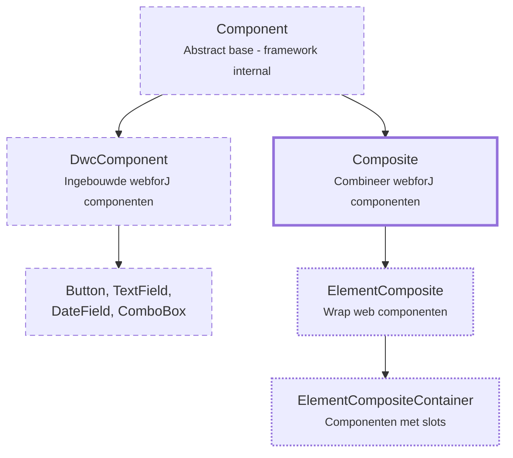

<JavadocLink type="foundation" location="com/webforj/component/Component" top='true'/> 

Voordat je aangepaste componenten in webforJ bouwt, is het belangrijk om de fundamentele architectuur te begrijpen die bepaalt hoe componenten werken. Dit artikel legt de componenthiërarchie, componentidentiteit, levenscyclusconcepten uit en hoe concerninterfaces componentmogelijkheden bieden.

## Begrijpen van de componenthiërarchie {#understanding-the-component-hierarchy}

webforJ organiseert componenten in een hiërarchie met twee groepen: interne klassen van het framework die je nooit moet uitbreiden, en klassen die specifiek zijn ontworpen voor het bouwen van aangepaste componenten. Deze sectie legt uit waarom webforJ samenstelling boven erfelijkheid gebruikt en wat elk niveau van de hiërarchie biedt.

### Waarom samenstelling in plaats van uitbreiding? {#why-composition-instead-of-extension}

In webforJ zijn ingebouwde componenten zoals [`Button`](../components/button) en [`TextField`](../components/fields/textfield) finale klassen—je kunt ze niet uitbreiden:

```java
// Dit werkt niet in webforJ
public class MyButton extends Button {
  // Button is final - kan niet worden uitgebreid 
}
```

webforJ gebruikt **samenstelling boven erfelijkheid**. In plaats van bestaande componenten uit te breiden, maak je een klasse die `Composite` uitbreidt en combineer je componenten erin. `Composite` fungeert als een container die een enkele component (de gebonden component) omhult en je in staat stelt je eigen componenten en gedrag toe te voegen.

```java
public class SearchBar extends Composite<FlexLayout> {
  private final FlexLayout self = getBoundComponent();
  private TextField searchField;
  private Button searchButton;
  
  public SearchBar() {
    searchField = new TextField("Zoeken");
    searchButton = new Button("Ga");
    
    self.setDirection(FlexDirection.ROW)
      .add(searchField, searchButton);
  }
}
```

### Waarom je ingebouwde componenten niet kunt uitbreiden {#why-you-cant-extend-built-in-components}

webforJ-componenten zijn gemarkeerd als final om de integriteit van de onderliggende client-side webcomponent te behouden. Het uitbreiden van webforJ-componentklassen zou controle over de onderliggende webcomponent geven, wat zou kunnen leiden tot onbedoelde gevolgen en de consistentie en voorspelbaarheid van het gedrag van componenten zou kunnen doorbreken.

Voor een gedetailleerde uitleg, zie [Final Classes and Extension Restrictions](https://docs.webforj.com/docs/architecture/controls-components#final-classes-and-extension-restrictions) in de architectuurdocumentatie.

### De componenthiërarchie {#the-component-hierarchy}

<div style={{textAlign: 'center'}}>

```mermaid
graph TD
  A[Component<br/><small>Abstract base - framework internal</small>]
  
  A --> B[DwcComponent<br/><small>Ingebouwde webforJ componenten</small>]
  A --> C[Composite<br/><small>Combineer webforJ componenten</small>]
  
  B --> E[Button, TextField,<br/>DateField, ComboBox]
  
  C --> D[ElementComposite<br/><small>Wrap web componenten</small>]
  D --> F[ElementCompositeContainer<br/><small>Componenten met slots</small>]

  classDef internal stroke-dasharray:6 4,stroke-width:1px
  classDef primary stroke-width:3px
  classDef secondary stroke-width:2px,stroke-dasharray:2 2
  class A,B,E internal
  class C primary
  class D,F secondary
```
</div>

Klassen voor ontwikkelaars (gebruik deze):
- `Composite`
- `ElementComposite`
- `ElementCompositeContainer`

Interne frameworkklassen (nooit direct uitbreiden):
- `Component`
- `DwcComponent`

:::warning[Never extend `Component` or `DwcComponent`]
Nooit `Component` of `DwcComponent` direct uitbreiden. Alle ingebouwde componenten zijn final. Gebruik altijd samenstelling patronen met `Composite` of `ElementComposite`.

Proberen `DwcComponent` uit te breiden zal een runtime-exceptie geven.
:::

## Concerninterfaces {#concern-interfaces}

Concerninterfaces zijn Java-interfaces die specifieke mogelijkheden aan je componenten bieden. Elke interface voegt een set gerelateerde methoden toe. Bijvoorbeeld, `HasSize` voegt methoden toe voor het beheersen van breedte en hoogte, terwijl `HasFocus` methoden toevoegt voor het beheren van de focusstatus.

Wanneer je een concerninterface op je component implementeert, krijg je toegang tot die mogelijkheden zonder enige implementatiecode te schrijven. De interface biedt standaardimplementaties die automatisch werken.

Het implementeren van concerninterfaces geeft je aangepaste componenten dezelfde API's als ingebouwde webforJ-componenten:

```java
// Implementeer HasSize om automatisch breedte/hoge methoden te krijgen
public class SizedCard extends Composite<Div> implements HasSize<SizedCard> {
  private final Div self = getBoundComponent();
  
  public SizedCard() {
    self.setText("Inhoud kaart");
  }
  
  // Geen noodzaak om deze te implementeren - je krijgt ze gratis:
  // setWidth(), setHeight(), setSize()
}

// Gebruik het zoals elk webforJ component
SizedCard card = new SizedCard();
card.setWidth("300px")
  .setHeight("200px");
```

De composiet stuurt deze oproepen automatisch door naar de onderliggende `Div`. Geen extra code nodig.

### Verschijning {#concern-interfaces-appearance}

Deze interfaces beheersen de visuele presentatie van een component, inclusief zijn afmetingen, zichtbaarheid, styling en thema.

| Interface | Beschrijving |
|---|---|
| `HasSize` | Beheert breedte en hoogte, inclusief min- en maxbeperkingen. Verlengt `HasWidth`, `HasHeight` en hun min/max-varianten. |
| `HasVisibility` | Toont of verbergt de component zonder deze uit de lay-out te verwijderen. |
| `HasClassName` | Beheert CSS-klassennamen op het wortelelement van de component. |
| `HasStyle` | Past inline CSS-stijlen toe en verwijdert deze. |
| `HasHorizontalAlignment` | Beheert hoe inhoud horizontaal binnen de component is uitgelijnd. |
| `HasExpanse` | Stelt de groottevariant van de component in met behulp van de standaard expanse-tokens (`XSMALL` tot `XLARGE`). |
| `HasTheme` | Past een themavariant toe zoals `DEFAULT`, `PRIMARY` of `DANGER`. |
| `HasPrefixAndSuffix` | Voegt componenten toe aan de prefix- of suffixslot binnen de component. |

### Inhoud {#concern-interfaces-content}

Deze interfaces beheren wat een component weergeeft, inclusief tekst, HTML, labels, hints en andere beschrijvende inhoud.

| Interface | Beschrijving |
|---|---|
| `HasText` | Stelt de normale tekstinhoud van de component in en haalt deze op. |
| `HasHtml` | Stelt de innerlijke HTML van de component in en haalt deze op. |
| `HasLabel` | Voegt een beschrijvende label toe die aan de component is gekoppeld, gebruikt voor toegankelijkheid. |
| `HasHelperText` | Toont secundaire hinttekst onder de component. |
| `HasPlaceholder` | Stelt de plaatsaanduidingtekst in die wordt weergegeven wanneer de component geen waarde heeft. |
| `HasTooltip` | Voegt een tooltip toe die verschijnt bij hover. |

### Staat {#concern-interfaces-state}

Deze interfaces beheersen de interactieve status van een component, inclusief of het is ingeschakeld, bewerkbaar, verplicht of gefocust bij de laadtijd.

| Interface | Beschrijving |
|---|---|
| `HasEnablement` | Schakelt de component in of uit. |
| `HasReadOnly` | Zet de component in een alleen-leesstatus waarin de waarde zichtbaar is maar niet kan worden gewijzigd. |
| `HasRequired` | Markeert de component als verplicht, meestal voor formuliervalidatie. |
| `HasAutoFocus` | Verplaatst de focus automatisch naar de component wanneer de pagina laadt. |

### Focus {#concern-interfaces-focus}

Deze interfaces beheren hoe een component focus ontvangt en hierop reageert met het toetsenbord.

| Interface | Beschrijving |
|---|---|
| `HasFocus` | Beheert de focusstatus en of de component focus kan ontvangen. |
| `HasFocusStatus` | Controleert of de component momenteel focus heeft. Vereist een round-trip naar de client. |
| `HasHighlightOnFocus` | Beheert of de inhoud van de component wordt gemarkeerd wanneer deze focus krijgt, en hoe (`KEY`, `MOUSE`, `KEY_MOUSE`, `ALL`, enzovoort). |

### Invoerbeperkingen {#concern-interfaces-input-constraints}

Deze interfaces definiëren welke waarden een component accepteert, inclusief de huidige waarde, toegelaten reeksen, lengtebeperkingen, formatteringsmaskers en locale-specifiek gedrag.

| Interface | Beschrijving |
|---|---|
| `HasValue` | Haalt de huidige waarde van de component op en stelt deze in. |
| `HasMin` | Stelt een minimum toegestane waarde in. |
| `HasMax` | Stelt een maximum toegestane waarde in. |
| `HasStep` | Stelt de stapverhoging in voor numerieke of bereikinput. |
| `HasPattern` | Past een reguliere expressiepatroon toe om de geaccepteerde invoer te beperken. |
| `HasMinLength` | Stelt het minimum aantal vereiste karakters in de waarde van de component in. |
| `HasMaxLength` | Stelt het maximum aantal toegestane karakters in de waarde van de component in. |
| `HasMask` | Past een formatteringsmasker toe op de invoer. Gebruikt door gemaskerde invoerveldcomponenten. |
| `HasTypingMode` | Beheert of getypte karakters worden ingevoegd of bestaande karakters overschrijven (`INSERT` of `OVERWRITE`). Gebruikt door gemaskerde velden en `TextArea`. |
| `HasRestoreValue` | Definieert een waarde waar de component naar terugzet wanneer de gebruiker Escape drukt of `restoreValue()` aanroept. Gebruikt door gemaskerde velden. |
| `HasLocale` | Slaat een per-component-locale op voor locale-gevoelige opmaak. Gebruikt door gemaskerde datum- en tijdvelden. |
| `HasPredictedText` | Stelt een voorspelde of automatisch aangevulde tekstwaarde in. Gebruikt door `TextArea` om inline suggesties te ondersteunen. |

### Validatie {#concern-interfaces-validation}

Deze interfaces voegen client-side validatiegedrag toe, inclusief het markeren van componenten als ongeldig, het weergeven van foutmeldingen en het besturen wanneer validatie plaatsvindt.

| Interface | Beschrijving |
|---|---|
| `HasClientValidation` | Merkt een component als ongeldig, stelt de foutmelding in en voegt een client-side validator toe. |
| `HasClientAutoValidation` | Beheert of de component automatisch valideert terwijl de gebruiker typt. |
| `HasClientAutoValidationOnLoad` | Beheert of de component valideert wanneer deze voor het eerst laadt. |
| `HasClientValidationStyle` | Beheert hoe validatieberichten worden weergegeven: `INLINE` (onder de component) of `POPOVER`. |

### DOM-toegang {#concern-interfaces-dom-access}

Deze interfaces bieden laagdrempelige toegang tot het onderliggende HTML-element van de component en client-side eigenschappen.

| Interface | Beschrijving |
|---|---|
| `HasAttribute` | Leest en schrijft willekeurige HTML-attributen op het element van de component. |
| `HasProperty` | Leest en schrijft DWC-componenteigenschappen direct op het actieve element. |

### i18n {#concern-interfaces-i18n}

Deze interface biedt ondersteuning voor vertalingen voor componenten die gelokaliseerde tekst moeten weergeven.

| Interface | Beschrijving |
|---|---|
| `HasTranslation` | Biedt de `t()` helper-methode voor het oplossen van vertaalkeys naar gelokaliseerde strings met behulp van de huidige locale van de applicatie. |

:::warning
Als de onderliggende component de interfacecapaciteit niet ondersteunt, krijg je een runtime-exceptie. Bied in dat geval je eigen implementatie aan.
:::

Voor een complete lijst van beschikbare concerninterfaces, zie de [webforJ JavaDoc](https://javadoc.io/doc/com.webforj/webforj-foundation/latest/com/webforj/concern/package-summary.html).

## Overzicht van de levenscyclus van componenten {#component-lifecycle-overview}

webforJ beheert de levenscyclus van de component automatisch. Het framework behandelt het maken, koppelen en vernietigen van componenten zonder dat handmatige tussenkomst vereist is.

**Levenscyclushooks** zijn beschikbaar wanneer je ze nodig hebt:
- `onDidCreate(T container)` - Wordt aangeroepen nadat de component aan de DOM is gekoppeld
- `onDidDestroy()` - Wordt aangeroepen wanneer de component wordt vernietigd

Deze hooks zijn **optioneel**. Gebruik ze wanneer je dat nodig hebt:
- Maak resources vrij (stop intervallen, sluit verbindingen)
- Initialiseer componenten die DOM-koppeling vereisen
- Integreer met client-side JavaScript

Voor de meeste eenvoudige gevallen kun je componenten direct in de constructor initialiseren. Gebruik levenscyclushooks zoals `onDidCreate()` om werk, indien nodig, uit te stellen.
