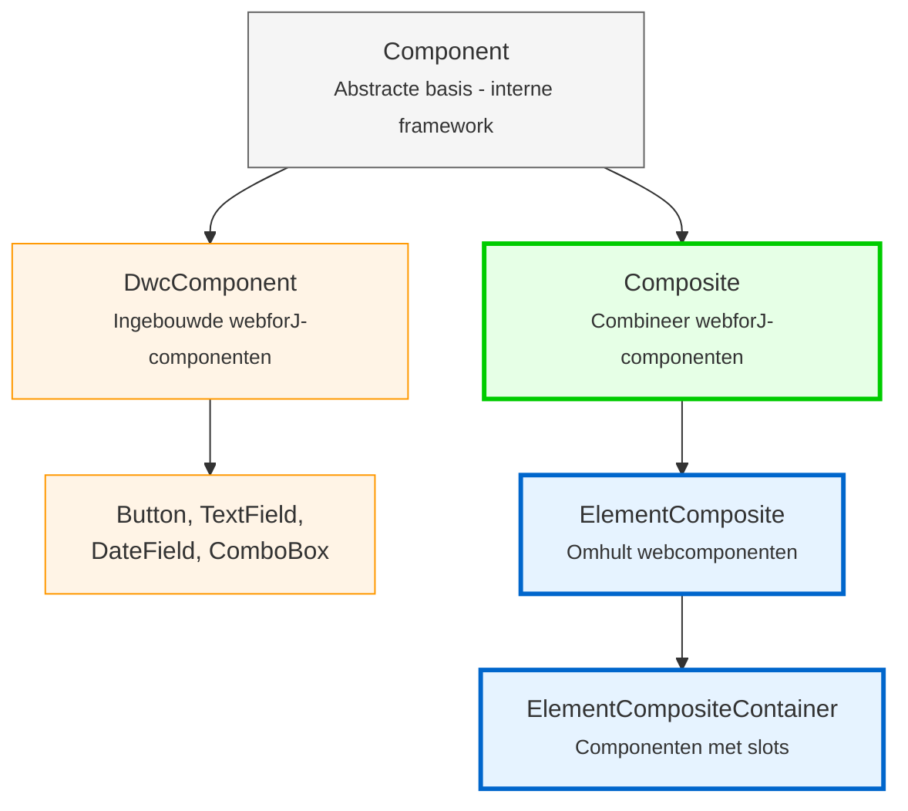

<JavadocLink type="foundation" location="com/webforj/component/Component" top='true'/> 

Voordat je aangepaste componenten in webforJ bouwt, is het belangrijk om de fundamentele architectuur te begrijpen die bepaalt hoe componenten werken. Dit artikel legt de componenthiërarchie, componentidentiteit, levenscyclusconcepten en hoe concerninterfaces componentcapaciteiten bieden uit.

## Begrijpen van de componenthiërarchie {#understanding-the-component-hierarchy}

webforJ organiseert componenten in een hiërarchie met twee groepen: interne klassen van het framework die je nooit moet uitbreiden, en klassen die speciaal zijn ontworpen voor het bouwen van aangepaste componenten. Deze sectie legt uit waarom webforJ compositie boven erfelijkheid gebruikt en wat elk niveau van de hiërarchie biedt.

### Waarom compositie in plaats van extensie? {#why-composition-instead-of-extension}

In webforJ zijn ingebouwde componenten zoals [`Button`](../components/button) en [`TextField`](../components/fields/textfield) final klassen - je kunt ze niet uitbreiden:

```java
// Dit werkt niet in webforJ
public class MyButton extends Button {
  // Button is final - kan niet worden uitgebreid 
}
```

webforJ gebruikt **compositie boven erfelijkheid**. In plaats van bestaande componenten uit te breiden, maak je een klasse die `Composite` uitbreidt en combineert componenten binnenin. `Composite` fungeert als een container die een enkele component (de gebonden component genoemd) omhult en je in staat stelt om je eigen componenten en gedragingen toe te voegen.

```java
public class SearchBar extends Composite<FlexLayout> {
  private final FlexLayout self = getBoundComponent();
  private TextField searchField;
  private Button searchButton;
  
  public SearchBar() {
    searchField = new TextField("Zoeken");
    searchButton = new Button("Ga");
    
    self.setDirection(FlexDirection.ROW)
      .add(searchField, searchButton);
  }
}
```

### Waarom je ingebouwde componenten niet kunt uitbreiden {#why-you-cant-extend-built-in-components}

webforJ-componenten zijn gemarkeerd als final om de integriteit van de onderliggende client-side webcomponent te behouden. Het uitbreiden van webforJ-componentklassen zou controle over de onderliggende webcomponent geven, wat zou kunnen leiden tot onbedoelde gevolgen en de consistentie en voorspelbaarheid van componentgedrag zou kunnen breken.

Voor een gedetailleerde uitleg, zie [Final Classes and Extension Restrictions](https://docs.webforj.com/docs/architecture/controls-components#final-classes-and-extension-restrictions) in de architectuurdocumentatie.

### De componenthiërarchie {#the-component-hierarchy}

<div style={{textAlign: 'center'}}>

```mermaid
graph TD
  A[Component<br/><small>Abstracte basis - interne framework</small>]
  
  A --> B[DwcComponent<br/><small>Ingebouwde webforJ-componenten</small>]
  A --> C[Composite<br/><small>Combineer webforJ-componenten</small>]
  
  B --> E[Button, TextField,<br/>DateField, ComboBox]
  
  C --> D[ElementComposite<br/><small>Omhult webcomponenten</small>]
  D --> F[ElementCompositeContainer<br/><small>Componenten met slots</small>]
  
  style A fill:#f5f5f5,stroke:#666
  style B fill:#fff4e6,stroke:#ff9800
  style C fill:#e6ffe6,stroke:#00cc00
  style D fill:#e6f3ff,stroke:#0066cc
  style E fill:#fff4e6,stroke:#ff9800
  style F fill:#e6f3ff,stroke:#0066cc
  
  classDef userClass stroke-width:3px
  class C,D,F userClass
```
</div>

Klassen voor ontwikkelaars (gebruik deze):
- `Composite`
- `ElementComposite`
- `ElementCompositeContainer`

Interne frameworkklassen (nooit direct uitbreiden):
- `Component`
- `DwcComponent`

:::warning[Never extend `Component` or `DwcComponent`]
Nooit `Component` of `DwcComponent` direct uitbreiden. Alle ingebouwde componenten zijn final. Gebruik altijd compositiepatronen met `Composite` of `ElementComposite`.

Proberen `DwcComponent` uit te breiden zal een runtime-exceptie veroorzaken.
:::

## Concerninterfaces {#concern-interfaces}

Concerninterfaces zijn Java-interfaces die specifieke mogelijkheden aan je componenten bieden. Elke interface voegt een set verwante methoden toe. Bijvoorbeeld, `HasSize` voegt methoden toe voor het beheersen van breedte en hoogte, terwijl `HasFocus` methoden toevoegt voor het beheren van de focusstatus.

Wanneer je een concerninterface implementeert op je component, krijg je toegang tot die mogelijkheden zonder dat je implementatiecode hoeft te schrijven. De interface biedt standaardimplementaties die automatisch werken.

Het implementeren van concerninterfaces geeft je aangepaste componenten dezelfde API's als ingebouwde webforJ-componenten:

```java
// Implementeer HasSize om automatisch breedte/hoogtemethoden te krijgen
public class SizedCard extends Composite<Div> implements HasSize<SizedCard> {
  private final Div self = getBoundComponent();
  
  public SizedCard() {
    self.setText("Inhoud kaart");
  }
  
  // Geen behoefte om deze te implementeren - je krijgt ze gratis:
  // setWidth(), setHeight(), setSize()
}

// Gebruik het zoals elke webforJ-component
SizedCard card = new SizedCard();
card.setWidth("300px")
  .setHeight("200px");
```

De composite geeft deze aanroepen automatisch door aan de onderliggende `Div`. Geen extra code nodig.

**Veelvoorkomende concerninterfaces:**
- `HasSize` - `setWidth()`, `setHeight()`, `setSize()`
- `HasFocus` - `focus()`, `setFocusable()`, focusevents
- `HasClassName` - `addClassName()`, `removeClassName()`
- `HasStyle` - `setStyle()`, inline CSS-beheer
- `HasVisibility` - `setVisible()`, toon/verberg mogelijkheid
- `HasText` - `setText()`, tekstinhoud beheer
- `HasAttribute` - `setAttribute()`, HTML- attribuutbeheer

:::warning
Als de onderliggende component de interfacecapaciteit niet ondersteunt, krijg je een runtime-exceptie. Bied in dat geval je eigen implementatie aan.
:::

Voor een complete lijst van beschikbare concerninterfaces zie de [webforJ JavaDoc](https://javadoc.io/doc/com.webforj/webforj-foundation/latest/com/webforj/concern/package-summary.html).

## Overzicht van de levenscyclus van componenten {#component-lifecycle-overview}

webforJ beheert de levenscyclus van componenten automatisch. Het framework handelt de creatie, bijvoeging en vernietiging van componenten af zonder dat handmatige tussenkomst nodig is.

**Levenscyclushaakjes** zijn beschikbaar wanneer je ze nodig hebt:
- `onDidCreate()` - Wordt aangeroepen nadat de component aan de DOM is toegevoegd
- `onDidDestroy()` - Wordt aangeroepen wanneer de component wordt vernietigd

Deze haakjes zijn **optioneel**. Gebruik ze wanneer je dat nodig hebt:
- Bronnen opruimen (stoppen met intervallen, verbindingen sluiten)
- Componenten initialiseren die DOM-bijvoeging vereisen
- Integreren met client-side JavaScript

Voor de meeste eenvoudige gevallen kun je componenten rechtstreeks in de constructor initialiseren. Gebruik levenscyclushaakjes zoals `onDidCreate()` om werk uit te stellen wanneer dat nodig is.
