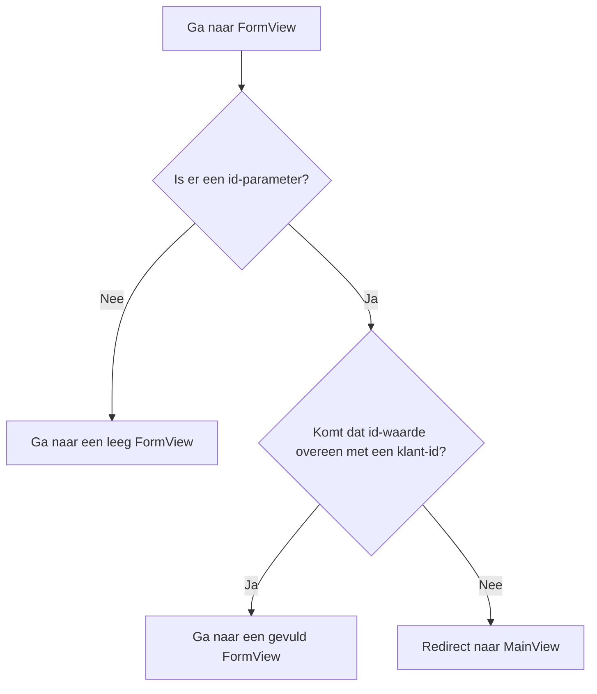

De app van [Routing and Composites](/docs/introduction/tutorial/routing-and-composites) kan alleen nieuwe klanten aan de database toevoegen. Met behulp van de volgende concepten geef je gebruikers de mogelijkheid om ook de gegevens van bestaande klanten te bewerken:

- Routepatronen
- Waardeparameters doorgeven via een URL
- Levenscycluswaarnemers

Door deze stap te voltooien, creëer je een versie van [4-observers-and-route-parameters](https://github.com/webforj/webforj-tutorial/tree/main/4-observers-and-route-parameters).

## De app uitvoeren {#running-the-app}

Terwijl je je app ontwikkelt, kun je [4-observers-and-route-parameters](https://github.com/webforj/webforj-tutorial/tree/main/4-observers-and-route-parameters) als vergelijking gebruiken. Om de app in actie te zien:

1. Navigeer naar de topmap die het bestand `pom.xml` bevat, dit is `4-observers-and-route-parameters` als je de versie op GitHub volgt.

2. Gebruik de volgende Maven-opdracht om de Spring Boot-app lokaal uit te voeren:
    ```bash
    mvn
    ```

Het uitvoeren van de app opent automatisch een nieuwe browser op `http://localhost:8080`.

## Het `id` van de klant gebruiken {#using-the-customers-id}

Om `FormView` te gebruiken om bestaande klanten te bewerken, heb je een manier nodig om aan te geven welke klant je wilt bewerken. Dit kun je doen door een initiële parameter aan `FormView` te geven die het klant-ID vertegenwoordigt. In [Working with Data](/docs/introduction/tutorial/working-with-data) heb je een entiteit `Customer` gemaakt die een numerieke `Long` waarde als uniek `id` aan klanten toekent wanneer ze aan de database worden toegevoegd.

```java
 @Id
 @GeneratedValue(strategy = GenerationType.IDENTITY)
  private Long id;
```

In deze stap breng je wijzigingen aan in `FormView`, zodat het een `id` gebruikt als initiële parameter voordat iets wordt geladen. Vervolgens zal `FormView` de `id` evalueren om te bepalen of het formulier voor het toevoegen van een nieuwe klant of het bijwerken van een bestaande is. Tot slot, je zult `MainView` aanpassen zodat het een `id`-waarde verzendt bij het navigeren naar `FormView`.

## Een routepatroon aan `FormView` toevoegen {#adding-a-route-pattern}

In de vorige stap werd de route in `FormView` ingesteld op `@Route(customer)`, wat de klasse lokaal koppelt aan `http://localhost:8080/customer`. Het toevoegen van een routepatroon stelt je in staat om een `id` als initiële parameter aan `FormView` toe te voegen.

Een [Routepatroon](/docs/routing/route-patterns) stelt je in staat een parameter in de URL toe te voegen, deze optioneel te maken en beperkingen in te stellen op geldige patronen. Met de `@Route` annotatie, hier is wat `id` een optionele routeparameter voor `FormView` maakt:

- **`/:id`** geeft de route een genummerde parameter van `id`, zodat gaan naar `http://localhost:8080/customer/6` `FormView` laadt met een `id`-parameter van `6`.

- **`?`** maakt de parameter `id` optioneel. Standaard zijn parameters verplicht, maar het optioneel maken van de `id` stelt je in staat om `FormView` te gebruiken voor het toevoegen van nieuwe klanten die nog geen `id` hebben.

- **`<[0-9]+>`** constrains `id` om een positief getal te zijn. In hoekige haakjes, `<>`, kun je een beperking toevoegen als een reguliere expressie aan de parameter. Als de `id` niet overeenkomt met de beperking, bijvoorbeeld `http://localhost:8080/customer/john-smith`, wordt de gebruiker naar een 404-pagina gestuurd.

Om de optionele routeparameter aan `FormView` toe te voegen, wijzig je de `@Route` annotatie naar dit:

```java
@Route("customer/:id?<[0-9]+>")
```

## Routeren naar `FormView` {#routing-to-formview}

`FormView` accepteert nu een optionele `id`-parameter en laadt alleen als de `id` een heel positief getal is.

Echter, `FormView` kan nog steeds laden wanneer een gebruiker handmatig een URL voor een niet-bestaande klant invoert, zoals `http://localhost:8080/customer/5000`. Het toevoegen van een levenscycluswaarnemer voordat je `FormView` binnenkomt, laat je app bepalen hoe om te gaan met de binnenkomende `id`-waarde.

### Voorwaardelijk routeren {#conditional-routing}

Levenscycluswaarnemers stellen componenten in staat om te reageren op levenscyclusgebeurtenissen op specifieke momenten. Het artikel [Lifecycle Observers](/docs/routing/navigation-lifecycle/observers) somt de beschikbare waarneembaren op, maar deze stap gebruikt alleen de `WillEnterObserver`.

De timing van `WillEnterObserver` vindt plaats voordat de routering van de component is afgerond. Het gebruik van deze observer stelt je in staat om de binnenkomende `id` te evalueren. Als de `id` niet overeenkomt met een bestaande klant, kun je de gebruiker terugleiden naar `MainView` om een geldige klant te vinden om te bewerken.

Voordat we de code voor de `WillEnterObserver` bespreken, legt het volgende flowchart de mogelijke uitkomsten bij het routeren naar `FormView` vast:



### De `WillEnterObserver` gebruiken {#using-the-willenterobserver}

Het gebruik van de levenscycluswaarnemer die wordt geactiveerd voordat de component volledig wordt geladen, `WillEnterObserver`, stelt je in staat om voorwaarden toe te voegen om te bepalen of de app moet doorgaan naar `FormView`, of dat het de gebruikers moet omleiden naar `MainView`.

Elke levenscycluswaarnemer is een interface, dus implementeer `WillEnterObserver` als onderdeel van de verklaring voor `FormView`:

```java
public class FormView extends Composite<Div> implements WillEnterObserver {
```

De `WillEnterObserver` heeft de methode `onWillEnter()` die webforJ oproept voordat hij naar de component routeert. Deze methode heeft twee parameters: het `WillEnterEvent` en de `ParametersBag`.

Het `WillEnterEvent` bepaalt of de routering naar de component moet doorgaan met de methode `accept()`, of moet stoppen met routeren met de methode `reject()`. Na het afwijzen van de huidige route, moet je de gebruiker ergens anders naartoe omleiden.

De `ParametersBag` bevat de routerparameters van de URL. Je zult de `ParametersBag` in de volgende sectie gebruiken om de voorwaardelijke logica voor `onWillEnter()` met de `id`-parameter te creëren.

De volgende `onWillEnter()` is een voorbeeld met slechts twee uitkomsten:

```java
@Override
public void onWillEnter(WillEnterEvent event, ParametersBag parameters) {

  // Voeg voorwaardelijke logica toe
  if (<condition>) {

    // Sta toe dat routeren naar FormView doorgaat
    event.accept();

  } else {

    // Stop met routeren naar FormView
    event.reject();

    // Stuur de gebruiker naar MainView
    navigateToMain();
  }
}
```

### De `ParametersBag` gebruiken {#using-the-parametersbag}

Zoals kort vermeld in de vorige sectie, bevat de `ParametersBag` de routerparameter van de URL. Elke levenscycluswaarnemer heeft toegang tot dit object, en het gebruik daarvan in je app stelt je in staat om de `id`-waarde te krijgen.

Het `ParametersBag`-object biedt verschillende querymethoden om een parameter als een specifiek objecttype op te halen. Bijvoorbeeld, `getInt()` kan je een parameter geven als een `Integer`.

Echter, aangezien sommige parameters optioneel zijn, wat `getInt()` eigenlijk retourneert is `Optional<Integer>`. Het gebruik van de methode `ifPresentOrElse()` op de `Optional<Integer>` stelt je in staat om een variabele in te stellen met de `Integer`.

Wanneer er geen `id` aanwezig is, kan de gebruiker doorgaan naar `FormView` om een nieuwe klant toe te voegen.

```java
@Override
public void onWillEnter(WillEnterEvent event, ParametersBag parameters) {

  // Bepaal welke parameter je moet krijgen, en controleer of deze aanwezig is of niet
  parameters.getInt("id").ifPresentOrElse(id -> {

    // Gebruik het id als een variabele
    customerId = Long.valueOf(id);

  // Wanneer er geen id aanwezig is, ga verder naar FormView voor een nieuwe klant
  }, () -> event.accept());
        
}
```

### Is het `id` geldig? {#is-the-id-valid}

Op dit moment accepteert de `WillEnterObserver` uit de laatste sectie alleen de routering wanneer er geen `id` aanwezig is. De waarnemer moet nog een validatie uitvoeren voordat hij doorgaat naar `FormView`: verifieer of de `id` overeenkomt met een bestaande klant.

Nu kan `FormView` de `CustomerService` gebruiken om de aanwezigheid van een klant te bevestigen met de methode `doesCustomerExist()`. Als er geen overeenstemming is, kan de app de huidige routering afwijzen en de gebruiker omleiden naar `MainView` met `navigateToMain()`.

Bij een geldig `id`, kan de app `accept()` gebruiken om door te gaan met de routering naar `FormView`. Maak een methode `fillForm()` om de `customer`-variabele toe te wijzen aan de klant met de bijbehorende `id` in de database en stel de waarden van de velden in:

```java
public void fillForm(Long customerId) {
  customer = customerService.getCustomerByKey(customerId);
  firstName.setValue(customer.getFirstName());
  lastName.setValue(customer.getLastName());
  company.setValue(customer.getCompany());
  country.selectKey(customer.getCountry());
}
```

Net zoals bij het toevoegen van een nieuwe klant, laat het gebruik van de werkende kopie gebruikers toe om klantgegevens in de UI te bewerken zonder direct de repository te bewerken.

### Voltooid `onWillEnter()` {#completed-onwillenter}

De laatste twee secties hebben in detail besproken hoe je met elke uitkomst voor routering naar `FormView` moet omgaan met behulp van de `ParametersBag` en de `CustomerService`.

Hier volgt de voltooide `onWillEnter()` voor `FormView` die de `ParametersBag` gebruikt om de binnenkomende route ofwel af te wijzen of te accepteren, en andere methoden aanroept om ofwel het formulier in te vullen of de gebruiker naar `MainView` te sturen:

```java
@Override
public void onWillEnter(WillEnterEvent event, ParametersBag parameters) {

  // Bepaal welke parameter je moet krijgen, en controleer of deze aanwezig is of niet
  parameters.getInt("id").ifPresentOrElse(id -> {
    customerId = Long.valueOf(id);
    if (customerService.doesCustomerExist(customerId)) {
      // Deze klant bestaat, dus ga verder naar FormView, en initialiseer de velden met de id
      event.accept();
      fillForm(customerId);
    } else {
      // Deze klant bestaat niet, dus omleiden naar MainView
      event.reject();
      navigateToMain();
    }

  // Geen id was aanwezig, dus ga verder naar FormView voor een nieuwe klant
  }, () -> event.accept());
        
}
```

## Een klant toevoegen of bewerken {#adding-or-editing-a-customer}

De vorige versie van deze app voegde alleen nieuwe klanten toe wanneer de gebruiker het formulier indiende. Nu gebruikers bestaande klanten kunnen bewerken, moet de methode `submitCustomer()` verifiëren of de klant al bestaat voordat de database wordt bijgewerkt.

Aanvankelijk was het niet nodig om een variabele voor het klant-ID in `FormView` toe te wijzen, omdat nieuwe klanten een uniek `id` kregen wanneer ze in de database werden ingediend. Maar als je `customerId` als een initiële variabele in `FormView` declareert met een `id`-waarde die niet in gebruik is, blijft het onaangetast voor nieuwe klanten en wordt overschreven in `onWillEnter()` voor bestaande.

Dit stelt je in staat `doesCustomerExist()` te gebruiken om te verifiëren of je een nieuwe klant moet toevoegen of een bestaande moet bijwerken.

```java
private Long customerId = 0L;

//...

private void submitCustomer() {
  if (customerService.doesCustomerExist(customerId)) {
    customerService.updateCustomer(customer);
  } else {
    customerService.createCustomer(customer);
  }
  navigateToMain();
}
```

## Voltooid `FormView` {#completed-formview}

Hier is hoe `FormView` eruit zou moeten zien, nu het de mogelijkheid heeft om bestaande klanten te bewerken: 

## Navigeren van `MainView` naar `FormView` om klanten te bewerken {#navigating-from-mainview-to-formview-to-edit-customers}

Eerder in deze stap heb je een bestaande `ParametersBag` gebruikt om de waarde van een `id` te bepalen. Het maken van een nieuwe `ParametersBag` stelt je in staat om tussen klassen te navigeren met de parameters van jouw keuze. Het gebruik van de gegevens in de `Table` is een levensvatbare optie voor het verzenden van gebruikers naar `FormView` met een klant `id`.

Vergelijkbaar met de knop, maakt het verbinden van de navigatie met een door de gebruiker gekozen actie het hen mogelijk om te beslissen wanneer ze naar `FormView` willen gaan. Het toevoegen van een gebeurtenisluisteraar aan de `Table` stelt je in staat om de gebruiker naar `FormView` te sturen met een `ParametersBag`:

```java
table.addItemClickListener(this::editCustomer);

private void editCustomer(TableItemClickEvent<Customer> e) {
  Router.getCurrent().navigate(FormView.class,
      ParametersBag.of("id=" + e.getItemKey()));
}
```

Echter, de sleutel van de tabelitems wordt standaard automatisch gegenereerd. Je kunt expliciet elke sleutel laten overeenkomen met het `id` van een klant door de methode `setKeyProvider()` te gebruiken:

```java
table.setKeyProvider(Customer::getId);
```

Voeg in `MainView` de methoden `addItemClickListener()` en `setKeyProvider()` toe aan `buildTable()`, en voeg vervolgens de methode toe die de gebruiker naar `FormView` stuurt met een waarde voor de `id` in de `ParametersBag`, gebaseerd op waar op de tabel de gebruiker heeft geklikt:

```java title="MainView.java" {30-31,34-37}
@Route("/")
@FrameTitle("Klant Tafel")
public class MainView extends Composite<Div> {
  private final CustomerService customerService;
  private Div self = getBoundComponent();
  private Table<Customer> table = new Table<>();
  private Button addCustomer = new Button("Voeg Klant Toe", ButtonTheme.PRIMARY,
      e -> Router.getCurrent().navigate(FormView.class));

  public MainView(CustomerService customerService) {
    this.customerService = customerService;
    addCustomer.setWidth(200);
    buildTable();
    self.setWidth("fit-content")
        .addClassName("card")
        .add(table, addCustomer);
  }

  private void buildTable() {
    table.setSize("1000px", "294px");
    table.setMaxWidth("90vw");
    table.addColumn("firstName", Customer::getFirstName).setLabel("Voornaam");
    table.addColumn("lastName", Customer::getLastName).setLabel("Achternaam");
    table.addColumn("company", Customer::getCompany).setLabel("Bedrijf");
    table.addColumn("country", Customer::getCountry).setLabel("Land");
    table.setColumnsToAutoFit();
    table.setColumnsToResizable(false);
    table.getColumns().forEach(column -> column.setSortable(true));
    table.setRepository(customerService.getRepositoryAdapter());
    table.setKeyProvider(Customer::getId);
    table.addItemClickListener(this::editCustomer);
  }

  private void editCustomer(TableItemClickEvent<Customer> e) {
    Router.getCurrent().navigate(FormView.class,
        ParametersBag.of("id=" + e.getItemKey()));
  }
}
```

## Volgende stap {#next-step}

Nu gebruikers klantgegevens direct kunnen bewerken, moet je app wijzigingen valideren voordat ze aan de repository worden bevestigd. In [Validating and Binding Data](/docs/introduction/tutorial/validating-and-binding-data) ga je validatieregels maken en direct het datamodel aan de UI koppelen, zodat de componenten foutmeldingen kunnen weergegeven wanneer de gegevens ongeldig zijn.
