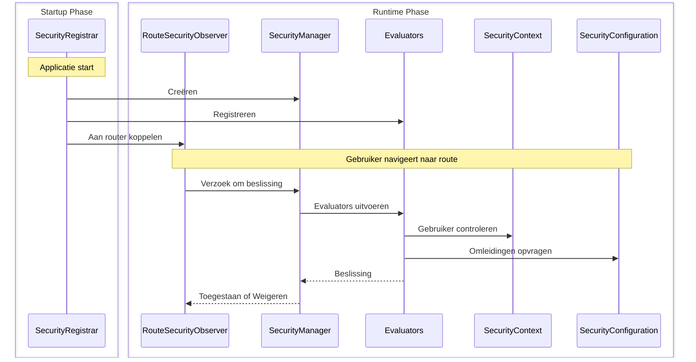

Deze gids begeleidt je bij het bouwen van een volledige aangepaste beveiligingsimplementatie met behulp van sessiegebaseerde authenticatie. Je leert hoe de vier kerninterfaces samenwerken door ze vanaf nul te implementeren.

:::tip[De meeste apps moeten Spring Security gebruiken]
De [Spring Security-integratie](/docs/security/getting-started) configureert automatisch alles wat hier is getoond. Bouw alleen aangepaste beveiliging als je specifieke vereisten hebt of geen gebruikmaakt van Spring Boot.
:::

## Wat je gaat bouwen {#what-youll-build}

Een werkend beveiligingssysteem met vier klassen:

- **SecurityConfiguration** - Definieert beveiligingsgedrag en omleidingslocaties
- **SecurityContext** - Houdt bij wie is ingelogd met behulp van HTTP-sessies
- **SecurityManager** - Coördineert beveiligingscontroles en biedt inloggen/uitloggen
- **SecurityRegistrar** - Verbindt alles tijdens de app-opstart

Dit voorbeeld gebruikt sessiegebaseerde opslag, maar je zou dezelfde interfaces kunnen implementeren met behulp van databasequery's, LDAP of een andere authenticatiebackend.

## Hoe de onderdelen samenwerken {#how-the-pieces-work-together}



**Stroom:**
1. **`SecurityRegistrar`** draait tijdens de opstart, maakt de manager aan, registreert evaluators en koppelt de observer
2. **`SecurityManager`** coördineert alles - het biedt de context en configuratie aan evaluators
3. **`SecurityContext`** beantwoordt "Wie is ingelogd?" door uit HTTP-sessies te lezen
4. **`SecurityConfiguration`** beantwoordt "Waarheen omleiden?" voor inlog- en toegang geweigerd pagina's
5. **`Evaluators`** nemen toegangbeslissingen met behulp van de context en configuratie

## Stap 1: Definieer beveiligingsconfiguratie {#step-1-define-security-configuration}

De configuratie vertelt het beveiligingssysteem hoe het zich moet gedragen en waar het gebruikers moet omleiden:

```java title="SecurityConfiguration.java"
package com.securityplain.security;

import com.webforj.router.history.Location;
import com.webforj.router.security.RouteSecurityConfiguration;
import java.util.Optional;

/**
 * Beveiligingsconfiguratie voor de applicatie.
 *
 * <p>
 * Definieert waar gebruikers naartoe moeten worden omgeleid wanneer authenticatie vereist is of toegang wordt geweigerd.
 * </p>
 */
public class SecurityConfiguration implements RouteSecurityConfiguration {

  @Override
  public boolean isEnabled() {
    return true;
  }

  @Override
  public boolean isSecureByDefault() {
    return false;
  }

  @Override
  public Optional<Location> getAuthenticationLocation() {
    return Optional.of(new Location("/login"));
  }

  @Override
  public Optional<Location> getDenyLocation() {
    return Optional.of(new Location("/access-denied"));
  }
}
```

- `isEnabled() = true` - Beveiliging is actief
- `isSecureByDefault() = false` - Routes zijn openbaar tenzij geannoteerd (gebruik `true` om authenticatie voor alle routes standaard vereist te maken)
- `/login` - Waar niet-geauthenticeerde gebruikers naartoe gaan
- `/access-denied` - Waar geauthenticeerde gebruikers zonder machtigingen naartoe gaan

## Stap 2: Implementeer beveiligingscontext {#step-2-implement-security-context}

De context houdt bij wie is ingelogd. Deze implementatie gebruikt HTTP-sessies om gebruikersinformatie op te slaan:

<!-- vale off -->

<ExpandableCode title="SecurityContext.java" language="java">
{`package com.securityplain.security;

import com.webforj.Environment;
import com.webforj.router.security.RouteSecurityContext;
import java.util.HashMap;
import java.util.Map;
import java.util.Optional;
import java.util.Set;

/**
 * Eenvoudige sessiegebaseerde beveiligingscontext.
 *
 * <p>
 * Slaat gebruikersprincipal en rollen op in HTTP-sessie. Dit is een minimale implementatie voor onderwijsdoeleinden.
 * </p>
 */
public class SecurityContext implements RouteSecurityContext {
  private static final String SESSION_USER_KEY = "security.user";
  private static final String SESSION_ROLES_KEY = "security.roles";
  private static final String SESSION_ATTRS_KEY = "security.attributes";

  /**
   * {@inheritDoc}
   */
  @Override
  public boolean isAuthenticated() {
    return getPrincipal().isPresent();
  }

  /**
   * {@inheritDoc}
   */
  @Override
  public Optional<Object> getPrincipal() {
    return getSessionAttribute(SESSION_USER_KEY);
  }

  /**
   * {@inheritDoc}
   */
  @Override
  public boolean hasRole(String role) {
    Optional<Object> rolesObj = getSessionAttribute(SESSION_ROLES_KEY);
    if (rolesObj.isPresent() && rolesObj.get() instanceof Set) {
      @SuppressWarnings("unchecked")
      Set<String> roles = (Set<String>) rolesObj.get();
      return roles.contains(role);
    }
    return false;
  }

  /**
   * {@inheritDoc}
   */
  @Override
  public boolean hasAuthority(String authority) {
    // In deze eenvoudige implementatie zijn autoriteiten hetzelfde als rollen
    return hasRole(authority);
  }

  /**
   * {@inheritDoc}
   */
  @Override
  public Optional<Object> getAttribute(String name) {
    Optional<Object> attrsObj = getSessionAttribute(SESSION_ATTRS_KEY);
    if (attrsObj.isPresent() && attrsObj.get() instanceof Map) {
      @SuppressWarnings("unchecked")
      Map<String, Object> attrs = (Map<String, Object>) attrsObj.get();
      return Optional.ofNullable(attrs.get(name));
    }
    return Optional.empty();
  }

  /**
   * {@inheritDoc}
   */
  @Override
  public void setAttribute(String name, Object value) {
    Environment.ifPresent(env -> {
      env.getSessionAccessor().ifPresent(accessor -> {
        accessor.access(session -> {
          @SuppressWarnings("unchecked")
          Map<String, Object> attrs =
              (Map<String, Object>) session.getAttribute(SESSION_ATTRS_KEY);
          if (attrs == null) {
            attrs = new HashMap<>();
            session.setAttribute(SESSION_ATTRS_KEY, attrs);
          }
          attrs.put(name, value);
        });
      });
    });
  }

  private Optional<Object> getSessionAttribute(String key) {
    final Object[] result = new Object[1];
    Environment.ifPresent(env -> {
      env.getSessionAccessor().ifPresent(accessor -> {
        accessor.access(session -> {
          result[0] = session.getAttribute(key);
        });
      });
    });
    return Optional.ofNullable(result[0]);
  }
}`}
</ExpandableCode>

<!-- vale on -->

**Hoe het werkt:**

- `isAuthenticated()` controleert of een gebruikersprincipal bestaat in de sessie
- `getPrincipal()` haalt de gebruikersnaam uit de sessiestorage
- `hasRole()` controleert of de rolenset van de gebruiker de opgegeven rol bevat
- `getAttribute()` / `setAttribute()` beheren aangepaste beveiligingsattributen
- `Environment.getSessionAccessor()` biedt thread-veilige toegang tot de sessie

## Stap 3: Maak beveiligingsmanager {#step-3-create-security-manager}

De manager coördineert beveiligingsbeslissingen. Het breidt `AbstractRouteSecurityManager` uit, dat evaluator-ketens en toegang weigering afhandelt:

<!-- vale off -->

<ExpandableCode title="SecurityManager.java" language="java">
{`package com.securityplain.security;

import com.webforj.environment.ObjectTable;
import com.webforj.environment.SessionObjectTable;
import com.webforj.router.Router;
import com.webforj.router.security.AbstractRouteSecurityManager;
import com.webforj.router.security.RouteAccessDecision;
import com.webforj.router.security.RouteSecurityConfiguration;
import com.webforj.router.security.RouteSecurityContext;

import java.util.Set;

/**
 * Eenvoudige implementatie van een beveiligingsmanager.
 *
 * <p>
 * Biedt statische methoden voor inloggen/uitloggen en beheert de beveiligingscontext.
 * </p>
 */
public class SecurityManager extends AbstractRouteSecurityManager {
  private static final String SESSION_USER_KEY = "security.user";
  private static final String SESSION_ROLES_KEY = "security.roles";

  /**
   * {@inheritDoc}
   */
  @Override
  public RouteSecurityConfiguration getConfiguration() {
    return new SecurityConfiguration();
  }

  /**
   * {@inheritDoc}
   */
  @Override
  public RouteSecurityContext getSecurityContext() {
    return new SecurityContext();
  }

  /**
   * Logt een gebruiker in met rollen.
   *
   * @param username de gebruikersnaam
   * @param password het wachtwoord
   */
  public RouteAccessDecision login(String username, String password) {
    if ("user".equals(username) && "password".equals(password)) {
      Set<String> roles = Set.of("USER");
      persistUser(username, roles);
      return RouteAccessDecision.grant();
    } else if ("admin".equals(username) && "admin".equals(password)) {
      Set<String> roles = Set.of("USER", "ADMIN");
      persistUser(username, roles);
      return RouteAccessDecision.grant();
    }

    return RouteAccessDecision.deny("Ongeldige gebruikersnaam of wachtwoord");
  }

  /**
   * Logt de huidige gebruiker uit en leidt om naar de inlogpagina.
   */
  public void logout() {
    SessionObjectTable.clear(SESSION_USER_KEY);
    SessionObjectTable.clear(SESSION_ROLES_KEY);

    Router router = Router.getCurrent();
    if (router != null) {
      getConfiguration().getAuthenticationLocation().ifPresent(location -> router.navigate(location));
    }
  }

  /**
   * Haal de huidige managerinstantie op.
   *
   * @return de huidige managerinstantie
   */
  public static SecurityManager getCurrent() {
    String key = SecurityManager.class.getName();
    if (ObjectTable.contains(key)) {
      return (SecurityManager) ObjectTable.get(key);
    }

    SecurityManager instance = new SecurityManager();
    ObjectTable.put(key, instance);

    return instance;
  }

  void saveCurrent(SecurityManager manager) {
    String key = SecurityManager.class.getName();
    ObjectTable.put(key, manager);
  }

  private void persistUser(String username, Set<String> roles) {
    SessionObjectTable.put(SESSION_USER_KEY, username);
    SessionObjectTable.put(SESSION_ROLES_KEY, roles);
  }
}`}
</ExpandableCode>

<!-- vale on -->

**Hoe het werkt:**

- Breidt `AbstractRouteSecurityManager` uit om evaluatorketenlogica te erven
- Biedt implementaties voor `getConfiguration()` en `getSecurityContext()`
- Voegt `login()` toe om gebruikers te authentiseren en referenties in de sessie op te slaan
- Voegt `logout()` toe om de sessie te wissen en om te leiden naar de inlogpagina
- Gebruikt [`SessionObjectTable`](/docs/advanced/object-string-tables#sessionobjecttable) voor eenvoudige sessieopslag
- Slaat zichzelf op in [`ObjectTable`](/docs/advanced/object-string-tables#objecttable) voor app-brede toegang

## Stap 4: Verbind alles tijdens opstart {#step-4-wire-everything-at-startup}

De registrar verbindt alle onderdelen wanneer de app start:

```java title="SecurityRegistrar.java"
package com.securityplain.security;

import com.webforj.App;
import com.webforj.AppLifecycleListener;
import com.webforj.annotation.AppListenerPriority;
import com.webforj.router.Router;
import com.webforj.router.security.RouteSecurityObserver;
import com.webforj.router.security.evaluator.AnonymousAccessEvaluator;
import com.webforj.router.security.evaluator.DenyAllEvaluator;
import com.webforj.router.security.evaluator.PermitAllEvaluator;
import com.webforj.router.security.evaluator.RolesAllowedEvaluator;

/**
 * Registreert routebeveiligingscomponenten tijdens de opstart van de applicatie.
 *
 * <p>
 * Stelt de beveiligingsmanager en evaluators in met de router.
 * </p>
 */
@AppListenerPriority(1)
public class SecurityRegistrar implements AppLifecycleListener {

  /**
   * {@inheritDoc}
   */
  @Override
  public void onWillRun(App app) {
    // Maak beveiligingsmanager aan
    SecurityManager securityManager = new SecurityManager();
    securityManager.saveCurrent(securityManager);

    // Registreer ingebouwde evaluators met prioriteiten
    securityManager.registerEvaluator(new DenyAllEvaluator(), 0);
    securityManager.registerEvaluator(new AnonymousAccessEvaluator(), 1);
    securityManager.registerEvaluator(new PermitAllEvaluator(), 2);
    securityManager.registerEvaluator(new RolesAllowedEvaluator(), 3);

    // Maak beveiligingsobserver aan en koppel deze aan de router
    RouteSecurityObserver securityObserver = new RouteSecurityObserver(securityManager);
    Router router = Router.getCurrent();
    if (router != null) {
      router.getRenderer().addObserver(securityObserver);
    }
  }
}
```

**Registreer de listener:**

Maak `src/main/resources/META-INF/services/com.webforj.AppLifecycleListener` met:

```text
com.securityplain.security.SecurityRegistrar
```

Dit registreert je [`AppLifecycleListener`](/docs/advanced/lifecycle-listeners) zodat het wordt uitgevoerd bij de opstart van de app.

**Hoe het werkt:**

- Draait vroeg (`@AppListenerPriority(1)`) om beveiliging op te zetten voordat routes worden geladen
- Maakt de beveiligingsmanager aan en slaat deze globaal op
- Registreert ingebouwde evaluators in prioriteitsvolgorde (lagere nummers draaien eerst)
- Maakt de observer die navigatie onderschept
- Koppelt de observer aan de router zodat beveiligingscontroles automatisch plaatsvinden

Nadat dit is uitgevoerd, is beveiliging actief voor alle navigatie.

## Gebruik je implementatie {#using-your-implementation}

### Maak een inlogweergave {#create-a-login-view}

De volgende weergave gebruikt de [`Login`](/docs/components/login) component.

```java title="LoginView.java"
package com.securityplain.views;

import com.securityplain.security.SecurityManager;
import com.webforj.component.Composite;
import com.webforj.component.login.Login;
import com.webforj.router.Router;
import com.webforj.router.annotation.FrameTitle;
import com.webforj.router.annotation.Route;
import com.webforj.router.history.Location;
import com.webforj.router.security.annotation.AnonymousAccess;

@Route("/login")
@FrameTitle("Inloggen")
@AnonymousAccess
public class LoginView extends Composite<Login> {
  private Login self = getBoundComponent();

  public LoginView() {
    self.onSubmit(e -> {
      var result = SecurityManager.getCurrent().login(
        e.getUsername(), e.getPassword()
      );
      
      if (result.isGranted()) {
        Router.getCurrent().navigate(new Location("/"));
      } else {
        self.setError(true);
        self.setEnabled(true);
      }
    });

    self.whenAttached().thenAccept(c -> self.open());
  }
}
```
