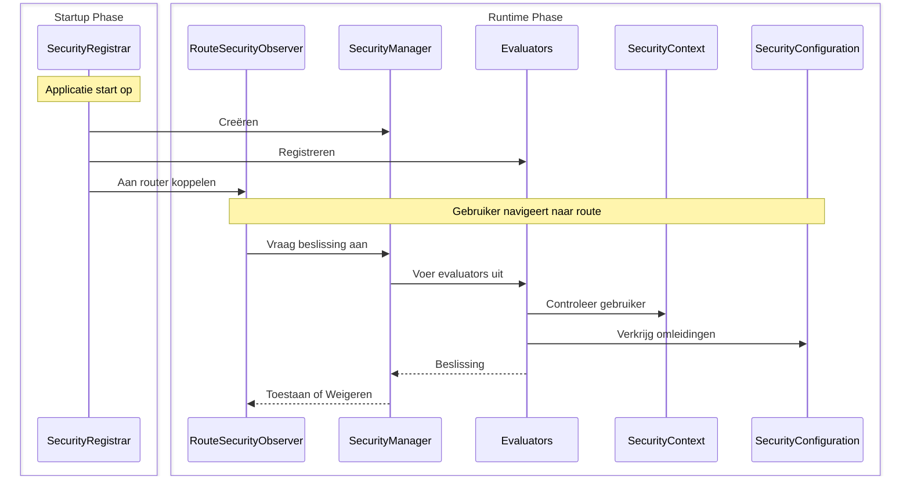

Deze gids doorloopt het bouwen van een complete aangepaste beveiligingsimplementatie met behulp van sessie-gebaseerde authenticatie. Je leert hoe de vier kerninterfaces samenwerken door ze vanaf nul te implementeren.

:::tip[De meeste apps zouden Spring Security moeten gebruiken]
De [Spring Security-integratie](/docs/security/getting-started) configureert automatisch alles wat hier wordt weergegeven. Bouw alleen aangepaste beveiliging als je specifieke vereisten hebt of geen gebruik maakt van Spring Boot.
:::

## Wat je gaat bouwen {#what-youll-build}

Een werkend beveiligingssysteem met vier klassen:

- **SecurityConfiguration** - Definieert het beveiligingsgedrag en de omleidingslocaties
- **SecurityContext** - Houdt bij wie is ingelogd met behulp van HTTP-sessies
- **SecurityManager** - Coördineert beveiligingscontroles en biedt inloggen/afmelden aan
- **SecurityRegistrar** - Verbindt alles met elkaar bij app-startup

Dit voorbeeld maakt gebruik van sessie-gebaseerde opslag, maar je zou dezelfde interfaces kunnen implementeren met behulp van database-query's, LDAP of een andere authenticatie-backend.

## Hoe de onderdelen samenwerken {#how-the-pieces-work-together}


```mermaid
sequenceDiagram
  box Startup Phase
  participant Registrar as SecurityRegistrar
  end
  box Runtime Phase
  participant Observer as RouteSecurityObserver
  participant Manager as SecurityManager
  participant Evaluators
  participant Context as SecurityContext
  participant Config as SecurityConfiguration
  end

  Note over Registrar: Applicatie start op
  Registrar->>Manager: Creëren
  Registrar->>Evaluators: Registreren
  Registrar->>Observer: Aan router koppelen

  Note over Observer,Config: Gebruiker navigeert naar route
  Observer->>Manager: Vraag beslissing aan
  Manager->>Evaluators: Voer evaluators uit
  Evaluators->>Context: Controleer gebruiker
  Evaluators->>Config: Verkrijg omleidingen
  Evaluators-->>Manager: Beslissing
  Manager-->>Observer: Toestaan of Weigeren
```

**Stroom:**
1. **`SecurityRegistrar`** draait bij opstarten, maakt de manager, registreert evaluators en koppelt de observer
2. **`SecurityManager`** coördineert alles - het biedt de context en configuratie aan evaluators
3. **`SecurityContext`** beantwoordt "Wie is ingelogd?" door te lezen uit HTTP-sessies
4. **`SecurityConfiguration`** beantwoordt "Waarheen omleiden?" voor inlog- en toegang geweigerd pagina's
5. **`Evaluators`** nemen toegangsbeslissingen met behulp van de context en configuratie

## Stap 1: Definieer beveiligingsconfiguratie {#step-1-define-security-configuration}

De configuratie vertelt het beveiligingssysteem hoe het zich moet gedragen en waar het gebruikers naartoe moet omleiden:

```java title="SecurityConfiguration.java"
package com.securityplain.security;

import com.webforj.router.history.Location;
import com.webforj.router.security.RouteSecurityConfiguration;
import java.util.Optional;

/**
 * Beveiligingsconfiguratie voor de applicatie.
 *
 * <p>
 * Definieert waar gebruikers naartoe moeten worden omgeleid wanneer authenticatie vereist is of toegang wordt geweigerd.
 * </p>
 */
public class SecurityConfiguration implements RouteSecurityConfiguration {

  @Override
  public boolean isEnabled() {
    return true;
  }

  @Override
  public boolean isSecureByDefault() {
    return false;
  }

  @Override
  public Optional<Location> getAuthenticationLocation() {
    return Optional.of(new Location("/login"));
  }

  @Override
  public Optional<Location> getDenyLocation() {
    return Optional.of(new Location("/access-denied"));
  }
}
```

- `isEnabled() = true` - Beveiliging is actief
- `isSecureByDefault() = false` - Routes zijn openbaar tenzij geannoteerd (gebruik `true` om authenticatie op alle routes standaard te vereisen)
- `/login` - Waar niet-geauthenticeerde gebruikers naartoe gaan
- `/access-denied` - Waar geauthenticeerde gebruikers zonder machtigingen naartoe gaan

## Stap 2: Implementeer beveiligingscontext {#step-2-implement-security-context}

De context houdt bij wie is ingelogd. Deze implementatie gebruikt HTTP-sessies om gebruikersinformatie op te slaan:

<!-- vale off -->

<ExpandableCode title="SecurityContext.java" language="java">

```java
package com.securityplain.security;

import com.webforj.Environment;
import com.webforj.router.security.RouteSecurityContext;
import java.util.HashMap;
import java.util.Map;
import java.util.Optional;
import java.util.Set;

/**
 * Eenvoudige sessie-gebaseerde beveiligingscontext.
 *
 * <p>
 * Slaat gebruikersprincipal en rollen op in HTTP-sessie. Dit is een minimale implementatie voor leerdoeleinden.
 * </p>
 */
public class SecurityContext implements RouteSecurityContext {
  private static final String SESSION_USER_KEY = "security.user";
  private static final String SESSION_ROLES_KEY = "security.roles";
  private static final String SESSION_ATTRS_KEY = "security.attributes";

  /**
   * {@inheritDoc}
   */
  @Override
  public boolean isAuthenticated() {
    return getPrincipal().isPresent();
  }

  /**
   * {@inheritDoc}
   */
  @Override
  public Optional<Object> getPrincipal() {
    return getSessionAttribute(SESSION_USER_KEY);
  }

  /**
   * {@inheritDoc}
   */
  @Override
  public boolean hasRole(String role) {
    Optional<Object> rolesObj = getSessionAttribute(SESSION_ROLES_KEY);
    if (rolesObj.isPresent() && rolesObj.get() instanceof Set) {
      @SuppressWarnings("unchecked")
      Set<String> roles = (Set<String>) rolesObj.get();
      return roles.contains(role);
    }
    return false;
  }

  /**
   * {@inheritDoc}
   */
  @Override
  public boolean hasAuthority(String authority) {
    // In deze simpele implementatie zijn autoriteiten hetzelfde als rollen
    return hasRole(authority);
  }

  /**
   * {@inheritDoc}
   */
  @Override
  public Optional<Object> getAttribute(String name) {
    Optional<Object> attrsObj = getSessionAttribute(SESSION_ATTRS_KEY);
    if (attrsObj.isPresent() && attrsObj.get() instanceof Map) {
      @SuppressWarnings("unchecked")
      Map<String, Object> attrs = (Map<String, Object>) attrsObj.get();
      return Optional.ofNullable(attrs.get(name));
    }
    return Optional.empty();
  }

  /**
   * {@inheritDoc}
   */
  @Override
  public void setAttribute(String name, Object value) {
    Environment.ifPresent(env -> {
      env.getSessionAccessor().ifPresent(accessor -> {
        accessor.access(session -> {
          @SuppressWarnings("unchecked")
          Map<String, Object> attrs =
              (Map<String, Object>) session.getAttribute(SESSION_ATTRS_KEY);
          if (attrs == null) {
            attrs = new HashMap<>();
            session.setAttribute(SESSION_ATTRS_KEY, attrs);
          }
          attrs.put(name, value);
        });
      });
    });
  }

  private Optional<Object> getSessionAttribute(String key) {
    final Object[] result = new Object[1];
    Environment.ifPresent(env -> {
      env.getSessionAccessor().ifPresent(accessor -> {
        accessor.access(session -> {
          result[0] = session.getAttribute(key);
        });
      });
    });
    return Optional.ofNullable(result[0]);
  }
}
```

</ExpandableCode>

<!-- vale on -->

**Hoe het werkt:**

- `isAuthenticated()` controleert of er een gebruikersprincipal in de sessie bestaat
- `getPrincipal()` haalt de gebruikersnaam uit de sessieopslag
- `hasRole()` controleert of de rolset van de gebruiker de opgegeven rol bevat
- `getAttribute()` / `setAttribute()` beheren aangepaste beveiligingsattributen
- `Environment.getSessionAccessor()` biedt thread-veilige sessie-toegang

## Stap 3: Maak beveiligingsmanager aan {#step-3-create-security-manager}

De manager coördineert beveiligingsbeslissingen. Het breidt `AbstractRouteSecurityManager` uit, dat evaluator ketens en toegang weigeringen afhandelt:

<!-- vale off -->

<ExpandableCode title="SecurityManager.java" language="java">

```java
package com.securityplain.security;

import com.webforj.environment.ObjectTable;
import com.webforj.environment.SessionObjectTable;
import com.webforj.router.Router;
import com.webforj.router.security.AbstractRouteSecurityManager;
import com.webforj.router.security.RouteAccessDecision;
import com.webforj.router.security.RouteSecurityConfiguration;
import com.webforj.router.security.RouteSecurityContext;

import java.util.Set;

/**
 * Eenvoudige implementatie van beveiligingsmanager.
 *
 * <p>
 * Biedt statische methoden voor inloggen/afmelden en beheert beveiligingscontext.
 * </p>
 */
public class SecurityManager extends AbstractRouteSecurityManager {
  private static final String SESSION_USER_KEY = "security.user";
  private static final String SESSION_ROLES_KEY = "security.roles";

  /**
   * {@inheritDoc}
   */
  @Override
  public RouteSecurityConfiguration getConfiguration() {
    return new SecurityConfiguration();
  }

  /**
   * {@inheritDoc}
   */
  @Override
  public RouteSecurityContext getSecurityContext() {
    return new SecurityContext();
  }

  /**
   * Logt een gebruiker in met rollen.
   *
   * @param username de gebruikersnaam
   * @param password het wachtwoord
   */
  public RouteAccessDecision login(String username, String password) {
    if ("user".equals(username) && "password".equals(password)) {
      Set<String> roles = Set.of("USER");
      persistUser(username, roles);
      return RouteAccessDecision.grant();
    } else if ("admin".equals(username) && "admin".equals(password)) {
      Set<String> roles = Set.of("USER", "ADMIN");
      persistUser(username, roles);
      return RouteAccessDecision.grant();
    }

    return RouteAccessDecision.deny("Ongeldige gebruikersnaam of wachtwoord");
  }

  /**
   * Logt de huidige gebruiker uit en leidt door naar de inlogpagina.
   */
  public void logout() {
    SessionObjectTable.clear(SESSION_USER_KEY);
    SessionObjectTable.clear(SESSION_ROLES_KEY);

    Router router = Router.getCurrent();
    if (router != null) {
      getConfiguration().getAuthenticationLocation().ifPresent(location -> router.navigate(location));
    }
  }

  /**
   * Verkrijg de huidige instantie van de manager.
   *
   * @return de huidige instantie van de manager
   */
  public static SecurityManager getCurrent() {
    String key = SecurityManager.class.getName();
    if (ObjectTable.contains(key)) {
      return (SecurityManager) ObjectTable.get(key);
    }

    SecurityManager instance = new SecurityManager();
    ObjectTable.put(key, instance);

    return instance;
  }

  void saveCurrent(SecurityManager manager) {
    String key = SecurityManager.class.getName();
    ObjectTable.put(key, manager);
  }

  private void persistUser(String username, Set<String> roles) {
    SessionObjectTable.put(SESSION_USER_KEY, username);
    SessionObjectTable.put(SESSION_ROLES_KEY, roles);
  }
}
```

</ExpandableCode>

<!-- vale on -->

**Hoe het werkt:**

- Breidt `AbstractRouteSecurityManager` uit om de evaluatorketenlogica over te nemen
- Biedt implementaties van `getConfiguration()` en `getSecurityContext()`
- Voegt `login()` toe om gebruikers te authenticeren en referenties in de sessie op te slaan
- Voegt `logout()` toe om de sessie te wissen en door te verwijzen naar de inlogpagina
- Gebruik [`SessionObjectTable`](/docs/advanced/object-string-tables#sessionobjecttable) voor eenvoudige sessieopslag
- Slaat zichzelf op in [`ObjectTable`](/docs/advanced/object-string-tables#objecttable) voor toegang door de hele app

## Stap 4: Verbind alles bij opstarten {#step-4-wire-everything-at-startup}

De registrar verbindt alle onderdelen wanneer de app opstart:

```java title="SecurityRegistrar.java"
package com.securityplain.security;

import com.webforj.App;
import com.webforj.AppLifecycleListener;
import com.webforj.annotation.AppListenerPriority;
import com.webforj.router.Router;
import com.webforj.router.security.RouteSecurityObserver;
import com.webforj.router.security.evaluator.AnonymousAccessEvaluator;
import com.webforj.router.security.evaluator.DenyAllEvaluator;
import com.webforj.router.security.evaluator.PermitAllEvaluator;
import com.webforj.router.security.evaluator.RolesAllowedEvaluator;

/**
 * Registreert routebeveiligingscomponenten tijdens de opstart van de applicatie.
 *
 * <p>
 * Stelt beveiligingsmanager en evaluators in met de router.
 * </p>
 */
@AppListenerPriority(1)
public class SecurityRegistrar implements AppLifecycleListener {

  /**
   * {@inheritDoc}
   */
  @Override
  public void onWillRun(App app) {
    // Maak beveiligingsmanager aan
    SecurityManager securityManager = new SecurityManager();
    securityManager.saveCurrent(securityManager);

    // Registreer ingebouwde evaluators met prioriteiten
    securityManager.registerEvaluator(new DenyAllEvaluator(), 0);
    securityManager.registerEvaluator(new AnonymousAccessEvaluator(), 1);
    securityManager.registerEvaluator(new PermitAllEvaluator(), 2);
    securityManager.registerEvaluator(new RolesAllowedEvaluator(), 3);

    // Maak beveiligingsobserver en koppel aan router
    RouteSecurityObserver securityObserver = new RouteSecurityObserver(securityManager);
    Router router = Router.getCurrent();
    if (router != null) {
      router.getRenderer().addObserver(securityObserver);
    }
  }
}
```

**Registreer de listener:**

Maak `src/main/resources/META-INF/services/com.webforj.AppLifecycleListener` aan met:

```text
com.securityplain.security.SecurityRegistrar
```

Dit registreert je [`AppLifecycleListener`](/docs/advanced/lifecycle-listeners) zodat deze draait bij de opstart van de app.

**Hoe het werkt:**

- Draait vroeg (`@AppListenerPriority(1)`) om beveiliging in te stellen voordat routes laden
- Creëert de beveiligingsmanager en slaat deze globaal op
- Registreert ingebouwde evaluators in prioriteitsvolgorde (lagere nummers draaien als eerste)
- Creëert de observer die navigatie onderschept
- Koppelt de observer aan de router zodat beveiligingscontroles automatisch plaatsvinden

Nadat dit draait, is de beveiliging actief voor alle navigatie.

## Gebruik je implementatie {#using-your-implementation}

### Maak een inlogweergave aan {#create-a-login-view}

De volgende weergave maakt gebruik van de [`Login`](/docs/components/login) component.

```java title="LoginView.java"
package com.securityplain.views;

import com.securityplain.security.SecurityManager;
import com.webforj.component.Composite;
import com.webforj.component.login.Login;
import com.webforj.router.Router;
import com.webforj.router.annotation.FrameTitle;
import com.webforj.router.annotation.Route;
import com.webforj.router.history.Location;
import com.webforj.router.security.annotation.AnonymousAccess;

@Route("/login")
@FrameTitle("Inloggen")
@AnonymousAccess
public class LoginView extends Composite<Login> {
  private final Login self = getBoundComponent();

  public LoginView() {
    self.onSubmit(e -> {
      var result = SecurityManager.getCurrent().login(
        e.getUsername(), e.getPassword()
      );

      if (result.isGranted()) {
        Router.getCurrent().navigate(new Location("/"));
      } else {
        self.setError(true);
        self.setEnabled(true);
      }
    });

    self.whenAttached().thenAccept(c -> self.open());
  }
}
```
