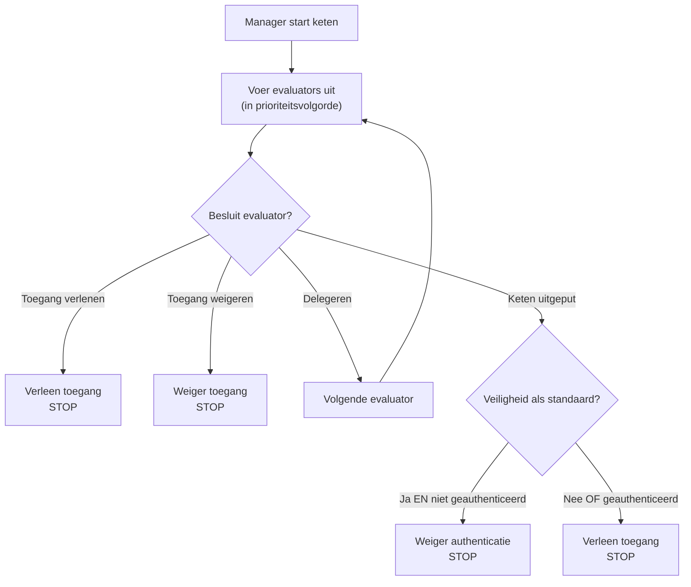

De evaluator-keten is het hart van het beveiligingssysteem van webforJ. Het is een prioriteitsgeordende reeks evaluators die routes onderzoeken en toegang besluiten nemen met behulp van het chain of responsibility-ontwerppatroon. Begrijpen hoe de keten werkt, helpt je om aangepaste evaluators te maken en onverwachte toegang weigeringen op te lossen.

## Het chain of responsibility-patroon {#the-chain-of-responsibility-pattern}

De evaluator-keten maakt gebruik van het chain of responsibility-patroon, waarbij elke evaluator in de reeks een navigatieverzoek kan afhandelen of het kan doorgeven aan de volgende evaluator. Dit creëert een systeem waarin beveiligingslogica verspreid is over meerdere gespecialiseerde evaluators in plaats van gecentraliseerd in een enkele monolithische checker.

Wanneer een route evaluatie nodig heeft, maakt de beveiligingsmanager een keten aan en start deze bij de eerste evaluator. Die evaluator onderzoekt de route en maakt een van de drie keuzes:

1. **Toegang verlenen:** De evaluator keurt de route goed en retourneert onmiddellijk. Geen verdere evaluators worden uitgevoerd.
2. **Toegang weigeren:** De evaluator blokkeert de route en retourneert onmiddellijk. Geen verdere evaluators worden uitgevoerd.
3. **Delegeren:** De evaluator neemt geen beslissing en roept `chain.evaluate()` aan om de controle aan de volgende evaluator door te geven.

Dit patroon stelt evaluators in staat om zich te concentreren op specifieke gevallen. Elke evaluator implementeert `supports(Class<?> routeClass)` om aan te geven welke routes hij afhandelt. Bijvoorbeeld, `AnonymousAccessEvaluator` wordt alleen uitgevoerd voor routes gemarkeerd met `@AnonymousAccess`, de manager roept deze nooit aan voor andere routes.

## Hoe de keten wordt opgebouwd {#how-the-chain-is-built}

De beveiligingsmanager houdt een lijst bij van geregistreerde evaluators, elk met een bijbehorende prioriteit. Wanneer een route evaluatie nodig heeft, sorteert de manager evaluators op prioriteit (lagere nummers eerst) en creëert een keten.

Evaluators worden geregistreerd met behulp van de `registerEvaluator()`-methode van de manager:

```java
// Registreer ingebouwde evaluators
securityManager.registerEvaluator(new DenyAllEvaluator(), 0);
securityManager.registerEvaluator(new AnonymousAccessEvaluator(), 1);
securityManager.registerEvaluator(new PermitAllEvaluator(), 2);
securityManager.registerEvaluator(new RolesAllowedEvaluator(), 3);

// Registreer aangepaste evaluators
securityManager.registerEvaluator(new SubscriptionEvaluator(), 10);
```

Prioriteit bepaalt de evaluatievolgorde. Laagste prioriteiten worden eerst uitgevoerd, waardoor ze de eerste mogelijkheid hebben om toegang besluiten te nemen. Dit is belangrijk voor de beveiliging omdat het kritieke evaluators in staat stelt om toegang te blokkeren voordat toegestane evaluators dat kunnen verlenen.

De keten is stateless en wordt vers aangemaakt voor elk navigatieverzoek, zodat de evaluatie van de ene navigatie de andere niet beïnvloedt.

## Ketenuitvoeringsstroom {#chain-execution-flow}

Wanneer de keten start, begint deze bij de eerste evaluator (laagste prioriteit) en gaat deze sequentieel verder:



De keten stopt zodra een evaluator toegang verleent of weigert. Als alle evaluators delegeren, is de keten uitgeput en valt deze terug op de veiligheid-als-standaard-gedrag.

## Volgorde van ingebouwde evaluators {#built-in-evaluator-ordering}

Vier ingebouwde evaluators behandelen standaardannotaties:

| Evaluator | Annotatie | Gedrag | Gedrag van de keten | Typische volgorde |
|-----------|-----------|--------|---------------------|-------------------|
| `DenyAllEvaluator` | `@DenyAll` | Blokkeert altijd toegang | Stopt keten (terminal) | Wordt als eerste uitgevoerd |
| `AnonymousAccessEvaluator` | `@AnonymousAccess` | Laat iedereen toe (geauthenticeerd of niet) | Stopt keten (terminal) | Wordt vroeg uitgevoerd |
| `PermitAllEvaluator` | `@PermitAll` | Vereist authenticatie, staat alle geauthenticeerde gebruikers toe | Stopt keten (terminal) | Wordt midden in de keten uitgevoerd |
| `RolesAllowedEvaluator` | `@RolesAllowed` | Vereist authenticatie en specifieke rol | **Vervolg keten** (composable) | Wordt later uitgevoerd |

:::note
Exacte prioriteitsnummers worden toegewezen tijdens de registratie van evaluators en verschillen tussen implementaties. Zie [Spring Security](/docs/security/getting-started) of [Aangepaste Implementatie](/docs/security/architecture/custom-implementation#securityregistrar) voor specifieke waarden.
:::

## Hoe evaluators delegeren {#how-evaluators-delegate}

Voordat een evaluator wordt aangeroepen, roept de manager zijn methode `supports(Class<?> routeClass)` aan. Alleen evaluators die `true` retourneren, worden aangeroepen. Deze filtering dwingt evaluators om alleen te draaien voor routes waarvoor ze zijn ontworpen.

Wanneer een evaluator wordt aangeroepen, kan deze:
- **Een beslissing nemen**: Retourneer grant of deny om de keten te stoppen
- **Delegeren**: Roep `chain.evaluate()` aan om de controle door te geven aan de volgende evaluator in de prioriteitsvolgorde

Bijvoorbeeld, de `RolesAllowedEvaluator` controleert of de gebruiker de vereiste rol heeft. Als dat zo is, roept hij `chain.evaluate()` aan om verdere controles door hogere prioriteit-evaluators toe te staan. Deze actieve delegatie maakt evaluator-compositie mogelijk.

Terminal-evaluators zoals `PermitAllEvaluator` nemen definitieve beslissingen zonder de keten aan te roepen, waardoor verdere evaluatie wordt voorkomen.

## Wanneer de keten is uitgeput {#when-the-chain-exhausts}

Als elke evaluator delegeert en niemand een beslissing neemt, is de keten uitgeput en zijn er geen evaluators meer om uit te voeren. Op dit punt past het beveiligingssysteem een fallback toe op basis van de `isSecureByDefault()` configuratie:

**Veiligheid als standaard ingeschakeld** (`isSecureByDefault() == true`):
- Als gebruiker geauthenticeerd is: Verleen toegang
- Als gebruiker niet geauthenticeerd is: Weiger met vereiste authenticatie

**Veiligheid als standaard uitgeschakeld** (`isSecureByDefault() == false`):
- Verleen toegang ongeacht authenticatie

Routes zonder beveiligingsannotaties hebben nog steeds gedefinieerd gedrag. Met ingeschakelde veiligheid-als-standaard vereisen ongeannoteerde routes authentificatie. Met het uitgezet vereisen ongeannoteerde routes geen public access.

## Prioriteiten van aangepaste evaluators {#custom-evaluator-priorities}

Bij het maken van aangepaste evaluators, kies prioriteiten zorgvuldig:

- **0-9**: Gereserveerd voor kernframework-evaluators. Vermijd het gebruik van deze prioriteiten, tenzij je ingebouwde evaluators vervangt.
- **10-99**: Aanbevolen voor aangepaste businesslogica-evaluators. Deze draaien na kernevaluators, maar vóór algemene fallback.

Voorbeeld:

```java title="SubscriptionEvaluator.java"
// Aangepaste evaluator voor op abonnement gebaseerde toegang
@RegisteredEvaluator(priority = 10)
public class SubscriptionEvaluator implements RouteSecurityEvaluator {
  @Override
  public boolean supports(Class<?> routeClass) {
    return routeClass.isAnnotationPresent(RequiresSubscription.class);
  }

  @Override
  public RouteAccessDecision evaluate(Class<?> routeClass,
                                       NavigationContext context,
                                       RouteSecurityContext securityContext,
                                       SecurityEvaluatorChain chain) {
    // Controleer of de gebruiker een actief abonnement heeft
    boolean hasSubscription = checkSubscription(securityContext);

    if (!hasSubscription) {
      return RouteAccessDecision.deny("Actief abonnement vereist");
    }

    // Gebruiker heeft abonnement - ga verder met de keten voor aanvullende controles
    return chain.evaluate(routeClass, context, securityContext);
  }
}
```

Deze evaluator draait met prioriteit 10, na kernevaluators. Als de gebruiker een actief abonnement heeft, wordt er gedelegeerd naar de keten, wat compositie met andere evaluators mogelijk maakt.

## Evaluator-compositie {#evaluator-composition}

De meeste ingebouwde evaluators zijn **terminal**, ze nemen een definitieve beslissing en stoppen de keten. Alleen `RolesAllowedEvaluator` gaat verder met de keten nadat toegang is verleend, waardoor compositie met aangepaste evaluators mogelijk is.

**Terminal evaluators (kunnen niet worden samengevoegd):**
- `@DenyAll`: Weigert altijd, stopt de keten
- `@AnonymousAccess`: Grant altijd, stopt de keten
- `@PermitAll`: Grant aan geauthenticeerde gebruikers, stopt de keten

**Composable evaluators:**
- `@RolesAllowed`: Als de gebruiker de rol heeft, **gaat de keten verder** voor verdere controles

### Compositie die werkt {#composition-that-works}

Je kunt `@RolesAllowed` combineren met aangepaste evaluators:

```java
@Route("/premium-admin")
@RolesAllowed("ADMIN")  // Controleert rol, gaat dan verder met de keten
@RequiresSubscription   // Aangepaste controle draait na rolcontrole
public class PremiumAdminView extends Composite<Div> {
  // Vereist ADMIN-rol EN actief abonnement
}
```

Stroom:
1. `RolesAllowedEvaluator` controleert of de gebruiker de `ADMIN`-rol heeft
2. Als dat zo is, roept hij `chain.evaluate()` aan om door te gaan
3. `SubscriptionEvaluator` controleert de abonnementsstatus (loopt later in de keten)
4. Als het abonnement actief is, verleent het toegang; anders weigert het

### Compositie die niet werkt {#composition-that-does-not-work}

Je **kunt niet** `@PermitAll` combineren met andere evaluators omdat deze de keten stopt:

```java
@Route("/wrong")
@PermitAll           // Verleent onmiddellijk, stopt de keten
@RolesAllowed("ADMIN")  // DRAAIT NOOIT!
public class WrongView extends Composite<Div> {
  // Dit verleent toegang aan ELKE geauthenticeerde gebruiker
  // @RolesAllowed wordt genegeerd
}
```

`PermitAllEvaluator` draait als eerste (geregistreerd met een lagere prioriteit), verleent toegang aan elke geauthenticeerde gebruiker en retourneert zonder `chain.evaluate()` aan te roepen. De `RolesAllowedEvaluator` wordt nooit uitgevoerd.
