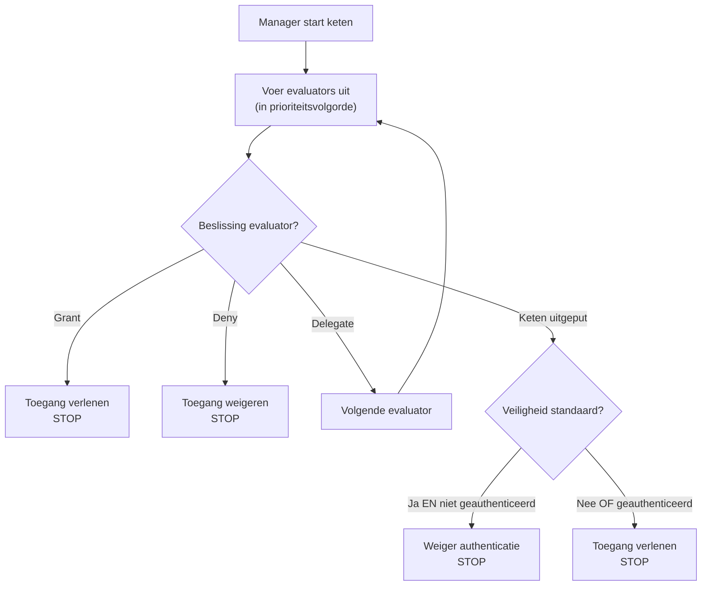

De evaluatorreeks is het hart van het beveiligingssysteem van webforJ. Het is een prioriteit-geordende reeks van evaluators die routes onderzoeken en beslissingen over toegang nemen met behulp van het chain of responsibility-ontwerppatroon. Begrijpen hoe de keten werkt, helpt je bij het creëren van aangepaste evaluators en het oplossen van onverwachte toegang weigeringen.

## Het chain of responsibility-patroon {#the-chain-of-responsibility-pattern}

De evaluatorreeks maakt gebruik van het chain of responsibility-patroon, waarbij elke evaluator in de reeks een navigatieverzoek kan afhandelen of het kan doorgeven aan de volgende evaluator. Dit creëert een systeem waarbij de beveiligingslogica over verschillende gespecialiseerde evaluators is verdeeld in plaats van gecentraliseerd in één monolithische checker.

Wanneer een route evaluatie nodig heeft, creëert de beveiligingsmanager een keten en start deze bij de eerste evaluator. Die evaluator onderzoekt de route en maakt een van de drie keuzes:

1. **Toegang verlenen:** De evaluator keurt de route goed en retourneert onmiddellijk. Geen verdere evaluators worden uitgevoerd.
2. **Toegang weigeren:** De evaluator blokkeert de route en retourneert onmiddellijk. Geen verdere evaluators worden uitgevoerd.
3. **Delegeren:** De evaluator neemt geen beslissing en roept `chain.evaluate()` aan om de controle door te geven aan de volgende evaluator.

Dit patroon stelt evaluators in staat zich te concentreren op specifieke gevallen. Elke evaluator implementeert `supports(Class<?> routeClass)` om aan te geven welke routes hij afhandelt. Bijvoorbeeld, `AnonymousAccessEvaluator` wordt alleen uitgevoerd voor routes die zijn gemarkeerd met `@AnonymousAccess`, de manager roept het nooit aan voor andere routes.

## Hoe de keten wordt opgebouwd {#how-the-chain-is-built}

De beveiligingsmanager houdt een lijst bij van geregistreerde evaluators, elk met een bijbehorende prioriteit. Wanneer een route evaluatie nodig heeft, sorteert de manager evaluators op prioriteit (lagere nummers eerst) en creëert een keten.

Evaluators worden geregistreerd met de `registerEvaluator()`-methode van de manager:

```java
// Registreer ingebouwde evaluators
securityManager.registerEvaluator(new DenyAllEvaluator(), 0);
securityManager.registerEvaluator(new AnonymousAccessEvaluator(), 1);
securityManager.registerEvaluator(new PermitAllEvaluator(), 2);
securityManager.registerEvaluator(new RolesAllowedEvaluator(), 3);

// Registreer aangepaste evaluators
securityManager.registerEvaluator(new SubscriptionEvaluator(), 10);
```

Prioriteit bepaalt de evaluatievolgorde. Lagere prioriteiten worden als eerste uitgevoerd, waardoor ze de eerste kans krijgen om toegangsbeslissingen te nemen. Dit is belangrijk voor de beveiliging omdat het kritieke evaluators in staat stelt toegang te blokkeren voordat permissieve evaluators het kunnen verlenen.

De keten is stateless en wordt voor elk navigatieverzoek vers aangemaakt, zodat de evaluatie van de ene navigatie de andere niet beïnvloedt.

## Ketenuitvoeringsstroom {#chain-execution-flow}

Wanneer de keten begint, start deze bij de eerste evaluator (laagste prioriteit) en gaat sequentieel verder:



De keten stopt zodra een evaluator toegang verleent of weigert. Als alle evaluators delegeren, raakt de keten uitgeput en valt terug op de standaardveiligheidsinstelling.

## Volgorde van ingebouwde evaluators {#built-in-evaluator-ordering}

Vier ingebouwde evaluators behandelen standaardannotaties:

| Evaluator | Annotatie | Gedrag | Keten Gedrag | Typische Volgorde |
|-----------|------------|----------|----------------|---------------|
| `DenyAllEvaluator` | `@DenyAll` | Blokkeert altijd toegang | Stopt keten (terminal) | Draait eerst |
| `AnonymousAccessEvaluator` | `@AnonymousAccess` | Staat iedereen toe (geauthenticeerd of niet) | Stopt keten (terminal) | Draait vroeg |
| `PermitAllEvaluator` | `@PermitAll` | Vereist authenticatie, staat alle geauthenticeerde gebruikers toe | Stopt keten (terminal) | Draait halverwege de keten |
| `RolesAllowedEvaluator` | `@RolesAllowed` | Vereist authenticatie en specifieke rol | **Vervolg keten** (composable) | Draait later |

:::note
Exacte prioriteitsnummers worden toegewezen tijdens het registreren van evaluators en verschillen per implementatie. Zie [Spring Security](/docs/security/getting-started) of [Aangepaste Implementatie](/docs/security/architecture/custom-implementation) voor specifieke waarden.
:::

## Hoe evaluators delegeren {#how-evaluators-delegate}

Voordat een evaluator wordt aangeroepen, roept de manager zijn `supports(Class<?> routeClass)`-methode aan. Alleen evaluators die `true` retourneren worden aangeroepen. Deze filtering dwingt evaluators om alleen uit te voeren voor routes die ze ontworpen zijn om te behandelen.

Wanneer een evaluator wordt aangeroepen, kan deze ofwel:
- **Een beslissing nemen**: Retourneer grant of deny om de keten te stoppen
- **Delegeren**: Roep `chain.evaluate()` aan om de controle door te geven aan de volgende evaluator in de prioriteitsvolgorde

Bijvoorbeeld, `RolesAllowedEvaluator` controleert of de gebruiker de vereiste rol heeft. Zo ja, dan roept het `chain.evaluate()` aan om verdere controles door hogere prioriteit evaluators toe te staan. Deze actieve delegatie stelt evaluatoreen samenstelling mogelijk.

Terminal evaluators zoals `PermitAllEvaluator` nemen definitieve beslissingen zonder de keten aan te roepen, waardoor verdere evaluatie wordt voorkomen.

## Wanneer de keten uitgeput raakt {#when-the-chain-exhausts}

Als elke evaluator delegeert en niemand een beslissing neemt, raakt de keten uitgeput, er zijn geen evaluators meer om uit te voeren. Op dit moment past het beveiligingssysteem een fallback toe op basis van de configuratie `isSecureByDefault()`:

**Veiligheid standaard ingeschakeld** (`isSecureByDefault() == true`):
- Als gebruiker geauthenticeerd is: Toegang verlenen
- Als gebruiker niet geauthenticeerd is: Weigeren met vereiste authenticatie

**Veiligheid standaard uitgeschakeld** (`isSecureByDefault() == false`):
- Toegang verlenen ongeacht authenticatie

Routes zonder beveiligingsannotaties hebben nog steeds gedefinieerd gedrag. Met veiligheid standaard ingeschakeld, vereisen niet-gemarkeerde routes authenticatie. Met deze uitgeschakeld zijn niet-gemarkeerde routes openbaar.

## Prioriteiten van aangepaste evaluators {#custom-evaluator-priorities}

Bij het creëren van aangepaste evaluators, kies prioriteiten zorgvuldig:

- **0-9**: Gereserveerd voor kernframework evaluators. Vermijd het gebruik van deze prioriteiten tenzij je ingebouwde evaluators vervangt.
- **10-99**: Aanbevolen voor aangepaste bedrijfslogica evaluators. Deze draaien na kern evaluators maar voor algemene fallbacks.

Voorbeeld:

```java title="SubscriptionEvaluator.java"
// Aangepaste evaluator voor toegang op basis van abonnements
@RegisteredEvaluator(priority = 10)
public class SubscriptionEvaluator implements RouteSecurityEvaluator {
  @Override
  public boolean supports(Class<?> routeClass) {
    return routeClass.isAnnotationPresent(RequiresSubscription.class);
  }

  @Override
  public RouteAccessDecision evaluate(Class<?> routeClass,
                                       NavigationContext context,
                                       RouteSecurityContext securityContext,
                                       SecurityEvaluatorChain chain) {
    // Controleer of de gebruiker een actief abonnement heeft
    boolean hasSubscription = checkSubscription(securityContext);

    if (!hasSubscription) {
      return RouteAccessDecision.deny("Actief abonnement vereist");
    }

    // Gebruiker heeft abonnement - vervolg keten voor aanvullende controles
    return chain.evaluate(routeClass, context, securityContext);
  }
}
```

Deze evaluator draait op prioriteit 10, na de kern evaluators. Als de gebruiker een actief abonnement heeft, delegeert hij naar de keten, waardoor samenstelling met andere evaluators mogelijk is.

## Evaluatorcompositie {#evaluator-composition}

De meeste ingebouwde evaluators zijn **terminal**, zij nemen een definitieve beslissing en stoppen de keten. Slechts `RolesAllowedEvaluator` vervolgt de keten na het verlenen van toegang, waardoor samenstelling met aangepaste evaluators mogelijk is.

**Terminal evaluators (kunnen niet worden samengesteld):**
- `@DenyAll`: Weigert altijd, stopt keten
- `@AnonymousAccess`: Staat altijd toe, stopt keten
- `@PermitAll`: Staat toe voor geauthenticeerde gebruikers, stopt keten

**Compositie evaluators:**
- `@RolesAllowed`: Als gebruiker rol heeft, **vervolgt keten** om verdere controles toe te staan

### Compositie die werkt {#composition-that-works}

Je kunt `@RolesAllowed` combineren met aangepaste evaluators:

```java
@Route("/premium-admin")
@RolesAllowed("ADMIN")  // Controleert rol, vervolgt dan keten
@RequiresSubscription   // Aangepaste controle draait na rolcontrole
public class PremiumAdminView extends Composite<Div> {
  // Vereist ADMIN rol EN actief abonnement
}
```

Stroom:
1. `RolesAllowedEvaluator` controleert of de gebruiker de `ADMIN` rol heeft
2. Als ja, roept `chain.evaluate()` aan om door te gaan
3. `SubscriptionEvaluator` controleert de abonnementsstatus (draait later in de keten)
4. Als het abonnement actief is, wordt toegang verleend; anders wordt geweigerd

### Compositie die niet werkt {#composition-that-does-not-work}

Je **kunt niet** `@PermitAll` combineren met andere evaluators omdat het de keten stopt:

```java
@Route("/wrong")
@PermitAll           // Staat onmiddellijk toe, stopt de keten
@RolesAllowed("ADMIN")  // DROEFT NOOIT!
public class WrongView extends Composite<Div> {
  // Dit verleent toegang aan ELKE geauthenticeerde gebruiker
  // @RolesAllowed wordt genegeerd
}
```

`PermitAllEvaluator` draait als eerste (geregistreerd met lagere prioriteit), verleent toegang aan elke geauthenticeerde gebruiker en retourneert zonder `chain.evaluate()` aan te roepen. De `RolesAllowedEvaluator` wordt nooit uitgevoerd.
