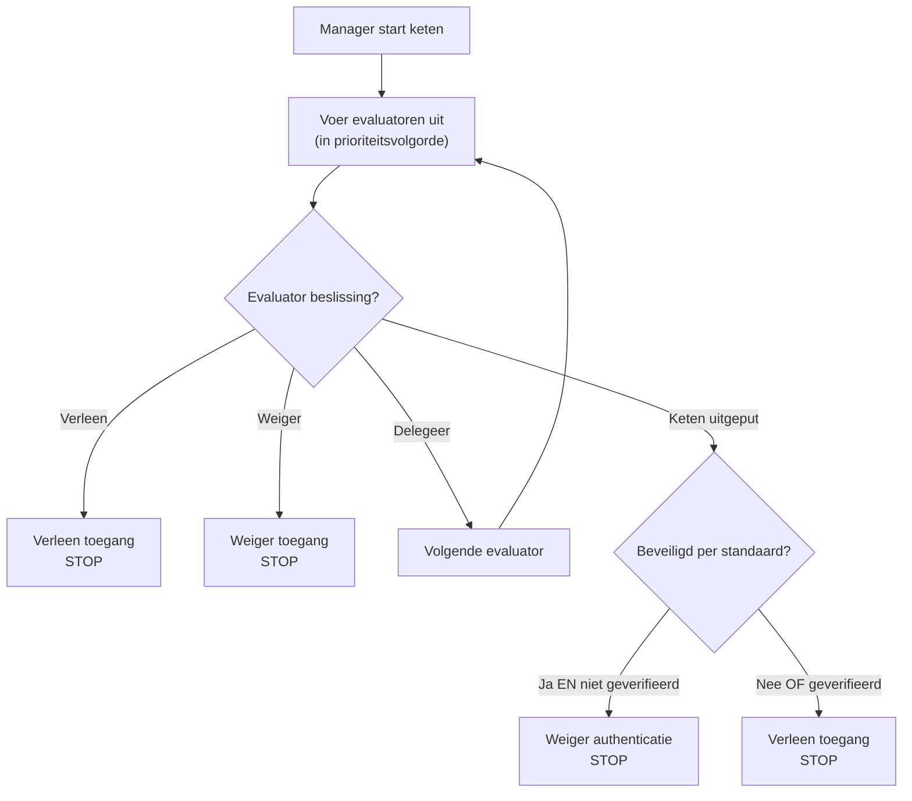

De evaluator-keten is het hart van het beveiligingssysteem van webforJ. Het is een prioriteitsgeordende reeks evaluatoren die routes onderzoeken en toegang beslissingen nemen met behulp van het chain of responsibility ontwerppatroon. Door te begrijpen hoe de keten werkt, kun je aangepaste evaluatoren maken en onverwachte toegang weigeringen oplossen.

## Het chain of responsibility patroon {#the-chain-of-responsibility-pattern}

De evaluator-keten gebruikt het chain of responsibility patroon, waarbij elke evaluator in de reeks een navigatieverzoek kan afhandelen of het kan doorgeven aan de volgende evaluator. Dit creëert een systeem waarin de beveiligingslogica is verdeeld over meerdere gespecialiseerde evaluatoren in plaats van gecentraliseerd in een enkele monolithische controle.

Wanneer een route evaluation nodig heeft, maakt de beveiligingsmanager een keten aan en start deze bij de eerste evaluator. Die evaluator onderzoekt de route en maakt een van de drie keuzes:

1. **Verleen toegang:** De evaluator keurt de route goed en retourneert meteen. Geen verdere evaluatoren worden uitgevoerd.
2. **Weiger toegang:** De evaluator blokkeert de route en retourneert meteen. Geen verdere evaluatoren worden uitgevoerd.
3. **Delegeer:** De evaluator neemt geen beslissing en roept `chain.evaluate()` aan om de controle door te geven aan de volgende evaluator.

Dit patroon stelt evaluatoren in staat zich te concentreren op specifieke gevallen. Elke evaluator implementeert `supports(Class<?> routeClass)` om aan te geven welke routes hij afhandelt. Bijvoorbeeld, `AnonymousAccessEvaluator` draait alleen voor routes gemarkeerd met `@AnonymousAccess`, de manager roept het nooit aan voor andere routes.

## Hoe de keten wordt opgebouwd {#how-the-chain-is-built}

De beveiligingsmanager houdt een lijst bij van geregistreerde evaluatoren, elk met een bijbehorende prioriteit. Wanneer een route evaluatie nodig heeft, sorteert de manager evaluatoren op prioriteit (lagere nummers eerst) en maakt een keten aan.

Evaluatoren worden geregistreerd met behulp van de `registerEvaluator()` methode van de manager:

```java
// Registreer ingebouwde evaluatoren
securityManager.registerEvaluator(new DenyAllEvaluator(), 0);
securityManager.registerEvaluator(new AnonymousAccessEvaluator(), 1);
securityManager.registerEvaluator(new PermitAllEvaluator(), 2);
securityManager.registerEvaluator(new RolesAllowedEvaluator(), 3);

// Registreer aangepaste evaluatoren
securityManager.registerEvaluator(new SubscriptionEvaluator(), 10);
```

Prioriteit bepaalt de evaluatievolgorde. Lagere prioriteiten worden eerst uitgevoerd, waardoor ze de eerste kans hebben om toegang beslissingen te nemen. Dit is belangrijk voor de beveiliging omdat het kritieke evaluatoren in staat stelt toegang te blokkeren voordat toegangsgevende evaluatoren dat kunnen doen.

De keten is stateless en wordt vers aangemaakt voor elke navigatieaanroep, zodat de evaluatie van de ene navigatie de andere niet beïnvloedt.

## Keten uitvoeringsstroom {#chain-execution-flow}

Wanneer de keten begint, begint deze bij de eerste evaluator (laagste prioriteit) en gaat sequentieel verder:


```mermaid
flowchart TD
  Start["Manager start keten"] --> Eval["Voer evaluatoren uit<br/>(in prioriteitsvolgorde)"]

  Eval --> Check{"Evaluator beslissing?"}
  Check -->|Verleen| Grant["Verleen toegang<br/>STOP"]
  Check -->|Weiger| Deny["Weiger toegang<br/>STOP"]
  Check -->|Delegeer| Next["Volgende evaluator"]

  Next --> Eval

  Check -->|Keten uitgeput| Default{"Beveiligd per standaard?"}
  Default -->|Ja EN niet geverifieerd| DenyDefault["Weiger authenticatie<br/>STOP"]
  Default -->|Nee OF geverifieerd| GrantDefault["Verleen toegang<br/>STOP"]
```

De keten stopt zodra een evaluator toegang verleent of weigert. Als alle evaluatoren delegeren, is de keten uitgeput en valt deze terug op de beveiligd-per-standaard gedrag.

## Volgorde van ingebouwde evaluatoren {#built-in-evaluator-ordering}

Vier ingebouwde evaluatoren behandelen standaardannotaties:

| Evaluator | Annotatie | Gedrag | Keten Gedrag | Typische Volgorde |
|-----------|------------|----------|----------------|---------------|
| `DenyAllEvaluator` | `@DenyAll` | Blokkeert altijd toegang | Stopt keten (terminaal) | Draait eerst |
| `AnonymousAccessEvaluator` | `@AnonymousAccess` | Laat iedereen toe (geauthenticeerd of niet) | Stopt keten (terminaal) | Draait vroeg |
| `PermitAllEvaluator` | `@PermitAll` | Vereist authenticatie, laat alle geauthenticeerde gebruikers toe | Stopt keten (terminaal) | Draait in het midden van de keten |
| `RolesAllowedEvaluator` | `@RolesAllowed` | Vereist authenticatie en specifieke rol | **Gaat verder met de keten** (samenstelbaar) | Draait later |

:::note
Exacte prioriteitsnummers worden toegewezen tijdens de registratie van evaluatoren en verschillen tussen implementaties. Zie [Spring Security](/docs/security/getting-started) of [Aangepaste Implementatie](/docs/security/architecture/custom-implementation) voor specifieke waarden.
:::

## Hoe evaluatoren delegeren {#how-evaluators-delegate}

Voordat een evaluator wordt aangeroepen, roept de manager zijn `supports(Class<?> routeClass)` methode aan. Alleen evaluatoren die `true` retourneren worden aangeroepen. Deze filtering dwingt evaluatoren om alleen te draaien voor routes waarvoor ze zijn ontworpen.

Wanneer een evaluator wordt aangeroepen, kan deze:

- **Een beslissing nemen**: Retourneer verleen of weiger om de keten te stoppen
- **Delegeren**: Roep `chain.evaluate()` aan om de controle door te geven aan de volgende evaluator in de prioriteitsvolgorde

Bijvoorbeeld, `RolesAllowedEvaluator` controleert of de gebruiker de vereiste rol heeft. Als dat zo is, roept het `chain.evaluate()` aan om verdere controles door hoger geprioriteerde evaluatoren toe te staan. Deze actieve delegatie maakt evaluatorcompositie mogelijk.

Terminalevaluatoren zoals `PermitAllEvaluator` nemen definitieve beslissingen zonder de keten aan te roepen, waardoor verdere evaluatie wordt voorkomen.

## Wanneer de keten uitgeput is {#when-the-chain-exhausts}

Als elke evaluator delegeert en geen beslissing neemt, is de keten uitgeput, er zijn geen evaluatoren meer om uit te voeren. Op dit punt past het beveiligingssysteem een fallback toe op basis van de `isSecureByDefault()` configuratie:

**Beveiligd per standaard ingeschakeld** (`isSecureByDefault() == true`):
- Als de gebruiker is geauthenticeerd: Verleen toegang
- Als de gebruiker niet is geauthenticeerd: Weiger met authenticatie vereist

**Beveiligd per standaard uitgeschakeld** (`isSecureByDefault() == false`):
- Verleen toegang ongeacht authenticatie

Routes zonder beveiligingsannotaties hebben nog steeds gedefinieerd gedrag. Met beveiligd-per-standaard ingeschakeld, vereisen ongeannoteerde routes authenticatie. Met het uitgeschakeld, zijn ongeannoteerde routes openbaar.

## Prioriteiten van aangepaste evaluatoren {#custom-evaluator-priorities}

Bij het maken van aangepaste evaluatoren, kies je prioriteiten met zorg:

- **0-9**: Gereserveerd voor kernframework evaluatoren. Vermijd het gebruik van deze prioriteiten, tenzij je ingebouwde evaluatoren vervangt.
- **10-99**: Aanbevolen voor aangepaste bedrijfslogica evaluatoren. Deze draaien na kern evaluatoren maar vóór algemene achterwaartse evaluaties.

Voorbeeld:

```java title="SubscriptionEvaluator.java"
// Aangepaste evaluator voor toegang op basis van abonnement
@RegisteredEvaluator(priority = 10)
public class SubscriptionEvaluator implements RouteSecurityEvaluator {
  @Override
  public boolean supports(Class<?> routeClass) {
    return routeClass.isAnnotationPresent(RequiresSubscription.class);
  }

  @Override
  public RouteAccessDecision evaluate(Class<?> routeClass,
                                       NavigationContext context,
                                       RouteSecurityContext securityContext,
                                       SecurityEvaluatorChain chain) {
    // Controleer of de gebruiker een actief abonnement heeft
    boolean hasSubscription = checkSubscription(securityContext);

    if (!hasSubscription) {
      return RouteAccessDecision.deny("Actief abonnement vereist");
    }

    // Gebruiker heeft abonnement - ga verder met de keten voor aanvullende controles
    return chain.evaluate(routeClass, context, securityContext);
  }
}
```

Deze evaluator draait op prioriteit 10, na kern evaluatoren. Als de gebruiker een actief abonnement heeft, delegeert hij naar de keten, waardoor samenstelling met andere evaluatoren mogelijk is.

## Evaluator-compositie {#evaluator-composition}

De meeste ingebouwde evaluatoren zijn **terminaal**, ze nemen een definitieve beslissing en stoppen de keten. Alleen `RolesAllowedEvaluator` gaat verder met de keten na het verlenen van toegang, waardoor samenstelling met aangepaste evaluatoren mogelijk is.

**Terminal evaluatoren (kunnen niet worden samengesteld):**
- `@DenyAll`: Weigert altijd, stopt de keten
- `@AnonymousAccess`: Verleent altijd, stopt de keten
- `@PermitAll`: Verleent toegang aan geauthenticeerde gebruikers, stopt de keten

**Samenstelbare evaluatoren:**
- `@RolesAllowed`: Als de gebruiker de rol heeft, **gaat verder met de keten** voor verdere controles

### Samenstelling die werkt {#composition-that-works}

Je kunt `@RolesAllowed` samenstellen met aangepaste evaluatoren:

```java
@Route("/premium-admin")
@RolesAllowed("ADMIN")  // Controleert rol, gaat dan verder met de keten
@RequiresSubscription   // Aangepaste controle draait na rolcheck
public class PremiumAdminView extends Composite<Div> {
  // Vereist ADMIN rol EN actief abonnement
}
```

Stroom:
1. `RolesAllowedEvaluator` controleert of de gebruiker de `ADMIN` rol heeft
2. Als ja, roept `chain.evaluate()` aan om door te gaan
3. `SubscriptionEvaluator` controleert de abonnementsstatus (draait later in de keten)
4. Als het abonnement actief is, verleent toegang; anders wordt geweigerd

### Samenstelling die niet werkt {#composition-that-does-not-work}

Je **kunt niet** `@PermitAll` combineren met andere evaluatoren omdat het de keten stopt:

```java
@Route("/wrong")
@PermitAll           // Verleent onmiddellijk, stopt de keten
@RolesAllowed("ADMIN")  // DRAAIT NOOIT!
public class WrongView extends Composite<Div> {
  // Dit verleent toegang aan IEDERE geauthenticeerde gebruiker
  // @RolesAllowed wordt genegeerd
}
```

`PermitAllEvaluator` draait eerst (geregistreerd met lagere prioriteit), verleent toegang aan elke geauthenticeerde gebruiker, en retourneert zonder `chain.evaluate()` aan te roepen. De `RolesAllowedEvaluator` wordt nooit uitgevoerd.
