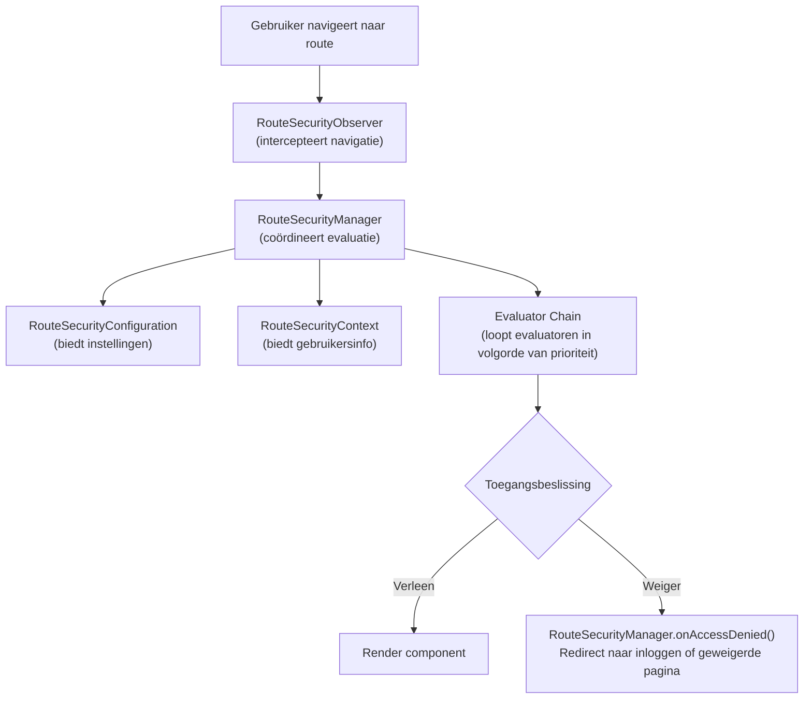

Het webforJ beveiligingssysteem is gebouwd op een fundament van kerninterfaces die samenwerken om route-niveau toegangscontrole te bieden. Deze interfaces definiëren de contracten voor beveiligingsgedrag, waardoor verschillende implementaties, of ze nu op sessies zijn gebaseerd, gebaseerd zijn op JSON Web Tokens (JWT), LDAP-geïntegreerd of database-ondersteund, kunnen aansluiten op hetzelfde onderliggende framework.

Het begrijpen van deze architectuur helpt je in te zien hoe beveiligingsannotaties zoals `@RolesAllowed` en `@PermitAll` worden geëvalueerd, hoe navigatie-interceptie werkt en hoe je aangepaste beveiligingsimplementaties kunt bouwen voor jouw specifieke behoeften.

## De kerninterfaces {#the-four-core-interfaces}

De beveiligingsfundering is opgebouwd uit sleutelabstracties, elk met een specifieke verantwoordelijkheid:

### `RouteSecurityManager` {#routesecuritymanager}

De `RouteSecurityManager` is de centrale coördinator van het beveiligingssysteem. Het beheert beveiligingsevaluatoren, coördineert het evaluatieproces en behandelt toegang weigering door gebruikers naar de juiste pagina's te verwijzen.

**Verantwoordelijkheden:**

- Registreren en beheren van beveiligingsevaluatoren met prioriteiten
- Coördineren van het evaluatieproces wanneer een gebruiker naar een route navigeert
- Toegang weigering behandelen door redirects naar inloggen of toegang geweigerd pagina's te activeren
- Opslaan en ophalen van pre-authenticatielocaties voor redirects na inloggen

```java
public interface RouteSecurityManager {
  RouteAccessDecision evaluate(Class<?> routeClass, NavigationContext context);
  void onAccessDenied(RouteAccessDecision decision, NavigationContext context);
  RouteSecurityContext getSecurityContext();
  RouteSecurityConfiguration getConfiguration();
  void registerEvaluator(RouteSecurityEvaluator evaluator, int priority);
  Optional<Location> consumePreAuthenticationLocation();
}
```

De manager neemt zelf geen beveiligingsbeslissingen, maar delegeert dit aan evaluatoren en configuratie. Het is de lijm die alle beveiligingscomponenten met elkaar verbindt.

### `RouteSecurityContext` {#routesecuritycontext}

De `RouteSecurityContext` biedt toegang tot de authenticatiestatus van de huidige gebruiker. Het beantwoordt vragen zoals of de gebruiker authenticeerd is, wat hun gebruikersnaam is en of ze de `ADMIN` rol hebben.

**Verantwoordelijkheden:**

- Bepalen of de huidige gebruiker authenticeerd is
- De principal van de gebruiker bieden (typisch hun gebruikersnaam of gebruikersobject)
- Controleren of de gebruiker specifieke rollen of autoriteiten heeft
- Opslaan en ophalen van aangepaste beveiligingsattributen

```java
public interface RouteSecurityContext {
  boolean isAuthenticated();
  Optional<Object> getPrincipal();
  boolean hasRole(String role);
  boolean hasAuthority(String authority);
  Optional<Object> getAttribute(String name);
  void setAttribute(String name, Object value);
}
```

Implementaties variëren afhankelijk van het authenticatiesysteem, HTTP-sessiebewaring, JWT-tokens gedecodeerd uit headers, databasequery's, LDAP-zoekopdrachten of andere mechanismen.

### `RouteSecurityConfiguration` {#routesecurityconfiguration}

De `RouteSecurityConfiguration` definieert beveiligingsgedrag en redirectlocaties. Het vertelt het beveiligingssysteem waar het gebruikers naartoe moet sturen wanneer authenticatie vereist is of toegang is geweigerd.

**Verantwoordelijkheden:**

- Bepalen of beveiliging is ingeschakeld
- Specifieke beveiligingsgedragingen opgeven
- Locatie van de authentificatiepagina bieden (typisch `/login`)
- Locatie van de toegang geweigerd pagina bieden

```java
public interface RouteSecurityConfiguration {
  default boolean isEnabled() { return true; }
  default boolean isSecureByDefault() { return true; }
  default Optional<Location> getAuthenticationLocation() {
    return Optional.of(new Location("/login"));
  }
  default Optional<Location> getDenyLocation() { /* ... */ }
}
```

Deze interface scheidt het beveiligingsbeleid van de beveiligingshandhaving. Je kunt redirectlocaties wijzigen of beveiliging standaard inschakelen zonder de manager of evaluatoren te wijzigen.

### `RouteSecurityEvaluator` {#routesecurityevaluator}

De `RouteSecurityEvaluator` is waar de daadwerkelijke beveiligingsregels worden gecontroleerd. Elke evaluator bekijkt een route en beslist of toegang moet worden verleend, toegang moet worden geweigerd of de beslissing aan de volgende evaluator in de keten moet worden gedelegeerd.

**Verantwoordelijkheden:**

- Bepalen of deze evaluator de gegeven route behandelt
- Beveiligingsannotaties op de routeklasse evalueren
- Toegang verlenen, toegang weigeren of de delegatie aan de volgende evaluator
- Deelnemen aan het keten van verantwoordelijkheden patroon

```java
public interface RouteSecurityEvaluator {
  RouteAccessDecision evaluate(Class<?> routeClass,
                                NavigationContext context,
                                RouteSecurityContext securityContext,
                                SecurityEvaluatorChain chain);
  default boolean supports(Class<?> routeClass) { return true; }
}
```

Builtin evaluatoren behandelen standaardannotaties zoals `@RolesAllowed`, `@PermitAll`, `@DenyAll`, en `@AnonymousAccess`. Je kunt aangepaste evaluatoren maken om domeinspecifieke beveiligingslogica te implementeren.

## Hoe de interfaces samenwerken {#how-the-interfaces-work-together}

Deze vier interfaces werken samen tijdens de navigatie om beveiligingsregels af te dwingen:



Wanneer een gebruiker navigeert, wordt de `RouteSecurityObserver` de navigatie onderschept en vraagt de `RouteSecurityManager` om de toegang te evalueren. De manager raadpleegt de `RouteSecurityConfiguration` voor instellingen, verkrijgt gebruikersinformatie van de `RouteSecurityContext`, en voert elke `RouteSecurityEvaluator` in prioriteitsvolgorde uit totdat één een beslissing neemt.

## Interfaces als contracten {#the-interfaces-as-contracts}

Elke interface definieert een contract, een set vragen die het beveiligingssysteem beantwoord moet krijgen. **Hoe** je deze vragen beantwoordt, is jouw implementatiekeuze:

**Contract van `RouteSecurityContext`:**

- "Is de huidige gebruiker authenticeerd?" (`isAuthenticated()`)
- "Wie is de gebruiker?" (`getPrincipal()`)
- "Heeft de gebruiker rol X?" (`hasRole()`)

Je beslist waar deze informatie vandaan komt: HTTP-sessies, JWT-tokens gedecodeerd uit headers, databasezoekopdrachten, LDAP-queries of een andere authenticatiebackend.

**Contract van `RouteSecurityConfiguration`:**

- "Is beveiliging ingeschakeld?" (`isEnabled()`)
- "Moeten routes standaard beveiligd zijn?" (`isSecureByDefault()`)
- "Waar moeten niet-geauthenticeerde gebruikers naartoe?" (`getAuthenticationLocation()`)

Je beslist hoe je deze waarden inroept: hardcoded, uit configuratiebestanden, uit omgevingsvariabelen, uit een database of dynamisch berekend.

**Contract van `RouteSecurityManager`:**

- "Moet deze gebruiker toegang hebben tot deze route?" (`evaluate()`)
- "Wat gebeurt er wanneer toegang wordt geweigerd?" (`onAccessDenied()`)
- "Welke evaluatoren moeten worden uitgevoerd?" (`registerEvaluator()`)

Je beslist over de authenticatiestroom, waar pre-authenticatielocaties moeten worden opgeslagen, en hoe aangepaste weigering scenario's moeten worden afgehandeld.

De fundamentele architectuur definieert deze contracten, maar de implementatie is flexibel. Verschillende systemen kunnen deze interfaces op geheel verschillende manieren implementeren op basis van specifieke vereisten.

## De `AbstractRouteSecurityManager` basisklasse {#the-abstractroutesecuritymanager-base-class}

De meeste implementaties implementeren `RouteSecurityManager` niet direct. In plaats daarvan breiden ze `AbstractRouteSecurityManager` uit, welke biedt:

- Evaluatorregistratie en prioriteitsgebaseerde sortering
- Logica voor ketenuitvoering
- Afhandeling van toegang weigering met automatische redirects
- Opslag van pre-authenticatielocaties in de HTTP-sessie
- Standaardbeveiliging fallback gedrag

De basisklasse implementeert de `RouteSecurityManager` interface en biedt concrete implementaties voor evaluatorenbeheer, toegangsevaluatie en afhandeling van weigeringen. Subklassen hoeven alleen de beveiligingscontext en configuratie te bieden. De basisklasse zorgt automatisch voor evaluatorenbeheer, ketenuitvoering en afhandeling van weigeringen.
