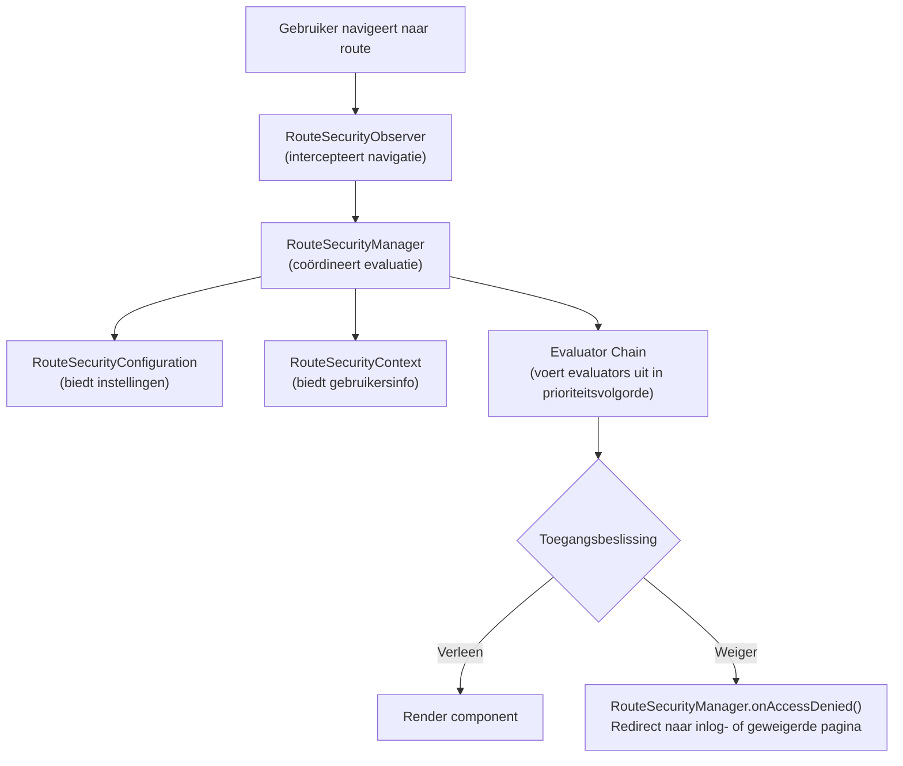

Het webforJ-beveiligingssysteem is gebouwd op een fundament van kerninterfaces die samenwerken om toegangscontrole op route-niveau te bieden. Deze interfaces definiëren de contracten voor beveiligingsgedrag, waardoor verschillende implementaties, of ze nu op sessies zijn gebaseerd, op JSON Web Tokens (JWT), LDAP-geïntegreerd of database-ondersteund zijn, in hetzelfde onderliggende framework kunnen worden geïntegreerd.

Het begrijpen van deze architectuur helpt je te zien hoe beveiligingsannotaties zoals `@RolesAllowed` en `@PermitAll` worden geëvalueerd, hoe navigatie-interceptie werkt en hoe je aangepaste beveiligingsimplementaties kunt bouwen voor je specifieke behoeften.

## De kerninterfaces {#the-four-core-interfaces}

De beveiligingsbasis is gebouwd op sleutelabstracties, elk met een specifieke verantwoordelijkheid:

### `RouteSecurityManager` {#routesecuritymanager}

De `RouteSecurityManager` is de centrale coördinator van het beveiligingssysteem. Het beheert beveiligingsevaluators, coördineert het evaluatieproces en behandelt toegangweigeringen door gebruikers naar de juiste pagina's om te leiden.

**Verantwoordelijkheden:**

- Registreren en beheren van beveiligingsevaluators met prioriteiten
- Coördineren van het evaluatieproces wanneer een gebruiker naar een route navigeert
- Behandelen van toegangweigering door omleidingen naar inlog- of toegang geweigerd-pagina's te activeren
- Opslaan en ophalen van pre-authenticatielocaties voor omleidingen na inloggen

```java
public interface RouteSecurityManager {
  RouteAccessDecision evaluate(Class<?> routeClass, NavigationContext context);
  void onAccessDenied(RouteAccessDecision decision, NavigationContext context);
  RouteSecurityContext getSecurityContext();
  RouteSecurityConfiguration getConfiguration();
  void registerEvaluator(RouteSecurityEvaluator evaluator, int priority);
  Optional<Location> consumePreAuthenticationLocation();
}
```

De manager neemt zelf geen beveiligingsbeslissingen, maar delegeert deze aan evaluators en configuratie. Het is de verbinding die alle beveiligingscomponenten verbindt.

### `RouteSecurityContext` {#routesecuritycontext}

De `RouteSecurityContext` biedt toegang tot de authenticatiestatus van de huidige gebruiker. Het beantwoordt vragen zoals of de gebruiker geauthenticeerd is, wat hun gebruikersnaam is, en of ze de rol `ADMIN` hebben.

**Verantwoordelijkheden:**

- Bepalen of de huidige gebruiker geauthentiseerd is
- De principal van de gebruiker bieden (typisch hun gebruikersnaam of gebruikersobject)
- Controleren of de gebruiker specifieke rollen of autoriteiten heeft
- Opslaan en ophalen van aangepaste beveiligingsattributen

```java
public interface RouteSecurityContext {
  boolean isAuthenticated();
  Optional<Object> getPrincipal();
  boolean hasRole(String role);
  boolean hasAuthority(String authority);
  Optional<Object> getAttribute(String name);
  void setAttribute(String name, Object value);
}
```

Implementaties variëren op basis van het authenticatiesysteem, HTTP-sessieopslag, JWT-tokens die uit headers zijn gedecodeerd, databasequery's, LDAP-opzoeken of andere mechanismen.

### `RouteSecurityConfiguration` {#routesecurityconfiguration}

De `RouteSecurityConfiguration` definieert beveiligingsgedrag en omleidingslocaties. Het vertelt het beveiligingssysteem waar het gebruikers naartoe moet sturen wanneer authenticatie vereist is of toegang wordt geweigerd.

**Verantwoordelijkheden:**

- Definiëren of beveiliging is ingeschakeld
- Speciferen van veilig-per-default gedrag
- Bieden van locatie van de inlogpagina (typisch `/login`)
- Bieden van locatie van de toegang geweigerd-pagina

```java
public interface RouteSecurityConfiguration {
  default boolean isEnabled() { return true; }
  default boolean isSecureByDefault() { return true; }
  default Optional<Location> getAuthenticationLocation() {
    return Optional.of(new Location("/login"));
  }
  default Optional<Location> getDenyLocation() { /* ... */ }
}
```

Deze interface scheidt het beveiligingsbeleid van de handhaving van beveiliging. Je kunt omleidingslocaties wijzigen of veilig-per-default in- of uitschakelen zonder de manager of evaluators te wijzigen.

### `RouteSecurityEvaluator` {#routesecurityevaluator}

De `RouteSecurityEvaluator` is waar feitelijke beveiligingsregels worden gecontroleerd. Elke evaluator onderzoekt een route en beslist of toegang moet worden verleend, toegang moet worden geweigerd of de beslissing moet worden gedelegeerd aan de volgende evaluator in de keten.

**Verantwoordelijkheden:**

- Bepalen of deze evaluator de gegeven route behandelt
- Beveiligingsannotaties op de routeklasse evalueren
- Toegang verlenen, toegang weigeren of delegeer naar de volgende evaluator
- Deelnemen aan het keten van verantwoordelijkhedenpatroon

```java
public interface RouteSecurityEvaluator {
  RouteAccessDecision evaluate(Class<?> routeClass,
                                NavigationContext context,
                                RouteSecurityContext securityContext,
                                SecurityEvaluatorChain chain);
  default boolean supports(Class<?> routeClass) { return true; }
}
```

Ingebouwde evaluators behandelen standaardannotaties zoals `@RolesAllowed`, `@PermitAll`, `@DenyAll` en `@AnonymousAccess`. Je kunt aangepaste evaluators maken om domeinspecifieke beveiligingslogica te implementeren.

## Hoe de interfaces samenwerken {#how-the-interfaces-work-together}

Deze vier interfaces werken samen tijdens navigatie om beveiligingsregels af te dwingen:


```mermaid
flowchart TB
  User["Gebruiker navigeert naar route"] --> Observer["RouteSecurityObserver<br/>(intercepteert navigatie)"]
  Observer --> Manager["RouteSecurityManager<br/>(coördineert evaluatie)"]

  Manager --> Config["RouteSecurityConfiguration<br/>(biedt instellingen)"]
  Manager --> Context["RouteSecurityContext<br/>(biedt gebruikersinfo)"]
  Manager --> Chain["Evaluator Chain<br/>(voert evaluators uit in prioriteitsvolgorde)"]

  Chain --> Decision{"Toegangsbeslissing"}
  Decision -->|"Verleen"| Render["Render component"]
  Decision -->|"Weiger"| Redirect["RouteSecurityManager.onAccessDenied()<br/>Redirect naar inlog- of geweigerde pagina"]
```

Wanneer een gebruiker navigeert, onderschept de `RouteSecurityObserver` de navigatie en vraagt de `RouteSecurityManager` om toegang te evalueren. De manager raadpleegt de `RouteSecurityConfiguration` voor instellingen, krijgt gebruikersinformatie van de `RouteSecurityContext` en voert elke `RouteSecurityEvaluator` in prioriteitsvolgorde uit totdat er één een beslissing maakt.

## Interfaces als contracten {#the-interfaces-as-contracts}

Elke interface definieert een contract, een set vragen die het beveiligingssysteem beantwoord wil hebben. **Hoe** je die vragen beantwoordt is jouw implementatiekeuze:

**`RouteSecurityContext` contract:**

- "Is de huidige gebruiker geauthentiseerd?" (`isAuthenticated()`)
- "Wie is de gebruiker?" (`getPrincipal()`)
- "Heeft de gebruiker rol X?" (`hasRole()`)

Je beslist waar deze informatie vandaan komt: HTTP-sessies, JWT-tokens die uit headers zijn gedecodeerd, databaseopzoekingen, LDAP-query's of enige andere authenticatie-backend.

**`RouteSecurityConfiguration` contract:**

- "Is beveiliging ingeschakeld?" (`isEnabled()`)
- "Moeten routes standaard veilig zijn?" (`isSecureByDefault()`)
- "Waar moeten niet-geauthenticeerde gebruikers naartoe gaan?" (`getAuthenticationLocation()`)

Je beslist hoe je deze waarden verwerft: hardcoded, uit configuratiebestanden, uit omgevingsvariabelen, uit een database of dynamisch berekend.

**`RouteSecurityManager` contract:**

- "Moet deze gebruiker toegang hebben tot deze route?" (`evaluate()`)
- "Wat gebeurt er wanneer toegang wordt geweigerd?" (`onAccessDenied()`)
- "Welke evaluators moeten worden uitgevoerd?" (`registerEvaluator()`)

Je beslist de authenticatiestroom, waar pre-authenticatielocaties moeten worden opgeslagen en hoe je omgaat met aangepaste weigeringen.

De fundamentarchitectuur definieert deze contracten, maar de implementatie is flexibel. Verschillende systemen kunnen deze interfaces op geheel verschillende manieren implementeren op basis van specifieke vereisten.

## De `AbstractRouteSecurityManager` basisclass {#the-abstractroutesecuritymanager-base-class}

De meeste implementaties implementeren `RouteSecurityManager` niet direct. In plaats daarvan breiden ze `AbstractRouteSecurityManager` uit, die biedt:

- Registratie van evaluators en sorteren op basis van prioriteit
- Logica voor ketenuitvoering
- Behandeling van toegangweigering met automatische omleidingen
- Opslag van pre-authenticatielocaties in HTTP-sessie
- Veilig-per-default fallback-gedrag

De basisclass implementeert de `RouteSecurityManager` interface en biedt concrete implementaties voor evaluatormanagement, toegangsevaluatie en weigering behandeling. Subklassen hoeven alleen de beveiligingscontext en configuratie te bieden. De basisclass beheert evaluatormanagement, ketenuitvoering en weigering behandeling automatisch.
