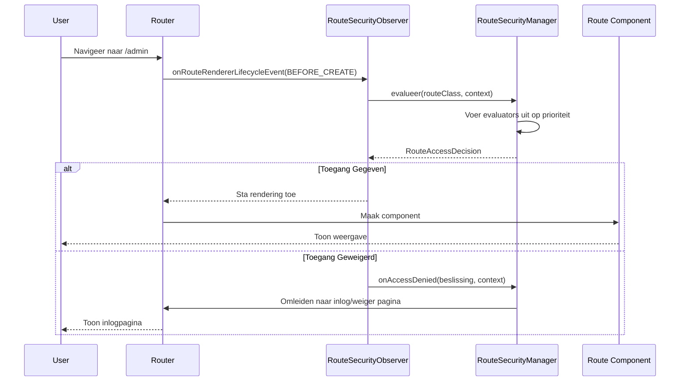

Beveiligingshandhaving in webforJ gebeurt automatisch tijdens navigatie. Wanneer een gebruiker op een link klikt of naar een route navigeert, onderschept het beveiligingssysteem de navigatie, evalueert het toegangsregels en staat ofwel de voortgang van de navigatie toe of leidt de gebruiker om naar een geschikte pagina. Deze onderschepping is onzichtbaar voor gebruikers en vereist geen handmatige beveiligingscontroles in uw componentcode.

Begrijpen hoe navigatieonderschepping werkt, helpt u bij het oplossen van beveiligingsproblemen en het bouwen van aangepaste navigatielogica die integreert met het beveiligingssysteem.

## De `RouteSecurityObserver` {#the-routesecurityobserver}

De `RouteSecurityObserver` is een navigatie-observer die haakt in op de levenscyclus van de router. Het luistert naar navigatiegebeurtenissen en evalueert beveiligingsregels voordat een component wordt gerenderd.

De observer is tijdens de opstart van de app aan de renderer van de router bevestigd:

```java
// Maak de observer met uw beveiligingsmanager
RouteSecurityObserver observer = new RouteSecurityObserver(securityManager);

// Bevestig het aan de renderer van de router
Router router = Router.getCurrent();
if (router != null) {
  router.getRenderer().addObserver(observer);
}
```

Eenmaal bevestigd, onderschept de observer elke navigatieaanvraag. De observer bevindt zich tussen navigatieaanvragen en component-rendering; wanneer de navigatie begint, vraagt het de beveiligingsmanager om toegang te evalueren. Alleen als toegang wordt verleend, wordt de component gerenderd.

## Navigatieonderscheppingsstroom {#navigation-interception-flow}

Wanneer een gebruiker naar een route navigeert, vindt de volgende volgorde plaats:



Deze stroom toont aan dat de beveiligingsevaluatie plaatsvindt voordat enige gevoelige routecode wordt uitgevoerd. Als toegang wordt geweigerd, wordt de component nooit geïnstantieerd, waardoor ongeautoriseerde gebruikers worden verhinderd om bedrijfslogica te activeren of toegang te krijgen tot beschermde gegevens.

## Onderscheppingspunten {#interception-points}

De observer onderschept navigatie op een specifiek punt in de levenscyclus van de routering:

**Voor rendering** De `onRouteRendererLifecycleEvent()`-methode van de observer wordt aangeroepen met de `LifecycleEvent.BEFORE_CREATE` gebeurtenis nadat de route is opgelost, maar voordat de component is gemaakt. Dit is het kritieke beveiligingscontrolepunt.

Op dit punt weet de router welke routeklasse zal worden gerenderd, maar de route is nog niet geïnstantieerd. De observer kan beveiligingsannotaties op de klasse evalueren zonder route-logica uit te voeren.

Als toegang wordt geweigerd, voorkomt de observer rendering en activeert een omleiding. De oorspronkelijke route wordt nooit geïnstantieerd.

## Het evaluatieproces {#the-evaluation-process}

Wanneer de observer navigatie onderschept, wordt de evaluatie gedelegeerd aan de beveiligingsmanager. De observer haalt de routeklasse uit de navigatiecontext en vraagt de manager om de toegang te evalueren. Als de beslissing toegang verleent, gaat de navigatie normaal door. Als de beslissing toegang weigert, stopt de observer de propagatie om rendering te verhinderen en laat de manager de weigering afhandelen.

De manager coördineert de evaluatie door:

1. Te controleren of beveiliging is ingeschakeld in de configuratie
2. De huidige beveiligingscontext (gebruikersinformatie) te verkrijgen
3. De evaluators in prioriteit volgorde uit te voeren
4. De uiteindelijke toegangbeslissing terug te sturen

De observer handelt op basis van de beslissing: als deze is gegeven, gaat de navigatie door; als deze is geweigerd, stopt de observer de propagatie en laat de manager de weigering afhandelen.

## Hoe toegangsbeslissingen worden genomen {#how-access-decisions-are-made}

De beveiligingsmanager maakt een evaluator-keten en voert elke evaluator in prioriteit volgorde uit. Evaluatoren kunnen drie soorten beslissingen nemen:

- **Toegang verlenen:** De evaluator keurt de navigatie goed en de route wordt gerenderd. Geen verdere evaluators worden geraadpleegd. De evaluator geeft een beslissing terug die aangeeft dat toegang is verleend.

- **Toegang weigeren:** De evaluator blokkeert de navigatie. De observer stopt de rendering en activeert een omleiding. De evaluator retourneert een weigeringbeslissing, eventueel met een reden. Weigering kan te wijten zijn aan gebrek aan authenticatie (inloggen vereist) of gebrek aan autorisatie (onvoldoende toestemming).

- **Delegatie aan de volgende evaluator:** De evaluator neemt geen beslissing en geeft de controle door aan de volgende evaluator in de keten. De evaluator roept de evaluate-methode van de keten aan, die doorgaat naar de volgende evaluator in prioriteit volgorde.

De meeste evaluators behandelen alleen routes met specifieke annotaties. Bijvoorbeeld, `RolesAllowedEvaluator` evalueert alleen routes die zijn geannoteerd met `@RolesAllowed`. Als de annotatie niet aanwezig is, wordt de controle gedelegeerd aan de volgende evaluator.

## Afhandeling van toegang weigering {#handling-access-denial}

Wanneer de toegang wordt geweigerd, behandelt de methode `onAccessDenied()` van de manager de weigering op basis van het type weigering:

- **Authenticatie vereist:** De gebruiker is niet ingelogd. Omleiden naar de inlogpagina die is geconfigureerd in `RouteSecurityConfiguration.getAuthenticationLocation()`.

- **Toegang geweigerd:** De gebruiker is ingelogd maar mist rechten. Omleiden naar de toegang geweigerd pagina die is geconfigureerd in `RouteSecurityConfiguration.getDenyLocation()`.

Voordat er wordt omgeleid, slaat de manager de oorspronkelijk gevraagde locatie op in de HTTP-sessie. Na een succesvolle inlog kan deze locatie worden opgehaald met de methode `consumePreAuthenticationLocation()` van de manager, die de opgeslagen locatie retourneert en deze uit de sessie verwijdert. Als er een locatie is opgeslagen, kan de app daarheen navigeren; anders navigeert deze naar een standaardpagina.

## Wanneer beveiliging is uitgeschakeld {#when-security-is-disabled}

Als `RouteSecurityConfiguration.isEnabled()` `false` retourneert, omzeilt de manager alle evaluatie en verleent onmiddellijk toegang tot elke route. De evaluator-keten wordt nooit uitgevoerd en er vinden geen beveiligingscontroles plaats.

Dit is nuttig tijdens de ontwikkeling of voor applicaties die geen beveiliging vereisen. U kunt de beveiliging in- en uitschakelen zonder annotaties te verwijderen of de observer te deregistreren.

## Integratie met de navigatielevenscyclus {#integration-with-navigation-lifecycle}

De beveiligingsobserver integreert met de bredere [navigatielevenscyclus](/docs/routing/navigation-lifecycle/overview), waar meerdere observers kunnen aansluiten bij navigatiegebeurtenissen. De beveiligingsevaluatie vindt plaats aan het begin van deze levenscyclus, voordat navigatie wordt geblokkeerd of componentlevenscycusevenementen plaatsvinden.

Als u aangepaste navigatie-observers implementeert, wees dan ervan bewust dat de beveiligingsevaluatie als eerste plaatsvindt. Als toegang wordt geweigerd, wordt de `onRouteRendererLifecycleEvent()` van uw observer niet aangeroepen met `BEFORE_CREATE`, omdat de navigatie is gestopt.
